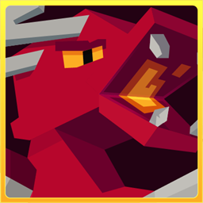
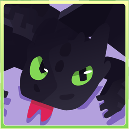

# Draconia

Welcome to the Draconia wiki - guides, almanacs, and reference for our Minecraft modpacks.

[**Join our Discord**](https://discord.gg/draconia) for support, updates, and community.

## Wikis

| | Wiki | |
|---|---|---|
|  | **Dragoncraft** | [Open](dragoncraft/README.md) |
|  | **Toothless** | [Open](toothless/README.md) |
|  | **PvZ Overgrowth** | [Open](pvz-overgrowth/README.md) |

## Projects

Everything we've published on CurseForge:

| Project | |
|---|---|
| Dragoncraft | [CurseForge](https://www.curseforge.com/minecraft/modpacks/dragoncraft) |
| Mythcraft Unleashed | [CurseForge](https://www.curseforge.com/minecraft/modpacks/mythcraft) |
| Toothless | [CurseForge](https://www.curseforge.com/minecraft/modpacks/toothless) |
| PvZ Overgrowth | [CurseForge](https://www.curseforge.com/minecraft/modpacks/pvz-overgrowth) |
| Nightcraft | [CurseForge](https://www.curseforge.com/minecraft/modpacks/nightcraft) |
| WarpDrive | [CurseForge](https://www.curseforge.com/minecraft/modpacks/warpdrive) |
| Submerged | [CurseForge](https://www.curseforge.com/minecraft/modpacks/submerged) |
| Comfycraft | [CurseForge](https://www.curseforge.com/minecraft/modpacks/comfycraft) |
| Cobblemon High | [CurseForge](https://www.curseforge.com/minecraft/modpacks/cobblemon-high) |

## Contributing

Found something wrong or missing? This wiki syncs with [GitHub](https://github.com/Kerberus-MC/Draconia-Wiki) - open a pull request, or ask in [Discord](https://discord.gg/draconia).
