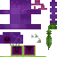
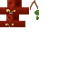
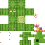
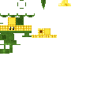
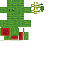

# Plants

All plants available in PvZ Overgrowth with their stats.

!!! info "Data Source"
    Stats extracted from the Plants & Zombies mod v1.4 by joshxviii. Custom Draconia plants are listed separately in [Custom Plants](../custom/plants.md).

| | Plant | Sun Cost | HP | DMG | Range | Attack Interval |
|---|---|---|---|---|---|---|
| { width="48" } | **Sunflower** | 5 | 20 | N/A | N/A | Generates sun every 34s |
| { width="48" } | **Peashooter** | 5 | 20 | 1.5 | 14 | 1s |
| { width="48" } | **Repeater** | 7 | 20 | 1.5 | 14 | 0.4s |
| { width="48" } | **Wall-nut** | 5 | 25 | N/A | N/A | N/A |
| { width="48" } | **Chomper** | 7 | 35 | 12 | 4.75 | 3s + 15s chew |
| { width="48" } | **Cherry Bomb** | 10 | 50 | 1.5 | 3.75 | Single-use explosion |
| { width="48" } | **Potato Mine** | 3 | 20 | 1.5 | 3.75 | Arms in ~5-9.5s |
| { width="48" } | **Snow Pea** | 7 | 20 | 2.5 | 14 | 1s |
| { width="48" } | **Fire Peashooter** | 7 | 20 | 2.5 | 14 | 1s |
| { width="48" } | **Cactus** | 6 | 20 | 3.5 | 34 | 2s |
| { width="48" } | **Cabbage-pult** | 5 | 20 | 3.5 | 22 | 1.5s |
| { width="48" } | **Kernel-pult** | 7 | 20 | 2.5 | 26 | 1.3s |
| { width="48" } | **Melon-pult** | 10 | 50 | 6.5 | 38 | 3.25s |
| { width="48" } | **Puff-shroom** | 0 | 12 | 1 | 10 | 1s |
| { width="48" } | **Scaredy-shroom** | 3 | 20 | 1.5 | 22 | 1s (hides when scared) |
| { width="48" } | **Fume-shroom** | 6 | 20 | 3 | 14 | 1.75s |
| { width="48" } | **Sun-shroom** | 3 | 20 | 1.5 | N/A | Generates sun every 34s |
| { width="48" } | **Hypno-shroom** | 7 | 4 | 1.5 | N/A | Triggers on hit/death |
| { width="48" } | **Coffee Bean** | 3 | 4 | N/A | 1 | N/A (wakes mushrooms) |
| { width="48" } | **Sea-shroom** | 0 | 12 | 0.5 | 10 | 1s |
| { width="48" } | **Doom-shroom** | 16 | 28 | N/A | 5 | Explodes after 2.4s |
