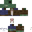
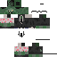
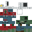
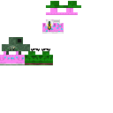
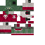
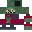
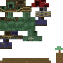
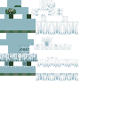
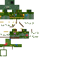

# Zombies

All zombies in PvZ Overgrowth with their stats.

!!! info "Data Source"
    Stats extracted from the Plants & Zombies mod v1.4 by joshxviii. Custom Draconia zombies are listed separately in [Custom Zombies](../custom/zombies.md).

| | Zombie | HP | DMG | Speed | Special |
|---|---|---|---|---|---|
| { width="48" } | **Browncoat** | Low | Low | Normal | Basic zombie |
| { width="48" } | **Newspaper Zombie** | Medium | Medium | Normal | Enrages when newspaper is destroyed |
| { width="48" } | **Digger Zombie** | Medium | Medium | Normal | Tunnels underground to attack from behind |
| { width="48" } | **Disco Zombie** | Medium | Medium | Normal | Summons Backup Dancers |
| { width="48" } | **Backup Dancer** | Low | Low | Normal | Summoned by Disco Zombie |
| { width="48" } | **All Star** | High | High | Fast | Charges and tackles plants |
| { width="48" } | **Imp** | Very Low | Medium | Fast | Small, thrown by Gargantuar |
| { width="48" } | **Gargantuar** | Very High | Very High | Slow | Smashes plants, throws Imp at half HP |
| { width="48" } | **Zombie Yeti** | High | Medium | Normal | Rare spawn, drops valuable loot |
| { width="48" } | **Soldier Zombie** | High | High | Normal | Armored military zombie |
