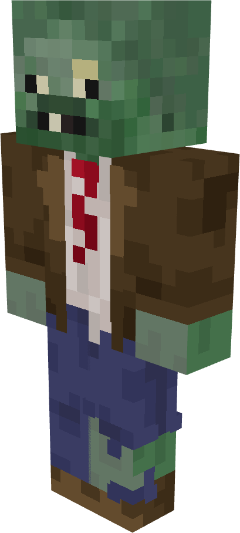
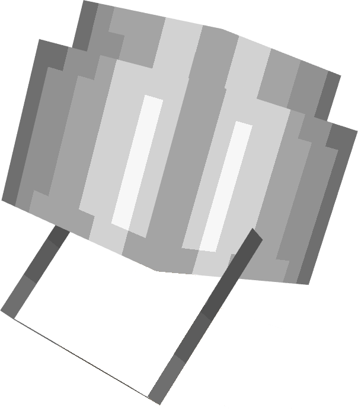
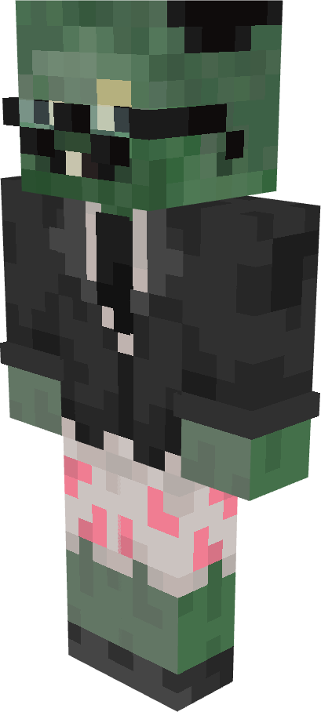
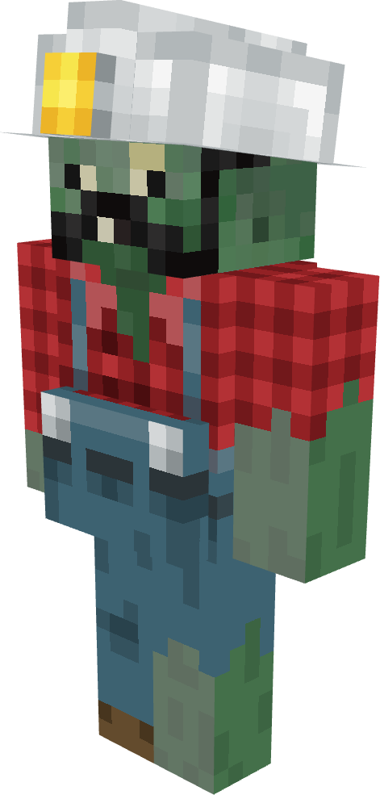
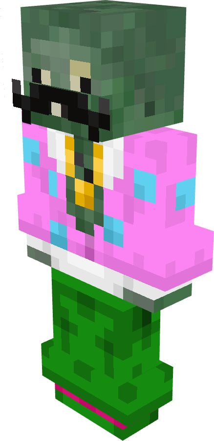
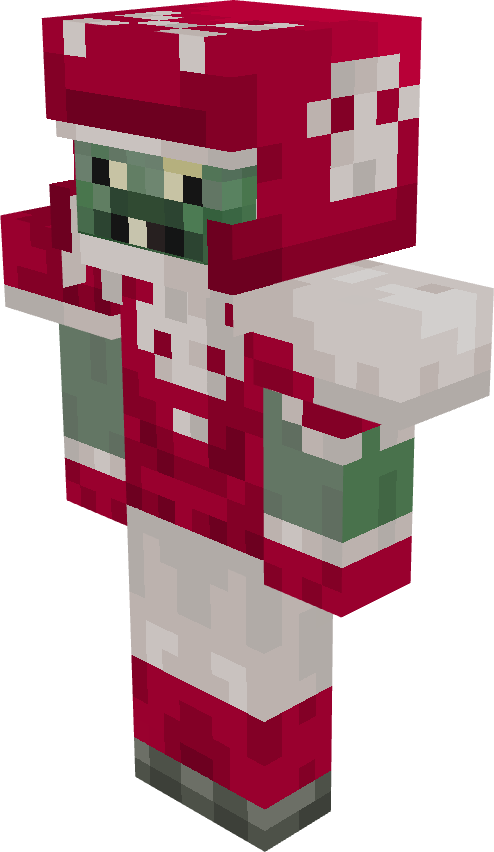
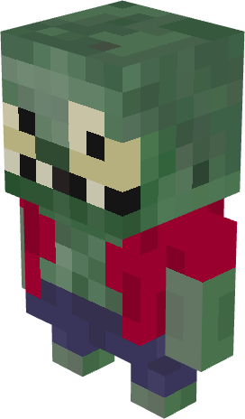
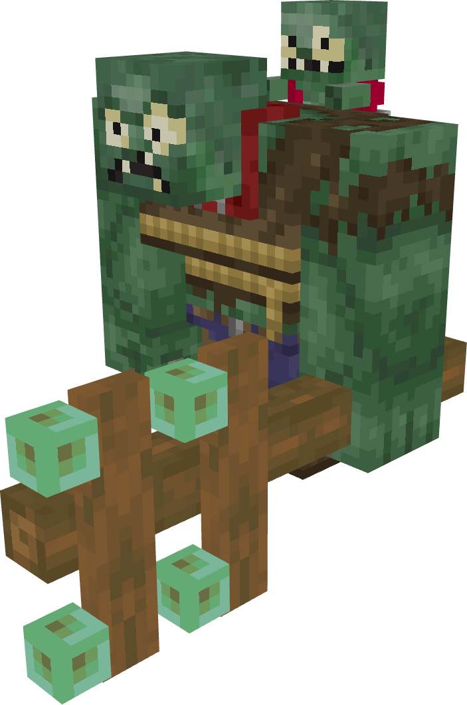

# Zombies

All zombies in PvZ Overgrowth with their stats.

| | Zombie | HP | DMG | Speed | Special |
|---|---|---|---|---|---|
|  | **Browncoat** | Low | Low | Normal | Basic zombie |
|  | **Conehead Zombie** | Medium | Low | Normal | Extra cone armor |
|  | **Buckethead Zombie** | High | Low | Normal | Stronger bucket armor |
|  | **Flag Zombie** | Low | Low | Normal | Carries flag variant |
|  | **Newspaper Zombie** | Medium | Medium | Normal | Enrages when newspaper is destroyed |
|  | **Digger Zombie** | Medium | Medium | Normal | Tunnels underground to attack from behind |
|  | **Disco Zombie** | Medium | Medium | Normal | Summons Backup Dancers |
|  | **Backup Dancer** | Low | Low | Normal | Summoned by Disco Zombie |
|  | **All Star** | High | High | Fast | Charges and tackles plants |
|  | **Imp** | Very Low | Medium | Fast | Small, thrown by Gargantuar |
|  | **Gargantuar** | Very High | Very High | Slow | Smashes plants, throws Imp at half HP |
|  | **Zombie Yeti** | High | Medium | Normal | Rare spawn, drops valuable loot |
|  | **Ducky Tube Zombie** | Low | Low | Normal | Spawns underwater |
