# Plant Spawn

Plants spawn naturally when chunks first load based on biome conditions. Unlike mobs, they do **not respawn continuously** and generate **only once per chunk** during terrain creation.

- Already-explored chunks won't generate new plants
- Rarer plants appear only in particular biomes
- Exploration is essential for progression

## Spawn Locations by Biome

### Plains / Forest

| | Plant | Biomes | Other Sources |
|---|---|---|---|
| 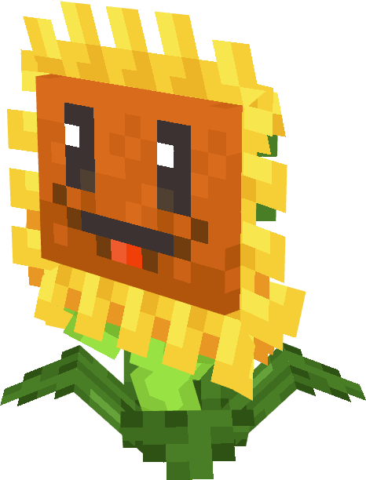 | **Sunflower** | Plains, Flower Forest, Meadow | Drops from Browncoats |
| 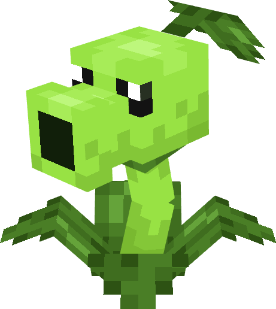 | **Peashooter** | Plains, Forest | - |
| 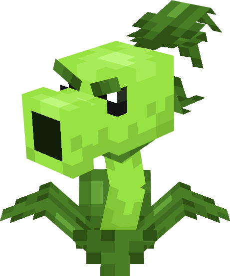 | **Repeater** | Plains, Forest | - |
| 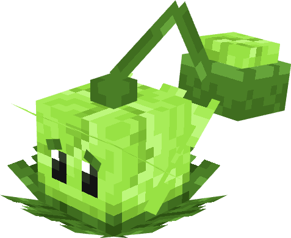 | **Cabbage-pult** | Plains, Forest | - |
| 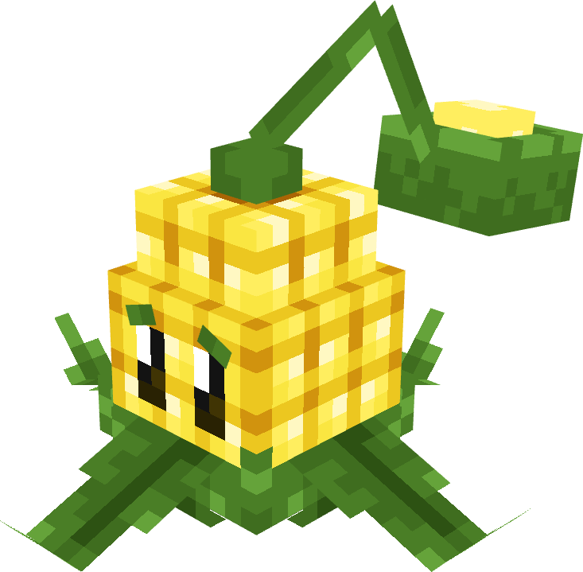 | **Kernel-pult** | Plains, Forest | - |
|  | **Wall-nut** | Plains, Forest | - |

### Desert

| | Plant | Biomes | Other Sources |
|---|---|---|---|
| 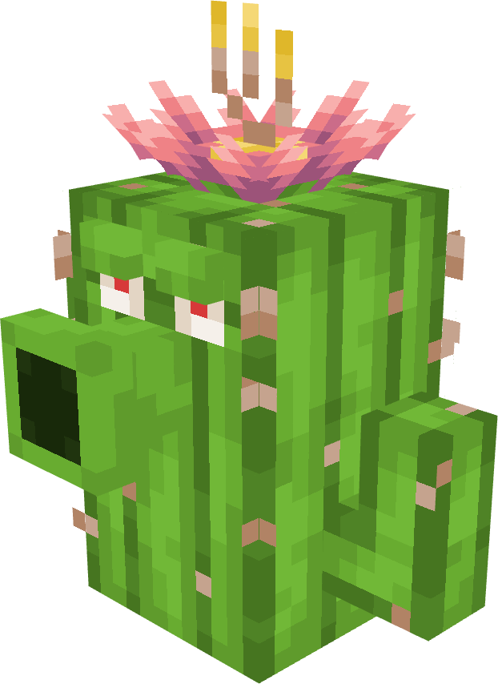 | **Cactus** | Desert | - |

### Swamp / Jungle

| | Plant | Biomes | Other Sources |
|---|---|---|---|
| 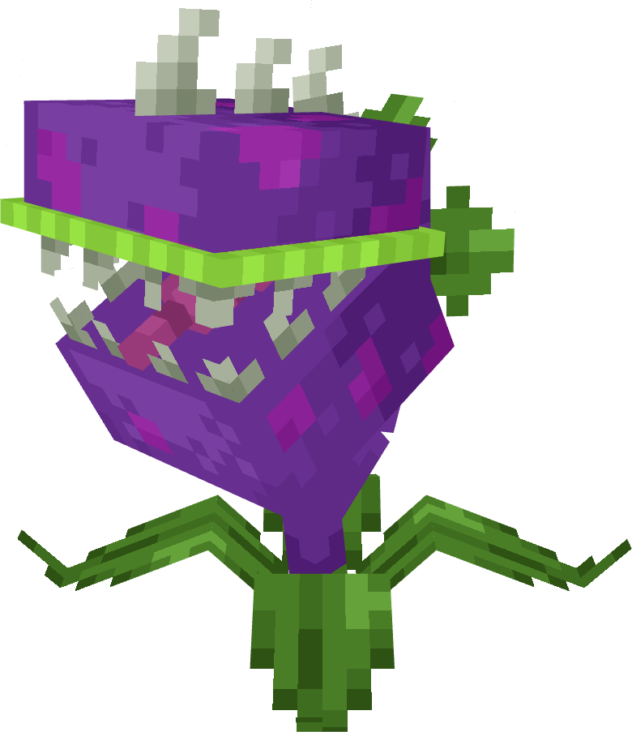 | **Chomper** | Swamp, Jungle | Fishing |
| 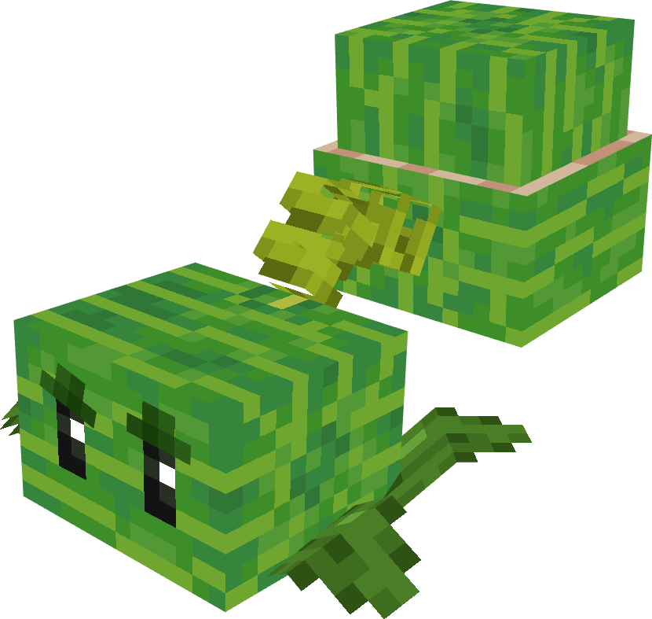 | **Melon-pult** | Jungle | Fishing |
| 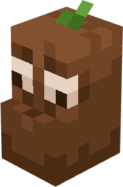 | **Coffee Bean** | Swamp, Jungle | - |

### Cold Biomes

| | Plant | Biomes | Other Sources |
|---|---|---|---|
| 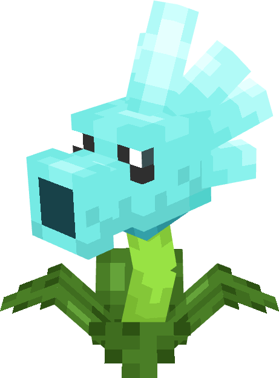 | **Snow Pea** | Snowy Plains, Taiga, Frozen Peaks, Ice Spikes | - |

### Nether

| | Plant | Biomes | Other Sources |
|---|---|---|---|
| 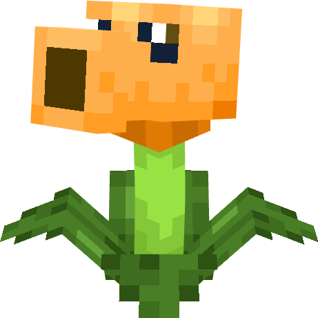 | **Fire Peashooter** | Crimson Forest | - |
| 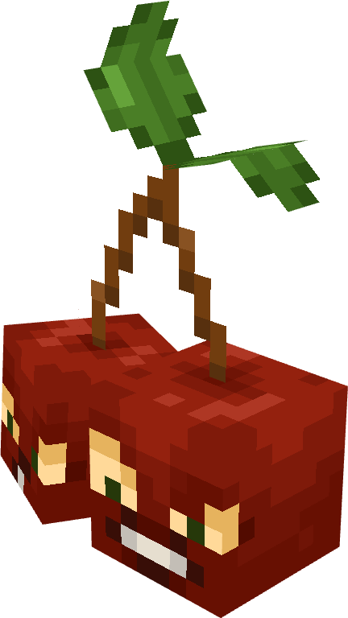 | **Cherry Bomb** | Basalt Deltas | Village loot, Digger Zombie drops |
| 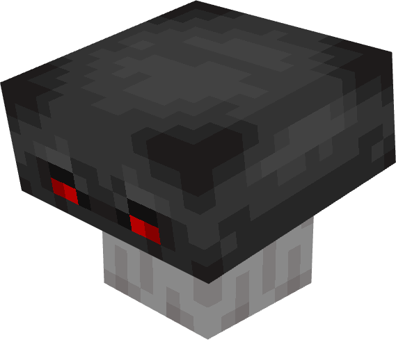 | **Doom-shroom** | Basalt Deltas | - |

### Mushrooms / Caves

| | Plant | Biomes | Other Sources |
|---|---|---|---|
| 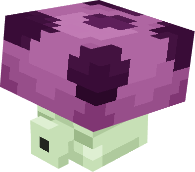 | **Puff-shroom** | Mushroom Fields, Caves | - |
| 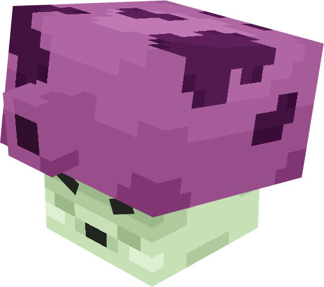 | **Fume-shroom** | Mushroom Fields, Caves | - |
| 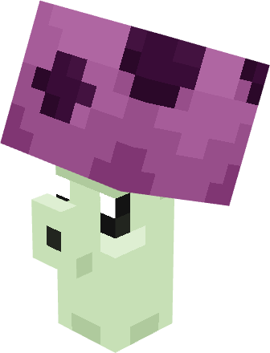 | **Scaredy-shroom** | Mushroom Fields, Caves | - |
| 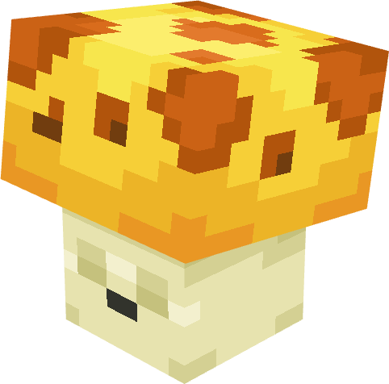 | **Sun-shroom** | Mushroom Fields, Caves | - |
|  | **Hypno-shroom** | Mushroom Fields, Caves | - |

### Aquatic

| | Plant | Biomes | Other Sources |
|---|---|---|---|
| 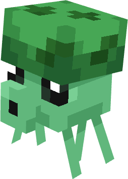 | **Sea-shroom** | Rivers, Deep Ocean | - |

### Special

| | Plant | Biomes | Other Sources |
|---|---|---|---|
| 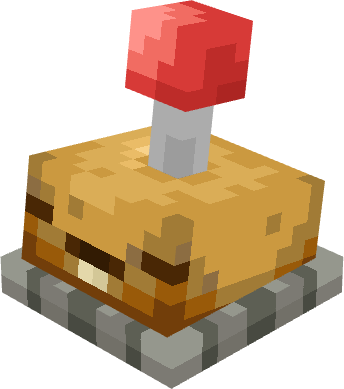 | **Potato Mine** | *No natural spawn* | Villager trading, village loot |
