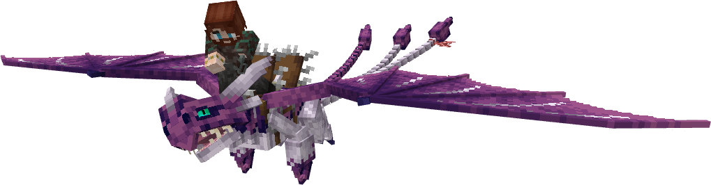
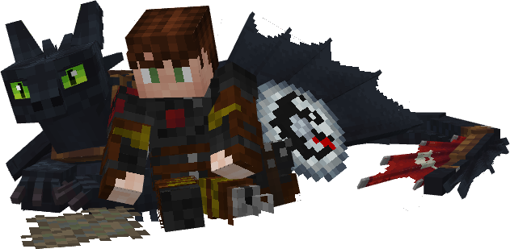
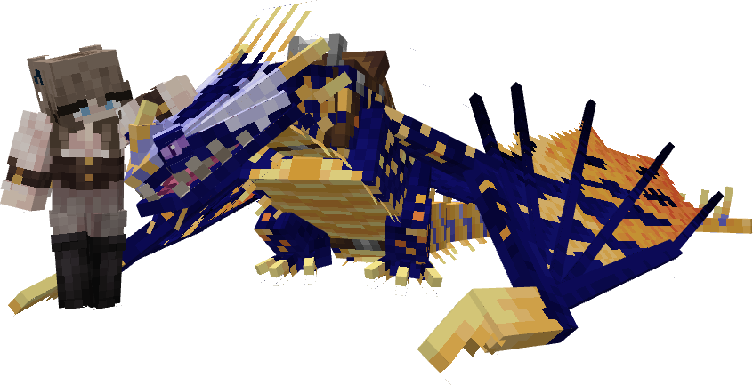
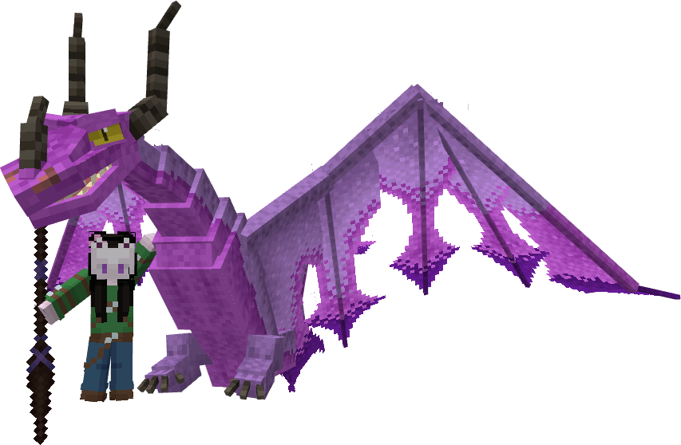
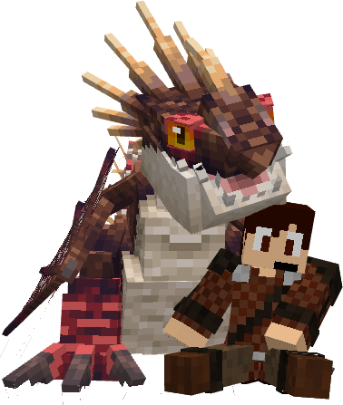
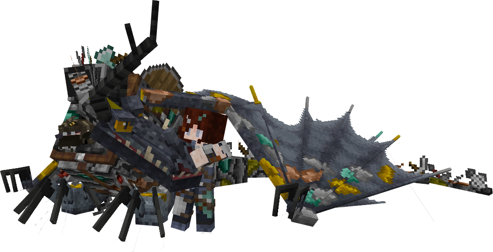
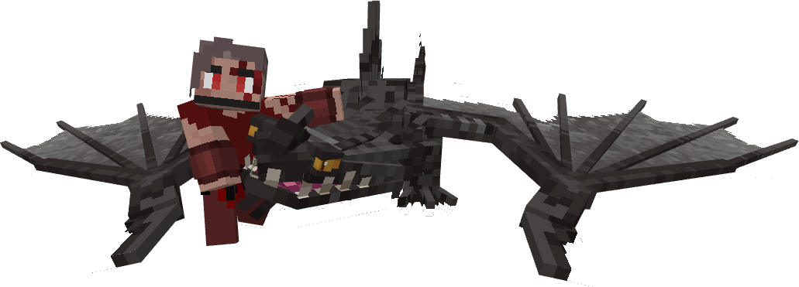
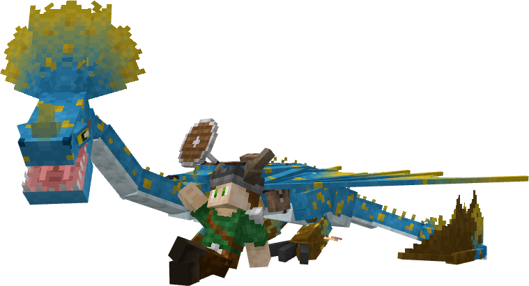

# Dragon Rider Companions

Dragon Rider Companions in Archipelago Additions use a conditional override to replace base IoB dragons. They have their own stats, appearance, animations, size, and riding positions.

| | Companion |
|---|---|
|  | **Havardr & DG** |
|  | **Hiccup & Toothless** |
|  | **Mako & Kingkiller** |
|  | **Melody & Galestorm** |
|  | **Raider & Rebecca** |
|  | **Skadi, Nestbarer & Smokebreaths** |
|  | **Skoll & Hyades** |
|  | **Stego & Muddy** |

---

_Content adapted from the [Archipelago Additions Wiki](https://archipelagoadditions.miraheze.org/wiki/Dragon_Rider_Companions) under [CC BY-SA 4.0](https://creativecommons.org/licenses/by-sa/4.0/)._
