# Armorwing


The Armorwing is a series canon dragon, first appearing in Race to the Edge. It is on theMonstrous Nightmarebase.

## Stats

| Stat | Value |
|---|---|
| Health | 100 (50 hearts) |
| Armour | 15 (7.5 icon) |
| Attack | 8 (4 hearts) |
| Walk Speed | 0.40 |
| Fly Speed | 0.13 |

## Taming

**Taming Foods:** Dragon Proof Metal Ingot, Dragon Proof Metal Scrap, Gronckle Iron, Raw Gronckle Iron, Copper Ingot, Gold Ingot, Iron Ingot, Raw Copper, Raw Gold, Raw Iron

**Requirements:**

- No tools or weapons (except Dragon Blades & specified Viking Artifacts) held
- No armour worn
- Fire resistance potion effect active

**Alt Taming:** Dragon Nip

## Breeding

**Breeding Foods:** Suspicious Stew, Sagefruit

## Drops

**Brush Drops:** 2-3 ArmorwingScales, 0-2 Copper Ingot, 0-2 Gold Ingot, 0-2 Iron Ingot

**Death Drops:** 1-3 Dragon Blood, 4-7 Armorwing Scales, 1-7 Copper Ingot, 1-7 Gold Ingot, 1-7 Iron Ingot

## Spawn Biomes

- `minecraft:savanna_plateau`
- `minecraft:windswept_savanna`
- `minecraft:wooded_badlands`

## Variants

### Animated Armour

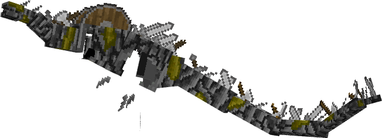

**Obtainment:** Command only

```
/summon isleofberk:monstrous_nightmare ~ ~ ~ {VariantName:animated_armour}
```

### Albino

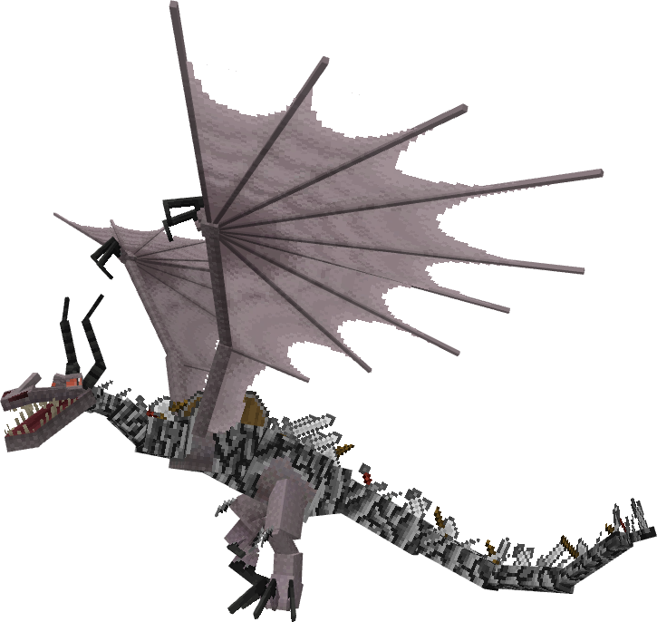

**Obtainment:** Rare spawn

```
/summon isleofberk:monstrous_nightmare ~ ~ ~ {VariantName:albino_armorwing}
```

### Armourwing

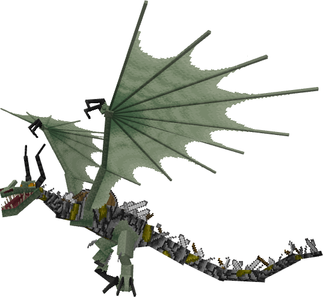

**Obtainment:** Normal spawn

```
/summon isleofberk:monstrous_nightmare ~ ~ ~ {VariantName:armorwing}
```

### Battlenaenae

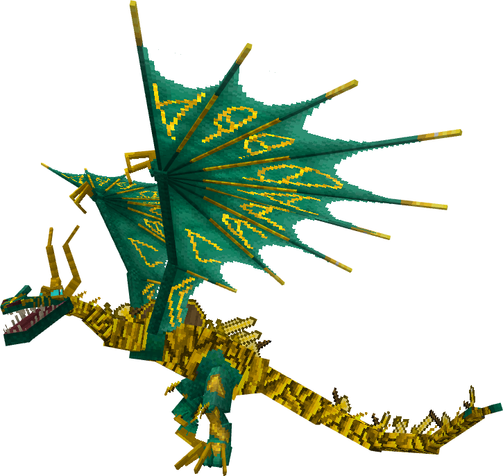

**Obtainment:** Normal spawn

```
/summon isleofberk:monstrous_nightmare ~ ~ ~ {VariantName:battlenaenae}
```

### Battlewhip

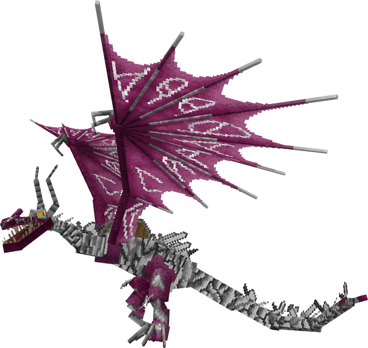

**Obtainment:** Normal spawn

```
/summon isleofberk:monstrous_nightmare ~ ~ ~ {VariantName:battlewhip}
```

### Copperwing

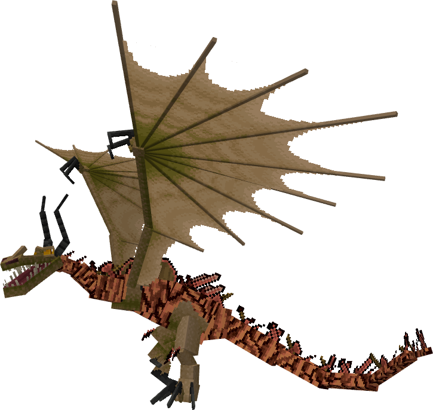

**Obtainment:** Normal spawn

```
/summon isleofberk:monstrous_nightmare ~ ~ ~ {VariantName:copperwing}
```

### Diamondback

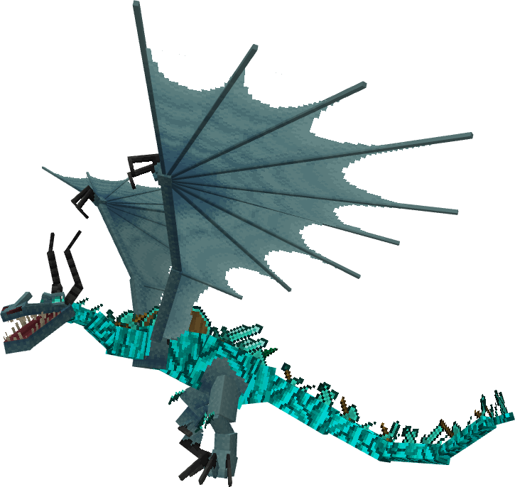

**Obtainment:** Rare spawn

```
/summon isleofberk:monstrous_nightmare ~ ~ ~ {VariantName:diamond}
```

### Emerald Guardian

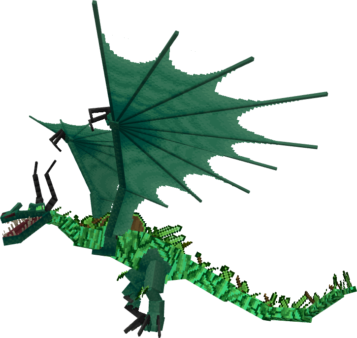

**Obtainment:** Normal spawn

```
/summon isleofberk:monstrous_nightmare ~ ~ ~ {VariantName:emerald_guardian}
```

### Goldrush

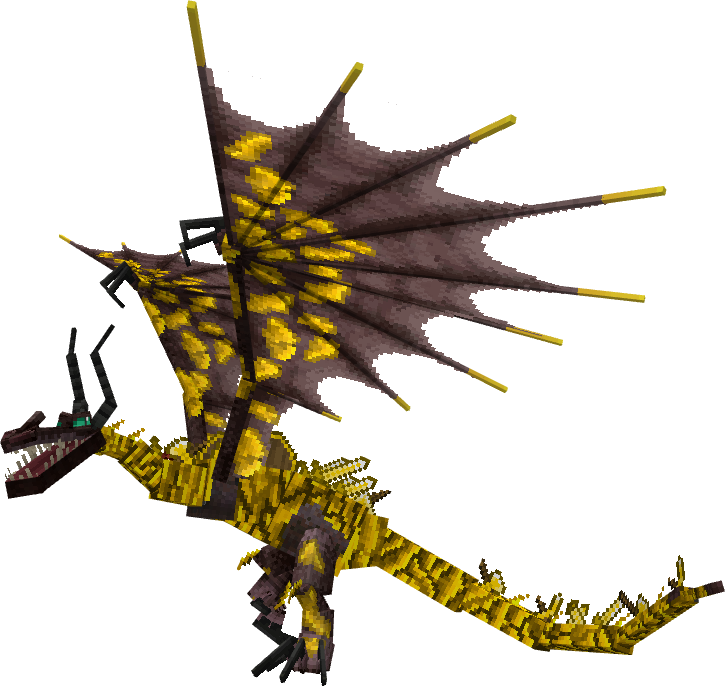

**Obtainment:** Normal spawn

```
/summon isleofberk:monstrous_nightmare ~ ~ ~ {VariantName:goldrush}
```

### Melanistic

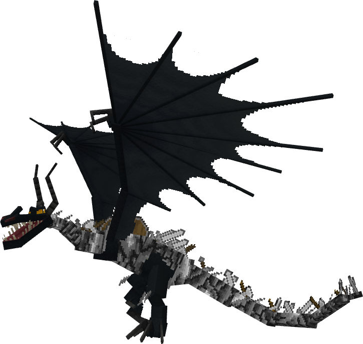

**Obtainment:** Rare spawn

```
/summon isleofberk:monstrous_nightmare ~ ~ ~ {VariantName:melanistic_armorwing}
```

### Netherwing

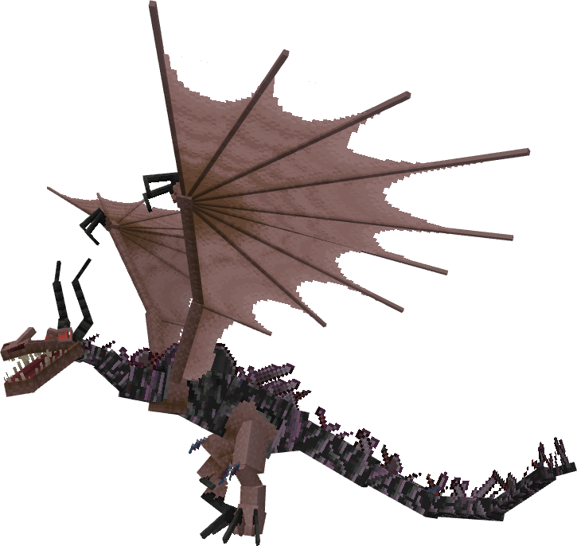

**Obtainment:** Rare spawn

```
/summon isleofberk:monstrous_nightmare ~ ~ ~ {VariantName:netherwing}
```

---

_Content adapted from the [Archipelago Additions Wiki](https://archipelagoadditions.miraheze.org/wiki/Armorwing) under [CC BY-SA 4.0](https://creativecommons.org/licenses/by-sa/4.0/)._
