# Crimson Goregutter


The Crimson Goregutter is a main canon dragon, first appearing in HTTYD 3. It is an Archipelago Additions dragon on theGroncklebase.

## Stats

| Stat | Value |
|---|---|
| Health | 200 (100 hearts) |
| Armour | 10 (5 icons) |
| Attack | 12 (6 hearts) |
| Walk Speed | 0.5 (sprinting villager speed) |
| Fly Speed | 0.14 (around 50% faster than Allay speed) |

## Taming

**Taming Foods:** Feed Bundle

**Requirements:** No tools or weapons (except Dragon Blades & specified Viking Artifacts) held

**Alt Taming:** Dragon Nip

## Breeding

**Breeding Foods:** Suspicious Stew, Sagefruit

## Drops

**Brush Drops:** 3-5 Crimson Goregutter Scales

**Death Drops:** 6-12 Dragon Blood, 6-12 Crimson Goregutter Scales

## Spawn Biomes

- `minecraft:savanna`
- `minecraft:savanna_plateau`
- `minecraft:windswept_savanna`

## Variants

### Albino

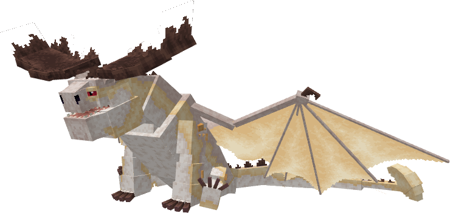

**Obtainment:** Rare spawn

```
/summon isleofberk:gronckle ~ ~ ~ {VariantName:albino_goregutter}
```

### Beachbasher

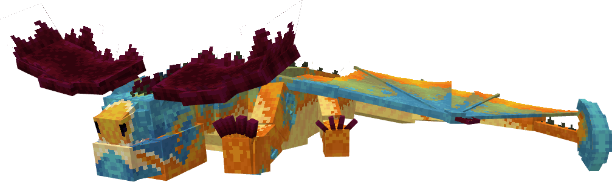

**Obtainment:** Normal spawn

```
/summon isleofberk:gronckle ~ ~ ~ {VariantName:beachbasher}
```

### Blabaermelk

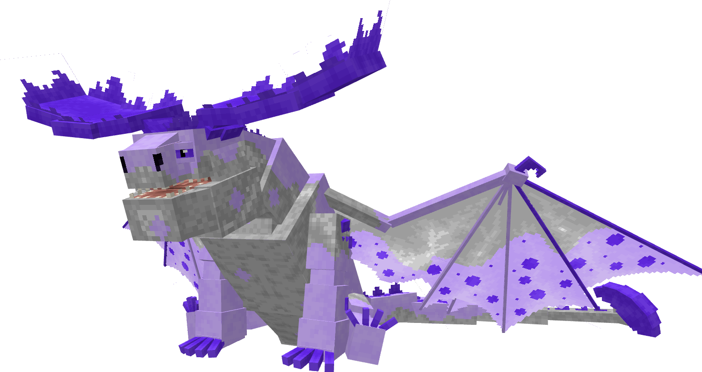

**Obtainment:** Normal spawn

```
/summon isleofberk:gronckle ~ ~ ~ {VariantName:blabaermelk}
```

### Bloodmoss

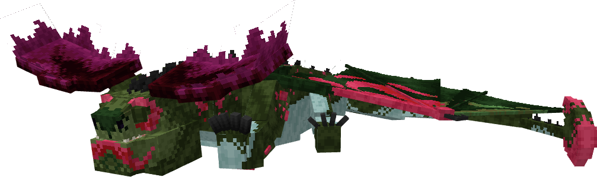

**Obtainment:** Normal spawn

```
/summon isleofberk:gronckle ~ ~ ~ {VariantName:bloodmoss}
```

### Brick

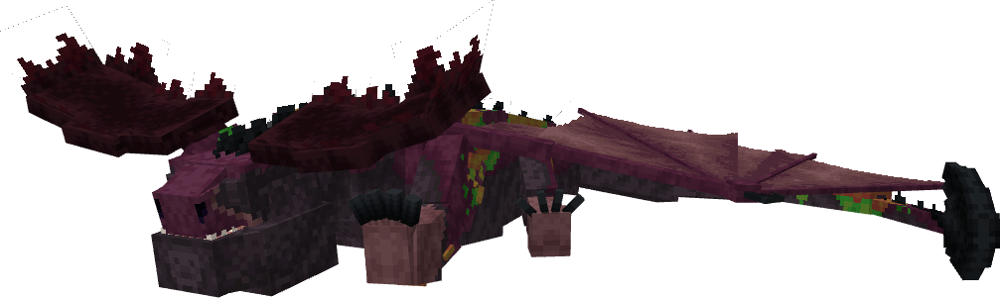

**Obtainment:** Normal spawn

```
/summon isleofberk:gronckle ~ ~ ~ {VariantName:brick}
```

### Brod

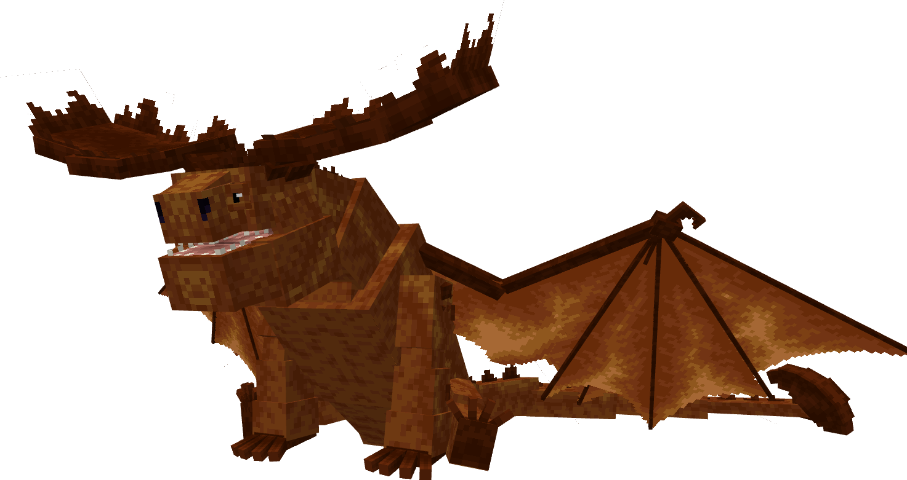

**Obtainment:** Normal spawn

```
/summon isleofberk:gronckle ~ ~ ~ {VariantName:brod}
```

### Cerulean

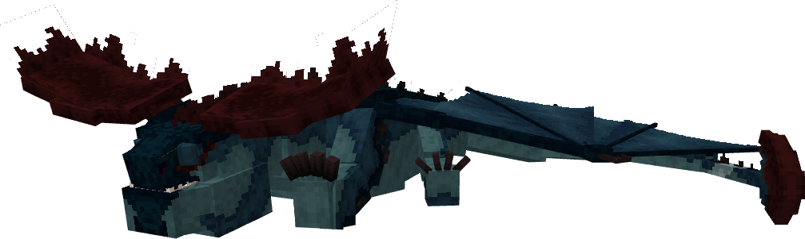

**Obtainment:** Normal spawn

```
/summon isleofberk:gronckle ~ ~ ~ {VariantName:cerulean}
```

### Cranberry

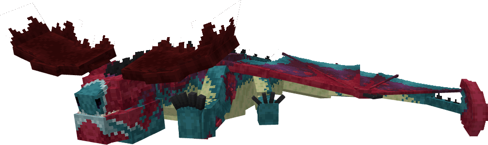

**Obtainment:** Normal spawn

```
/summon isleofberk:gronckle ~ ~ ~ {VariantName:cranberry}
```

### Crimson Goregutter


**Obtainment:** Normal spawn

```
/summon isleofberk:gronckle ~ ~ ~ {VariantName:crimson_goregutter}
```

### Jordbaermelk

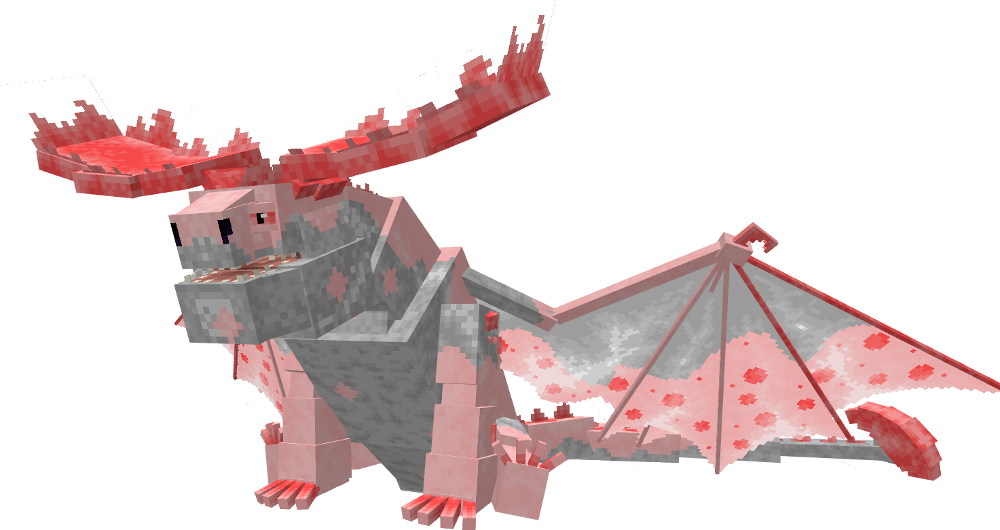

**Obtainment:** Normal spawn

```
/summon isleofberk:gronckle ~ ~ ~ {VariantName:jordbaermelk}
```

### Loomingstomper

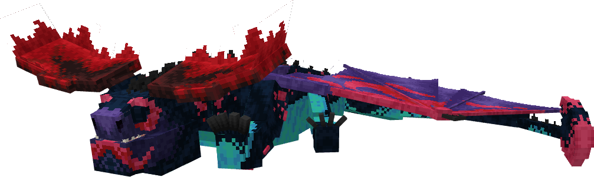

**Obtainment:** Normal spawn

```
/summon isleofberk:gronckle ~ ~ ~ {VariantName:loomingstomper}
```

### Louise

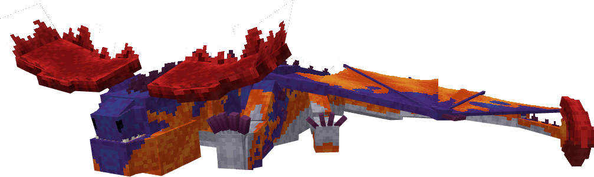

**Obtainment:** Normal spawn

```
/summon isleofberk:gronckle ~ ~ ~ {VariantName:lousie}
```

*Credits: Don't mention the typo.*

### Melanistic

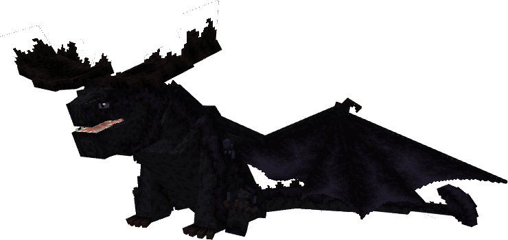

**Obtainment:** Rare spawn

```
/summon isleofberk:gronckle ~ ~ ~ {VariantName:melanistic_goregutter}
```

### Mountain

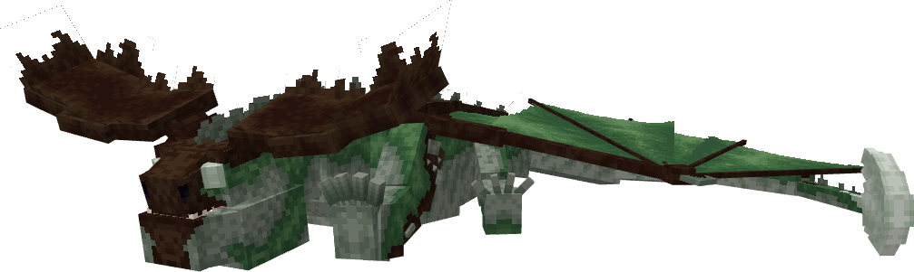

**Obtainment:** Normal spawn

```
/summon isleofberk:gronckle ~ ~ ~ {VariantName:mountain}
```

*Credits: This variant was designed by R3xodus.*

### Mountain King

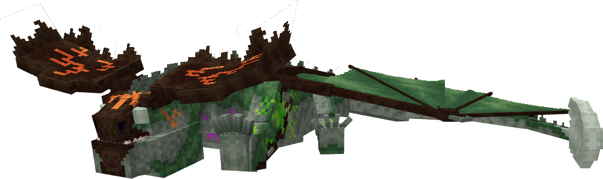

**Obtainment:** Rare spawn

```
/summon isleofberk:gronckle ~ ~ ~ {VariantName:mountain_king}
```

*Credits: This variant was designed by R3xodus.*

### Odin's War Cry

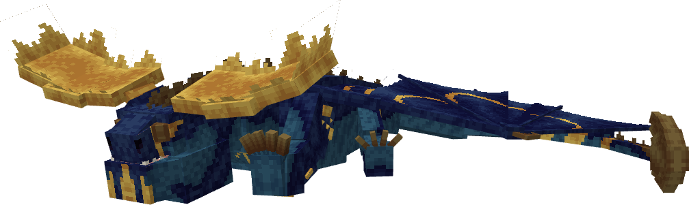

**Obtainment:** Rare spawn

```
/summon isleofberk:gronckle ~ ~ ~ {VariantName:odins_war_cry}
```

*Credits: This variant was designed by DragoFRN.*

### Ol' Forest

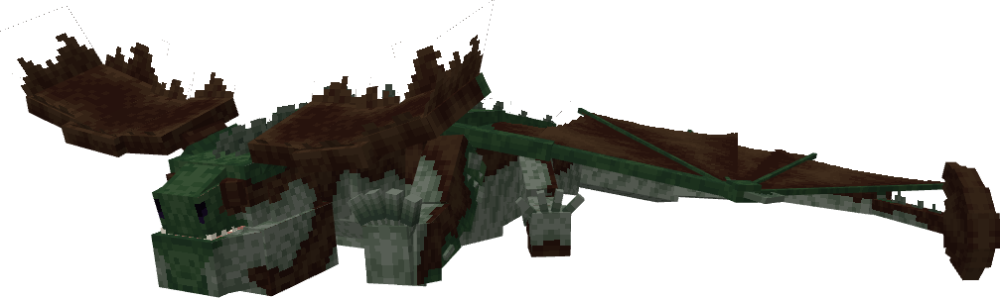

**Obtainment:** Rare spawn

```
/summon isleofberk:gronckle ~ ~ ~ {VariantName:ol_forest}
```

### Sjokolademelk

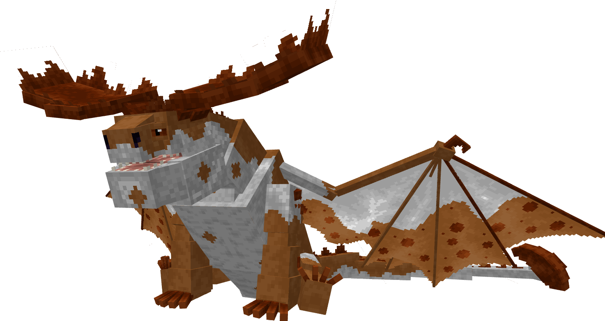

**Obtainment:** Normal spawn

```
/summon isleofberk:gronckle ~ ~ ~ {VariantName:sjokolademelk}
```

### Vanilijemelk


**Obtainment:** Normal spawn

```
/summon isleofberk:gronckle ~ ~ ~ {VariantName:vanilijemelk}
```

---

_Content adapted from the [Archipelago Additions Wiki](https://archipelagoadditions.miraheze.org/wiki/Crimson_Goregutter) under [CC BY-SA 4.0](https://creativecommons.org/licenses/by-sa/4.0/)._
