# Dramillion


The Dramillion is a series canon dragon, first appearing in Race to the Edge. It is an Archipelago Additions dragon on theLight Furybase.

## Stats

| Stat | Value |
|---|---|
| Health | 50 (25 hearts) |
| Armour | 1 (0.5 hearts) |
| Attack | 5 (2.5 heart) |
| Walk Speed | 0.4 (Piglin Brute speed) |
| Fly Speed | 0.15 (around 50% faster than an Allay) |

## Taming

**Taming Foods:** Sweet Berries

**Requirements:**

- Invisibility or Night Vision potion effect active
- No armour equipped
- No tools or weapons (except Dragon Blades & specified Viking Artifacts) held

**Alt Taming:** Dragon Nip

## Breeding

**Breeding Foods:** Honeycomb, Sagefruit

## Drops

**Brush Drops:** 1-3 Dramillion Scales

**Death Drops:** 1-2 Dragon Blood, 3-5 Dramillion Scales

## Spawn Biomes

- `minecraft:sunflower_plains`
- `minecraft:taiga`
- `minecraft:windswept_forest`

## Variants

### Albino

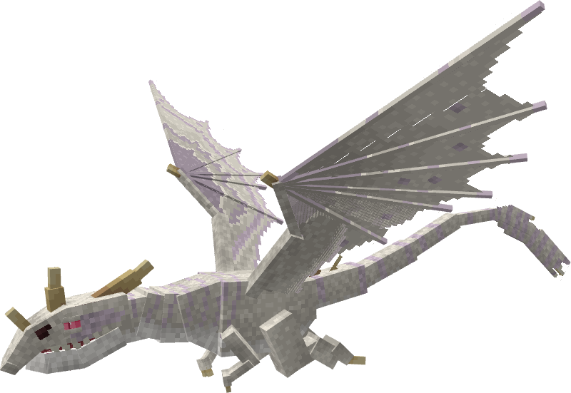

**Obtainment:** Rare spawn

```
/summon isleofberk:light_fury ~ ~ ~ {VariantName:albino_dramillion}
```

### Aquamarillion

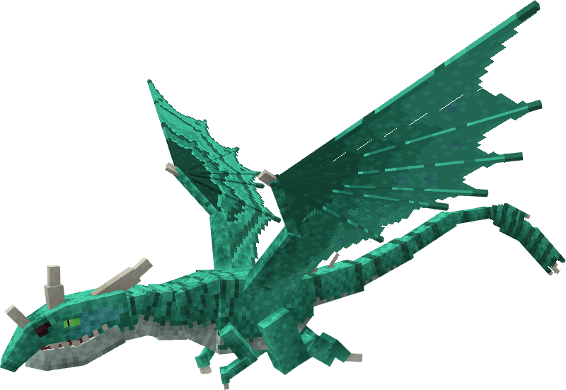

**Obtainment:** Normal spawn

```
/summon isleofberk:light_fury ~ ~ ~ {VariantName:aquamarillion}
```

### Bonnefire

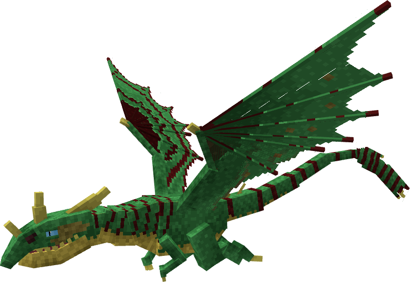

**Obtainment:** Normal spawn

```
/summon isleofberk:light_fury ~ ~ ~ {VariantName:bonnefire}
```

### Dramillion


**Obtainment:** Normal spawn

```
/summon isleofberk:light_fury ~ ~ ~ {VariantName:dramillion }
```

### Elder Dramillion

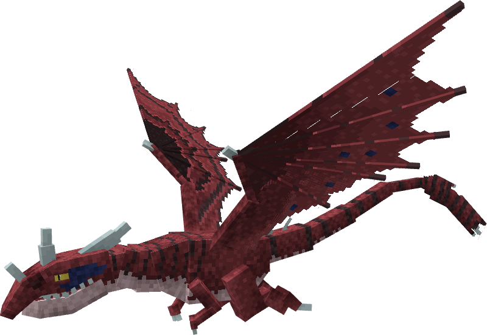

**Obtainment:** Normal spawn

```
/summon isleofberk:light_fury ~ ~ ~ {VariantName:elder_dramillion }
```

### Hurleqast

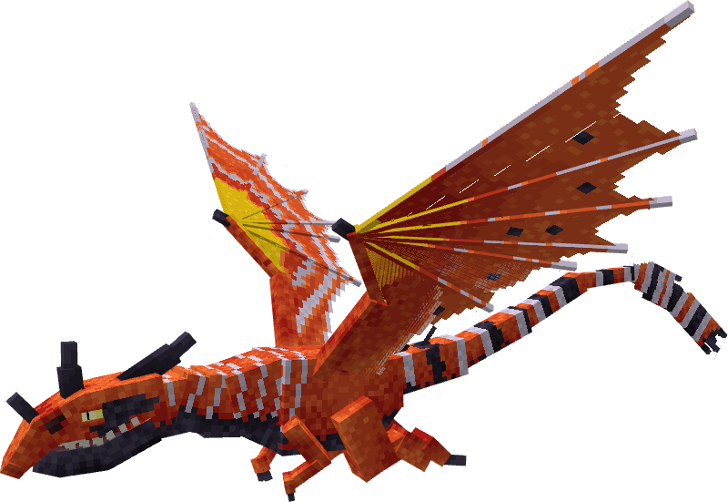

**Obtainment:** Rare spawn

```
/summon isleofberk:light_fury ~ ~ ~ {VariantName:hurleqast}
```

### Macaron

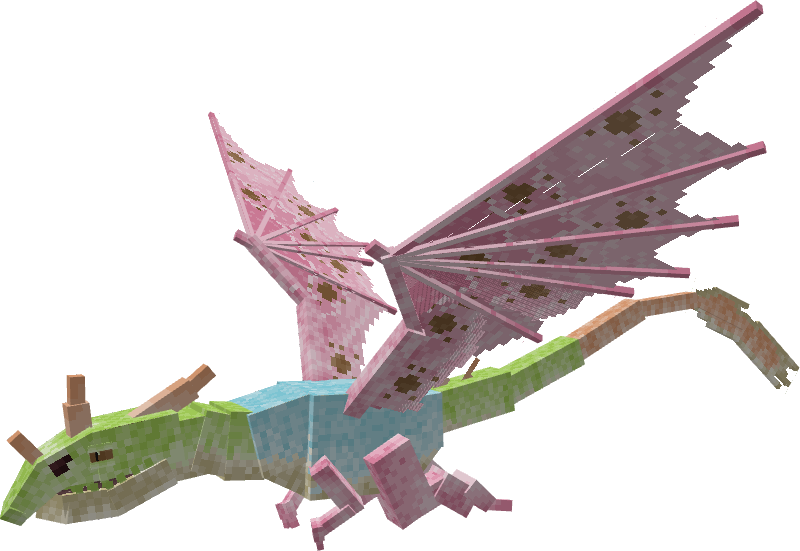

**Obtainment:** Thawfest only

```
/summon isleofberk:light_fury ~ ~ ~ {VariantName:macaron}
```

### Melanistic

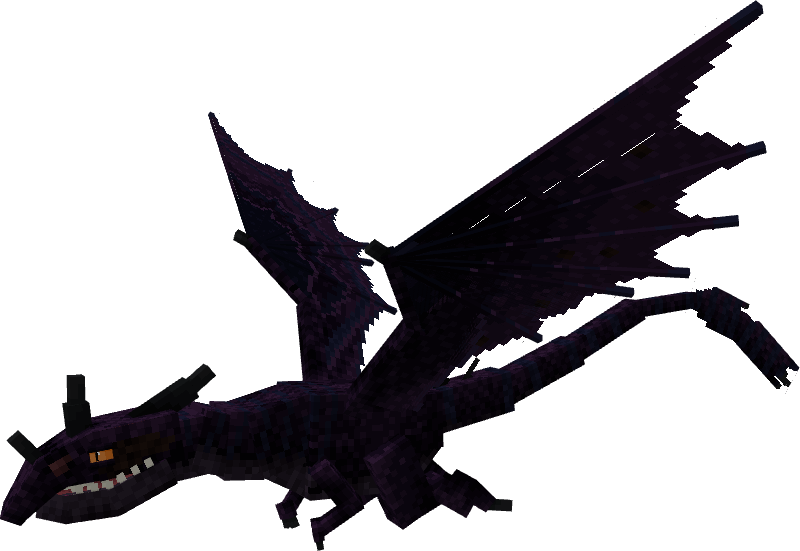

**Obtainment:** Rare spawn

```
/summon isleofberk:light_fury ~ ~ ~ {VariantName:melanistic_dramillion}
```

### Mimiric

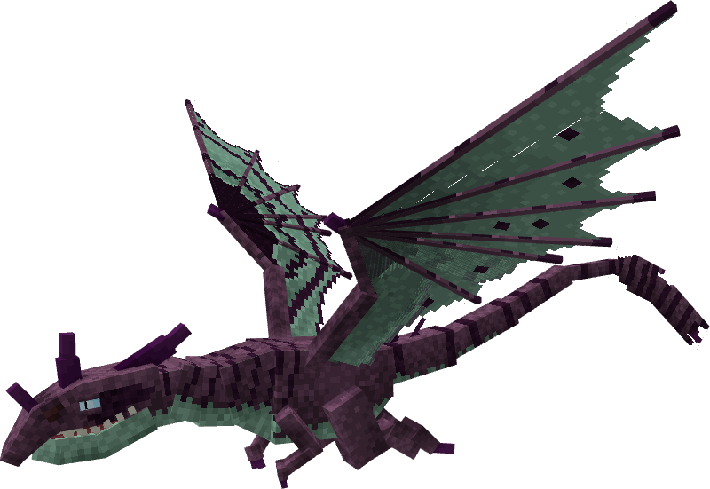

**Obtainment:** Normal spawn

```
/summon isleofberk:light_fury ~ ~ ~ {VariantName:mimiric}
```

### Muffin

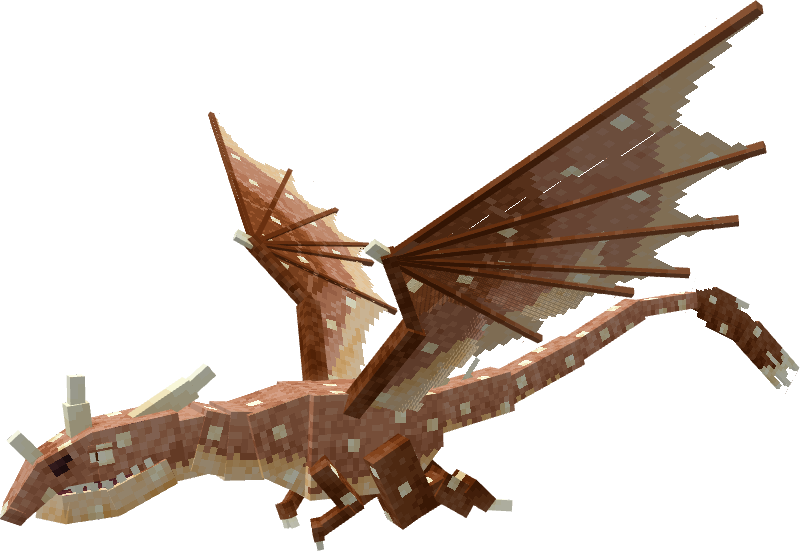

**Obtainment:** Normal spawn

```
/summon isleofberk:light_fury ~ ~ ~ {VariantName:muffin_wcc}
```

### Myrkva

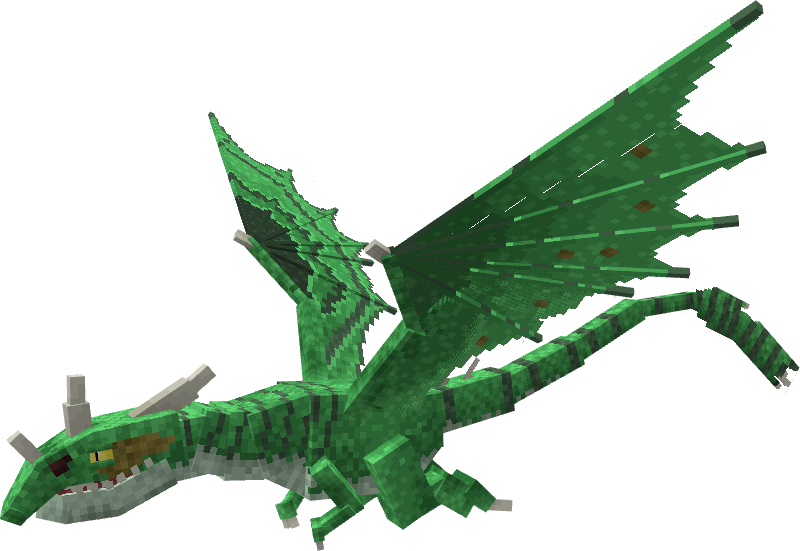

**Obtainment:** Normal spawn

```
/summon isleofberk:light_fury ~ ~ ~ {VariantName:myrkva}
```

### Nattvig

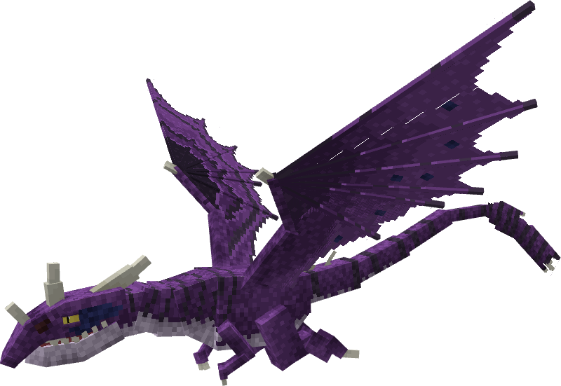

**Obtainment:** Normal spawn

```
/summon isleofberk:light_fury ~ ~ ~ {VariantName:nattvig}
```

### Ormsliki

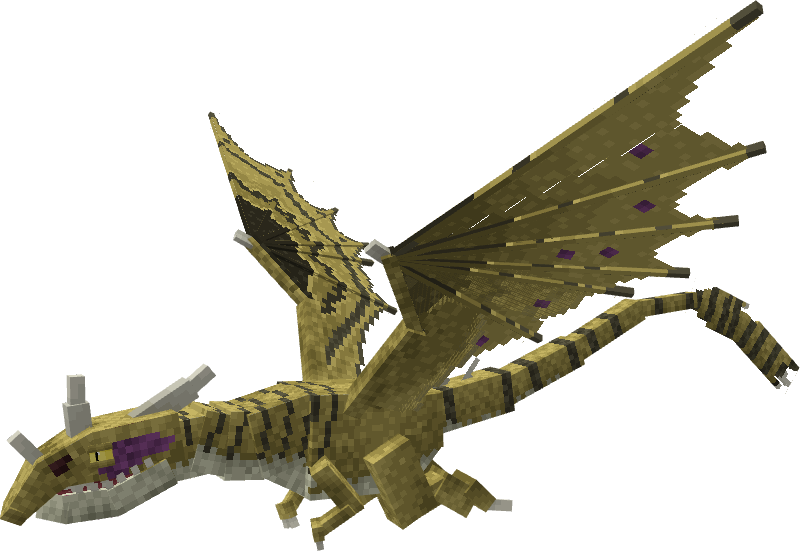

**Obtainment:** Normal spawn

```
/summon isleofberk:light_fury ~ ~ ~ {VariantName:ormsliki}
```

### Pineapple

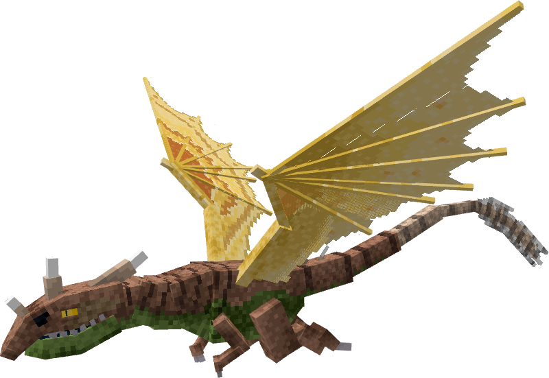

**Obtainment:** Normal spawn

```
/summon isleofberk:light_fury ~ ~ ~ {VariantName:pineapple}
```

### Titanwing

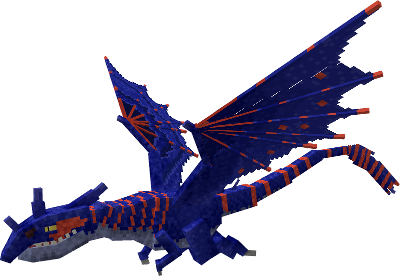

**Obtainment:** Rare spawn

```
/summon isleofberk:light_fury ~ ~ ~ {VariantName:titan_wing_dramillion}
```

---

_Content adapted from the [Archipelago Additions Wiki](https://archipelagoadditions.miraheze.org/wiki/Dramillion) under [CC BY-SA 4.0](https://creativecommons.org/licenses/by-sa/4.0/)._
