# Eight-Legged Nadder


The Eight-Legged Nadder is a book canon dragon. It is an Archipelago Additions dragon on theTerrible Terrorbase.

## Stats

| Stat | Value |
|---|---|
| Health | 30 (15 hearts) |
| Armour | 0 |
| Attack | 2 (1 heart) |
| Walk Speed | 0.45 (a little below Evoker speed) |
| Fly Speed | 0.1 (Allay speed) |

## Taming

**Taming Foods:** Raw Cod, Raw Salmon, Tropical Fish

**Requirements:** No tools or weapons (except Dragon Blades & specified Viking Artifacts) held

**Alt Taming:** Dragon Nip

## Breeding

**Breeding Foods:** Pufferfish, Sagefruit

## Drops

**Brush Drops:** 1-2 Eight-Legged Nadder Scales

**Death Drops:** 1 Dragon Blood, 1-3 Eight-Legged Nadder Scales

## Spawn Biomes

- `minecraft:flower_forest`
- `minecraft:meadow`
- `minecraft:sunflower_plains`

## Variants

### Albino

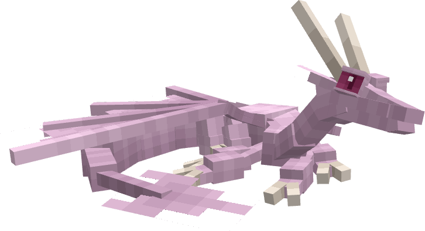

**Obtainment:** Rare spawn

```
/summon isleofberk:terrible_terror ~ ~ ~ {VariantName:eightleg_albino}
```

### Beiged Blue

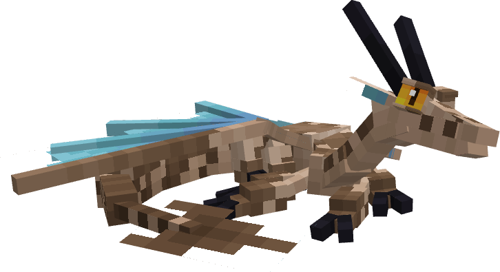

**Obtainment:** Normal spawn

```
/summon isleofberk:terrible_terror ~ ~ ~ {VariantName:beiged_blue}
```

### Blue

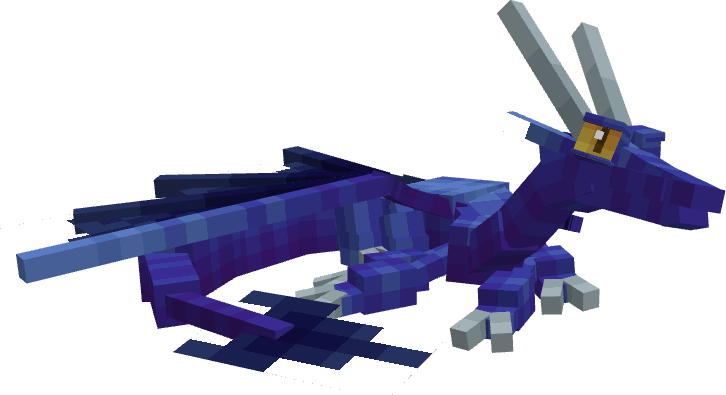

**Obtainment:** Normal spawn

```
/summon isleofberk:terrible_terror ~ ~ ~ {VariantName:eightleg_blue}
```

### Deadly Flower

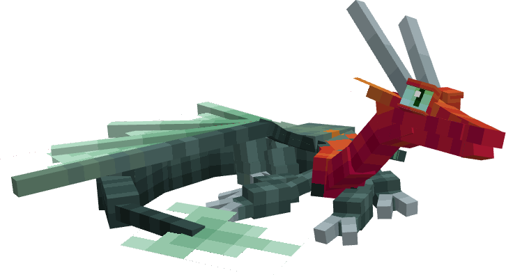

**Obtainment:** Normal spawn

```
/summon isleofberk:terrible_terror ~ ~ ~ {VariantName:deadlyflower}
```

### Erythristic

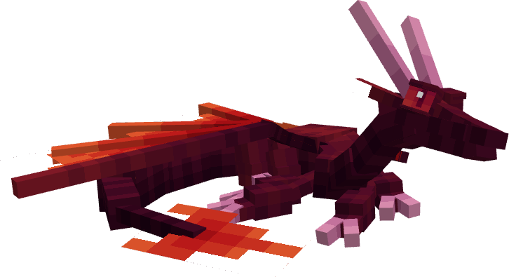

**Obtainment:** Rare spawn

```
/summon isleofberk:terrible_terror ~ ~ ~ {VariantName:eightleg_erythristic}
```

### Leucistic

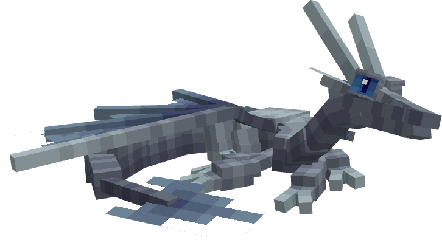

**Obtainment:** Rare spawn

```
/summon isleofberk:terrible_terror ~ ~ ~ {VariantName:eightleg_leucistic}
```

### Melanistic

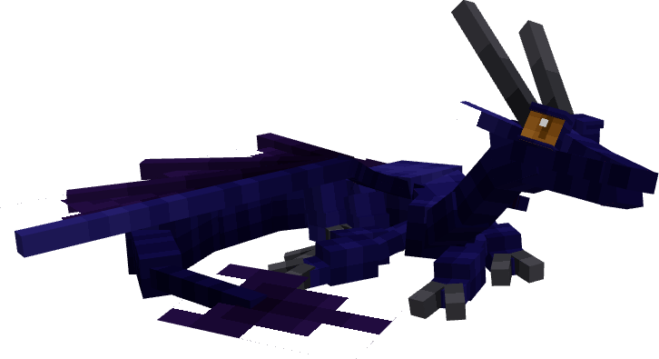

**Obtainment:** Rare spawn

```
/summon isleofberk:terrible_terror ~ ~ ~ {VariantName:eightleg_melanistic}
```

### Peril

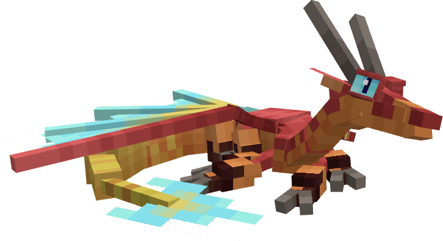

**Obtainment:** Normal spawn

```
/summon isleofberk:terrible_terror ~ ~ ~ {VariantName:peril}
```

### Purple

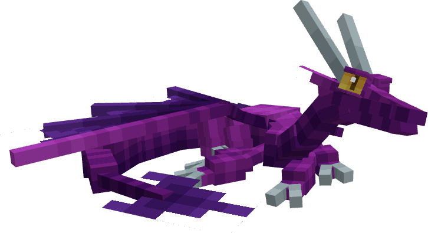

**Obtainment:** Normal spawn

```
/summon isleofberk:terrible_terror ~ ~ ~ {VariantName:eightleg_purple}
```

### Stormflew

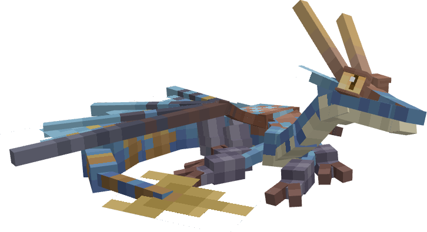

**Obtainment:** Normal spawn

```
/summon isleofberk:terrible_terror ~ ~ ~ {VariantName:stormflew}
```

### Taiga River

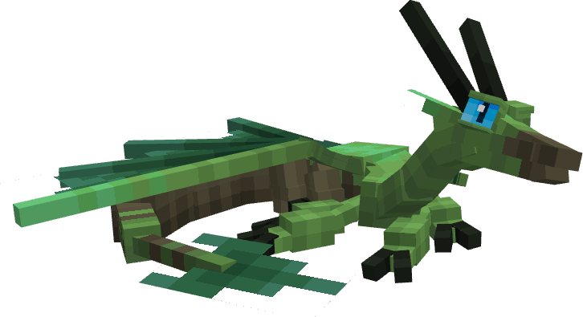

**Obtainment:** Normal spawn

```
/summon isleofberk:terrible_terror ~ ~ ~ {VariantName:taiga_river}
```

---

_Content adapted from the [Archipelago Additions Wiki](https://archipelagoadditions.miraheze.org/wiki/Eight-Legged_Nadder) under [CC BY-SA 4.0](https://creativecommons.org/licenses/by-sa/4.0/)._
