# Fireworm Queen

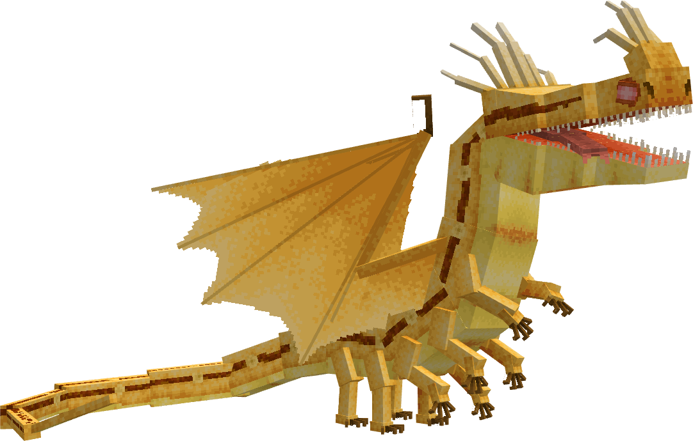

The Fireworm Queen is a series canon dragon, first appearing in Riders & Defenders of Berk. It is a Stego's Dragons dragon, now part of AA after the merge. The Fireworm Queen uses theMonstrous Nightmarebase.

## Stats

| Stat | Value |
|---|---|
| Health | 150 (75 hearts) |
| Armour | 8 (4 icons) |
| Attack | 8 (4 hearts) |
| Walk Speed | 0.6 (Wither speed) |
| Fly Speed | 0.14 (40% faster than Allay speed) |

## Taming

**Taming Foods:** Honeycomb, Firecomb Gel

**Requirements:**

- No tools or weapons (except Dragon Blades & specified Viking Artifacts) held
- No armour worn
- Fire resistance potion effect active

**Alt Taming:** Dragon Nip

## Breeding

**Breeding Foods:** Suspicious Stew, Sagefruit

## Drops

**Brush Drops:** 2-3 Fireworm Scales, 1-2 Firecomb

**Death Drops:** 2-4 Dragon Blood, 4-7 Fireworm Scales, 1-4 Firecomb

## Spawn Biomes

- `minecraft:badlands`
- `minecraft:eroded_badlands`
- `minecraft:savanna`

## Variants

### Bonefire Queen

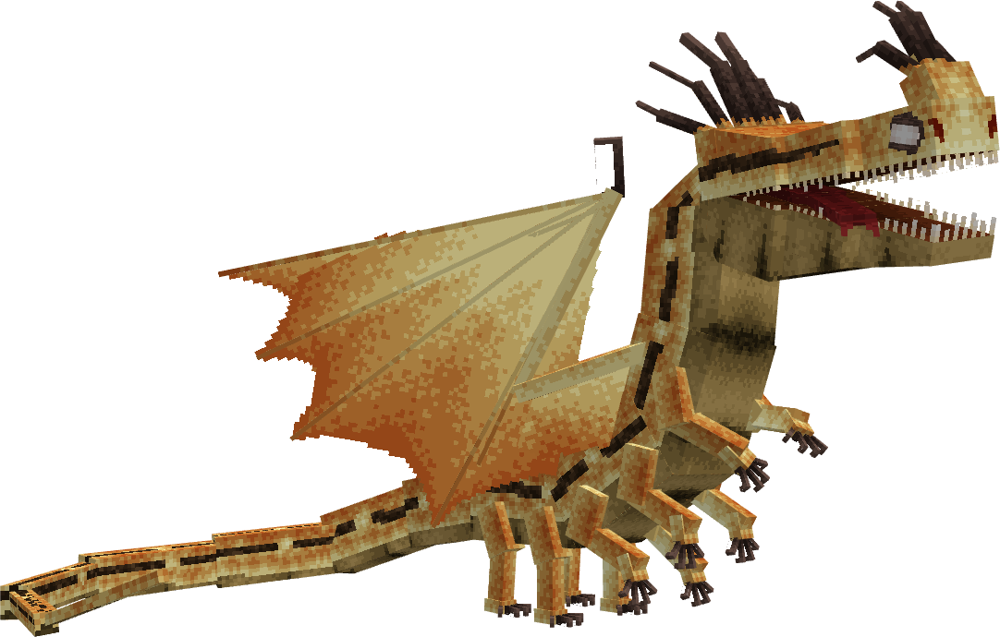

**Obtainment:** Normal spawn

```
/summon isleofberk:monstrous_nightmare ~ ~ ~ {VariantName:bonefire_queen}
```

*Credits: Stego's Dragons variant*

### Copper Queen

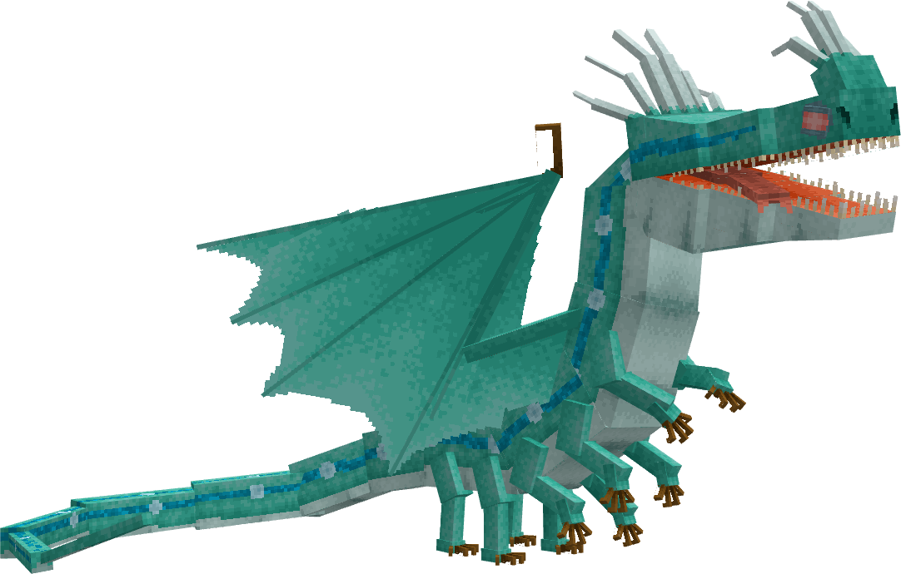

**Obtainment:** Normal spawn

```
/summon isleofberk:monstrous_nightmare ~ ~ ~ {VariantName:copper_queen}
```

*Credits: Stego's Dragons variant*

### Fearsome Flamellion

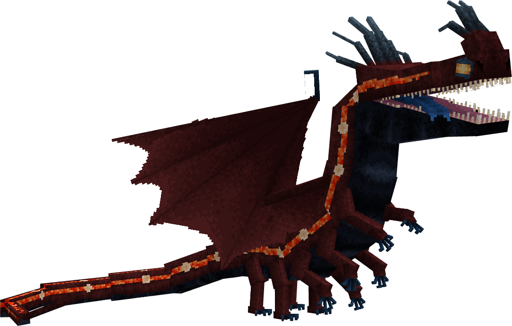

**Obtainment:** Normal spawn

```
/summon isleofberk:monstrous_nightmare ~ ~ ~ {VariantName:fearsome_flamellion}
```

*Credits: Stego's Dragons variant*

### Fireworm Empress

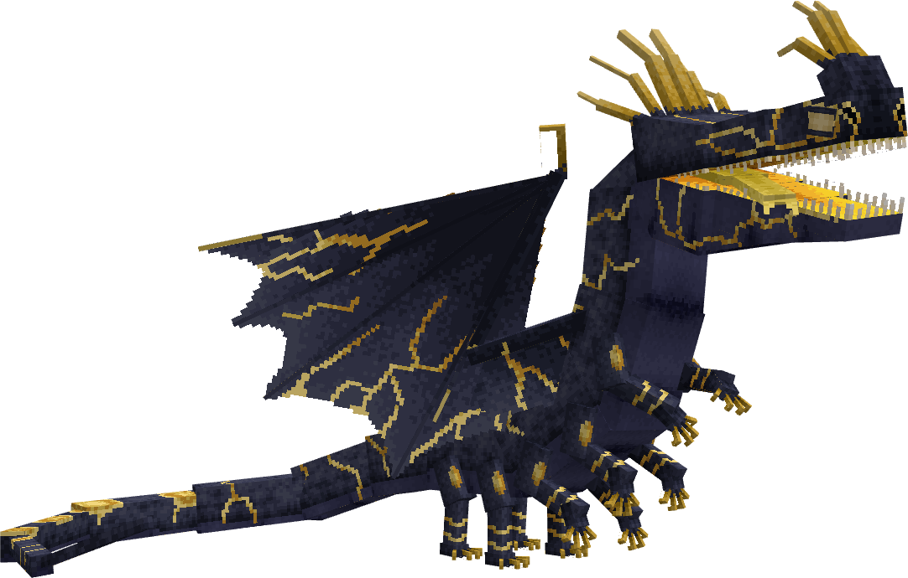

**Obtainment:** Normal spawn

```
/summon isleofberk:monstrous_nightmare ~ ~ ~ {VariantName:fireworm_empress}
```

*Credits: Stego's Dragons variant*

### Fireworm Queen


**Obtainment:** Normal spawn

```
/summon isleofberk:monstrous_nightmare ~ ~ ~ {VariantName:fireworm_queen}
```

*Credits: Stego's Dragons variant*

### Fireworm Queen (Rise of Berk)

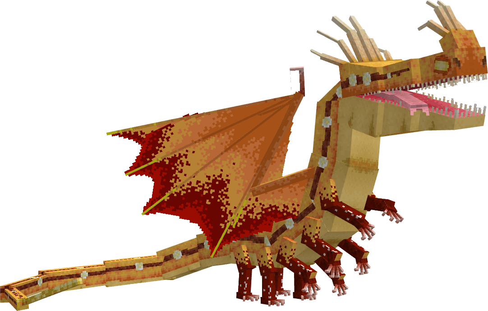

**Obtainment:** Normal spawn

```
/summon isleofberk:monstrous_nightmare ~ ~ ~ {VariantName:rob_queen}
```

*Credits: Stego's Dragons variant*

### Ice Queen

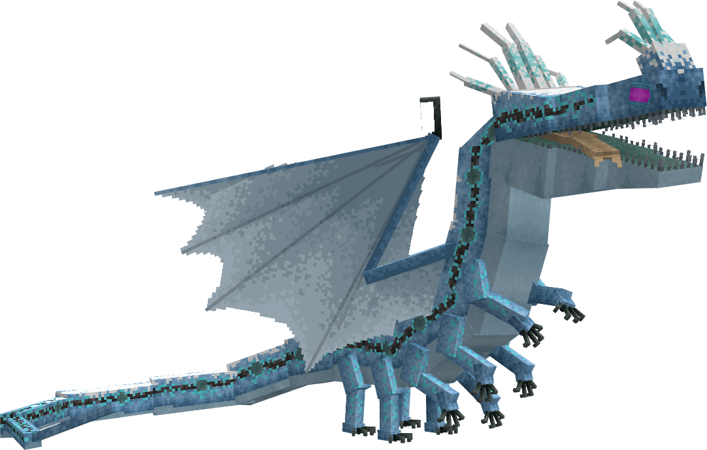

**Obtainment:** Normal spawn

```
/summon isleofberk:monstrous_nightmare ~ ~ ~ {VariantName:ice_queen}
```

*Credits: Stego's Dragons variant*

### Indium Queen

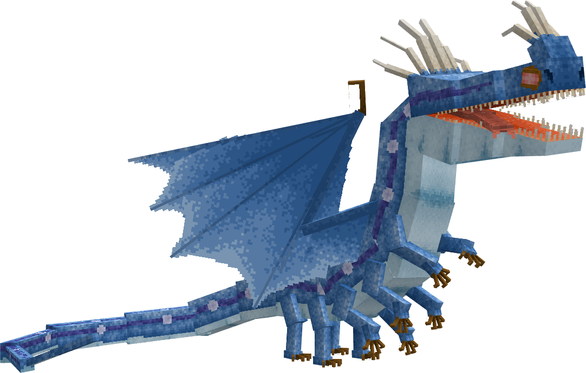

**Obtainment:** Normal spawn

```
/summon isleofberk:monstrous_nightmare ~ ~ ~ {VariantName:indium_queen}
```

*Credits: Stego's Dragons variant*

### Iron Queen

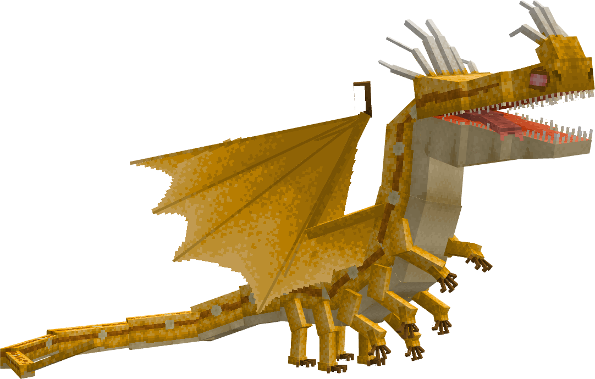

**Obtainment:** Normal spawn

```
/summon isleofberk:monstrous_nightmare ~ ~ ~ {VariantName:iron_queen}
```

*Credits: Stego's Dragons variant*

### Lithium Queen

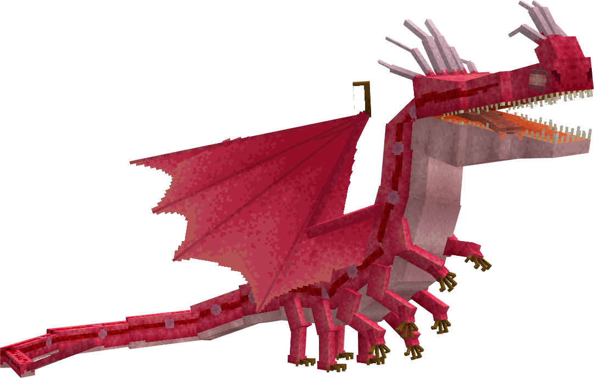

**Obtainment:** Normal spawn

```
/summon isleofberk:monstrous_nightmare ~ ~ ~ {VariantName:lithium_queen}
```

*Credits: Stego's Dragons variant*

### Metallic Queen

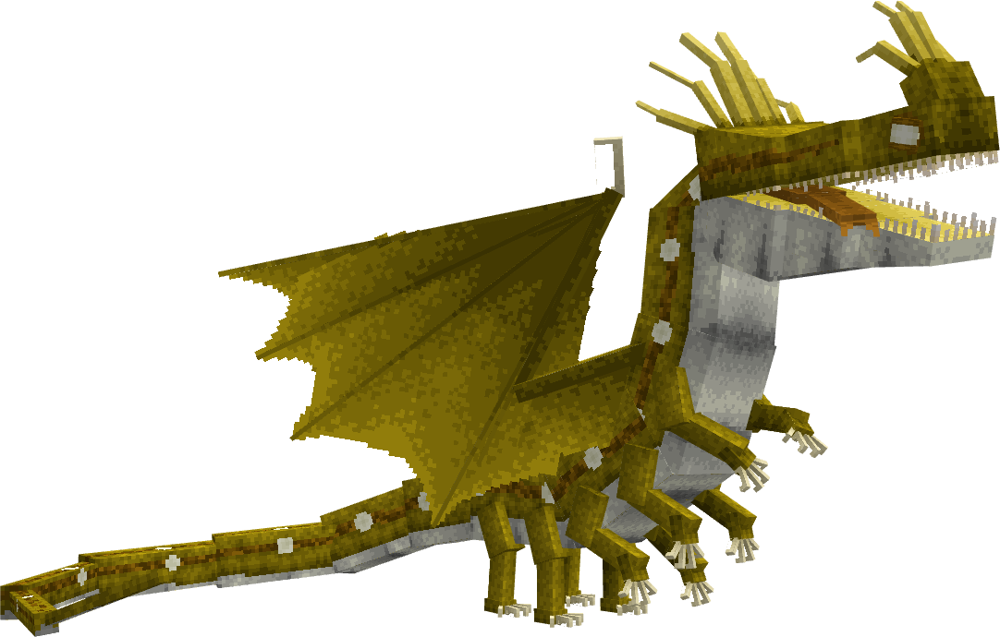

**Obtainment:** Normal spawn

```
/summon isleofberk:monstrous_nightmare ~ ~ ~ {VariantName:metalic_queen}
```

*Credits: Stego's Dragons variant. Don't mention the typo.*

### Verdigriff Queen

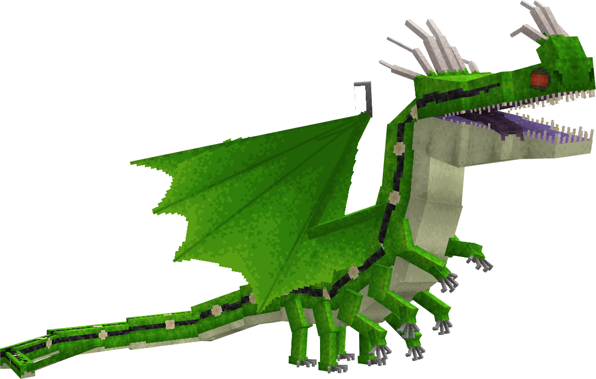

**Obtainment:** Normal spawn

```
/summon isleofberk:monstrous_nightmare ~ ~ ~ {VariantName:verdigriff_queen}
```

*Credits: Stego's Dragons variant*

---

_Content adapted from the [Archipelago Additions Wiki](https://archipelagoadditions.miraheze.org/wiki/Fireworm_Queen) under [CC BY-SA 4.0](https://creativecommons.org/licenses/by-sa/4.0/)._
