# Gronckle


The Gronckle is a main canon dragon from the first film. It is a base Isle of Berk dragon.

## Stats

| Stat | Value |
|---|---|
| Health | 60 (30 hearts) |
| Armour | 10 (5 icons) |
| Attack | 6 (3 hearts) |
| Walk Speed | 0.37 (Piglin Brute speed) |
| Fly Speed | 0.08 (just below Allay speed) |

## Taming

**Taming Foods:** Raw Beef

**Requirements:** No tools or weapons (except Dragon Blades & specified Viking Artifacts) held

**Alt Taming:** Dragon Nip

## Breeding

**Breeding Foods:** Suspicious Stew, Sagefruit

## Drops

**Brush Drops:** 1-3 Gronckle Scales

**Death Drops:** 1-2 Dragon Blood, 3-5 Gronckle Scales

## Spawn Biomes

- `minecraft:meadow`
- `minecraft:plains`
- `minecraft:savanna`
- `minecraft:savanna_plateau`
- `minecraft:stony_shores`
- `minecraft:stony_peaks`

## Variants

### Albino

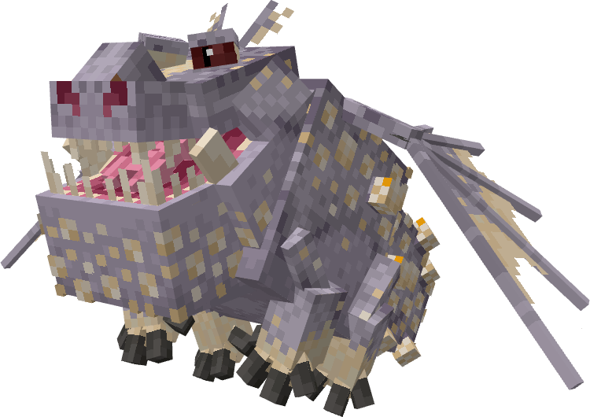

**Obtainment:** Rare spawn

```
/summon isleofberk:gronckle ~ ~ ~ {VariantName:albino_gronck}
```

### Barn

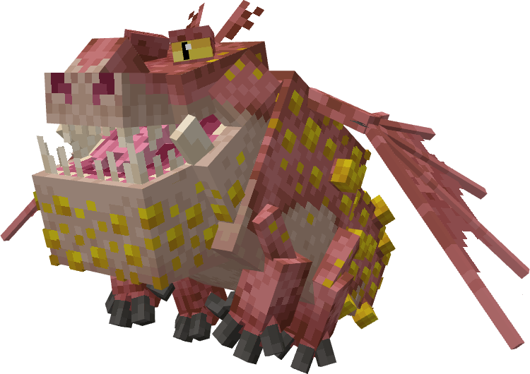

**Obtainment:** Normal spawn

```
/summon isleofberk:gronckle ~ ~ ~ {VariantName:barn}
```

*Credits: Base IoB variant*

### Bulldog

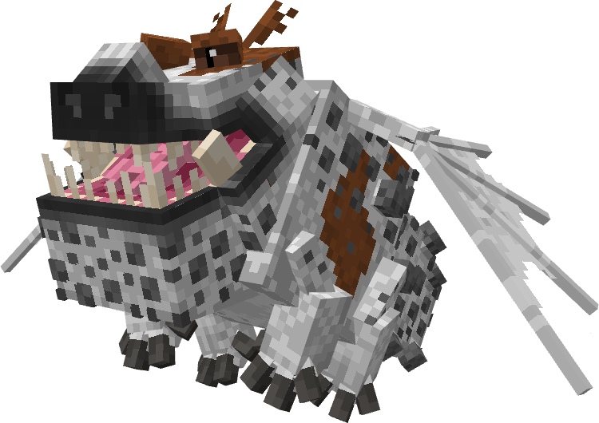

**Obtainment:** Normal spawn

```
/summon isleofberk:gronckle ~ ~ ~ {VariantName:bulldog}
```

### Bumpy

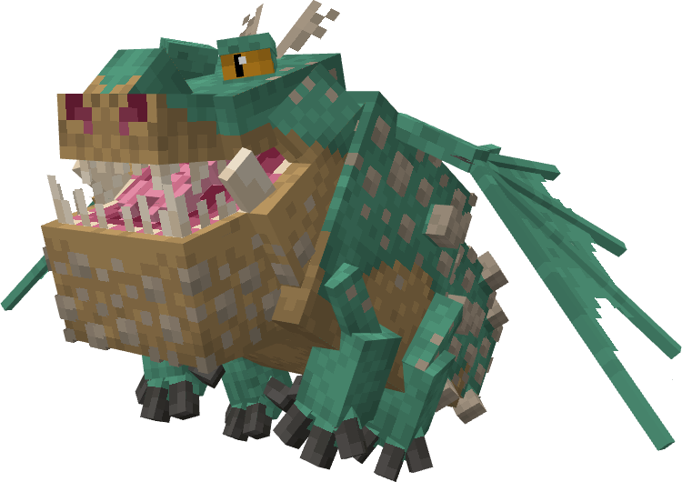

**Obtainment:** Normal spawn

```
/summon isleofberk:gronckle ~ ~ ~ {VariantName:bumpy}
```

### Candydrop

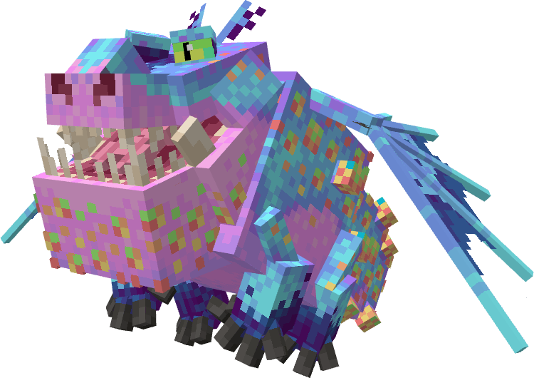

**Obtainment:** Bifrost Temple only

```
/summon isleofberk:gronckle ~ ~ ~ {VariantName:candydrop}
```

### Cheesemonger

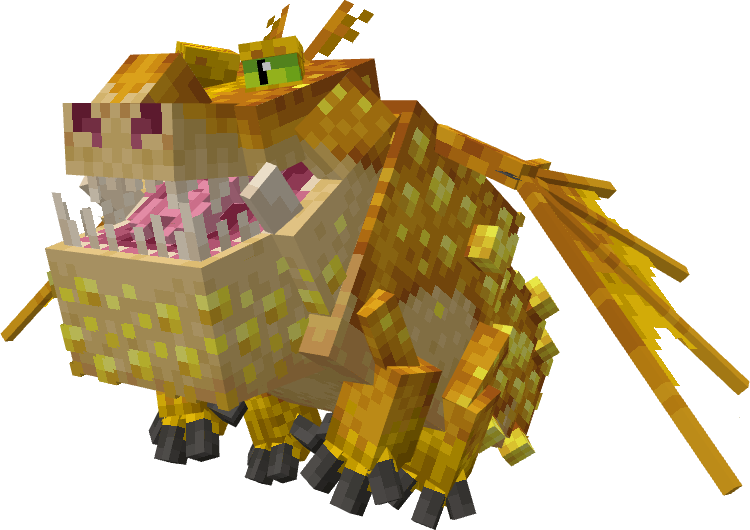

**Obtainment:** Normal spawn

```
/summon isleofberk:gronckle ~ ~ ~ {VariantName:cheesemonger}
```

*Credits: Base IoB variant*

### Coal

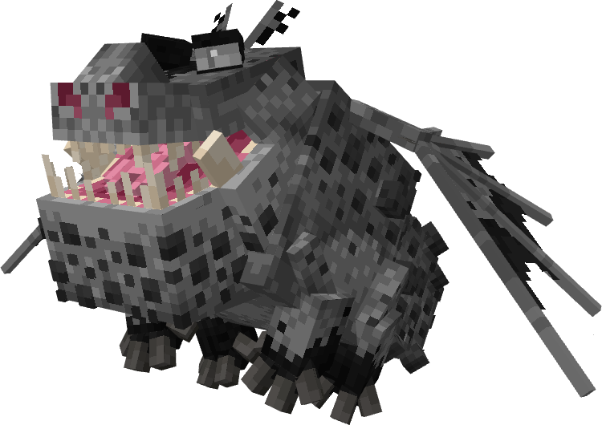

**Obtainment:** Rare spawn

```
/summon isleofberk:gronckle ~ ~ ~ {VariantName:coal}
```

### Crubble

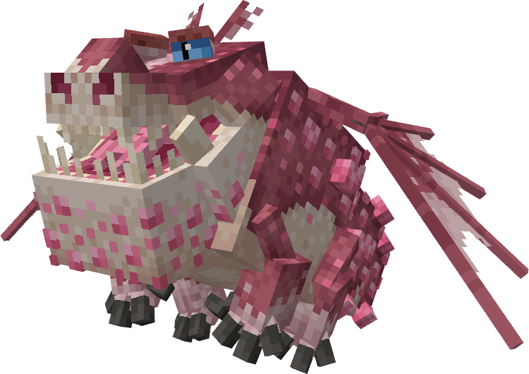

**Obtainment:** Normal spawn

```
/summon isleofberk:gronckle ~ ~ ~ {VariantName:crubble}
```

*Credits: Base IoB variant*

### Diamond

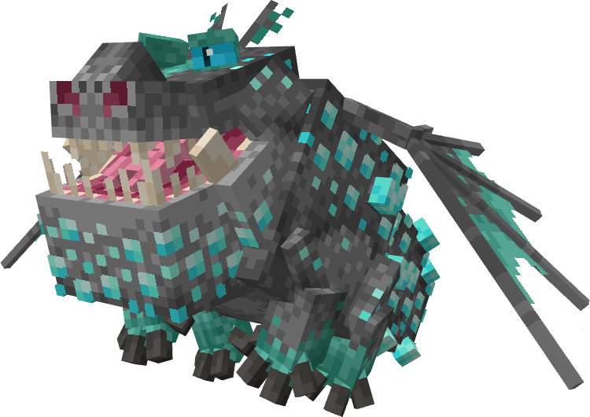

**Obtainment:** Rare spawn

```
/summon isleofberk:gronckle ~ ~ ~ {VariantName:diamond}
```

### Doge

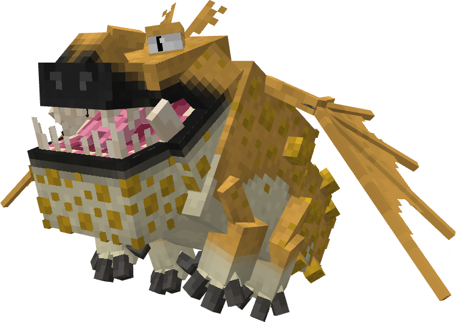

**Obtainment:** Rare spawn

```
/summon isleofberk:gronckle ~ ~ ~ {VariantName:doge}
```

### Emerald

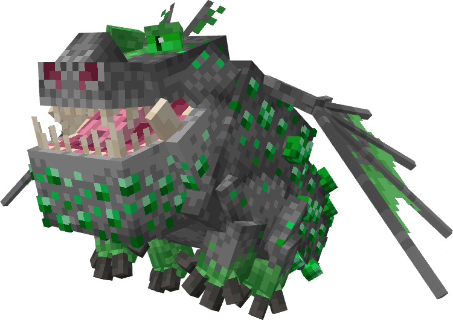

**Obtainment:** Rare spawn

```
/summon isleofberk:gronckle ~ ~ ~ {VariantName:emerald_gronckle}
```

### Exiled

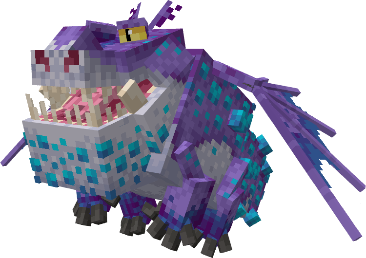

**Obtainment:** Normal spawn

```
/summon isleofberk:gronckle ~ ~ ~ {VariantName:exiled}
```

*Credits: Base IoB variant*

### Gold

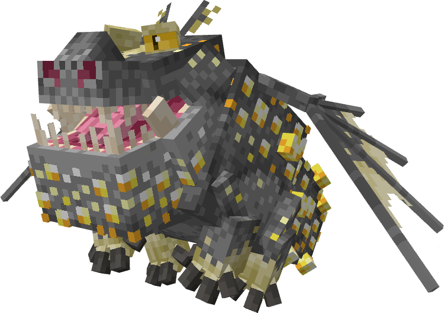

**Obtainment:** Rare spawn

```
/summon isleofberk:gronckle ~ ~ ~ {VariantName:gold}
```

### Gronckle


**Obtainment:** Normal spawn

```
/summon isleofberk:gronckle ~ ~ ~ {VariantName:gronckle}
```

*Credits: Base IoB variant*

### Gronkoh

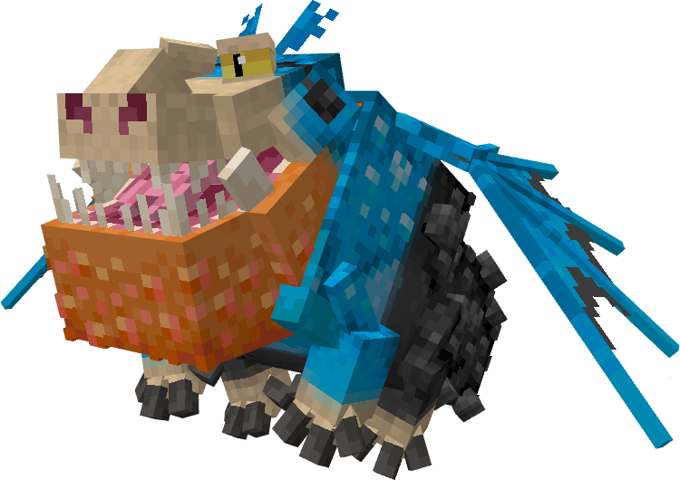

**Obtainment:** Command only

```
/summon isleofberk:gronckle ~ ~ ~ {VariantName:gronkoh}
```

### Hjarta

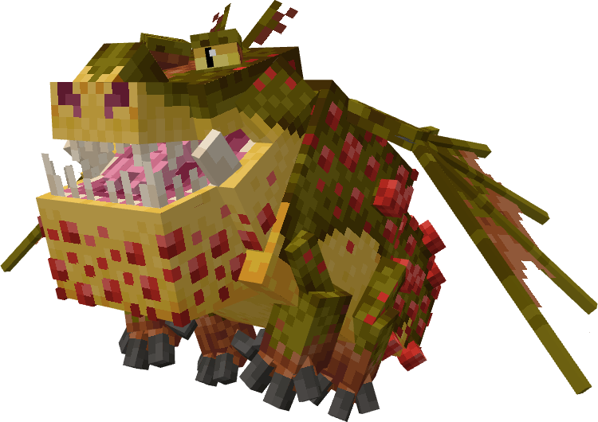

**Obtainment:** Normal spawn

```
/summon isleofberk:gronckle ~ ~ ~ {VariantName:hjarta}
```

*Credits: Base IoB variant*

### Iron

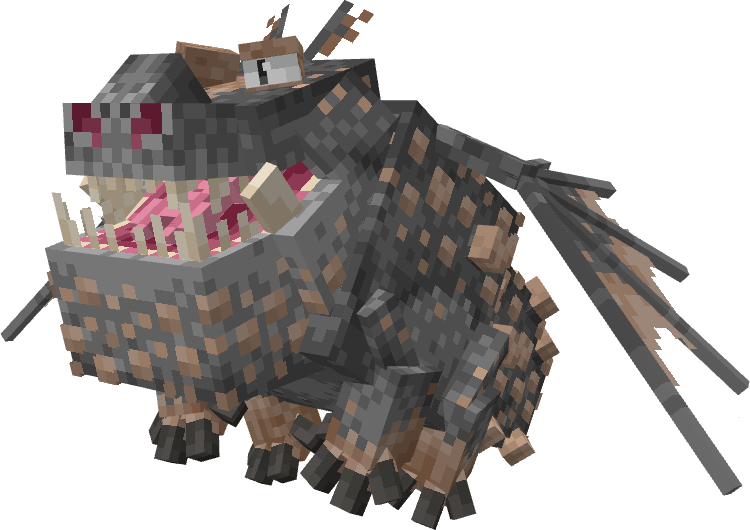

**Obtainment:** Rare spawn

```
/summon isleofberk:gronckle ~ ~ ~ {VariantName:iron}
```

### Junior Tuffnut Jr.

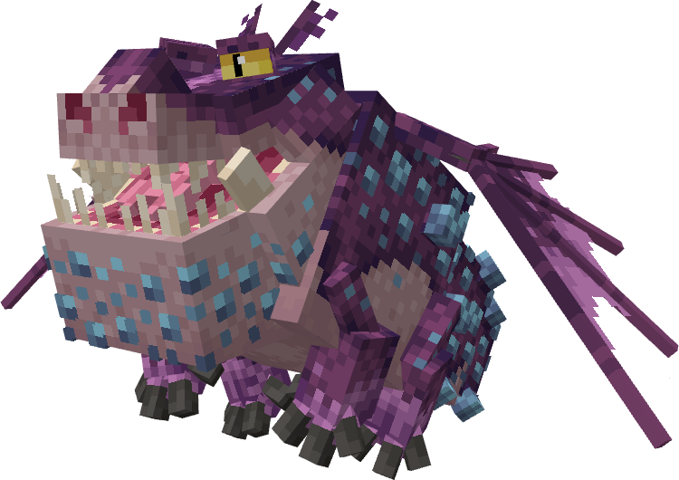

**Obtainment:** Normal spawn

```
/summon isleofberk:gronckle ~ ~ ~ {VariantName:junior_tuffnut_junior}
```

*Credits: Base IoB variant*

### Lapis

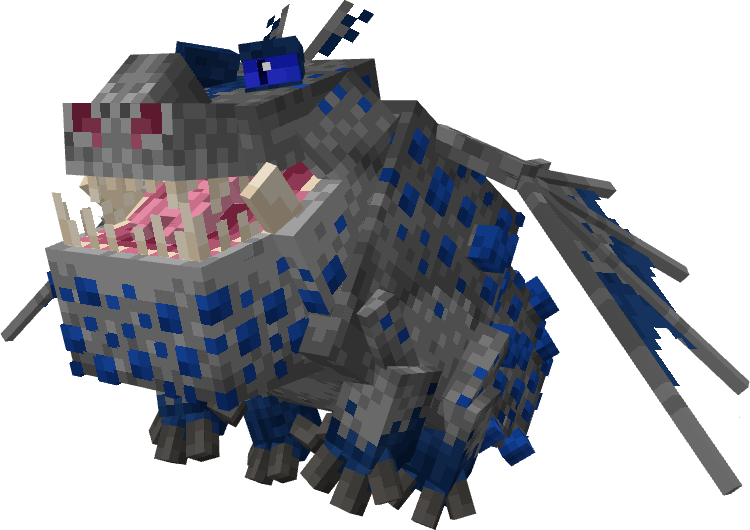

**Obtainment:** Rare spawn

```
/summon isleofberk:gronckle ~ ~ ~ {VariantName:lapis}
```

### Meatlug

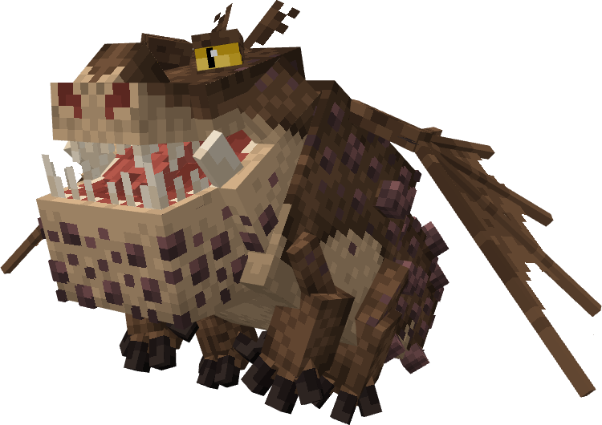

**Obtainment:** Normal spawn

```
/summon isleofberk:gronckle ~ ~ ~ {VariantName:meatlug}
```

*Credits: Base IoB variant*

### Melanistic

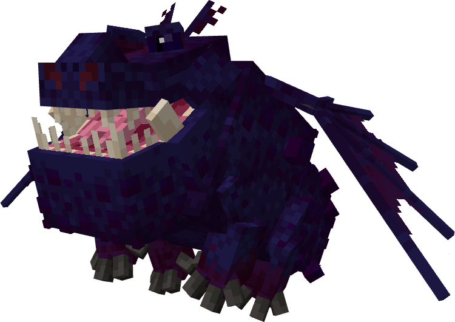

**Obtainment:** Rare spawn

```
/summon isleofberk:gronckle ~ ~ ~ {VariantName:melanistic_gronck}
```

### Nether Gold

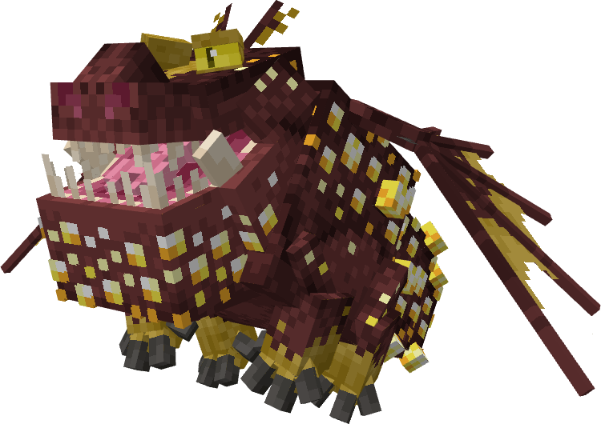

**Obtainment:** Rare spawn

```
/summon isleofberk:gronckle ~ ~ ~ {VariantName:nether_gold}
```

### Netherite

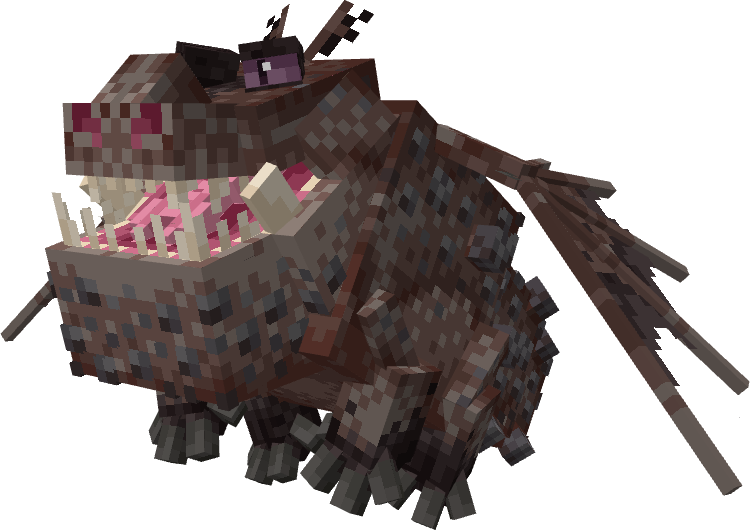

**Obtainment:** Rare spawn

```
/summon isleofberk:gronckle ~ ~ ~ {VariantName:netherite}
```

### Redstone

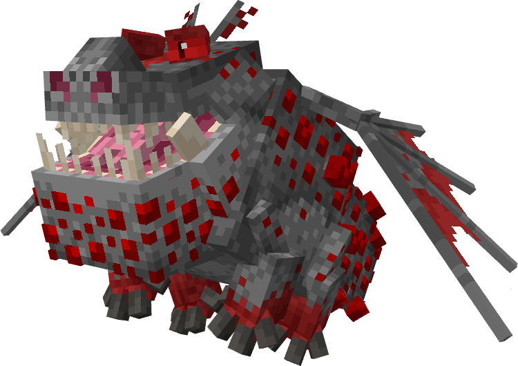

**Obtainment:** Rare spawn

```
/summon isleofberk:gronckle ~ ~ ~ {VariantName:redstone}
```

### Rubblegrubber

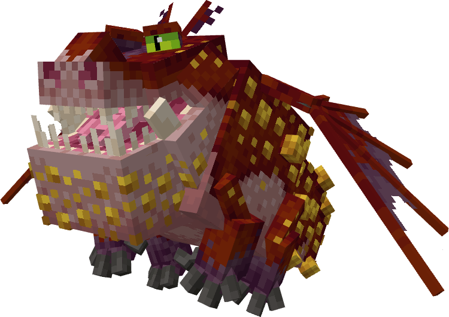

**Obtainment:** Normal spawn

```
/summon isleofberk:gronckle ~ ~ ~ {VariantName:rubblegrubber}
```

*Credits: Base IoB variant*

### Shattermaster

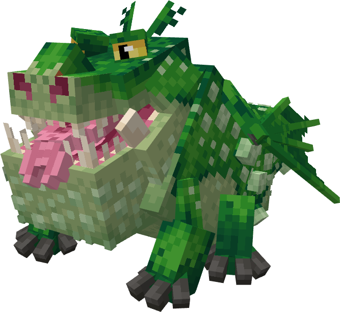

**Obtainment:** Normal spawn

```
/summon isleofberk:gronckle ~ ~ ~ {VariantName:shattermaster}
```

### Yawnckle

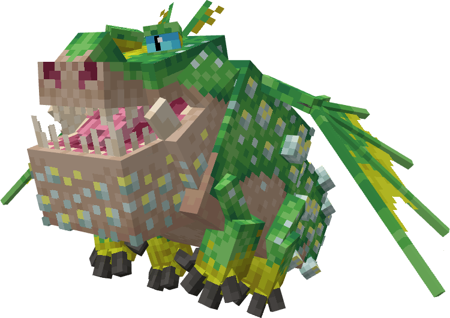

**Obtainment:** Normal spawn

```
/summon isleofberk:gronckle ~ ~ ~ {VariantName:yawnckle}
```

*Credits: Base IoB variant*

### Y-Wing

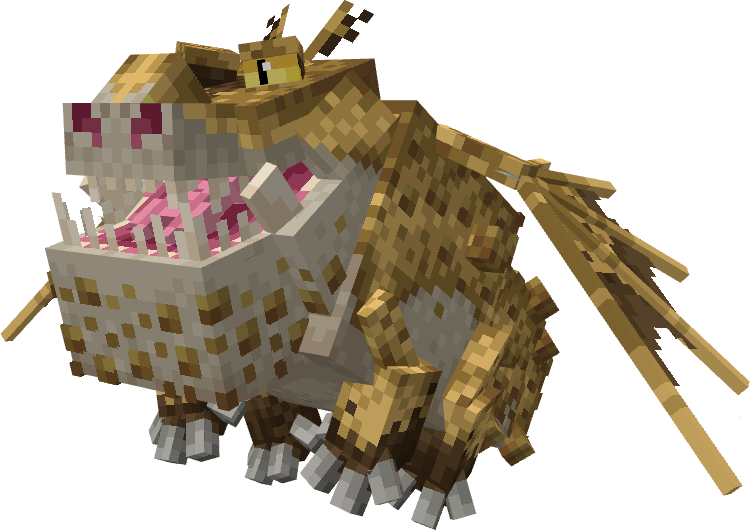

**Obtainment:** Normal spawn

```
/summon isleofberk:gronckle ~ ~ ~ {VariantName:ywing}
```

---

_Content adapted from the [Archipelago Additions Wiki](https://archipelagoadditions.miraheze.org/wiki/Gronckle) under [CC BY-SA 4.0](https://creativecommons.org/licenses/by-sa/4.0/)._
