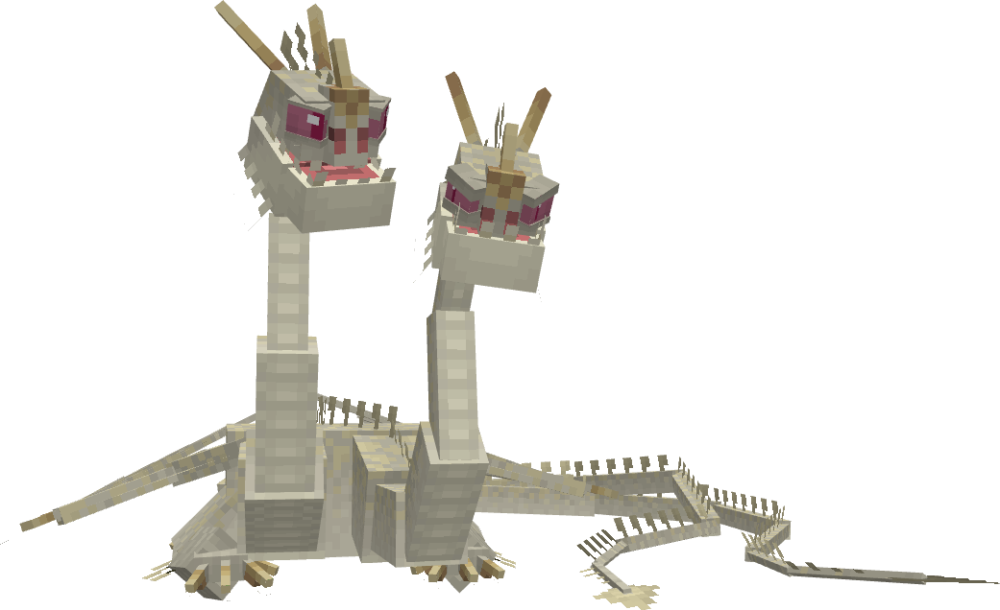
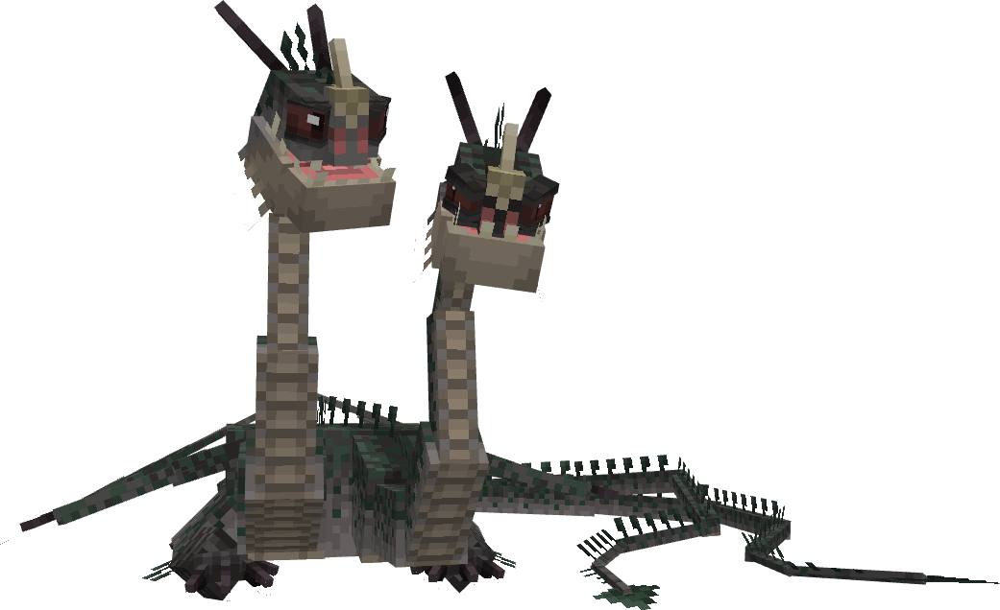
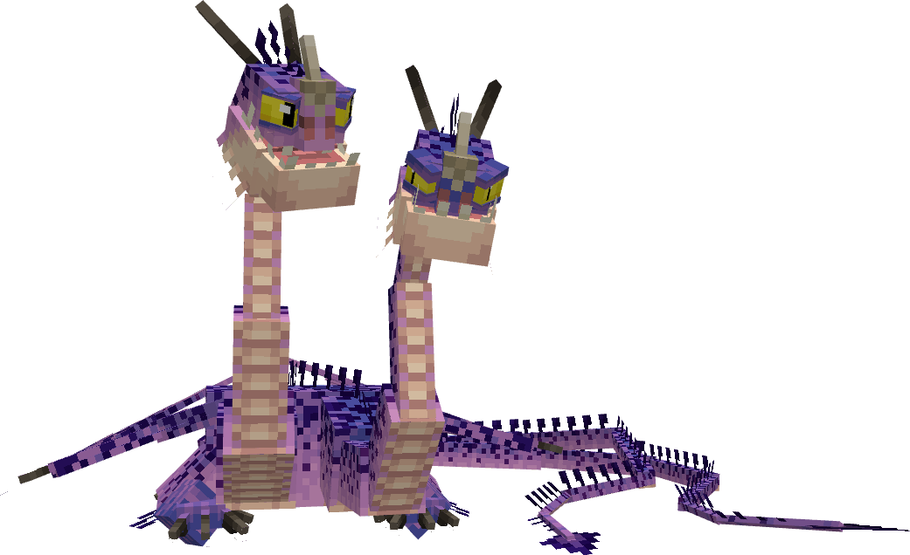
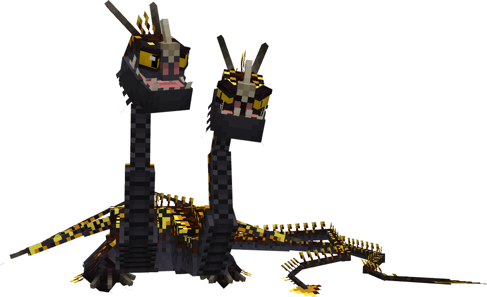
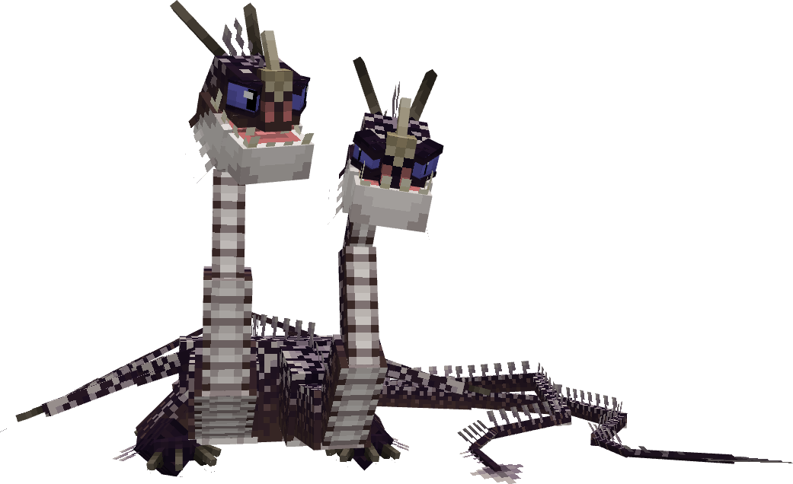
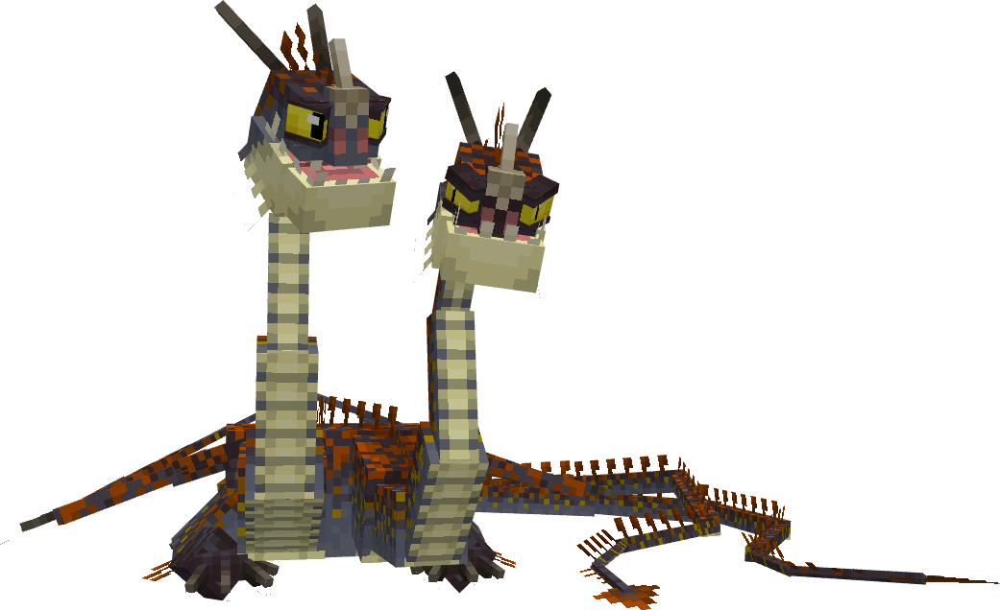
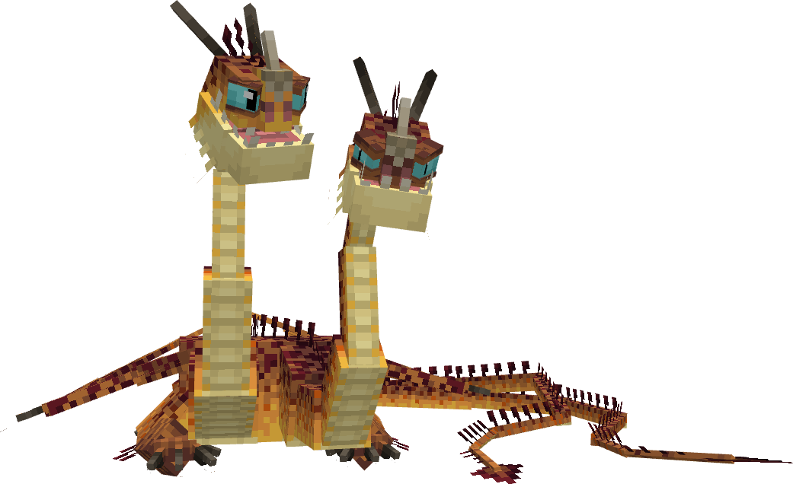
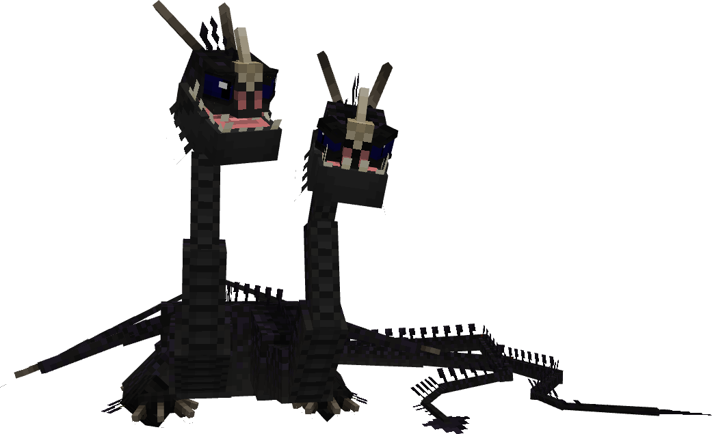
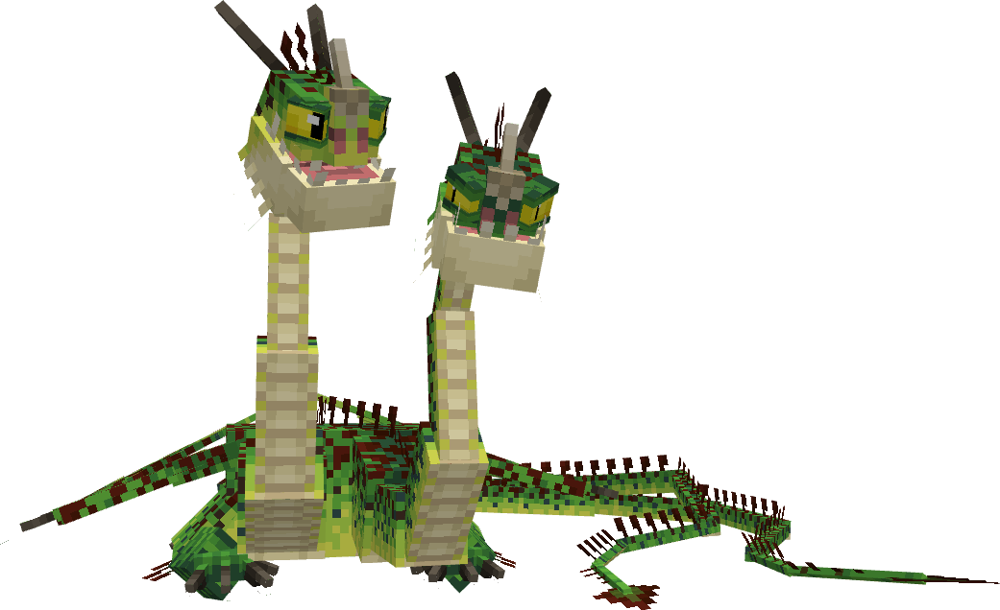
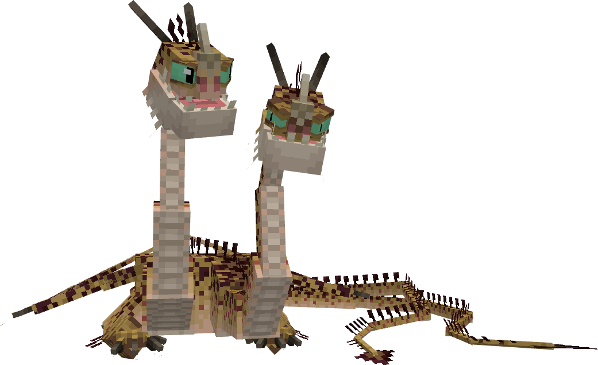

# Hideous Zippleback


The Hideous Zippleback is a main canon dragon from the first film. It is a base Isle of Berk dragon.

## Stats

| Stat | Value |
|---|---|
| Health | 100 (50 hearts) |
| Armour | 0 |
| Attack | 6 (3 heart) |
| Walk Speed | 0.4 (Piglin Brute speed) |
| Fly Speed | 0.14 (40% faster than an Allay) |

## Taming

**Taming Foods:** Raw Cod, Raw Salmon, Tropical Fish

**Requirements:**

- Strength potion effect active
- No armour equipped
- No tools or weapons (except Dragon Blades & specified Viking Artifacts) held

**Alt Taming:** Dragon Nip

## Breeding

**Breeding Foods:** Suspicious Stew, Sagefruit

## Drops

**Brush Drops:** 2-3 Hideous Zippleback Scales

**Death Drops:** 1-3 Dragon Blood, 4-7 Hideous Zippleback Scales

## Spawn Biomes

- `minecraft:flower_forest`
- `minecraft:old_growth_birch_forest`
- `minecraft:forest`

## Variants

### Albino



**Obtainment:** Rare spawn

```
/summon isleofberk:zippleback ~ ~ ~ {VariantName:albino_zipple}
```

### Barf & Belch


**Obtainment:** Normal spawn

```
/summon isleofberk:zippleback ~ ~ ~ {VariantName:barf_n_belch}
```

### Brachi



**Obtainment:** Normal spawn

```
/summon isleofberk:zippleback ~ ~ ~ {VariantName:brachi}
```

### Exiled



**Obtainment:** Normal spawn

```
/summon isleofberk:zippleback ~ ~ ~ {VariantName:exiled}
```

*Credits: Base IoB variant*

### Fart & Smella


**Obtainment:** Normal spawn

```
/summon isleofberk:zippleback ~ ~ ~ {VariantName:fart_n_smella}
```

### Fart & Sniff


**Obtainment:** Normal spawn

```
/summon isleofberk:zippleback ~ ~ ~ {VariantName:fart_n_sniff}
```

*Credits: Base IoB variant*

### Gilded Zippleback



**Obtainment:** Rare spawn

```
/summon isleofberk:zippleback ~ ~ ~ {VariantName:gilded_zippleback}
```

### Glitter & Light


**Obtainment:** Bifrost Temple only

```
/summon isleofberk:zippleback ~ ~ ~ {VariantName:glitter_n_light}
```

### Hamfeist



**Obtainment:** Normal spawn

```
/summon isleofberk:zippleback ~ ~ ~ {VariantName:hamfeist}
```

*Credits: Base IoB variant*

### Hjarta



**Obtainment:** Normal spawn

```
/summon isleofberk:zippleback ~ ~ ~ {VariantName:hjarta}
```

*Credits: Base IoB variant*

### Hodd



**Obtainment:** Normal spawn

```
/summon isleofberk:zippleback ~ ~ ~ {VariantName:hodd}
```

*Credits: Base IoB variant*

### Kandy & Kane


**Obtainment:** Snoggletog only

```
/summon isleofberk:zippleback ~ ~ ~ {VariantName:kandy_n_kane}
```

*Credits: Base IoB variant*

### Leaf & Bark


**Obtainment:** Normal spawn

```
/summon isleofberk:zippleback ~ ~ ~ {VariantName:leaf_n_bark}
```

*Credits: Base IoB variant*

### Melanistic



**Obtainment:** Rare spawn

```
/summon isleofberk:zippleback ~ ~ ~ {VariantName:melanistic_zipple}
```

### Pistill



**Obtainment:** Normal spawn

```
/summon isleofberk:zippleback ~ ~ ~ {VariantName:pistill}
```

*Credits: Base IoB variant*

### Poison & Dart


**Obtainment:** Rare spawn

```
/summon isleofberk:zippleback ~ ~ ~ {VariantName:poison_n_dart}
```

*Credits: This variant was donated by Ness*

### Purple & Nurple


**Obtainment:** Normal spawn

```
/summon isleofberk:zippleback ~ ~ ~ {VariantName:purple_n_nurple}
```

*Credits: Base IoB variant*

### Sandr



**Obtainment:** Normal spawn

```
/summon isleofberk:zippleback ~ ~ ~ {VariantName:sandr}
```

*Credits: Base IoB variant*

### Sparkles & Sparks


**Obtainment:** Normal spawn

```
/summon isleofberk:zippleback ~ ~ ~ {VariantName:sparkles_n_sparks}
```

### Water & Melon


**Obtainment:** Rare spawn

```
/summon isleofberk:zippleback ~ ~ ~ {VariantName:water_n_melon}
```

### Whip & Lash


**Obtainment:** Normal spawn

```
/summon isleofberk:zippleback ~ ~ ~ {VariantName:whip_n_lash}
```

*Credits: Base IoB variant*

---

_Content adapted from the [Archipelago Additions Wiki](https://archipelagoadditions.miraheze.org/wiki/Hideous_Zippleback) under [CC BY-SA 4.0](https://creativecommons.org/licenses/by-sa/4.0/)._
