# Hobblegrunt


The Hobblegrunt is a main canon dragon, first appearing in HTTYD2. It is a Stego's Dragons dragon, now part of AA after the merge. The Hobblegrunt uses theMonstrous Nightmarebase.

## Stats

| Stat | Value |
|---|---|
| Health | 60 (30 hearts) |
| Armour | 4 (2 icons) |
| Attack | 4 (2 hearts) |
| Walk Speed | 0.4 (Piglin Brute speed) |
| Fly Speed | 0.15 (50% faster than Allay speed) |

## Taming

**Taming Foods:** Raw Cod

**Requirements:**

- No tools or weapons (except Dragon Blades & specified Viking Artifacts) held
- No armour worn
- Fire resistance potion effect active

**Alt Taming:** Dragon Nip

## Breeding

**Breeding Foods:** Suspicious Stew, Sagefruit

## Drops

**Brush Drops:** 1-3 Hobblegrunt Scales

**Death Drops:** 1-2 Dragon Blood, 3-5 Hobblegrunt Scales

## Spawn Biomes

- `minecraft:jungle`
- `minecraft:sparse_jungle`
- `minecraft:bamboo_jungle`

## Variants

### Albinogrunt

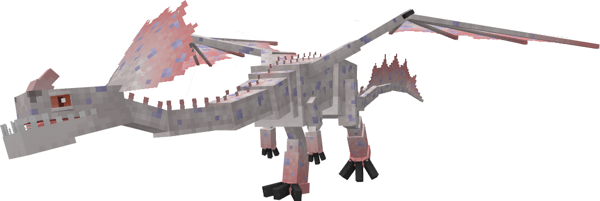

**Obtainment:** Rare spawn

```
/summon isleofberk:monstrous_nightmare ~ ~ ~ {VariantName:albinogrunt}
```

*Credits: Stego's Dragons variant*

### Blind (A)

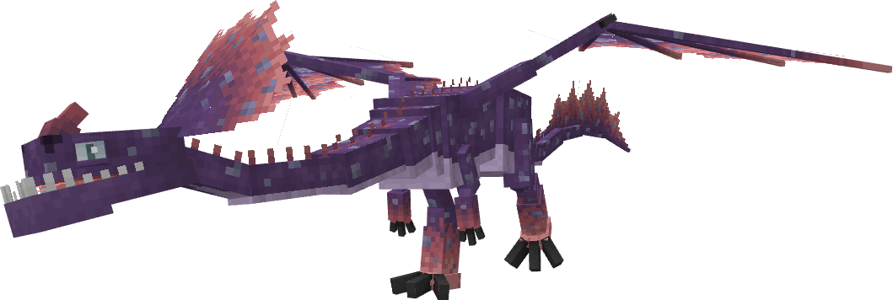

**Obtainment:** Rare spawn

```
/summon isleofberk:monstrous_nightmare ~ ~ ~ {VariantName:blind}
```

*Credits: Stego's Dragons variant*

### Blind (B)

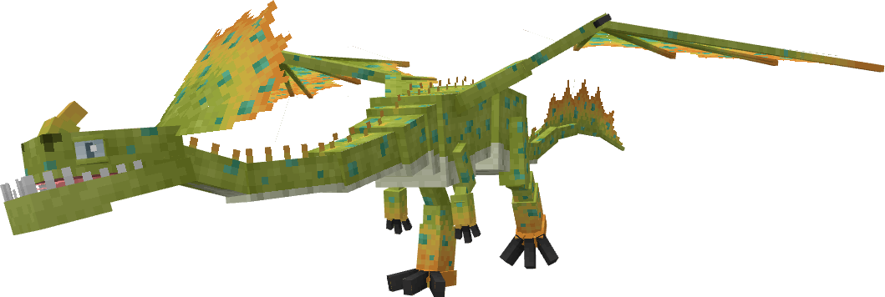

**Obtainment:** Rare spawn

```
/summon isleofberk:monstrous_nightmare ~ ~ ~ {VariantName:blind2}
```

*Credits: Stego's Dragons variant*

### Cheesegrunt

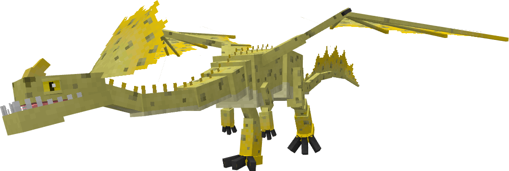

**Obtainment:** Normal spawn

```
/summon isleofberk:monstrous_nightmare ~ ~ ~ {VariantName:cheesegrunt}
```

*Credits: Stego's Dragons variant*

### Chromo


**Obtainment:** Normal spawn

```
/summon isleofberk:monstrous_nightmare ~ ~ ~ {VariantName:chromo}
```

*Credits: Stego's Dragons variant*

### Cookie Monster

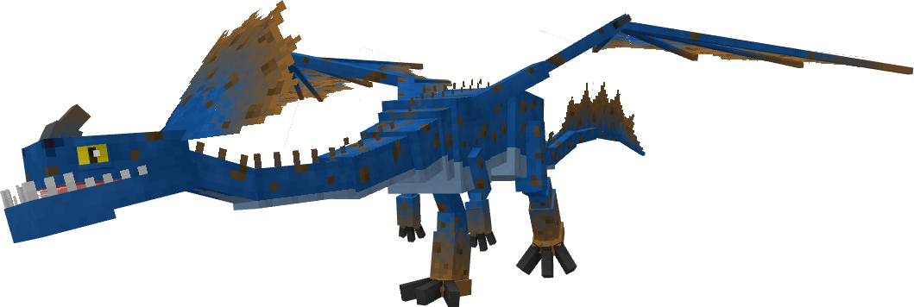

**Obtainment:** Normal spawn

```
/summon isleofberk:monstrous_nightmare ~ ~ ~ {VariantName:cookie_monster}
```

*Credits: Stego's Dragons variant*

### Crimson Gruntgutter

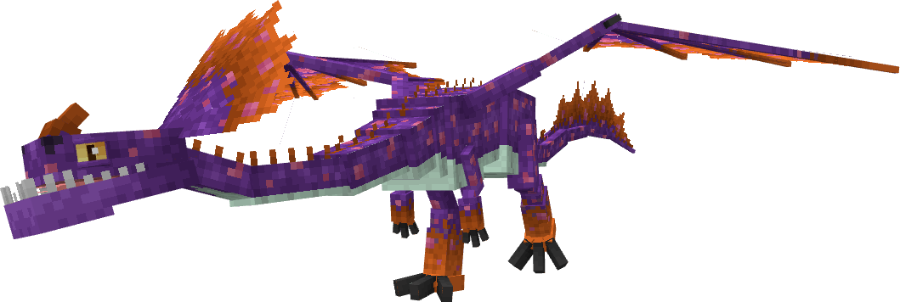

**Obtainment:** Normal spawn

```
/summon isleofberk:monstrous_nightmare ~ ~ ~ {VariantName:crimson_gruntgutter}
```

*Credits: Stego's Dragons variant*

### Crooked Bellow

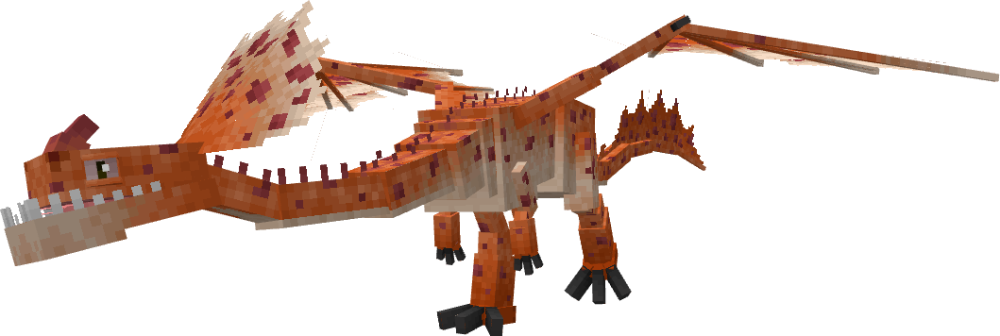

**Obtainment:** Normal spawn

```
/summon isleofberk:monstrous_nightmare ~ ~ ~ {VariantName:crookedbellow}
```

*Credits: Stego's Dragons variant*

### Dawn


**Obtainment:** Normal spawn

```
/summon isleofberk:monstrous_nightmare ~ ~ ~ {VariantName:dawn}
```

*Credits: Stego's Dragons variant*

### Demongrunt

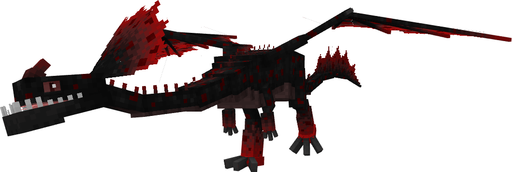

**Obtainment:** Normal spawn

```
/summon isleofberk:monstrous_nightmare ~ ~ ~ {VariantName:demongrunt}
```

*Credits: Stego's Dragons variant*

### Doomsday Blue

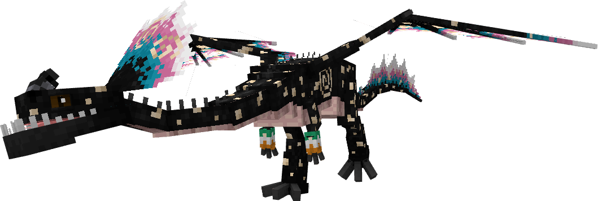

**Obtainment:** Rare spawn

```
/summon isleofberk:monstrous_nightmare ~ ~ ~ {VariantName:doomsday_blue}
```

*Credits: Stego's Dragons variant*

### Eclipse

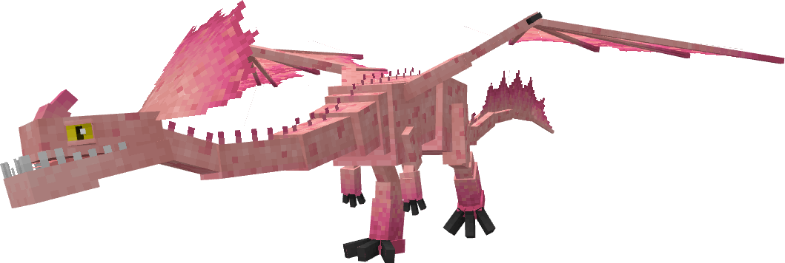

**Obtainment:** Normal spawn

```
/summon isleofberk:monstrous_nightmare ~ ~ ~ {VariantName:eclipse}
```

*Credits: Stego's Dragons variant*

### Galaxygrunt

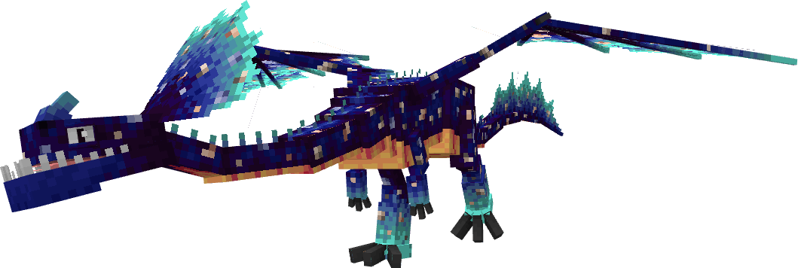

**Obtainment:** Rare spawn

```
/summon isleofberk:monstrous_nightmare ~ ~ ~ {VariantName:galaxygrunt}
```

*Credits: Stego's Dragons variant*

### Grunty Zippleback

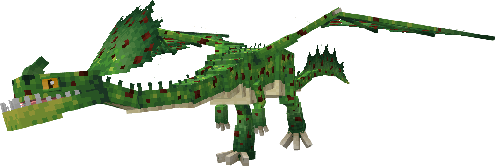

**Obtainment:** Normal spawn

```
/summon isleofberk:monstrous_nightmare ~ ~ ~ {VariantName:grunty_zippleback}
```

*Credits: Stego's Dragons variant*

### Hobblegrunt


**Obtainment:** Normal spawn

```
/summon isleofberk:monstrous_nightmare ~ ~ ~ {VariantName:hobblegrunt}
```

*Credits: Stego's Dragons variant*

### Lemongrunt

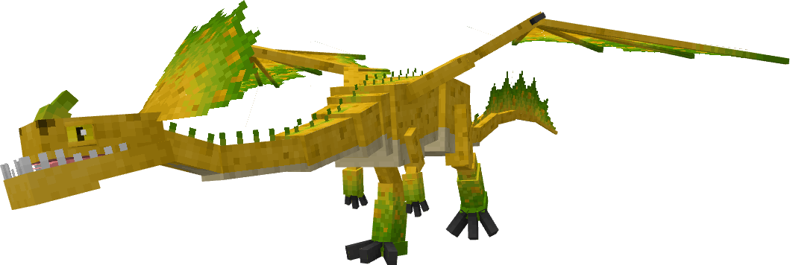

**Obtainment:** Normal spawn

```
/summon isleofberk:monstrous_nightmare ~ ~ ~ {VariantName:lemongrunt}
```

*Credits: Stego's Dragons variant*

### Leucistic

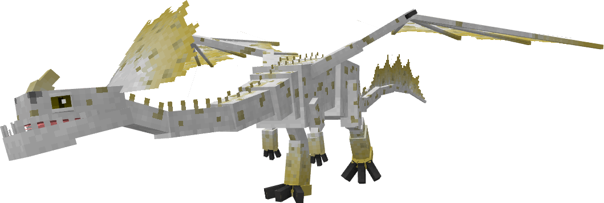

**Obtainment:** Rare spawn

```
/summon isleofberk:monstrous_nightmare ~ ~ ~ {VariantName:leucistgrunt}
```

*Credits: Stego's Dragons variant*

### Light Grunter

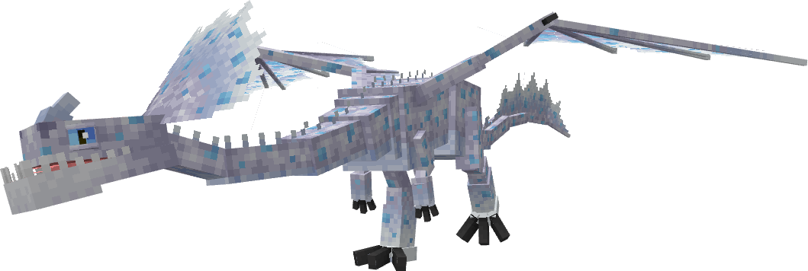

**Obtainment:** Normal spawn

```
/summon isleofberk:monstrous_nightmare ~ ~ ~ {VariantName:light_grunter}
```

*Credits: Stego's Dragons variant*

### Luminigrunt

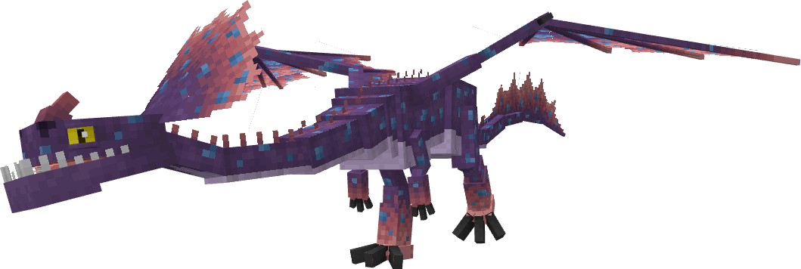

**Obtainment:** Rare spawn

```
/summon isleofberk:monstrous_nightmare ~ ~ ~ {VariantName:luminigrunt}
```

*Credits: Stego's Dragons variant*

### Melanistic

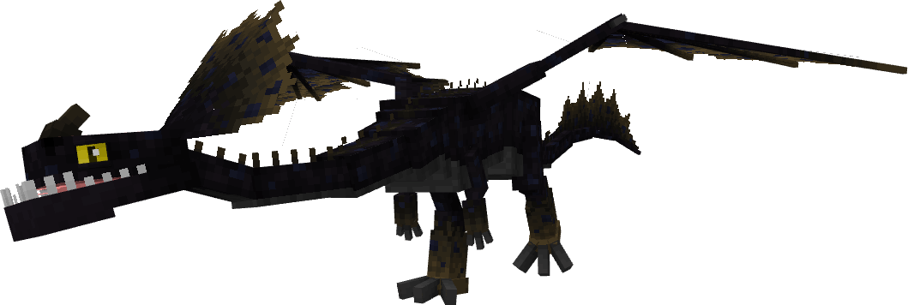

**Obtainment:** Rare spawn

```
/summon isleofberk:monstrous_nightmare ~ ~ ~ {VariantName:melangrunt}
```

*Credits: Stego's Dragons variant*

### Monstrous Grunter

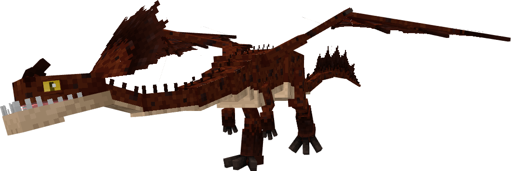

**Obtainment:** Normal spawn

```
/summon isleofberk:monstrous_nightmare ~ ~ ~ {VariantName:monstrous_grunter}
```

*Credits: Stego's Dragons variant*

### Night Grunter

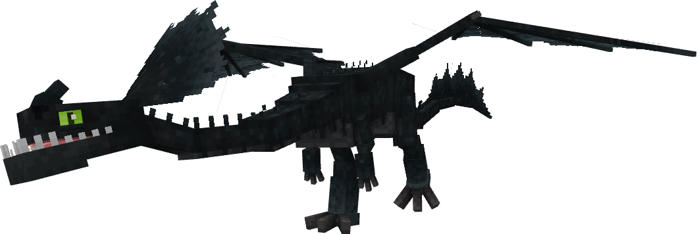

**Obtainment:** Normal spawn

```
/summon isleofberk:monstrous_nightmare ~ ~ ~ {VariantName:night_grunter}
```

*Credits: Stego's Dragons variant*

### Seagrunt

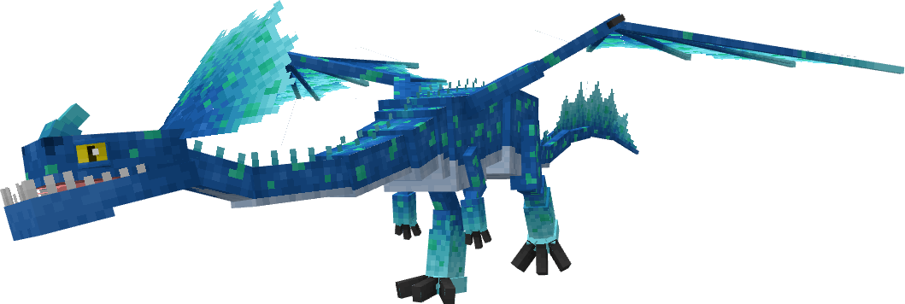

**Obtainment:** Normal spawn

```
/summon isleofberk:monstrous_nightmare ~ ~ ~ {VariantName:seagrunt}
```

*Credits: Stego's Dragons variant*

### Slavicgrunt

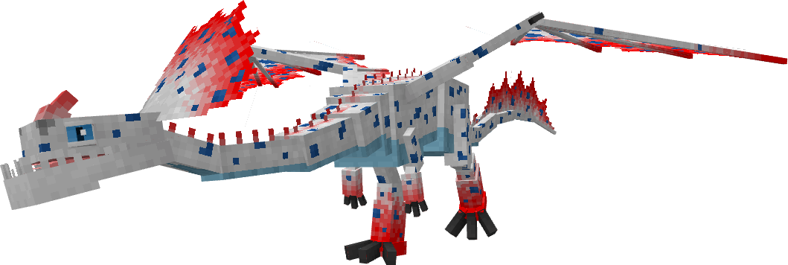

**Obtainment:** Normal spawn

```
/summon isleofberk:monstrous_nightmare ~ ~ ~ {VariantName:slavicgrunt}
```

*Credits: Stego's Dragons variant*

### Snowgrunt

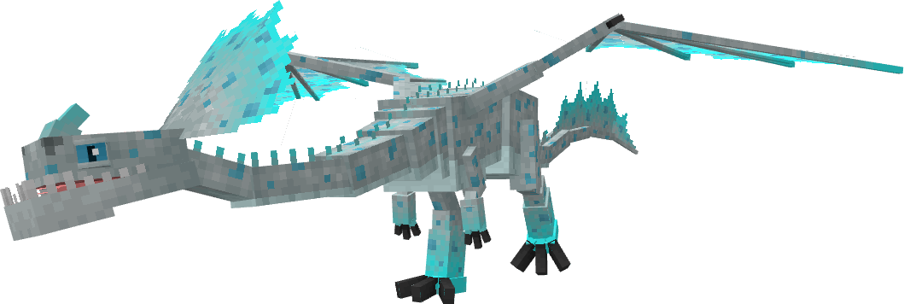

**Obtainment:** Normal spawn

```
/summon isleofberk:monstrous_nightmare ~ ~ ~ {VariantName:snowgrunt}
```

*Credits: Stego's Dragons variant*

### Stardust

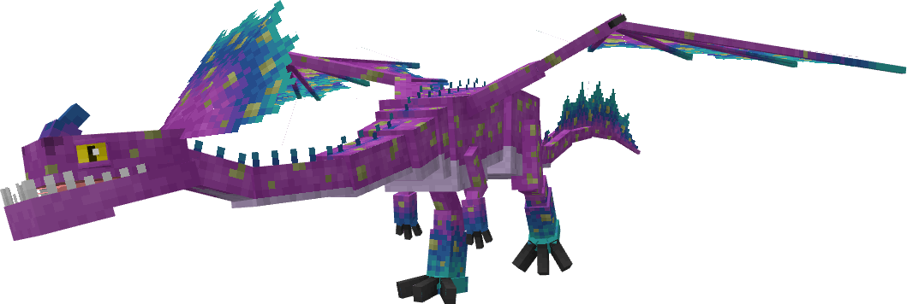

**Obtainment:** Normal spawn

```
/summon isleofberk:monstrous_nightmare ~ ~ ~ {VariantName:stardust}
```

*Credits: Stego's Dragons variant*

### Sunrise

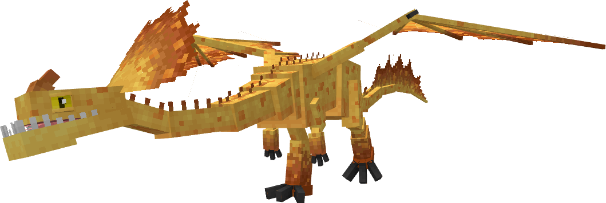

**Obtainment:** Normal spawn

```
/summon isleofberk:monstrous_nightmare ~ ~ ~ {VariantName:sunrise}
```

*Credits: Stego's Dragons variant*

---

_Content adapted from the [Archipelago Additions Wiki](https://archipelagoadditions.miraheze.org/wiki/Hobblegrunt) under [CC BY-SA 4.0](https://creativecommons.org/licenses/by-sa/4.0/)._
