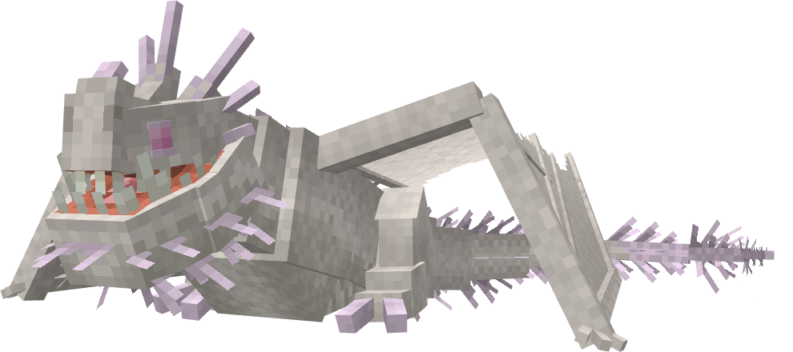
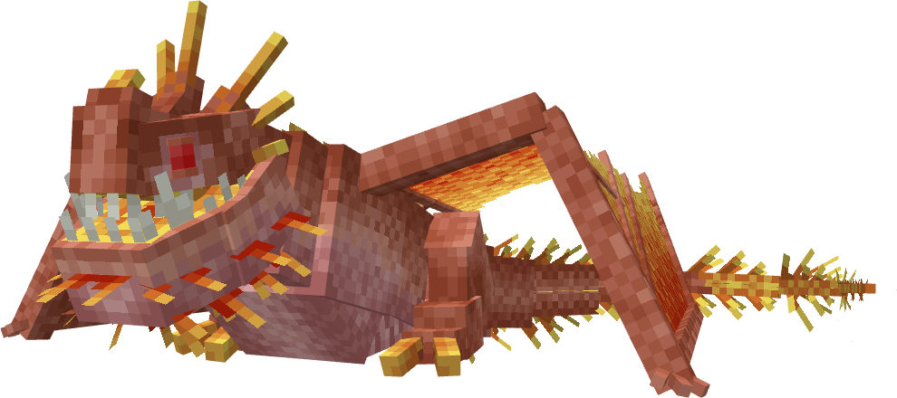
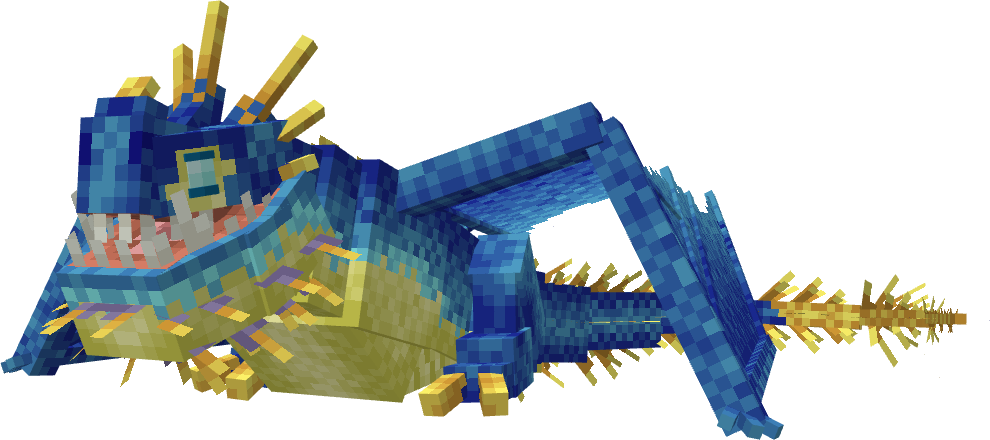
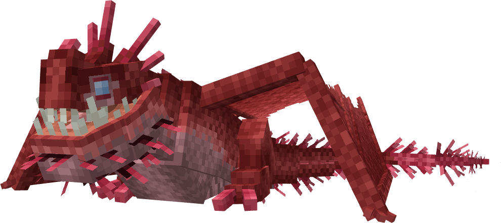
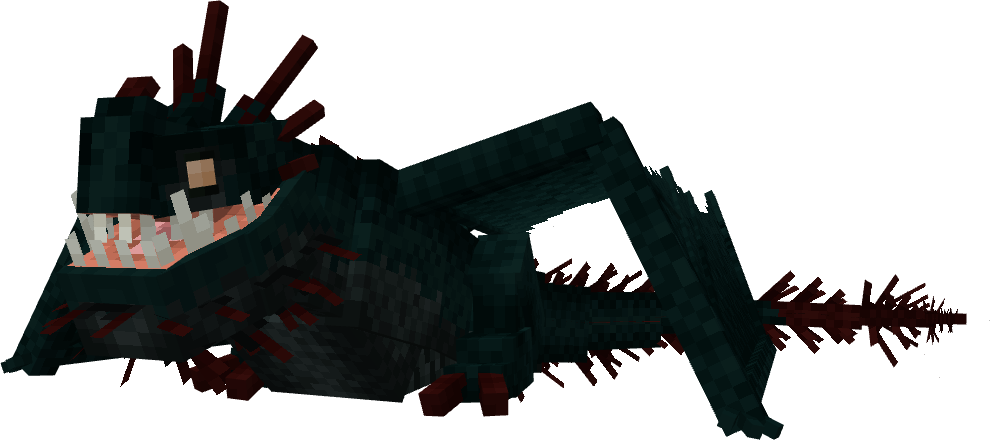
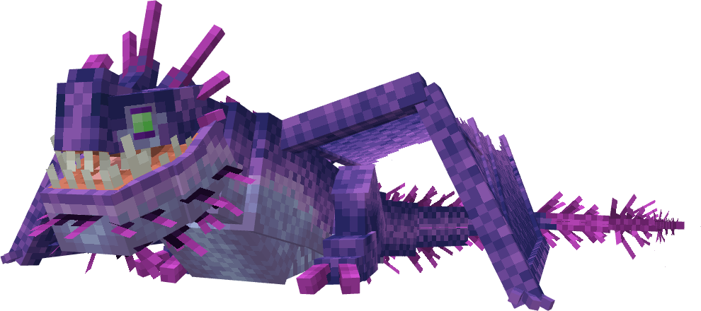
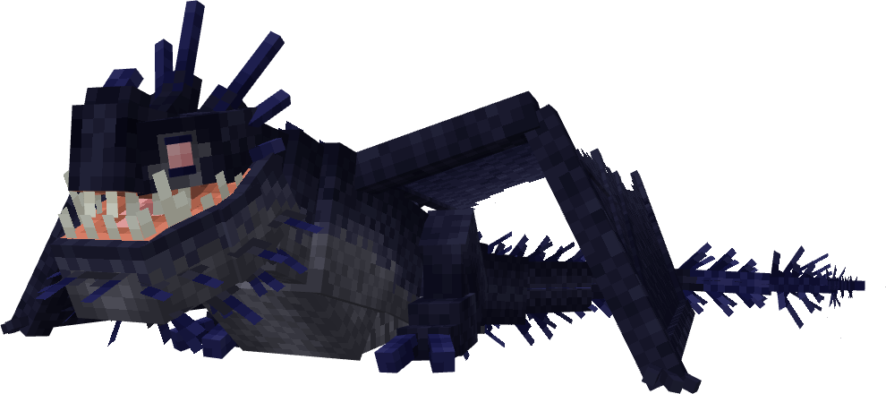
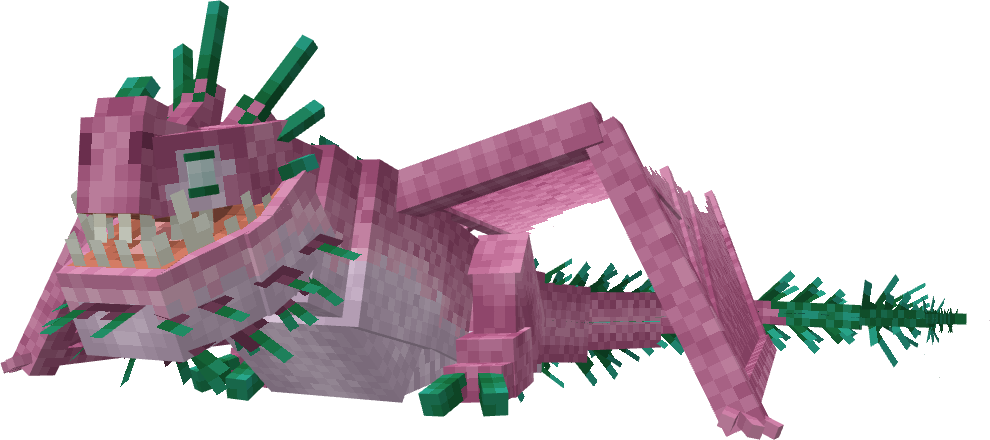
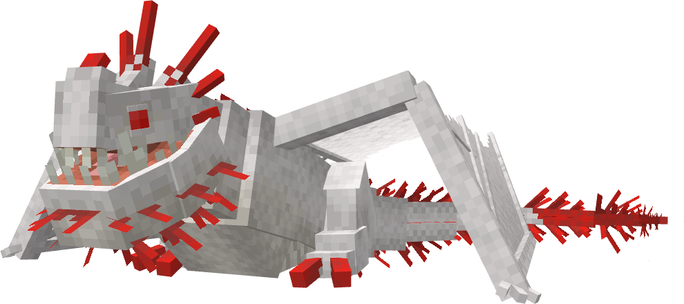

# Hushboggle


The Hushboggle is a game canon hybrid of theSnow Wraith&Whispering Death, first appearing in Titans Uprising. It is an Archipelago Additions dragon on theDeadly Nadderbase.

## Stats

| Stat | Value |
|---|---|
| Health | 70 (35 hearts) |
| Armour | 3 (1.5 icons) |
| Attack | 5 (2.5 hearts) |
| Walk Speed | 0.4 (Piglin Brute speed) |
| Fly Speed | 0.18 |

## Taming

**Taming Foods:** Raw Cod, Raw Mutton

**Requirements:** No tools or weapons (except Dragon Blades & specified Viking Artifacts) held

**Alt Taming:** Dragon Nip

## Breeding

**Breeding Foods:** Suspicious Stew, Sagefruit

## Drops

**Brush Drops:** 1-3 Hushboggle Scales, 0-1 Hushboggle Spines

**Death Drops:** 1-2 Dragon Blood, 3-5 Hushboggle Scales, 1-2 Hushboggle Spines

## Spawn Biomes

- `minecraft:windswept_gravelly_hills`
- `minecraft:snowy_slopes`

## Variants

### Albino



**Obtainment:** Rare spawn

```
/summon isleofberk:deadly_nadder ~ ~ ~ {VariantName:hush_albino}
```

### Blazeboggle



**Obtainment:** Rare spawn

```
/summon isleofberk:deadly_nadder ~ ~ ~ {VariantName:blazeboggle}
```

### Foehammer



**Obtainment:** Normal spawn

```
/summon isleofberk:deadly_nadder ~ ~ ~ {VariantName:foehammer}
```

### Gorge Hushboggle



**Obtainment:** Normal spawn

```
/summon isleofberk:deadly_nadder ~ ~ ~ {VariantName:gorge_hushboggle}
```

### Hushboggle


**Obtainment:** Normal spawn

```
/summon isleofberk:deadly_nadder ~ ~ ~ {VariantName:hushboggle}
```

### Melanistic



**Obtainment:** Rare spawn

```
/summon isleofberk:deadly_nadder ~ ~ ~ {VariantName:melanboggle}
```

### Mythic Murmurquill



**Obtainment:** Normal spawn

```
/summon isleofberk:deadly_nadder ~ ~ ~ {VariantName:mythic_murmurquill}
```

### Nightboggle



**Obtainment:** Normal spawn

```
/summon isleofberk:deadly_nadder ~ ~ ~ {VariantName:nightboggle}
```

### Roseboggle



**Obtainment:** Normal spawn

```
/summon isleofberk:deadly_nadder ~ ~ ~ {VariantName:roseboggle}
```

### Screamboggle



**Obtainment:** Rare spawn

```
/summon isleofberk:deadly_nadder ~ ~ ~ {VariantName:screamboggle}
```

---

_Content adapted from the [Archipelago Additions Wiki](https://archipelagoadditions.miraheze.org/wiki/Hushboggle) under [CC BY-SA 4.0](https://creativecommons.org/licenses/by-sa/4.0/)._
