# Light Night


The Light Night is an Archipelago Additions original hybrid of the Light Fury & Night Fury. It is on the Night Light base.

## Stats

| Stat | Value |
|---|---|
| Health | 70 (35 hearts) |
| Armour | 0 |
| Attack | 4 (2 hearts) |
| Walk Speed | 0.4 (Piglin Brute speed) |
| Fly Speed | 0.2 (twice Allay speed) |

## Taming

**Taming Foods:** Raw Cod, Raw Salmon, Tropical Fish

**Requirements:** The dragon must be a baby

## Breeding

**Breeding Foods:** Honeycomb, Sagefruit

## Drops

**Brush Drops:** 1-3 Light Night Scales

**Death Drops:** 1-2 Dragon Blood, 3-5 Light Night Scales

## Spawn Biomes

- `This dragon does not spawn. It has a 50% chance to be produced when breeding a Light Fury and a Night Fury . The alternative outcome is a Night Light .`

## Variants

### Cinderpot


**Obtainment:** Normal breeding

```
/summon isleofberk:night_light ~ ~ ~ {VariantName:cinderpot}
```

### Cinderpot Alpha

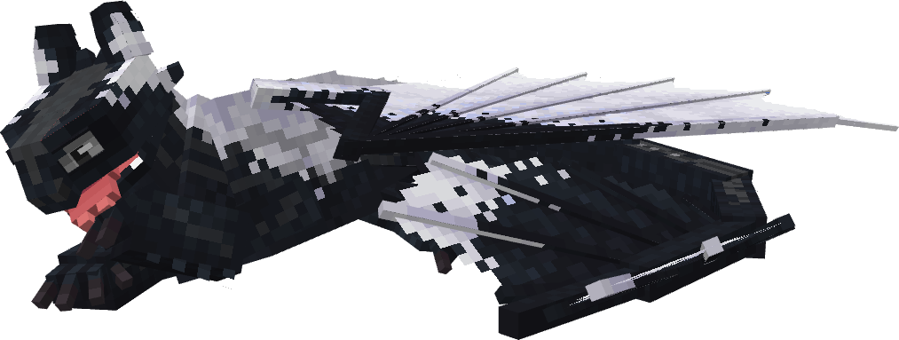

**Obtainment:** Rare breeding

```
/summon isleofberk:night_light ~ ~ ~ {VariantName:cinderpot_alpha}
```

### Curls

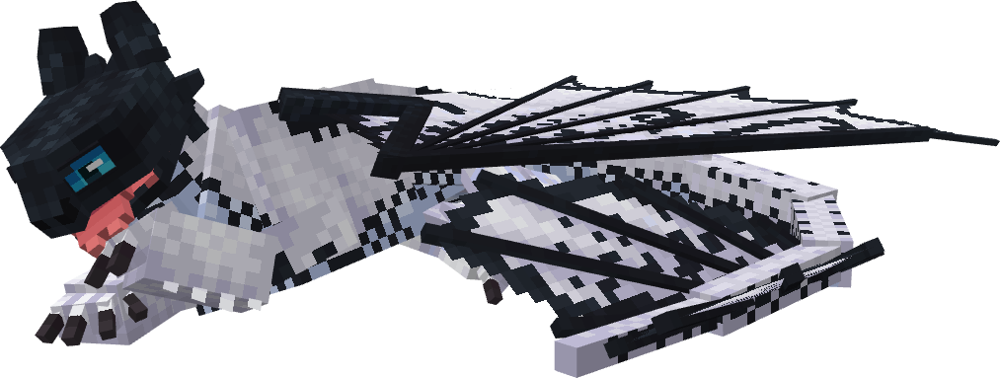

**Obtainment:** Normal breeding

```
/summon isleofberk:night_light ~ ~ ~ {VariantName:curls}
```

### Curls Alpha

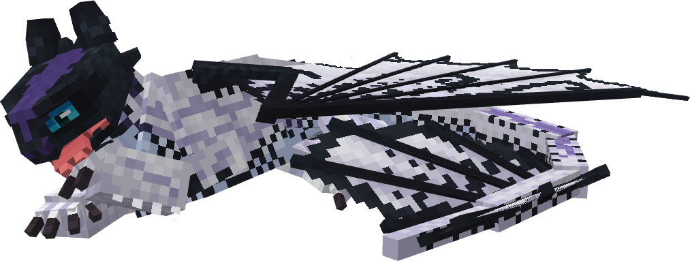

**Obtainment:** Rare breeding

```
/summon isleofberk:night_light ~ ~ ~ {VariantName:curls_alpha}
```

### Cyanea

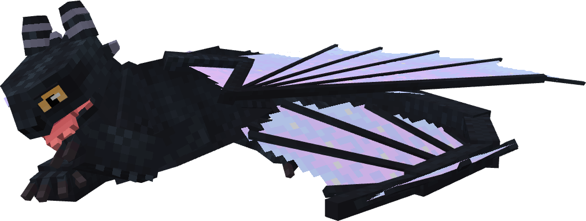

**Obtainment:** Normal breeding

```
/summon isleofberk:night_light ~ ~ ~ {VariantName:cyanea}
```

### Dawn

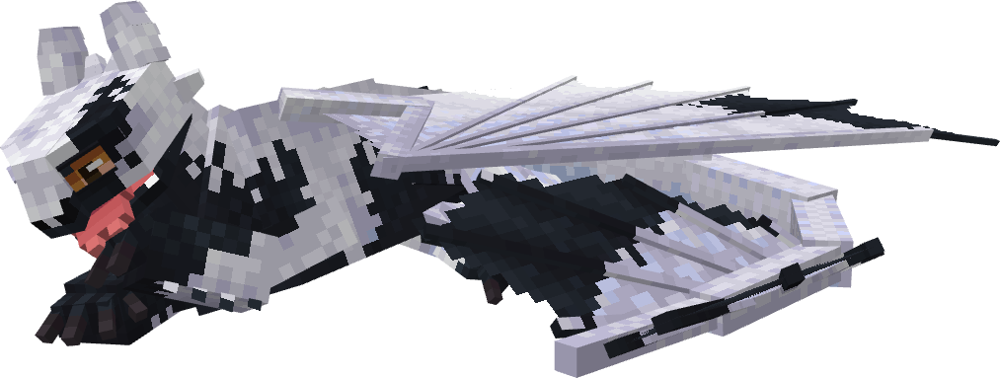

**Obtainment:** Normal breeding

```
/summon isleofberk:night_light ~ ~ ~ {VariantName:dawn}
```

### Dawn Alpha

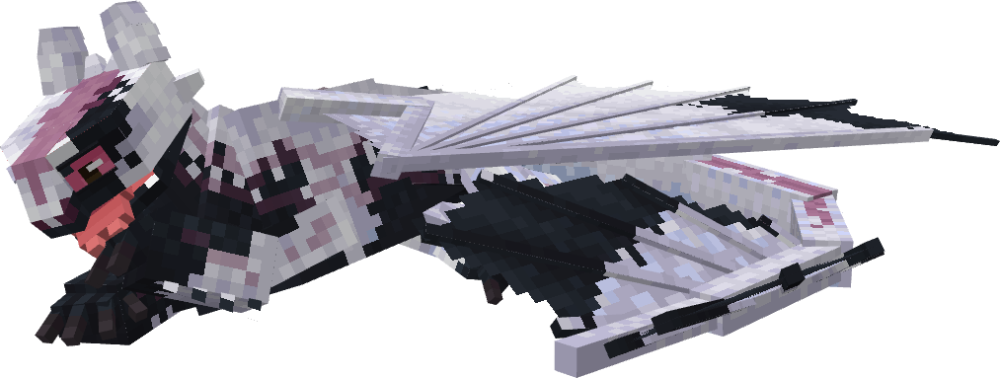

**Obtainment:** Rare breeding

```
/summon isleofberk:night_light ~ ~ ~ {VariantName:dawn_alpha}
```

### Fenrir

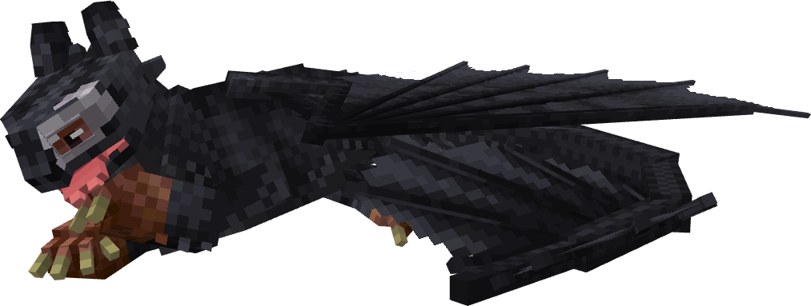

**Obtainment:** Normal breeding

```
/summon isleofberk:night_light ~ ~ ~ {VariantName:fenrir}
```

### Freckles

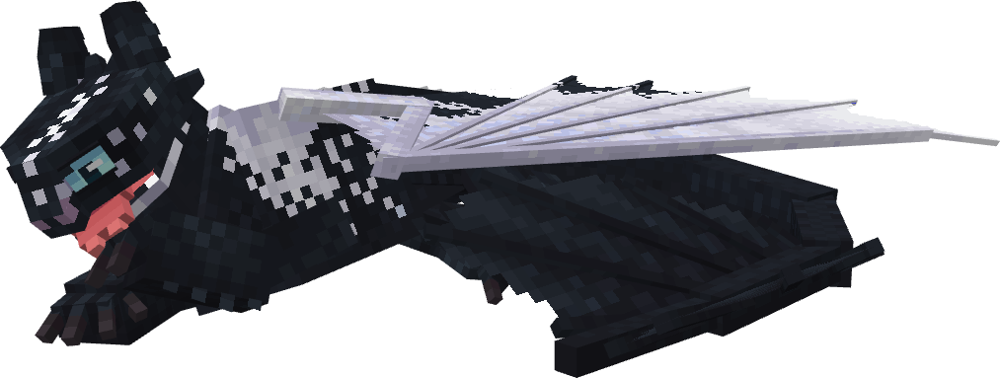

**Obtainment:** Normal breeding

```
/summon isleofberk:night_light ~ ~ ~ {VariantName:freckles}
```

### Freckles Alpha

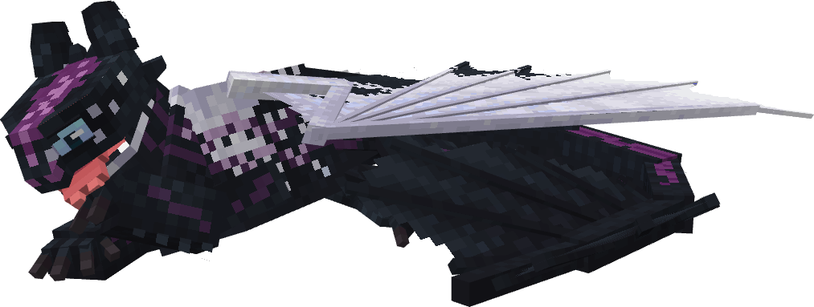

**Obtainment:** Rare breeding

```
/summon isleofberk:night_light ~ ~ ~ {VariantName:freckles_alpha}
```

### Garm

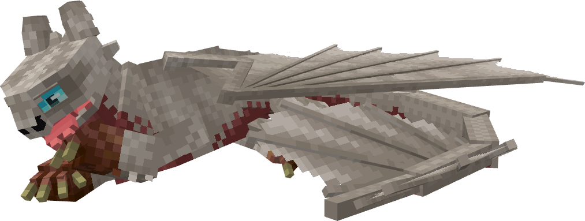

**Obtainment:** Normal breeding

```
/summon isleofberk:night_light ~ ~ ~ {VariantName:garm}
```

### Goggles

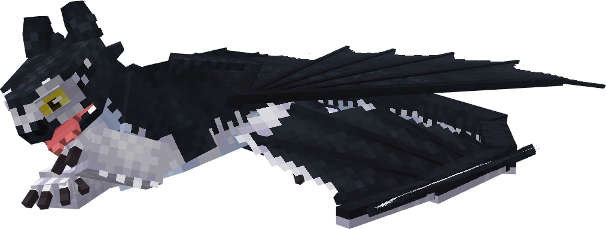

**Obtainment:** Normal breeding

```
/summon isleofberk:night_light ~ ~ ~ {VariantName:goggles}
```

### Goggles Alpha

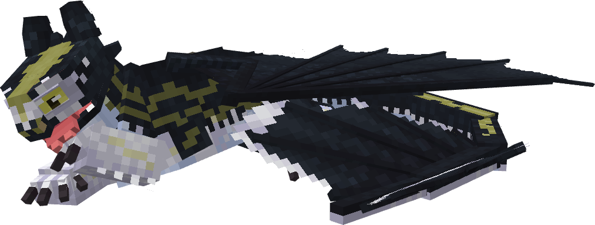

**Obtainment:** Rare breeding

```
/summon isleofberk:night_light ~ ~ ~ {VariantName:goggles_alpha}
```

### Harleking

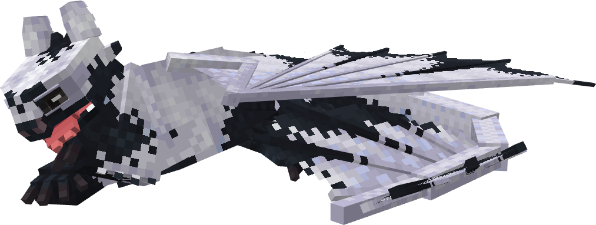

**Obtainment:** Normal breeding

```
/summon isleofberk:night_light ~ ~ ~ {VariantName:harleking}
```

### Harleking Alpha

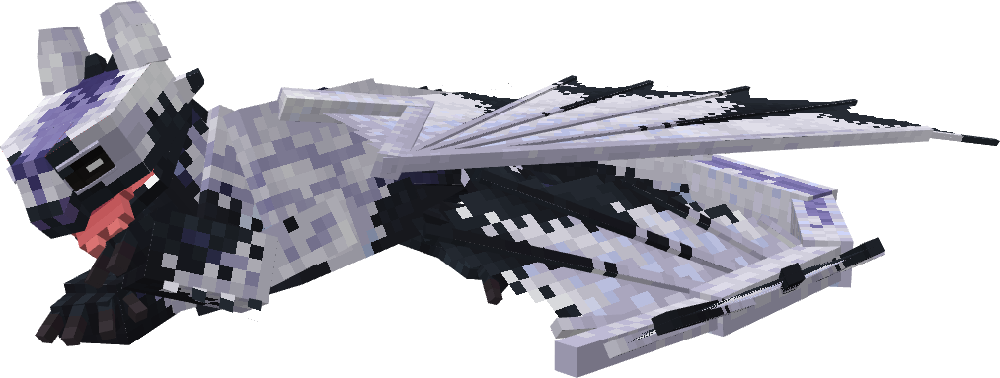

**Obtainment:** Rare breeding

```
/summon isleofberk:night_light ~ ~ ~ {VariantName:harleking_alpha}
```

### Hati

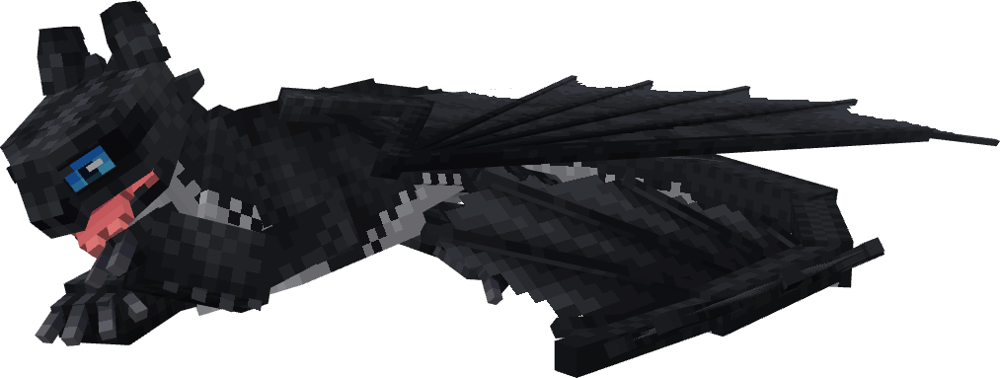

**Obtainment:** Normal breeding

```
/summon isleofberk:night_light ~ ~ ~ {VariantName:hati}
```

### Lanula

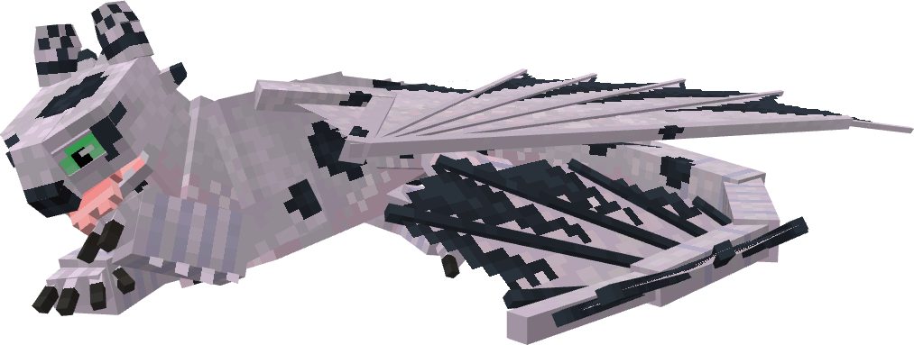

**Obtainment:** Normal breeding

```
/summon isleofberk:night_light ~ ~ ~ {VariantName:lanula}
```

### Sentingaldr

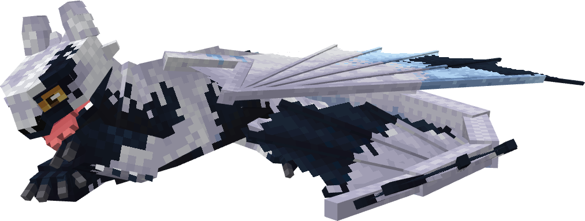

**Obtainment:** Normal breeding

```
/summon isleofberk:night_light ~ ~ ~ {VariantName:sentingaldr}
```

### Sentingaldr Alpha

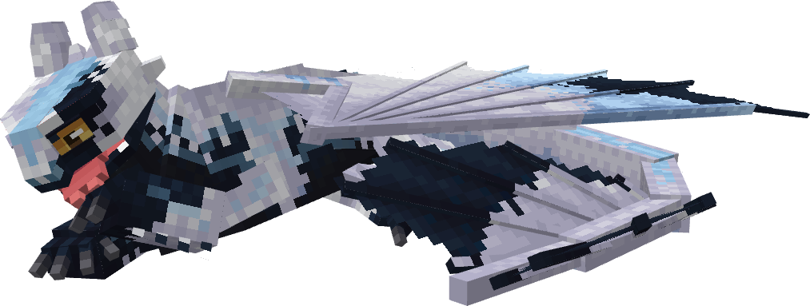

**Obtainment:** Rare breeding

```
/summon isleofberk:night_light ~ ~ ~ {VariantName:sentingaldr_alpha}
```

### Shimmer

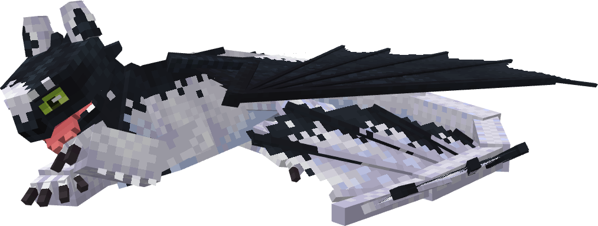

**Obtainment:** Normal breeding

```
/summon isleofberk:night_light ~ ~ ~ {VariantName:shimmer}
```

### Shimmer Alpha

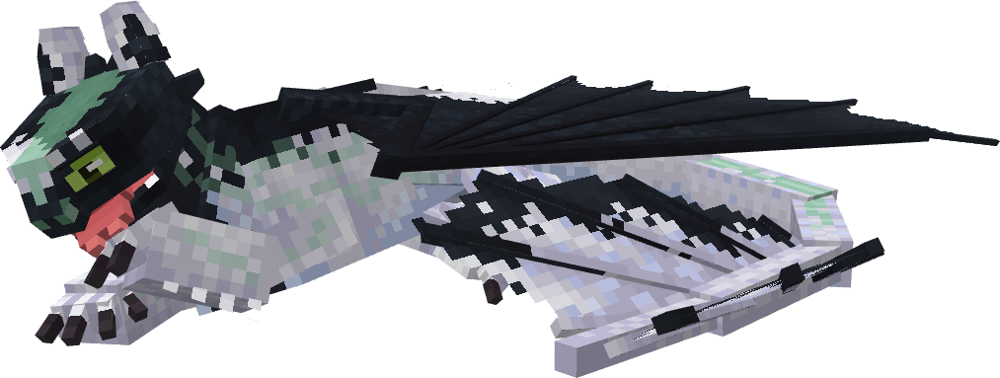

**Obtainment:** Rare breeding

```
/summon isleofberk:night_light ~ ~ ~ {VariantName:shimmer_alpha}
```

### Skoll

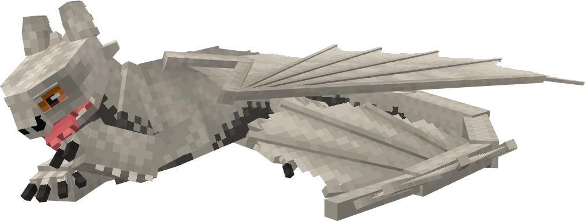

**Obtainment:** Normal breeding

```
/summon isleofberk:night_light ~ ~ ~ {VariantName:skoll}
```

### Snowflake

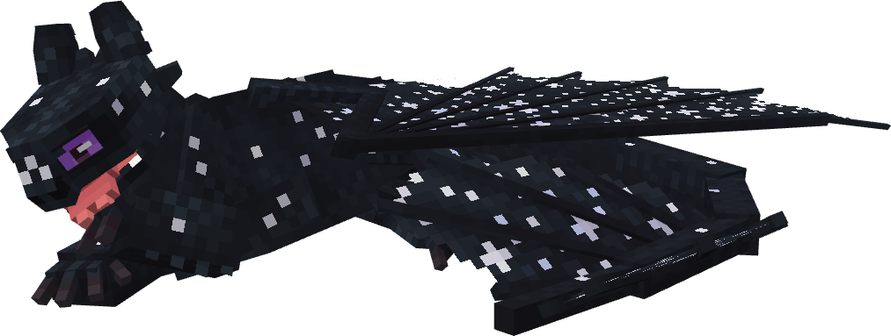

**Obtainment:** Normal breeding

```
/summon isleofberk:night_light ~ ~ ~ {VariantName:snowflake}
```

### Snowflake Alpha

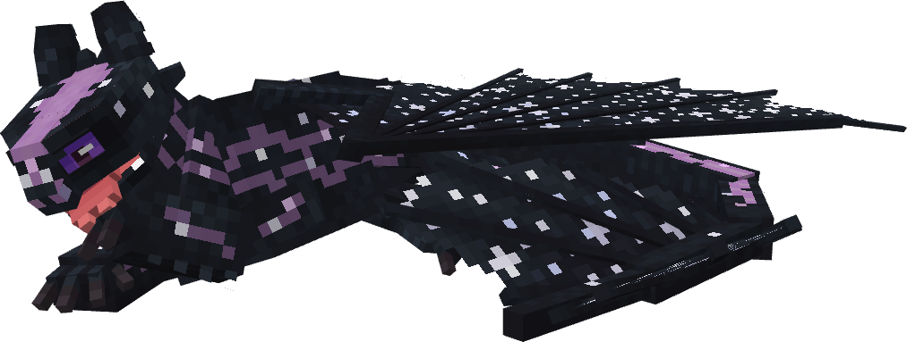

**Obtainment:** Rare breeding

```
/summon isleofberk:night_light ~ ~ ~ {VariantName:snowflake_alpha}
```

### Speckle

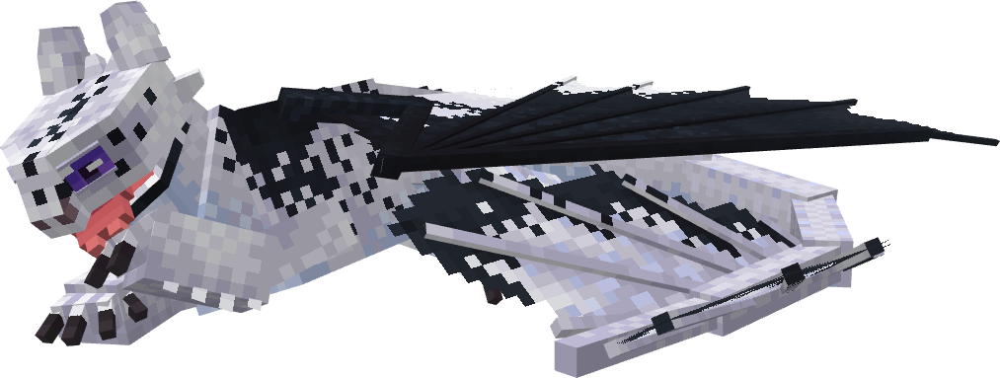

**Obtainment:** Normal breeding

```
/summon isleofberk:night_light ~ ~ ~ {VariantName:speckle}
```

### Speckle Alpha

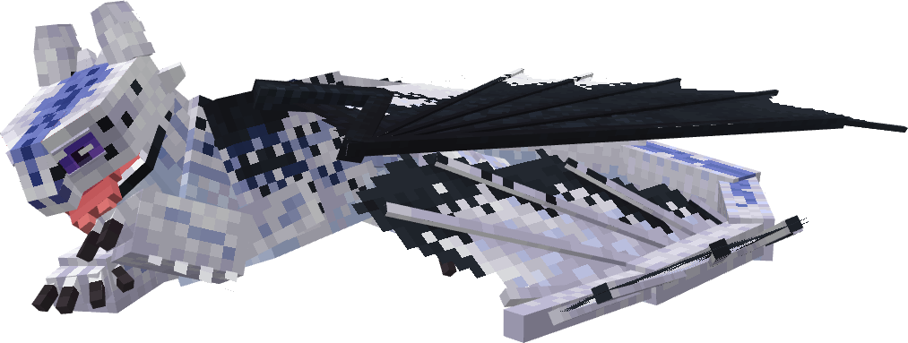

**Obtainment:** Rare breeding

```
/summon isleofberk:night_light ~ ~ ~ {VariantName:speckle_alpha}
```

### Spot Belly

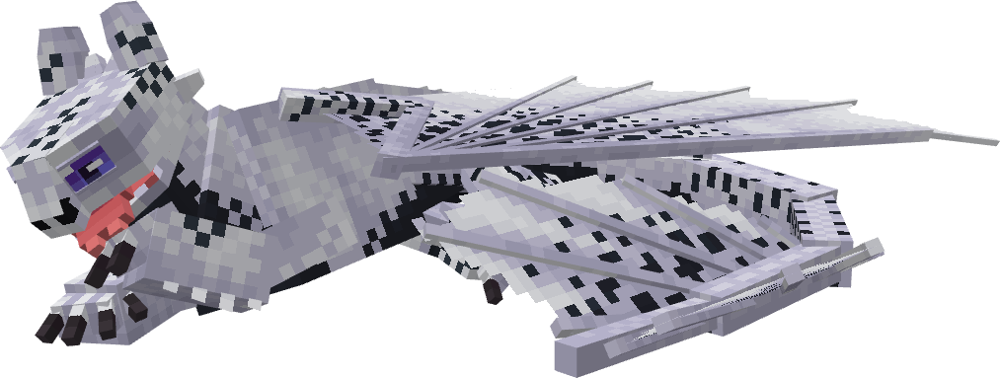

**Obtainment:** Normal breeding

```
/summon isleofberk:night_light ~ ~ ~ {VariantName:spot_belly}
```

### Spot Belly Alpha

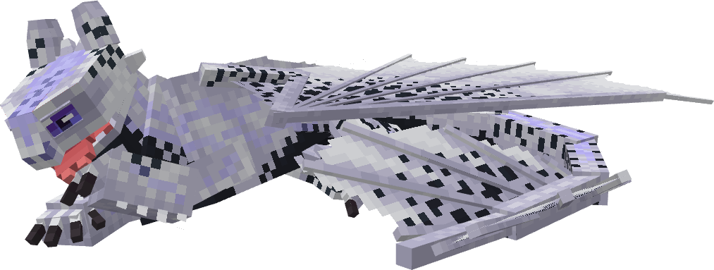

**Obtainment:** Rare breeding

```
/summon isleofberk:night_light ~ ~ ~ {VariantName:spot_belly_alpha}
```

### Star Runner

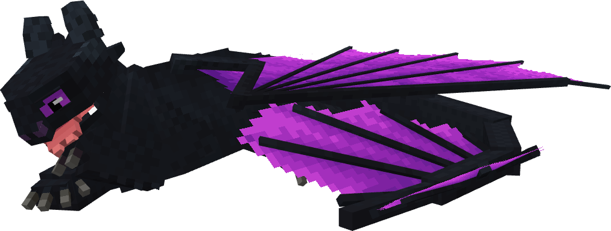

**Obtainment:** Rare breeding

```
/summon isleofberk:night_light ~ ~ ~ {VariantName:star_runner}
```

*Credits: This variant was designed by SillySuki*

### Valentine

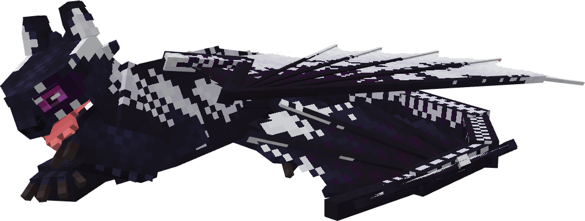

**Obtainment:** Normal breeding

```
/summon isleofberk:night_light ~ ~ ~ {VariantName:valentine}
```

### Valentine Alpha

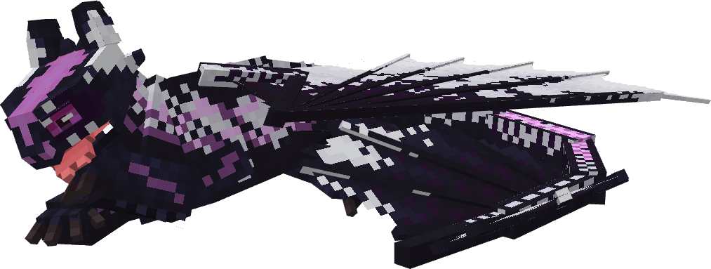

**Obtainment:** Rare breeding

```
/summon isleofberk:night_light ~ ~ ~ {VariantName:valentine_alpha}
```

### Wink

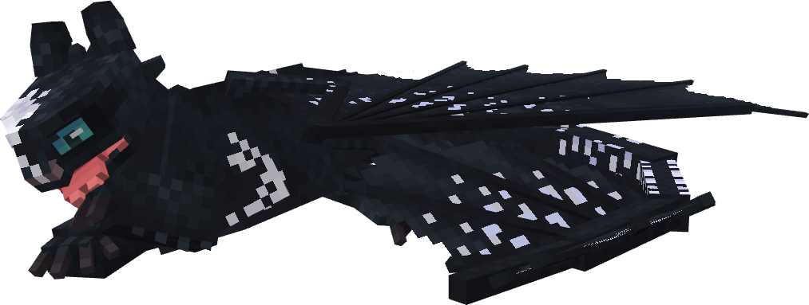

**Obtainment:** Normal breeding

```
/summon isleofberk:night_light ~ ~ ~ {VariantName:wink}
```

### Wink Alpha

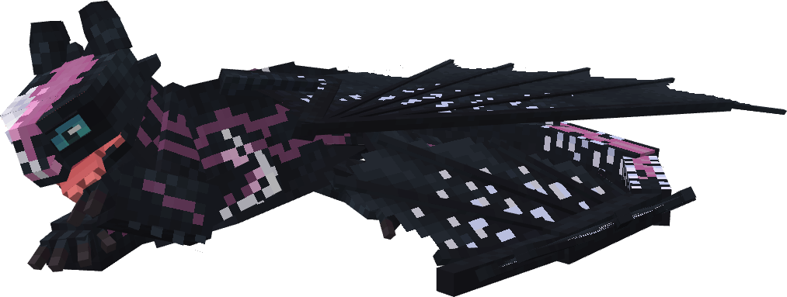

**Obtainment:** Rare breeding

```
/summon isleofberk:night_light ~ ~ ~ {VariantName:wink_alpha}
```

### Yang

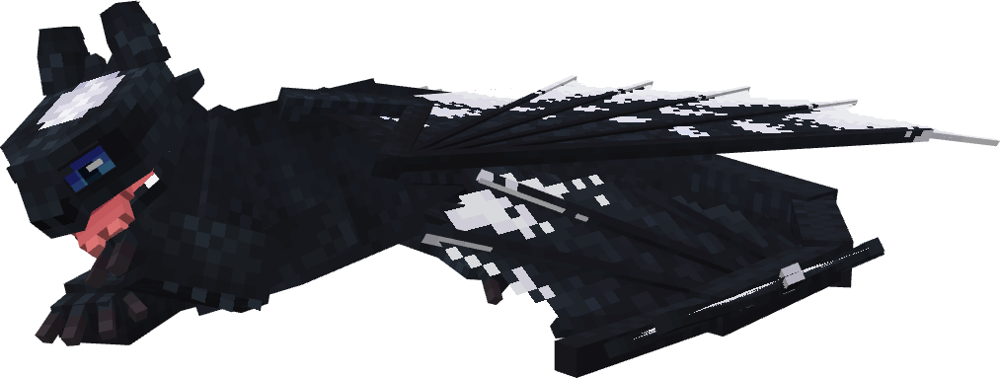

**Obtainment:** Normal breeding

```
/summon isleofberk:night_light ~ ~ ~ {VariantName:yang}
```

### Yin

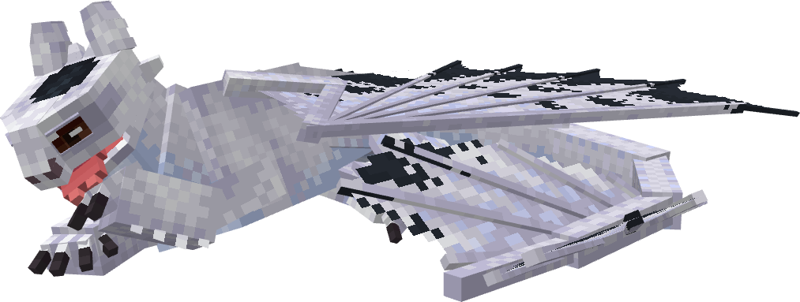

**Obtainment:** Normal breeding

```
/summon isleofberk:night_light ~ ~ ~ {VariantName:ying}
```

*Credits: Don't mention the typo*

---

_Content adapted from the [Archipelago Additions Wiki](https://archipelagoadditions.miraheze.org/wiki/Light_Night) under [CC BY-SA 4.0](https://creativecommons.org/licenses/by-sa/4.0/)._
