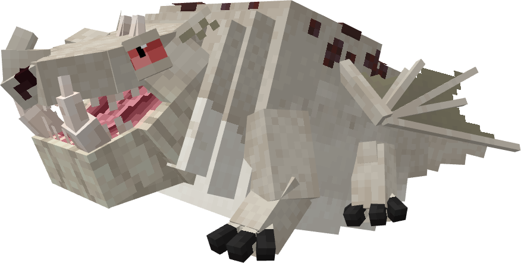
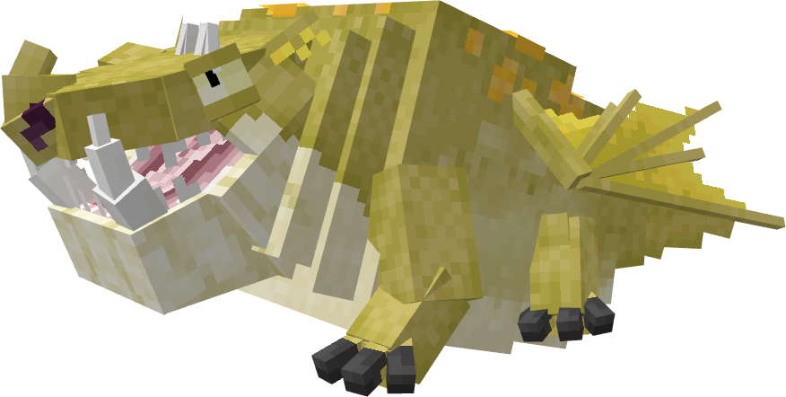
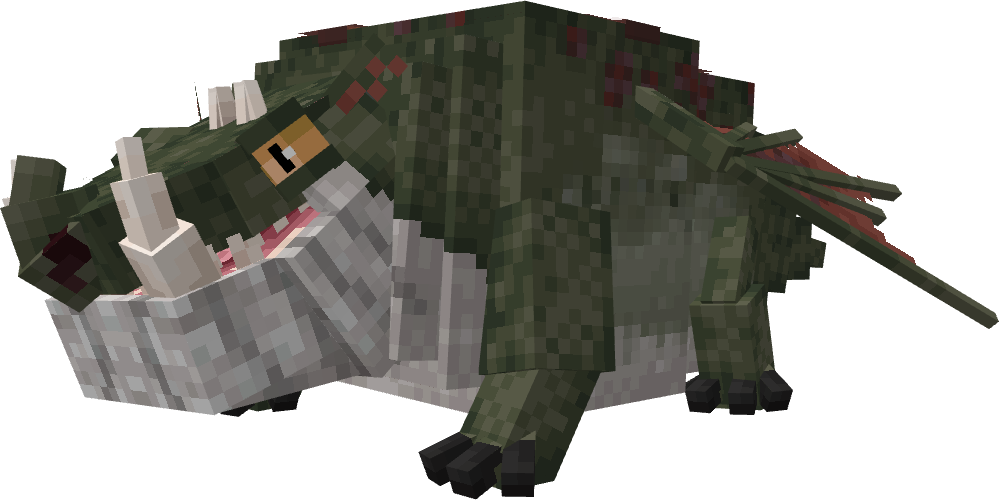
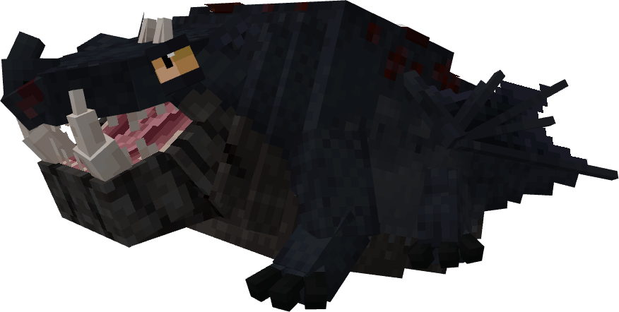
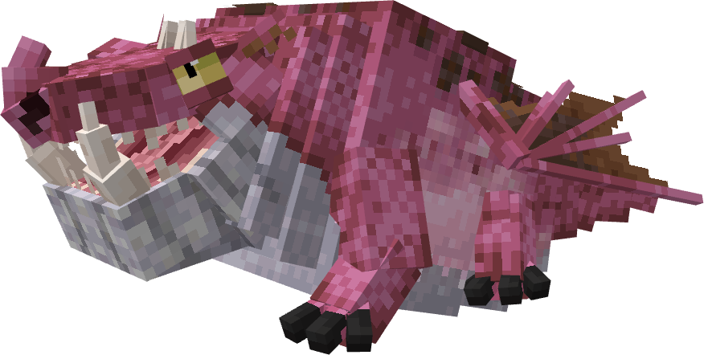
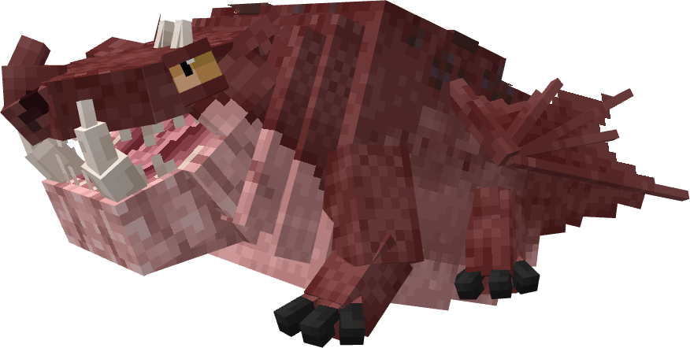
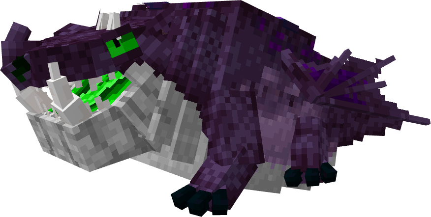
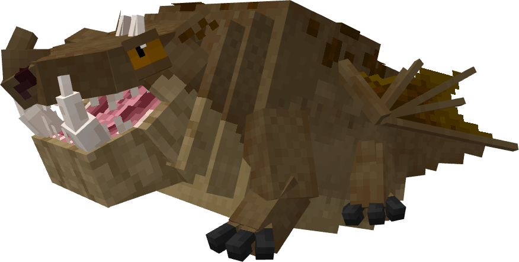
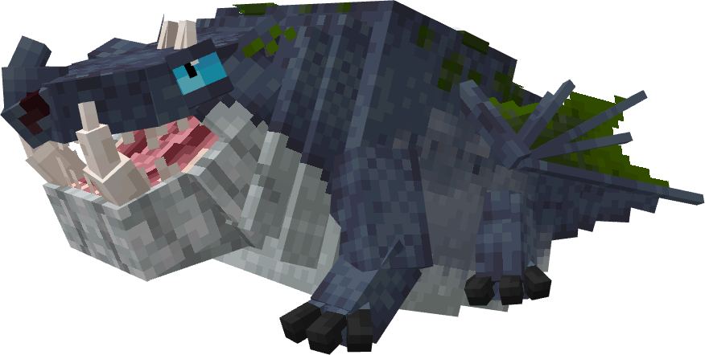
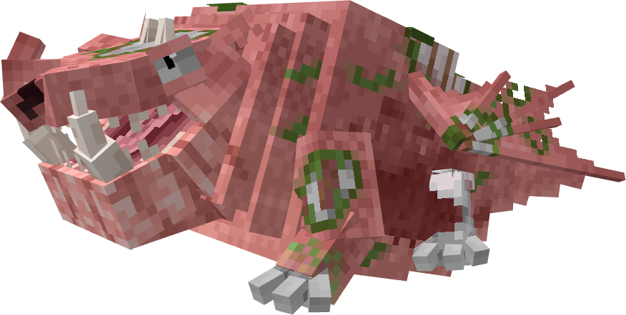

# Magma Breather


The Magma Breather is a consequence of the Nine Realms series. It is an Archipelago Additions dragon on theGroncklebase.

## Stats

| Stat | Value |
|---|---|
| Health | 90 (45 hearts) |
| Armour | 6 (3 icon) |
| Attack | 6 (3 hearts) |
| Walk Speed | 0.3 |
| Fly Speed | 0.07 |

## Taming

**Taming Foods:** Cobblestone, Stone

**Requirements:** No tools or weapons (except Dragon Blades & specified Viking Artifacts) held

**Alt Taming:** Dragon Nip

## Breeding

**Breeding Foods:** Suspicious Stew, Sagefruit

## Drops

**Brush Drops:** 1-3 Magma Breather Scales

**Death Drops:** 1-2 Dragon Blood, 3-5 Magma Breather Scales

## Spawn Biomes

- `minecraft:badlands`
- `minecraft:wooded_badlands`
- `minecraft:eroded_badlands`

## Variants

### Albino



**Obtainment:** Rare spawn

```
/summon isleofberk:gronckle ~ ~ ~ {VariantName:albino_magma}
```

### Butterball



**Obtainment:** Normal spawn

```
/summon isleofberk:gronckle ~ ~ ~ {VariantName:butterball}
```

### Magma Breather



**Obtainment:** Normal spawn

```
/summon isleofberk:gronckle ~ ~ ~ {VariantName:magma_breather}
```

### Melanistic



**Obtainment:** Rare spawn

```
/summon isleofberk:gronckle ~ ~ ~ {VariantName:melanistic_magma}
```

### Peppa



**Obtainment:** Normal spawn

```
/summon isleofberk:gronckle ~ ~ ~ {VariantName:peppa}
```

### Red



**Obtainment:** Normal spawn

```
/summon isleofberk:gronckle ~ ~ ~ {VariantName:red}
```

### Toxic Breather



**Obtainment:** Rare spawn

```
/summon isleofberk:gronckle ~ ~ ~ {VariantName:toxic_breather}
```

### Truffle



**Obtainment:** Normal spawn

```
/summon isleofberk:gronckle ~ ~ ~ {VariantName:truffle}
```

### Whale



**Obtainment:** Normal spawn

```
/summon isleofberk:gronckle ~ ~ ~ {VariantName:whale}
```

### Zogler



**Obtainment:** Dreadfall only

```
/summon isleofberk:gronckle ~ ~ ~ {VariantName:zogler}
```

---

_Content adapted from the [Archipelago Additions Wiki](https://archipelagoadditions.miraheze.org/wiki/Magma_Breather) under [CC BY-SA 4.0](https://creativecommons.org/licenses/by-sa/4.0/)._
