# Monstrous Nightmare

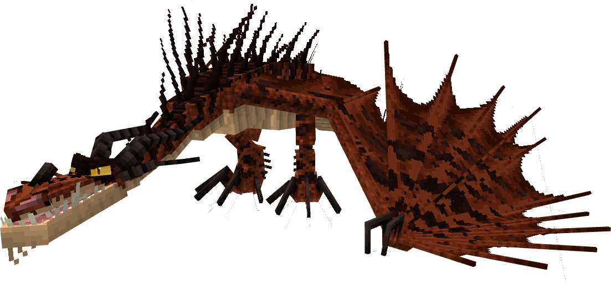

The Monstrous Nightmare is a main canon dragon from the first film. It is a base Isle of Berk dragon.

## Stats

| Stat | Value |
|---|---|
| Health | 120 (60 hearts) |
| Armour | 4 (2 icons) |
| Attack | 7 (3.5 hearts) |
| Walk Speed | 0.4 (Piglin Brute speed) |
| Fly Speed | 0.14 (50% faster than an Allay) |

## Taming

**Taming Foods:** Raw Pork, Raw Mutton

**Requirements:**

- No tools or weapons (except Dragon Blades & specified Viking Artifacts) held
- No armour worn
- Fire resistance potion effect active

**Alt Taming:** Dragon Nip

## Breeding

**Breeding Foods:** Suspicious stew, Sagefruit

## Drops

**Brush Drops:** 2-3 Monstrous Nightmare Scales, 1-2 Monstrous Nightmare Gel

**Death Drops:** 1-3 Dragon Blood, 4-7 Monstrous Nightmare Scales, 1-3 Monstrous Nightmare Gel

## Spawn Biomes

- `minecraft:stony_peaks`
- `minecraft:windswept_hills`
- `minecraft:windswept_gravelly_hills`

## Variants

### Albino

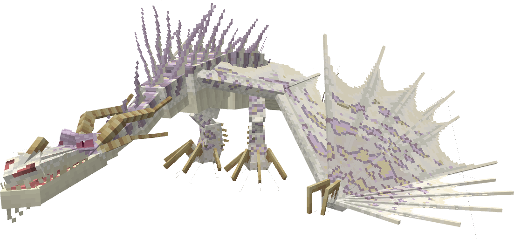

**Obtainment:** Rare spawn

```
/summon isleofberk:monstrous_nightmare ~ ~ ~ {VariantName:albino_nightmare}
```

### Alduin

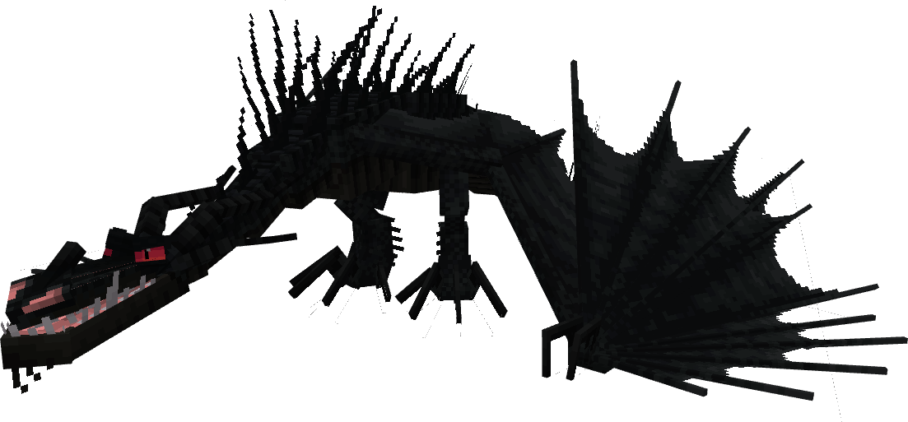

**Obtainment:** Normal spawn

```
/summon isleofberk:monstrous_nightmare ~ ~ ~ {VariantName:alduin}
```

### Aurorae

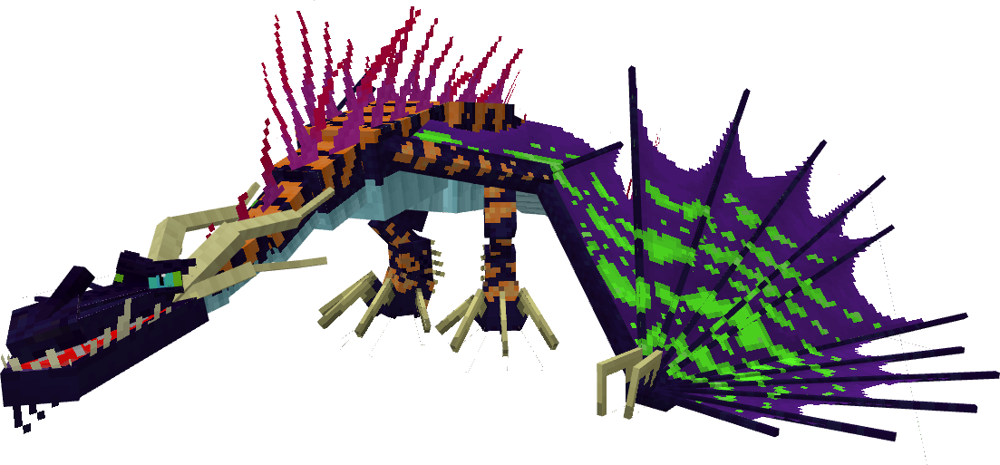

**Obtainment:** Bifrost Temple only

```
/summon isleofberk:monstrous_nightmare ~ ~ ~ {VariantName:aurorae}
```

### Batman

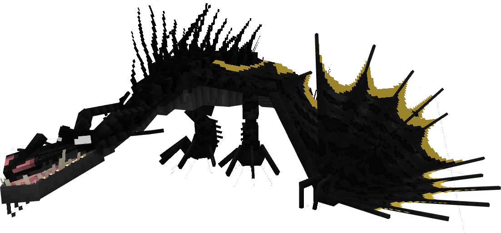

**Obtainment:** Command only

```
/summon isleofberk:monstrous_nightmare ~ ~ ~ {VariantName:batman}
```

*Credits: This variant was designed by GrayDoesn'tExist*

### Black Dragon

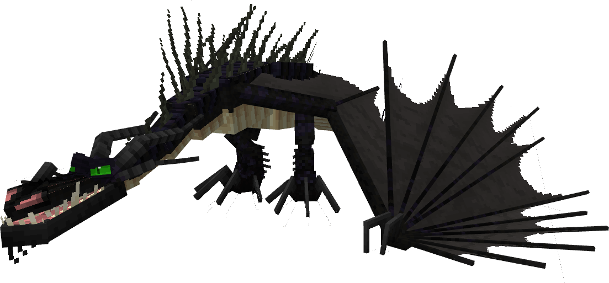

**Obtainment:** Normal spawn

```
/summon isleofberk:monstrous_nightmare ~ ~ ~ {VariantName:black_dragon}
```

### Bloodroot

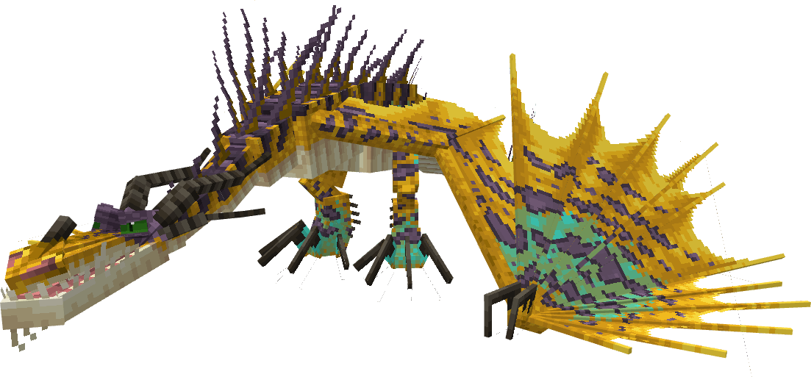

**Obtainment:** Normal spawn

```
/summon isleofberk:monstrous_nightmare ~ ~ ~ {VariantName:bloodroot}
```

*Credits: Base IoB variant*

### Burlystorm

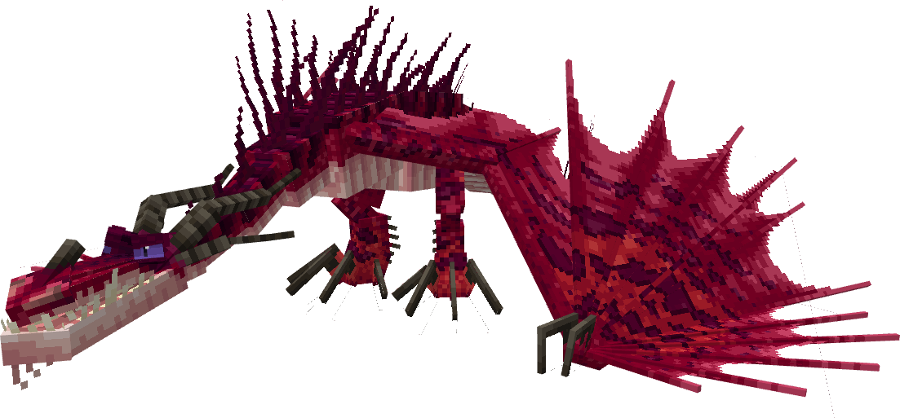

**Obtainment:** Normal spawn

```
/summon isleofberk:monstrous_nightmare ~ ~ ~ {VariantName:burlystorm}
```

*Credits: Base IoB variant*

### Cardinal

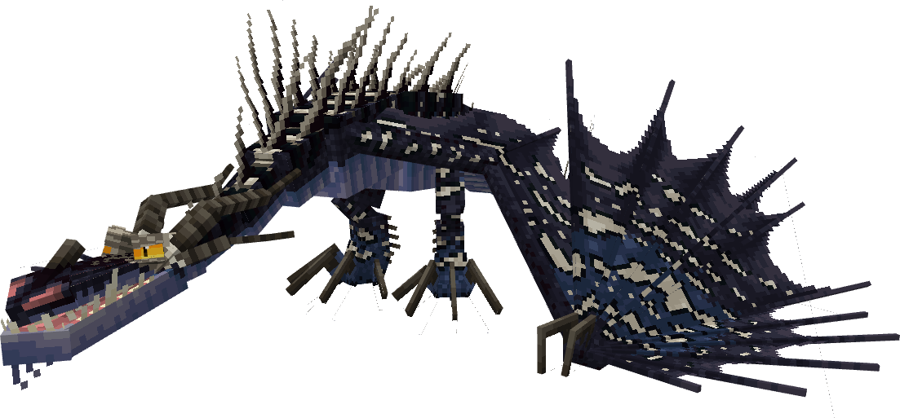

**Obtainment:** Normal spawn

```
/summon isleofberk:monstrous_nightmare ~ ~ ~ {VariantName:cardinal}
```

*Credits: Base IoB variant*

### Carnation

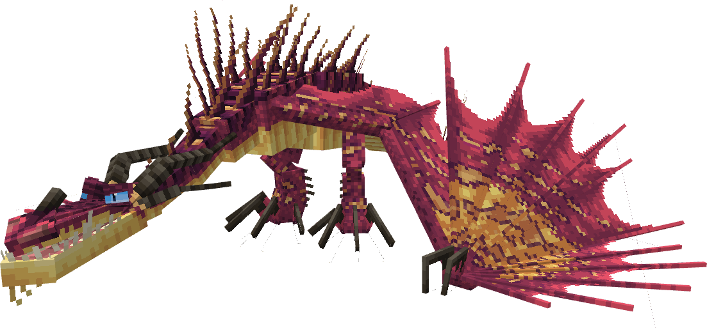

**Obtainment:** Normal spawn

```
/summon isleofberk:monstrous_nightmare ~ ~ ~ {VariantName:carnation}
```

*Credits: Base IoB variant*

### Corl

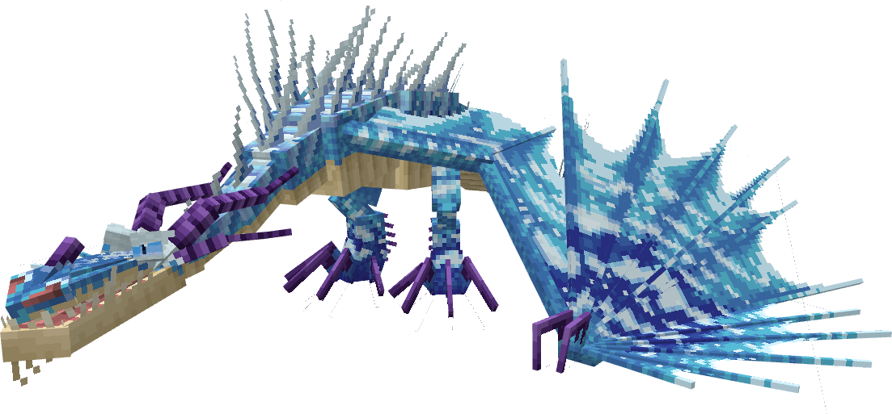

**Obtainment:** Normal spawn

```
/summon isleofberk:monstrous_nightmare ~ ~ ~ {VariantName:corl}
```

### Ender

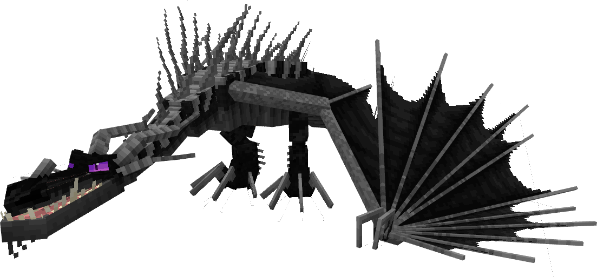

**Obtainment:** Normal spawn

```
/summon isleofberk:monstrous_nightmare ~ ~ ~ {VariantName:ender_nightmare}
```

### Exiled

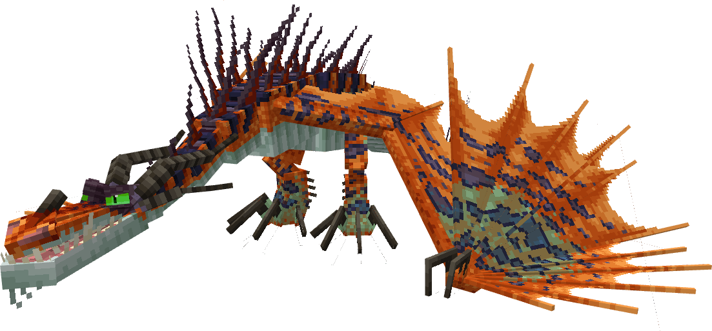

**Obtainment:** Normal spawn

```
/summon isleofberk:monstrous_nightmare ~ ~ ~ {VariantName:exiled}
```

*Credits: Base IoB variant*

### Fanghook

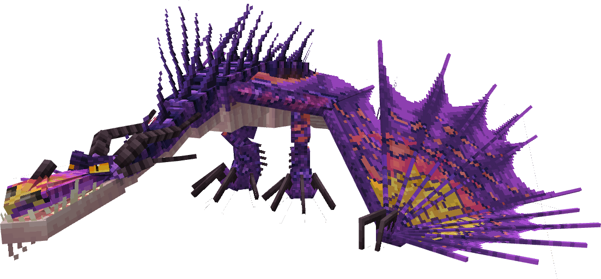

**Obtainment:** Normal spawn

```
/summon isleofberk:monstrous_nightmare ~ ~ ~ {VariantName:fanghook}
```

*Credits: Base IoB variant*

### Fangmaster

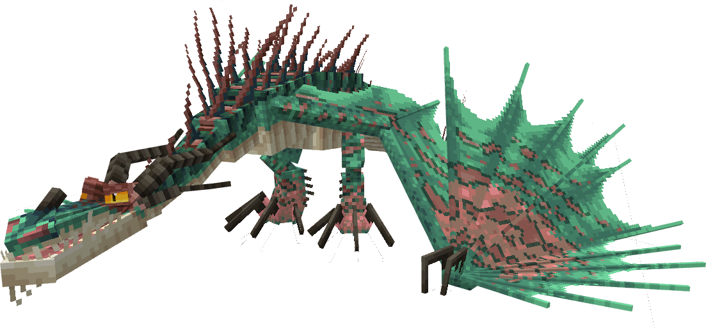

**Obtainment:** Normal spawn

```
/summon isleofberk:monstrous_nightmare ~ ~ ~ {VariantName:fangmaster}
```

*Credits: Base IoB variant*

### Frost

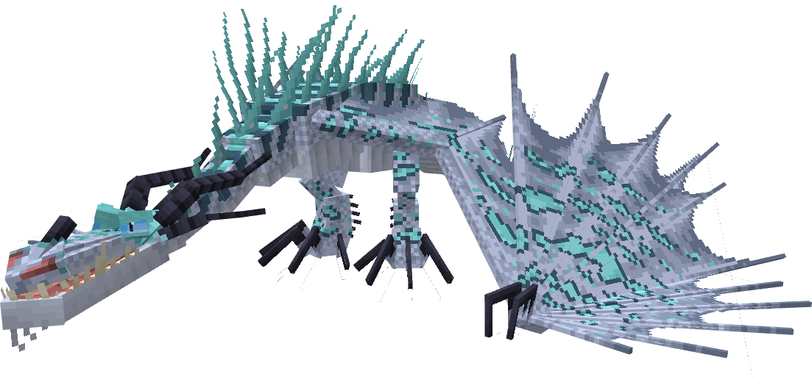

**Obtainment:** Normal spawn

```
/summon isleofberk:monstrous_nightmare ~ ~ ~ {VariantName:frost}
```

### Ginger

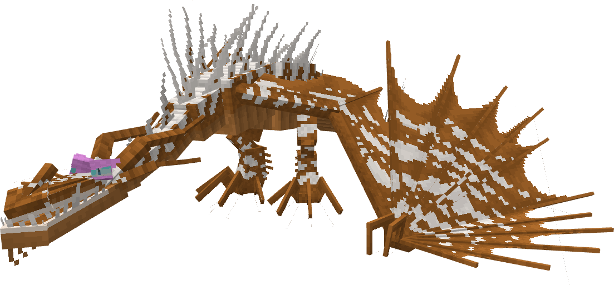

**Obtainment:** Snoggletog only

```
/summon isleofberk:monstrous_nightmare ~ ~ ~ {VariantName:ginger_mn}
```

### Godzilla

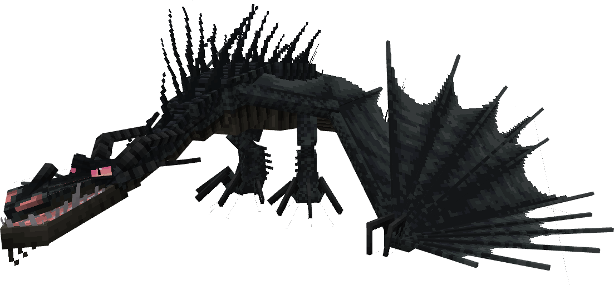

**Obtainment:** Normal spawn

```
/summon isleofberk:monstrous_nightmare ~ ~ ~ {VariantName:godzilla}
```

### Godzilla Evolved

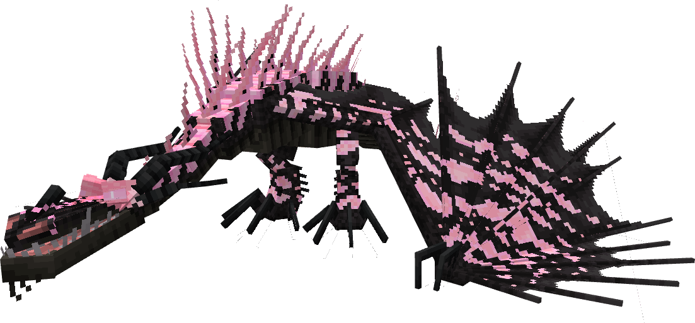

**Obtainment:** Rare spawn

```
/summon isleofberk:monstrous_nightmare ~ ~ ~ {VariantName:godzilla_evolved}
```

### Gold Glimmer

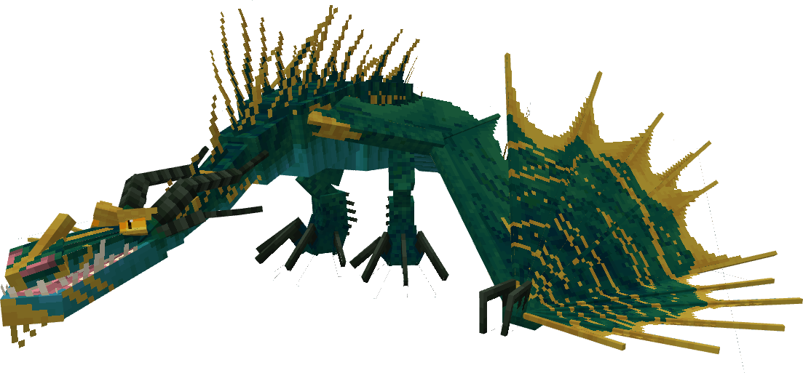

**Obtainment:** Rare spawn

```
/summon isleofberk:monstrous_nightmare ~ ~ ~ {VariantName:gold_glimmer}
```

*Credits: This variant was designed by DragoFRN*

### Hellebore

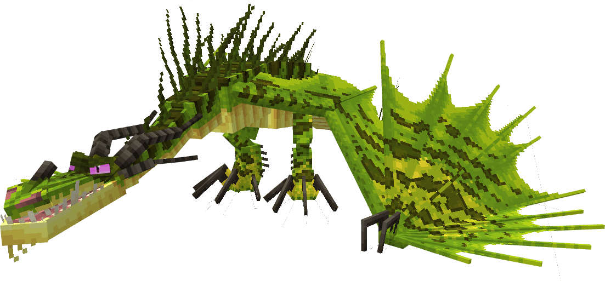

**Obtainment:** Normal spawn

```
/summon isleofberk:monstrous_nightmare ~ ~ ~ {VariantName:hellebore}
```

*Credits: Base IoB variant*

### High honour

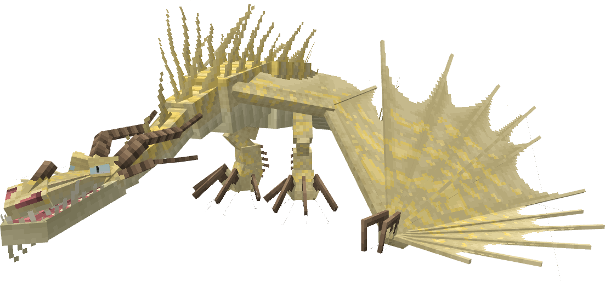

**Obtainment:** Normal spawn

```
/summon isleofberk:monstrous_nightmare ~ ~ ~ {VariantName:high_honour}
```

### Hookfang


**Obtainment:** Normal spawn

```
/summon isleofberk:monstrous_nightmare ~ ~ ~ {VariantName:hookfang}
```

### Kruziikrel

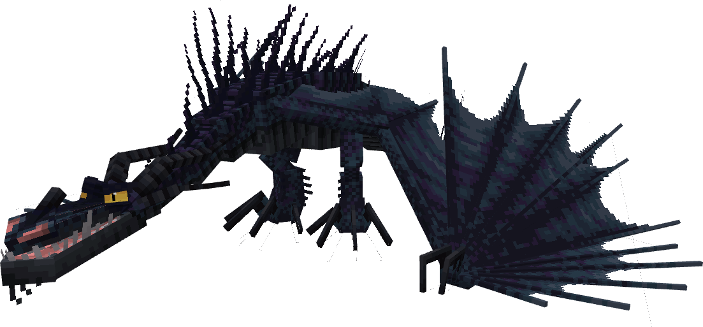

**Obtainment:** Normal spawn

```
/summon isleofberk:monstrous_nightmare ~ ~ ~ {VariantName:kruziikrel}
```

### Low honour

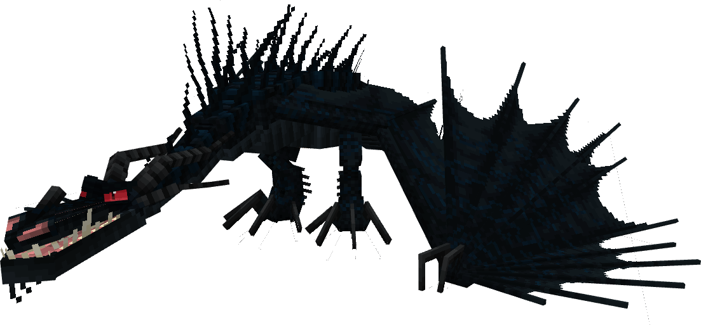

**Obtainment:** Normal spawn

```
/summon isleofberk:monstrous_nightmare ~ ~ ~ {VariantName:low_honour}
```

### Melanistic

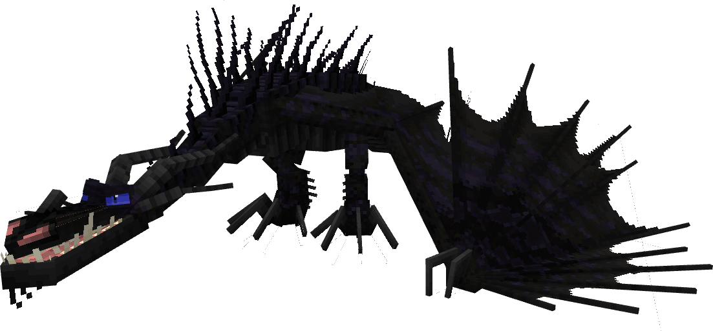

**Obtainment:** Rare spawn

```
/summon isleofberk:monstrous_nightmare ~ ~ ~ {VariantName:melanistic_nightmare}
```

### Mint

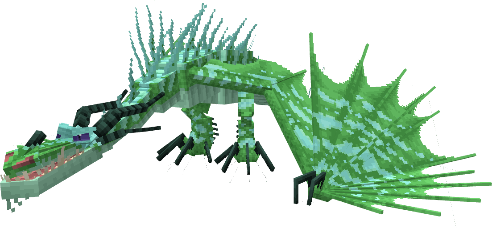

**Obtainment:** Normal spawn

```
/summon isleofberk:monstrous_nightmare ~ ~ ~ {VariantName:mint}
```

### Mirmulnir

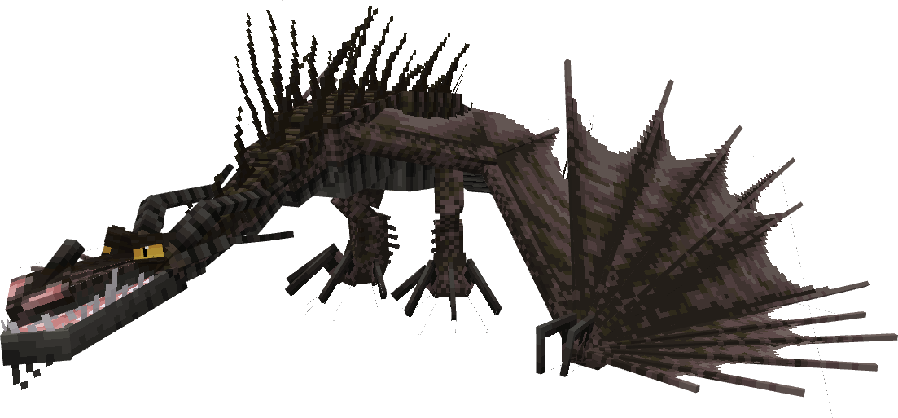

**Obtainment:** Normal spawn

```
/summon isleofberk:monstrous_nightmare ~ ~ ~ {VariantName:mirmulnir}
```

### Mountain

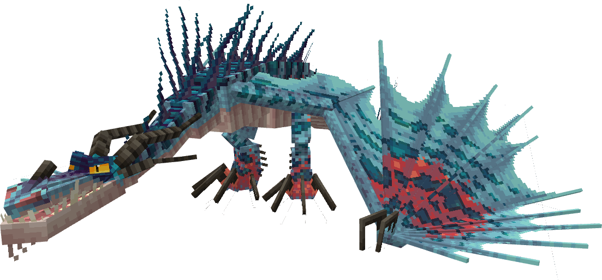

**Obtainment:** Normal spawn

```
/summon isleofberk:monstrous_nightmare ~ ~ ~ {VariantName:mountain}
```

*Credits: Base IoB variant*

### Nahagliiv

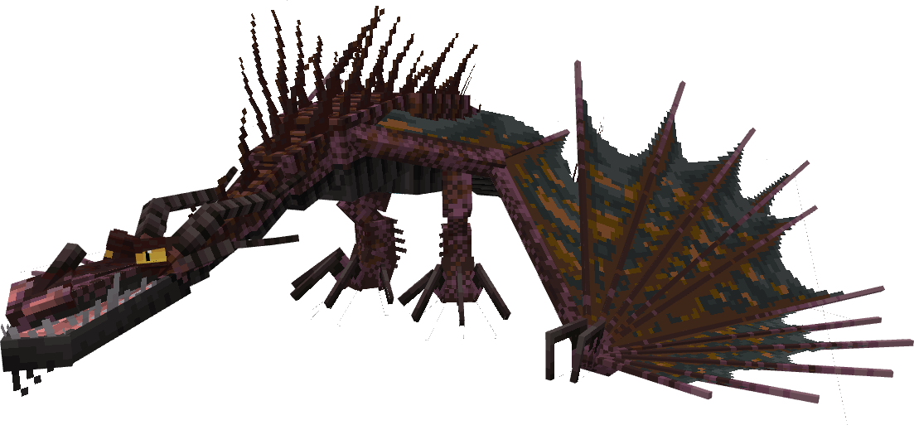

**Obtainment:** Normal spawn

```
/summon isleofberk:monstrous_nightmare ~ ~ ~ {VariantName:nahagliiv}
```

### Rainbow

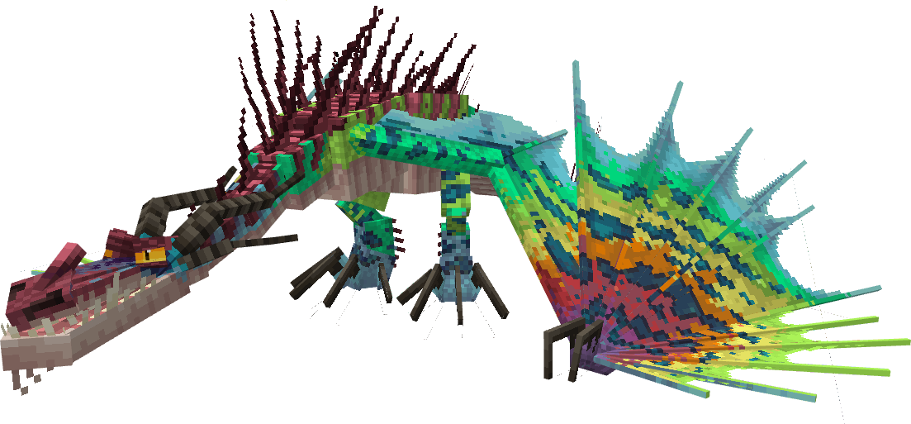

**Obtainment:** Bifrost Temple only

```
/summon isleofberk:monstrous_nightmare ~ ~ ~ {VariantName:rainbow}
```

*Credits: Base IoB variant*

### Relonikiv

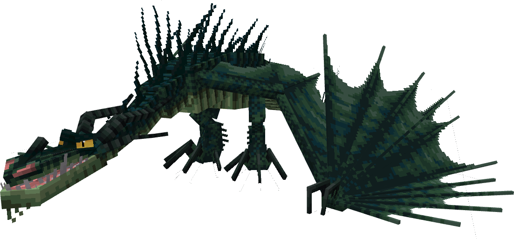

**Obtainment:** Normal spawn

```
/summon isleofberk:monstrous_nightmare ~ ~ ~ {VariantName:relonikiv}
```

### Roseblaze

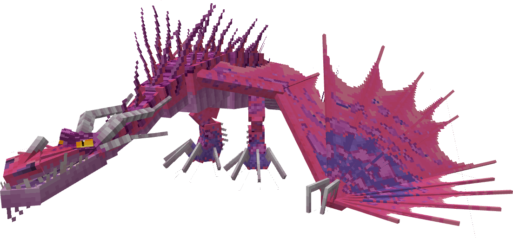

**Obtainment:** Bork Week only

```
/summon isleofberk:monstrous_nightmare ~ ~ ~ {VariantName:roseblaze}
```

### Runerigus

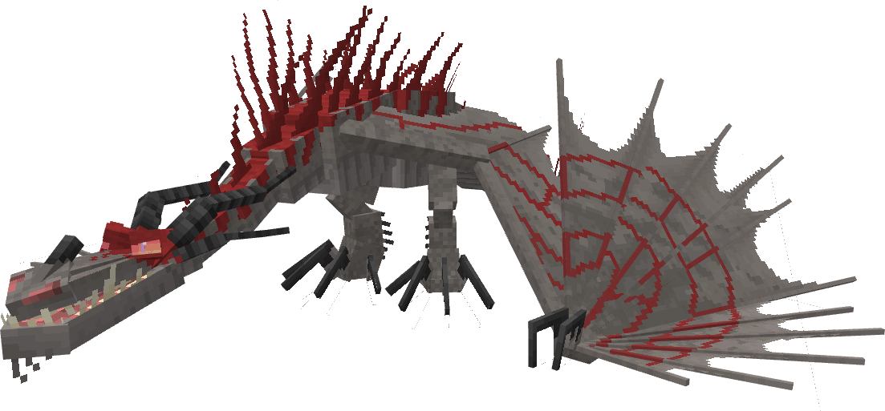

**Obtainment:** Rare spawn

```
/summon isleofberk:monstrous_nightmare ~ ~ ~ {VariantName:runerigus}
```

### Runerigus (shiny)

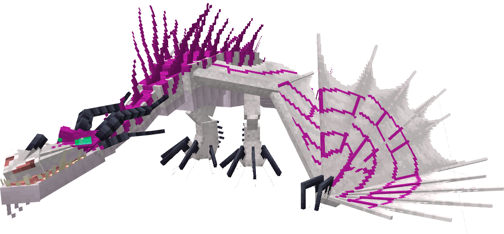

**Obtainment:** Rare spawn

```
/summon isleofberk:monstrous_nightmare ~ ~ ~ {VariantName:runerigus_shiny}
```

### Smokey

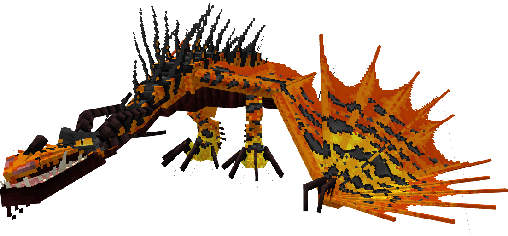

**Obtainment:** Midsommar only

```
/summon isleofberk:monstrous_nightmare ~ ~ ~ {VariantName:smokey}
```

### Spectra

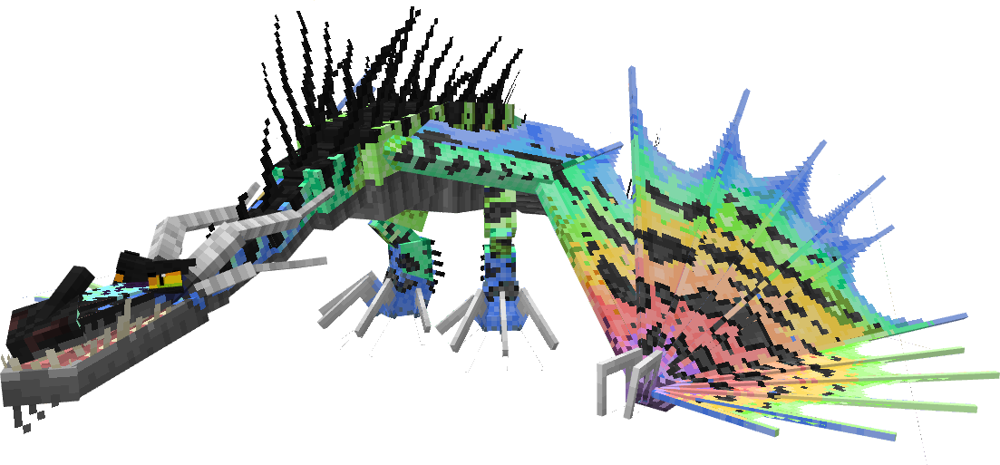

**Obtainment:** Bifrost Temple only

```
/summon isleofberk:monstrous_nightmare ~ ~ ~ {VariantName:spectra}
```

### Sunfyre

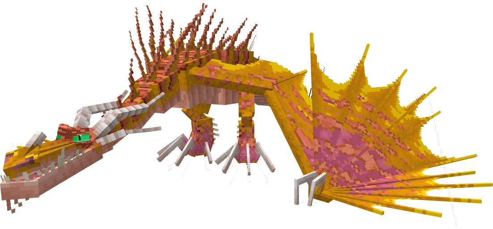

**Obtainment:** Normal spawn

```
/summon isleofberk:monstrous_nightmare ~ ~ ~ {VariantName:sunfyre}
```

*Credits: Base IoB variant*

### Thermo blue

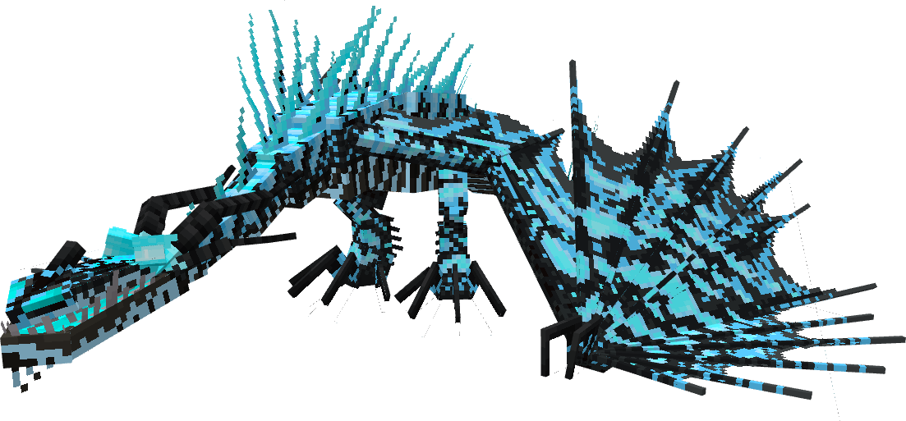

**Obtainment:** Rare spawn

```
/summon isleofberk:monstrous_nightmare ~ ~ ~ {VariantName:thermo_blue}
```

### Thermo Mothra

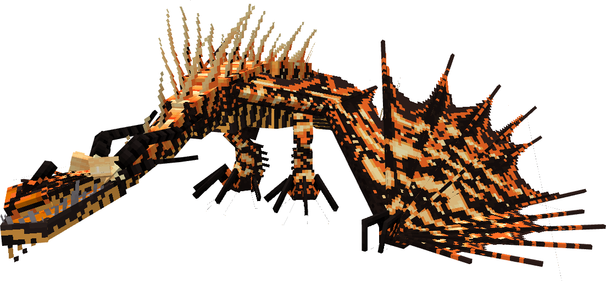

**Obtainment:** Rare spawn

```
/summon isleofberk:monstrous_nightmare ~ ~ ~ {VariantName:thermo_mothra}
```

### The Red Dragon from Dungeon Meshi

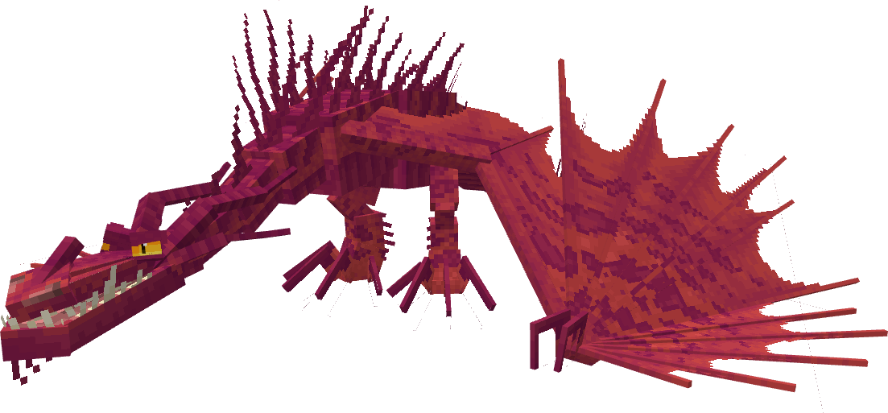

**Obtainment:** Normal spawn

```
/summon isleofberk:monstrous_nightmare ~ ~ ~ {VariantName:meshi}
```

### Tsukarion

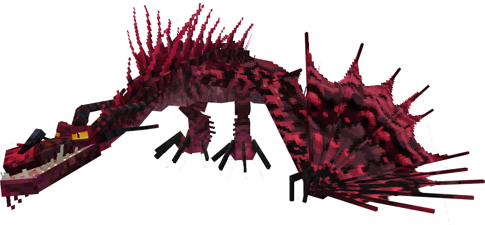

**Obtainment:** Rare spawn

```
/summon isleofberk:monstrous_nightmare ~ ~ ~ {VariantName:tsukarion}
```

*Credits: Base IoB variant*

### Winter

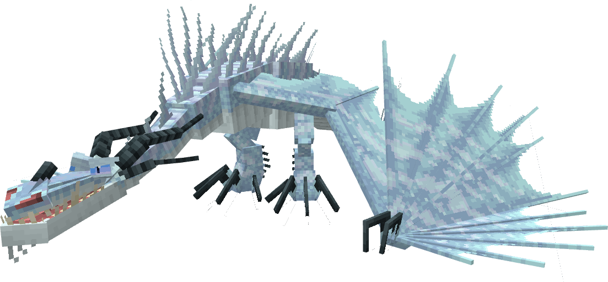

**Obtainment:** Yule only

```
/summon isleofberk:monstrous_nightmare ~ ~ ~ {VariantName:winter}
```

### Wolfsbane

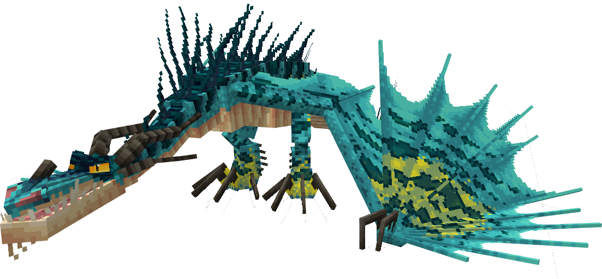

**Obtainment:** Normal spawn

```
/summon isleofberk:monstrous_nightmare ~ ~ ~ {VariantName:wolfsbane}
```

*Credits: Base IoB variant*

---

_Content adapted from the [Archipelago Additions Wiki](https://archipelagoadditions.miraheze.org/wiki/Monstrous_Nightmare) under [CC BY-SA 4.0](https://creativecommons.org/licenses/by-sa/4.0/)._
