# Night Fury


> The unholy offspring of lightning and death itself. Do not engage this dragon. Your only chance: Hide and pray it does not find you.

The Night Fury is a main canon dragon from the first film. It is a base Isle of Berk dragon.
Tail fin variants have their speed attribute reduced by 0.01

## Stats

| Stat | Value |
|---|---|
| Health | 80 (40 hearts) |
| Armour | 2 (1 icon) |
| Attack | 4 (2 hearts) |
| Walk Speed | 0.4 (Piglin Brute speed) |
| Fly Speed | 0.2 (twice as fast as an Allay) |

## Taming

**Taming Foods:** Raw Cod, Raw Salmon

**Requirements:**

- No tools or weapons (except Dragon Blades & specified Viking Artifacts) held
- No armour worn
- Night vision potion effect active

**Alt Taming:** Dragon Nip

## Breeding

**Breeding Foods:** Honeycomb, Sagefruit

## Drops

**Brush Drops:** 1-3 Night Fury Scales

**Death Drops:** 1-2 Dragon Blood, 3-5 Night Fury Scales

## Spawn Biomes

- `minecraft:stony_peaks`
- `minecraft:stony_shore`
- `minecraft:windswept_forest`

## Variants

### Albino


**Obtainment:** Rare spawn

```
/summon isleofberk:night_fury ~ ~ ~ {VariantName:albino_night_fury}
```

*Credits: Base IoB variant*

### Albino alpha

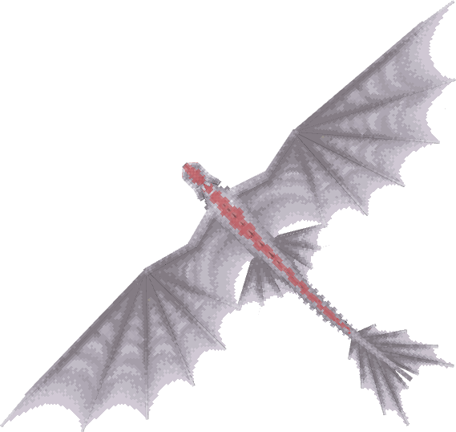

**Obtainment:** Extremely Rare spawn

```
/summon isleofberk:night_fury ~ ~ ~ {VariantName:albino_alpha_night_fury}
```

*Credits: Near base IoB variant*

### Albino tail

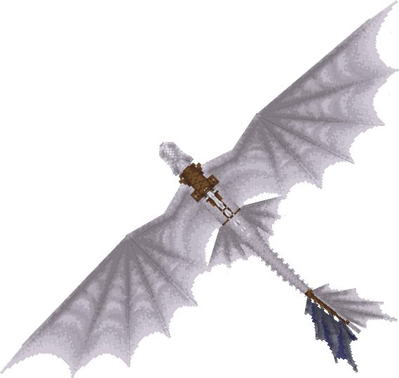

**Obtainment:** Extremely Rare spawn

```
/summon isleofberk:night_fury ~ ~ ~ {VariantName:albino_tail_night_fury}
```

*Credits: Near base IoB variant*

### Arsian

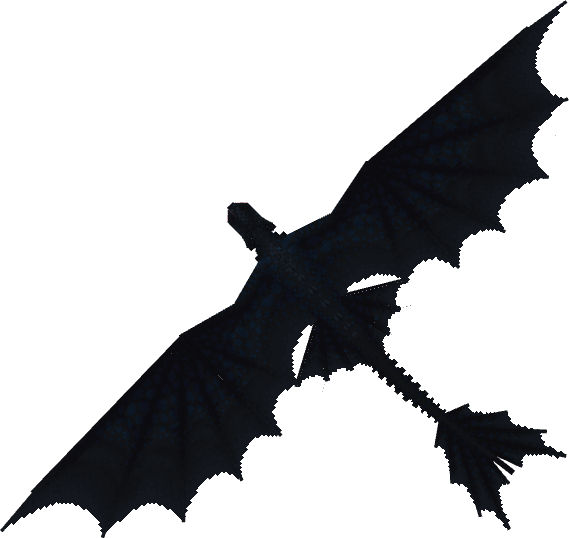

**Obtainment:** Normal spawn

```
/summon isleofberk:night_fury ~ ~ ~ {VariantName:arsian}
```

*Credits: Base IoB variant*

### Arsian alpha


**Obtainment:** Rare spawn

```
/summon isleofberk:night_fury ~ ~ ~ {VariantName:arsian_alpha}
```

*Credits: Near base IoB variant*

### Arsian tail

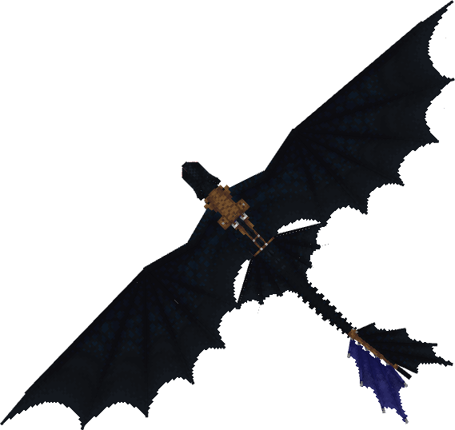

**Obtainment:** Rare spawn

```
/summon isleofberk:night_fury ~ ~ ~ {VariantName:arsian_tail}
```

*Credits: Near base IoB variant*

### Karma

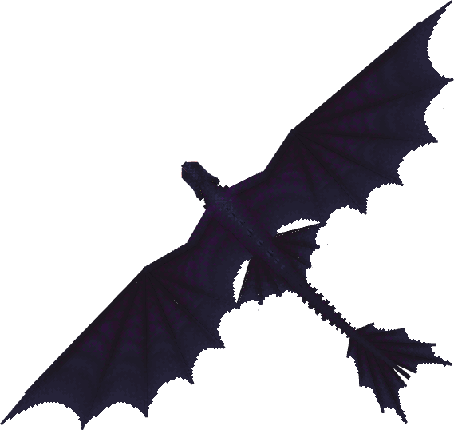

**Obtainment:** Normal spawn

```
/summon isleofberk:night_fury ~ ~ ~ {VariantName:karma}
```

*Credits: Base IoB variant*

### Karma alpha

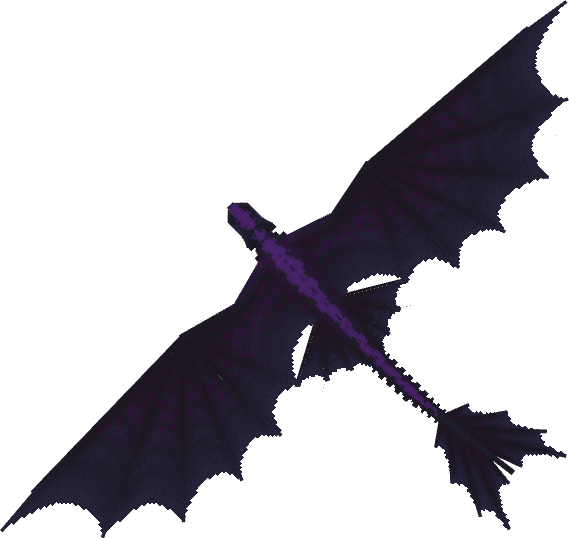

**Obtainment:** Rare spawn

```
/summon isleofberk:night_fury ~ ~ ~ {VariantName:karma_alpha}
```

*Credits: Near base IoB variant*

### Karma tail

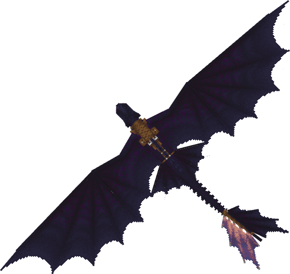

**Obtainment:** Rare spawn

```
/summon isleofberk:night_fury ~ ~ ~ {VariantName:karma_tail}
```

*Credits: Near base IoB variant*

### Lumora

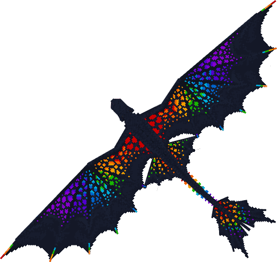

**Obtainment:** Bifrost Temple only

```
/summon isleofberk:night_fury ~ ~ ~ {VariantName:lumora}
```

### Melanistic

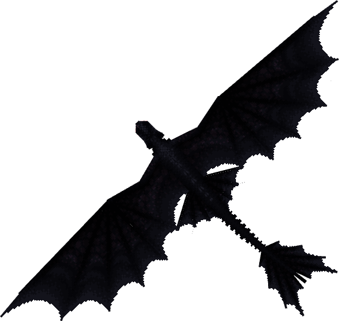

**Obtainment:** Rare spawn

```
/summon isleofberk:night_fury ~ ~ ~ {VariantName:melanistic_night_fury}
```

### Melanistic alpha

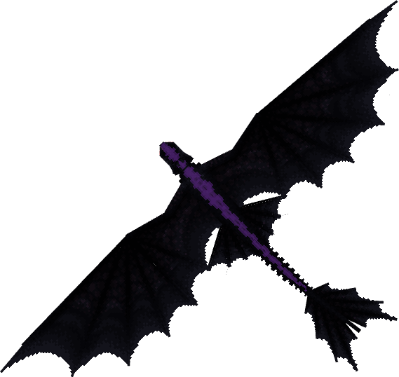

**Obtainment:** Extremely Rare spawn

```
/summon isleofberk:night_fury ~ ~ ~ {VariantName:melanistic_alpha_night_fury}
```

### Melanistic tail

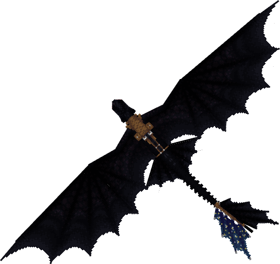

**Obtainment:** Extremely Rare spawn

```
/summon isleofberk:night_fury ~ ~ ~ {VariantName:melanistic_tail_night_fury}
```

### Night Fury


**Obtainment:** Normal spawn

```
/summon isleofberk:night_fury ~ ~ ~ {VariantName:night_fury}
```

*Credits: Base IoB variant*

### Night Fury alpha

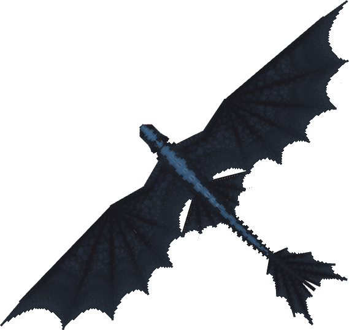

**Obtainment:** Rare spawn

```
/summon isleofberk:night_fury ~ ~ ~ {VariantName:night_fury_alpha}
```

*Credits: Near base IoB variant*

### Night Fury tail

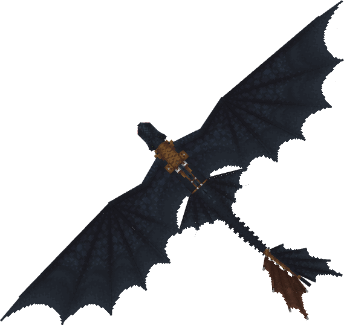

**Obtainment:** Rare spawn

```
/summon isleofberk:night_fury ~ ~ ~ {VariantName:night_fury_tail}
```

*Credits: Near base IoB variant*

### Pink

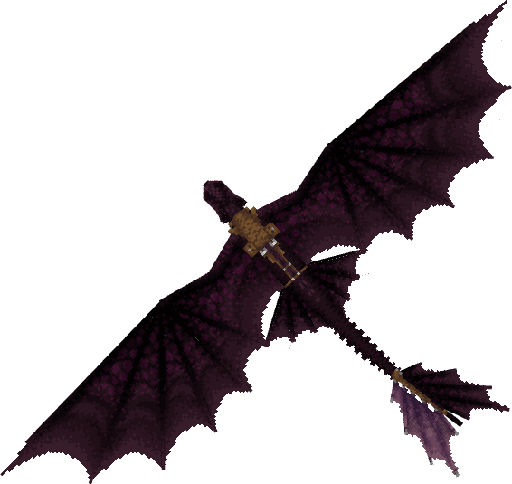

**Obtainment:** Rare spawn

```
/summon isleofberk:night_fury ~ ~ ~ {VariantName:pink}
```

### Sentinel


**Obtainment:** Normal spawn

```
/summon isleofberk:night_fury ~ ~ ~ {VariantName:sentinel}
```

*Credits: Base IoB variant*

### Sentinel alpha

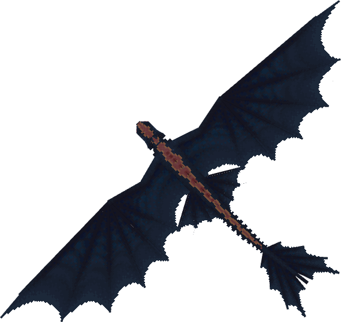

**Obtainment:** Rare spawn

```
/summon isleofberk:night_fury ~ ~ ~ {VariantName:sentinel_alpha}
```

*Credits: Near base IoB variant*

### Sentinel tail

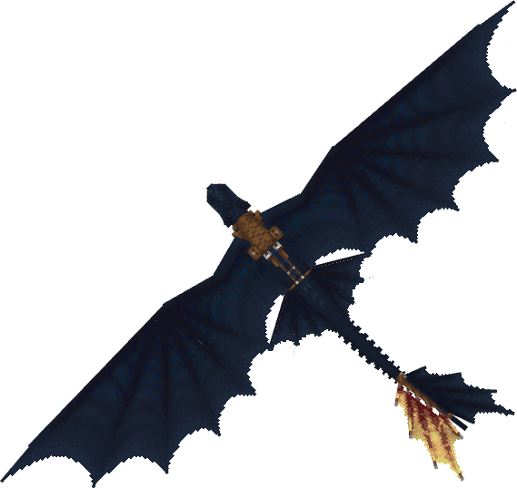

**Obtainment:** Rare spawn

```
/summon isleofberk:night_fury ~ ~ ~ {VariantName:sentinel_tail}
```

*Credits: Near base IoB variant*

### Starchaser

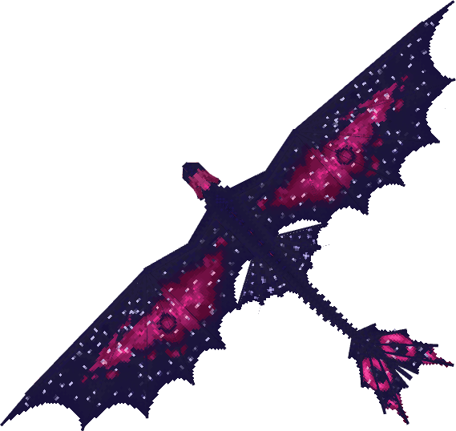

**Obtainment:** Rare spawn

```
/summon isleofberk:night_fury ~ ~ ~ {VariantName:starchaser}
```

### Starlit

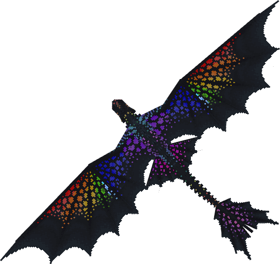

**Obtainment:** Bifrost Temple only

```
/summon isleofberk:night_fury ~ ~ ~ {VariantName:starlit}
```

### Svartr

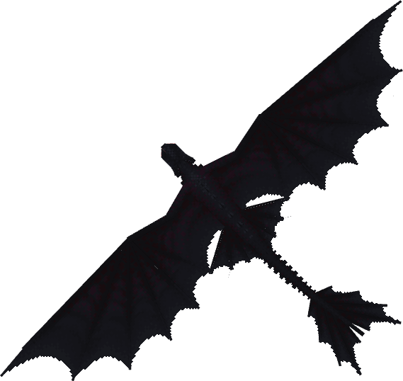

**Obtainment:** Normal spawn

```
/summon isleofberk:night_fury ~ ~ ~ {VariantName:svartr}
```

*Credits: Base IoB variant*

### Svartr alpha

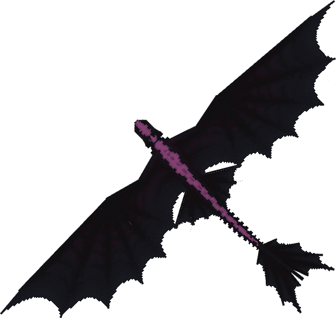

**Obtainment:** Rare spawn

```
/summon isleofberk:night_fury ~ ~ ~ {VariantName:svartr_alpha}
```

*Credits: Near base IoB variant*

### Svartr tail

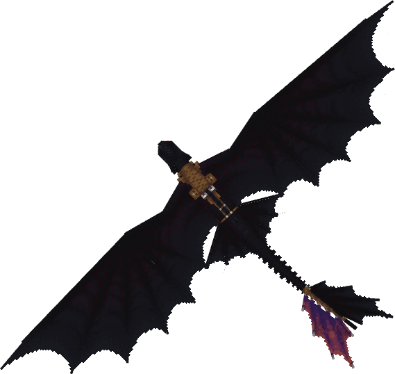

**Obtainment:** Rare spawn

```
/summon isleofberk:night_fury ~ ~ ~ {VariantName:svartr_tail}
```

*Credits: Near base IoB variant*

### Toothless

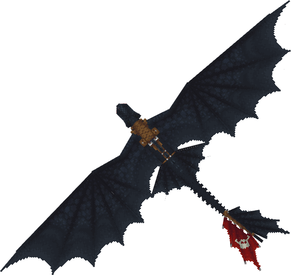

**Obtainment:** Command only

```
/summon isleofberk:night_fury ~ ~ ~ {VariantName:toothless}
```

*Credits: Base IoB variant*

### Toothless alpha

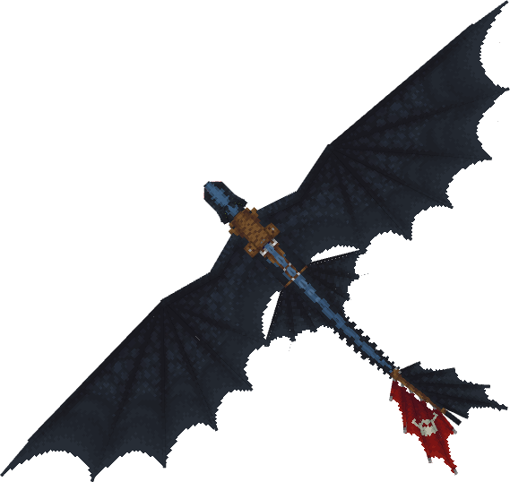

**Obtainment:** Command only

```
/summon isleofberk:night_fury ~ ~ ~ {VariantName:toothless_alpha}
```

*Credits: Near base IoB variant*

### Venus

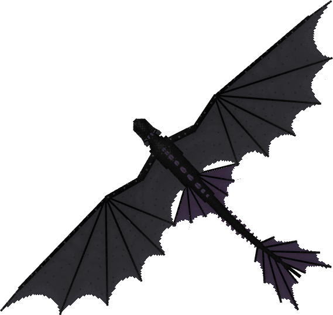

**Obtainment:** Rare spawn

```
/summon isleofberk:night_fury ~ ~ ~ {VariantName:venus}
```

### Xiao

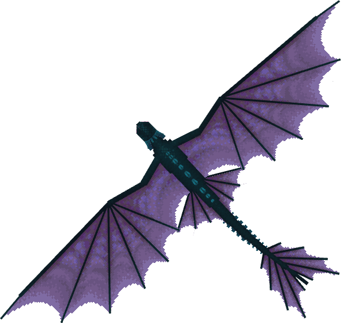

**Obtainment:** Rare spawn

```
/summon isleofberk:night_fury ~ ~ ~ {VariantName:xiao}
```

---

_Content adapted from the [Archipelago Additions Wiki](https://archipelagoadditions.miraheze.org/wiki/Night_Fury) under [CC BY-SA 4.0](https://creativecommons.org/licenses/by-sa/4.0/)._
