# Night Light


The Night Light is a main canon dragon from the third film. It is a base Isle of Berk dragon.

## Stats

| Stat | Value |
|---|---|
| Health | 70 (35 hearts) |
| Armour | 0 |
| Attack | 4 (2 hearts) |
| Walk Speed | 0.4 (Piglin Brute speed) |
| Fly Speed | 0.2 (twice Allay speed) |

## Taming

**Taming Foods:** Raw Cod, Raw Salmon, Tropical Fish

**Requirements:** The dragon must be a baby

## Breeding

**Breeding Foods:** Honeycomb, Sagefruit

## Drops

**Brush Drops:** 1-3 Night Light Scales

**Death Drops:** 1-2 Dragon Blood, 3-5 Night Light Scales

## Spawn Biomes

- `This dragon does not spawn. It has a 50% chance to be produced when breeding a Light Fury and a Night Fury . The alternative outcome is a Light Night .`

## Variants

### Appaloosa

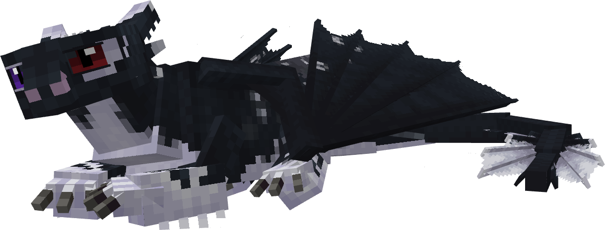

**Obtainment:** Normal breeding

```
/summon isleofberk:night_light ~ ~ ~ {VariantName:appaloosa}
```

*Credits: Base IoB variant*

### Appaloosa alpha

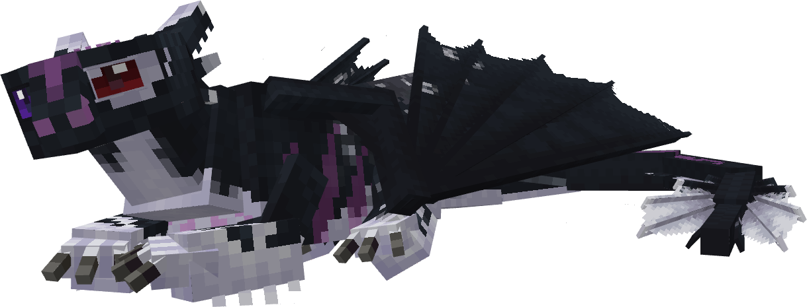

**Obtainment:** Rare breeding

```
/summon isleofberk:night_light ~ ~ ~ {VariantName:appaloosa_alpha}
```

*Credits: Near base IoB variant*

### Ashwing

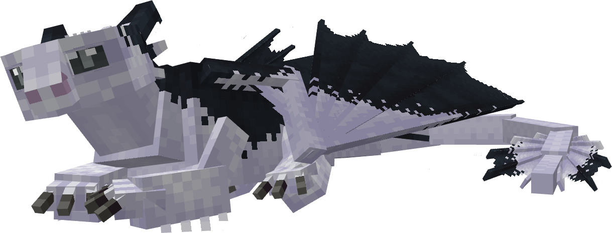

**Obtainment:** Normal breeding

```
/summon isleofberk:night_light ~ ~ ~ {VariantName:ashwing}
```

*Credits: Base IoB variant*

### Ashwing alpha

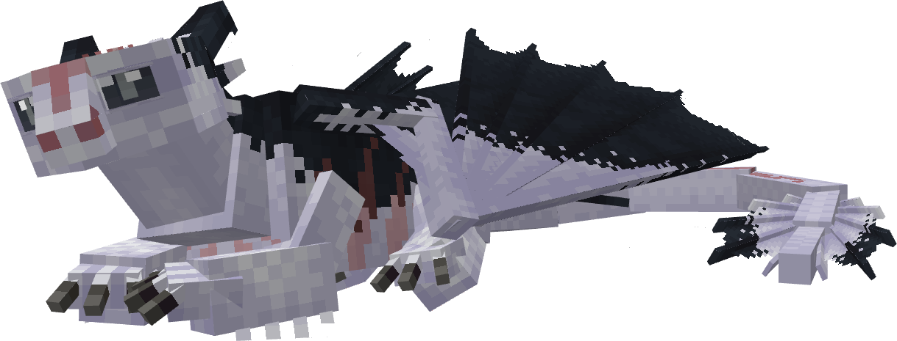

**Obtainment:** Rare breeding

```
/summon isleofberk:night_light ~ ~ ~ {VariantName:ashwing_alpha}
```

*Credits: Near base IoB variant*

### Colour

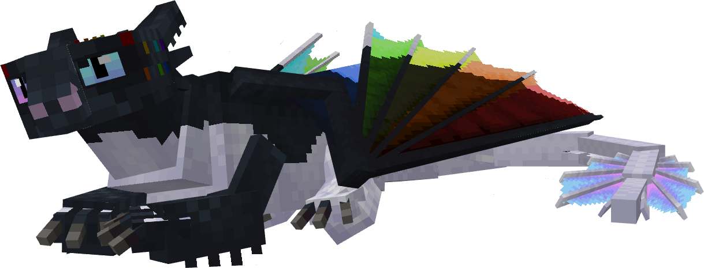

**Obtainment:** Bifrost Temple only

```
/summon isleofberk:night_light ~ ~ ~ {VariantName:color}
```

### Dart


**Obtainment:** Normal breeding

```
/summon isleofberk:night_light ~ ~ ~ {VariantName:dart}
```

*Credits: Base IoB variant*

### Dart alpha

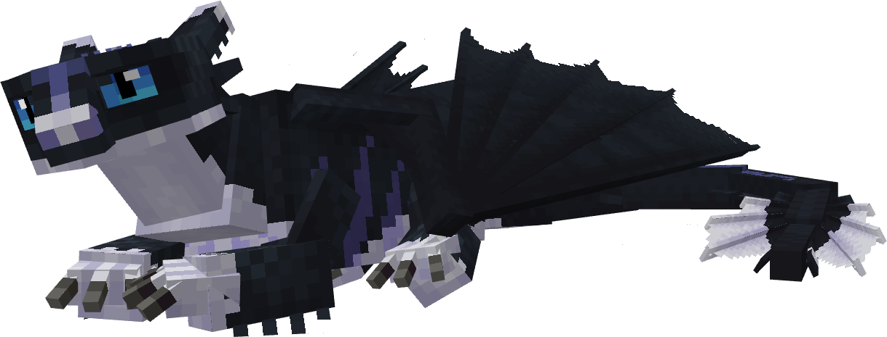

**Obtainment:** Rare breeding

```
/summon isleofberk:night_light ~ ~ ~ {VariantName:dart_alpha}
```

*Credits: Near base IoB variant*

### Dusk

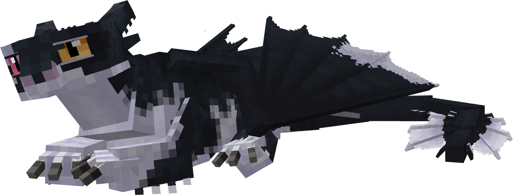

**Obtainment:** Normal breeding

```
/summon isleofberk:night_light ~ ~ ~ {VariantName:dusk}
```

*Credits: Base IoB variant*

### Dusk alpha

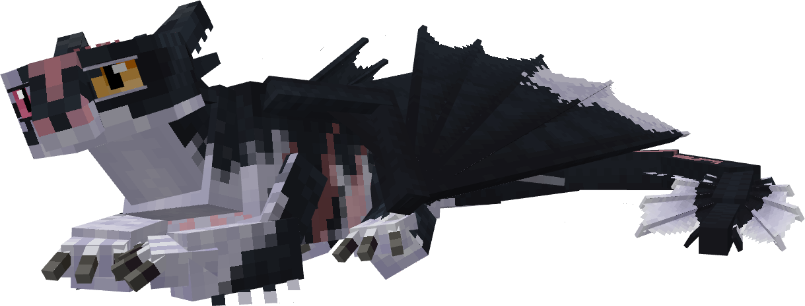

**Obtainment:** Rare breeding

```
/summon isleofberk:night_light ~ ~ ~ {VariantName:dusk_alpha}
```

*Credits: Near base IoB variant*

### Harlequeen

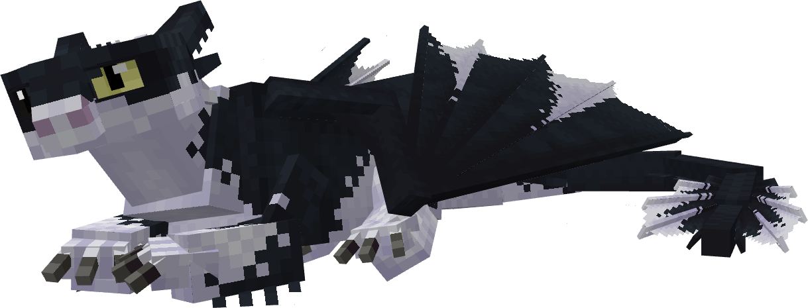

**Obtainment:** Normal breeding

```
/summon isleofberk:night_light ~ ~ ~ {VariantName:harlequeen}
```

*Credits: Base IoB variant*

### Harlequeen alpha

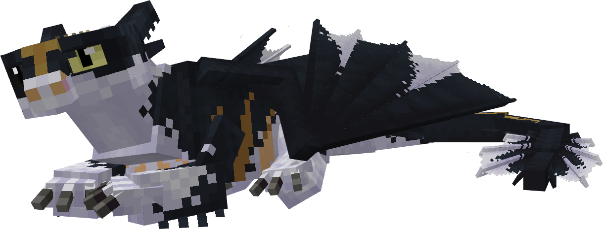

**Obtainment:** Rare breeding

```
/summon isleofberk:night_light ~ ~ ~ {VariantName:harlequeen_alpha}
```

*Credits: Near base IoB variant*

### Iridescence

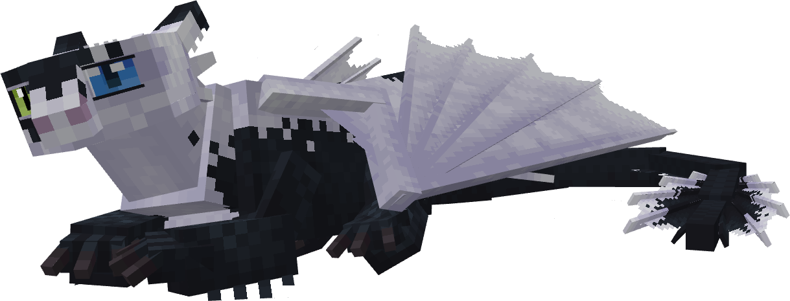

**Obtainment:** Normal breeding

```
/summon isleofberk:night_light ~ ~ ~ {VariantName:iridescence}
```

*Credits: Base IoB variant*

### Iridescence alpha

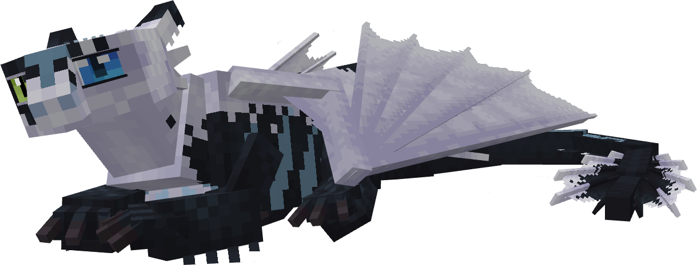

**Obtainment:** Rare breeding

```
/summon isleofberk:night_light ~ ~ ~ {VariantName:iridescence_alpha}
```

*Credits: Near base IoB variant*

### Leopard

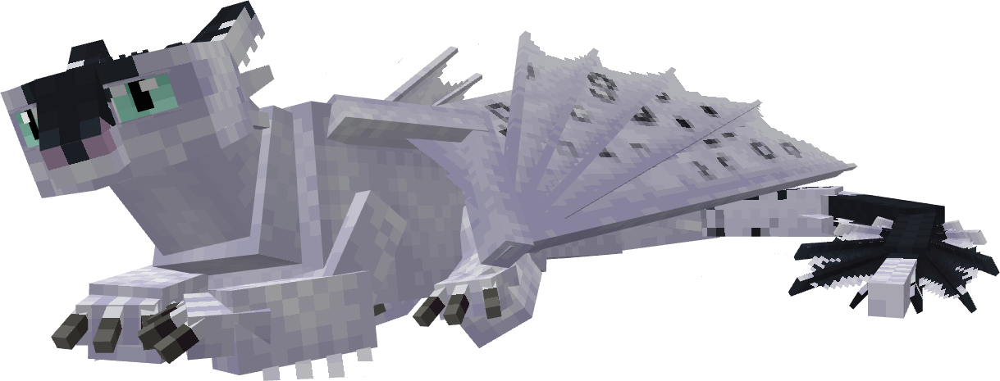

**Obtainment:** Normal breeding

```
/summon isleofberk:night_light ~ ~ ~ {VariantName:leopard}
```

*Credits: Base IoB variant*

### Leopard alpha

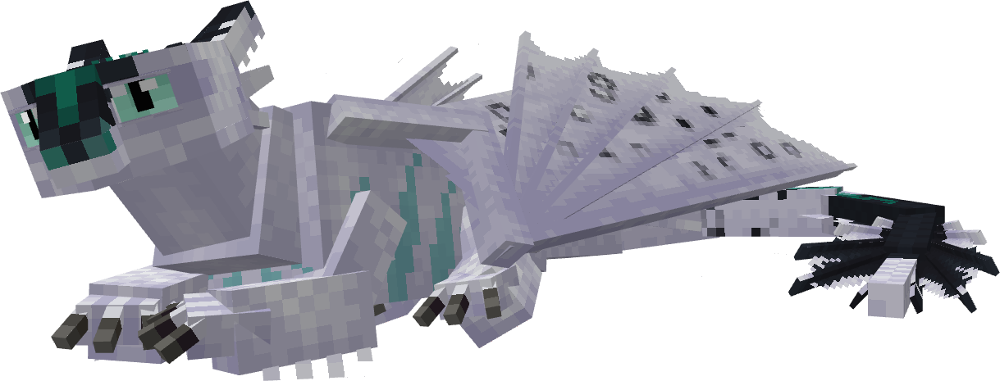

**Obtainment:** Rare breeding

```
/summon isleofberk:night_light ~ ~ ~ {VariantName:leopard_alpha}
```

*Credits: Near base IoB variant*

### Nightdancer


**Obtainment:** Normal breeding

```
/summon isleofberk:night_light ~ ~ ~ {VariantName:nightdancer}
```

*Credits: Base IoB variant*

### Nightdancer alpha

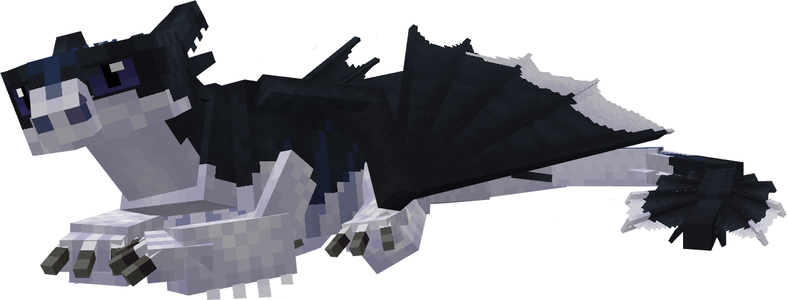

**Obtainment:** Rare breeding

```
/summon isleofberk:night_light ~ ~ ~ {VariantName:nightdancer_alpha}
```

*Credits: Near base IoB variant*

### Occasus

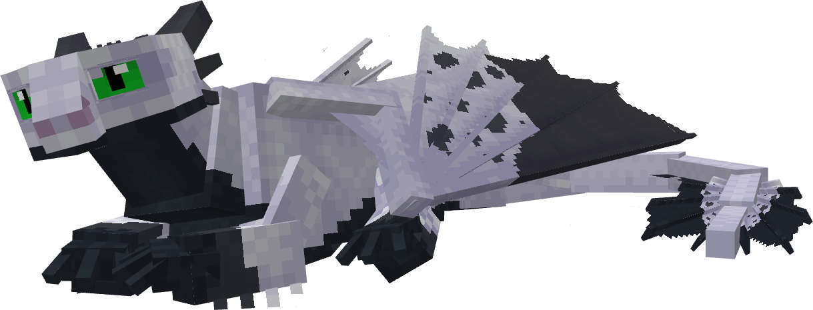

**Obtainment:** Normal breeding

```
/summon isleofberk:night_light ~ ~ ~ {VariantName:occasus}
```

### Occasus alpha

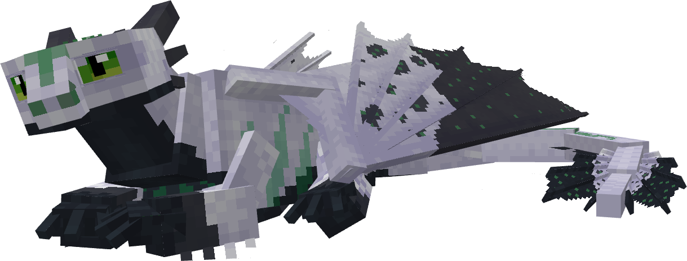

**Obtainment:** Rare breeding

```
/summon isleofberk:night_light ~ ~ ~ {VariantName:occasus_alpha}
```

### Orca

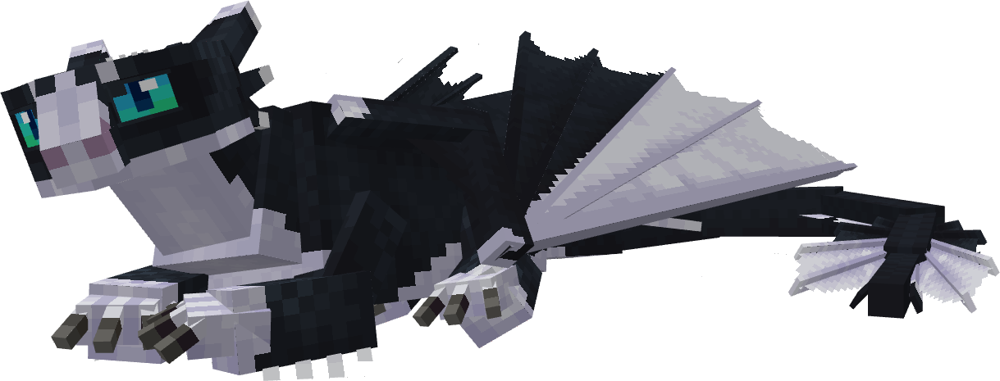

**Obtainment:** Normal breeding

```
/summon isleofberk:night_light ~ ~ ~ {VariantName:orca}
```

### Pouncer

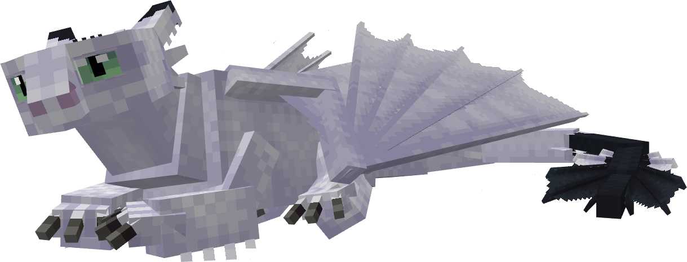

**Obtainment:** Normal breeding

```
/summon isleofberk:night_light ~ ~ ~ {VariantName:pouncer}
```

*Credits: Base IoB variant*

### Pouncer alpha

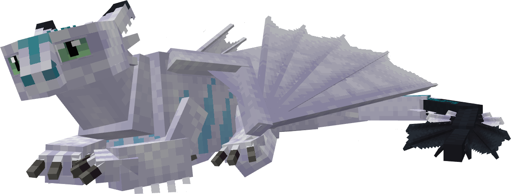

**Obtainment:** Rare breeding

```
/summon isleofberk:night_light ~ ~ ~ {VariantName:pouncer_alpha}
```

*Credits: Near base IoB variant*

### Ruffrunner

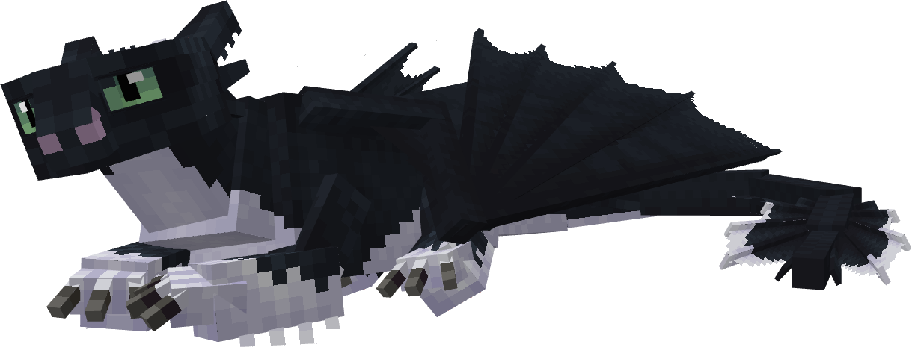

**Obtainment:** Normal breeding

```
/summon isleofberk:night_light ~ ~ ~ {VariantName:ruffrunner}
```

*Credits: Base IoB variant*

### Ruffrunner alpha

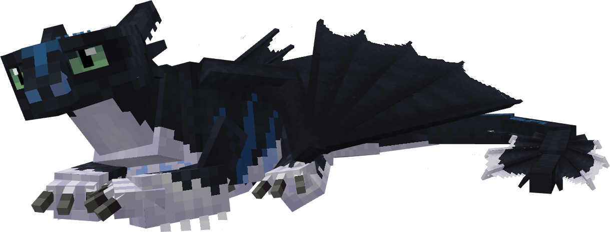

**Obtainment:** Rare breeding

```
/summon isleofberk:night_light ~ ~ ~ {VariantName:ruffrunner_alpha}
```

*Credits: Near base IoB variant*

### Skydancer

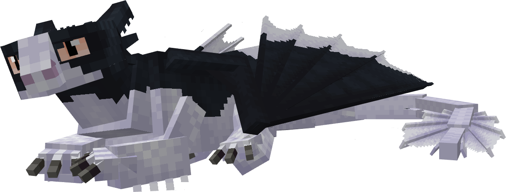

**Obtainment:** Normal breeding

```
/summon isleofberk:night_light ~ ~ ~ {VariantName:skydancer}
```

*Credits: Base IoB variant*

### Skydancer alpha

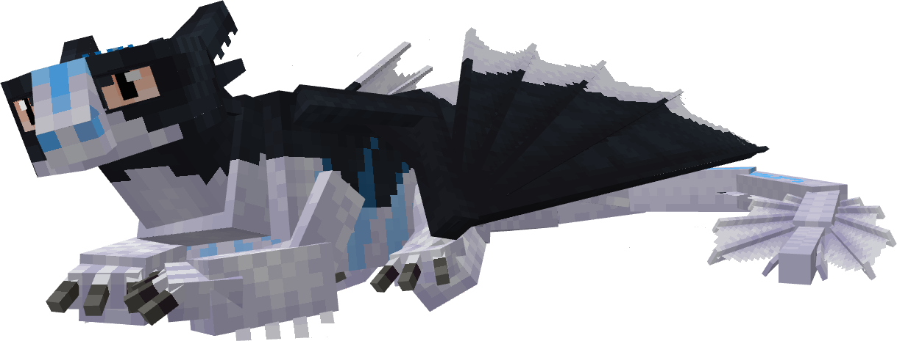

**Obtainment:** Rare breeding

```
/summon isleofberk:night_light ~ ~ ~ {VariantName:skydancer_alpha}
```

*Credits: Near base IoB variant*

### Smores

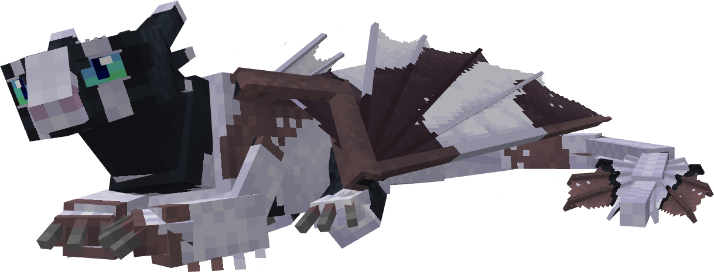

**Obtainment:** Normal breeding

```
/summon isleofberk:night_light ~ ~ ~ {VariantName:smores}
```

### Snow Owl

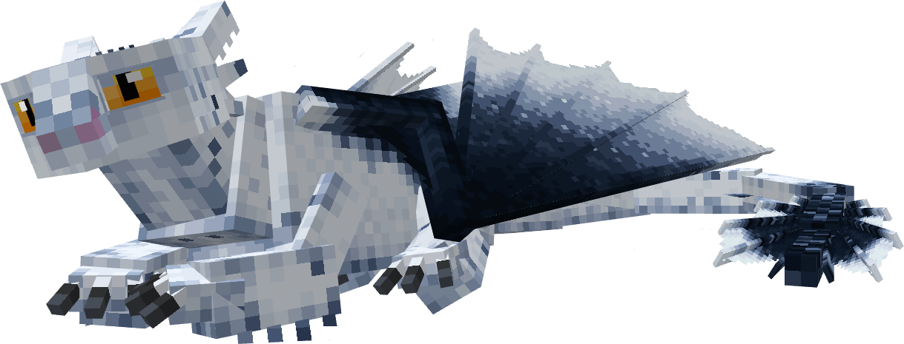

**Obtainment:** Normal breeding

```
/summon isleofberk:night_light ~ ~ ~ {VariantName:snow_owl}
```

*Credits: This variant was donated by Ness*

### Snow Owl alpha

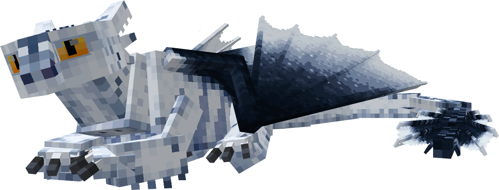

**Obtainment:** Normal breeding

```
/summon isleofberk:night_light ~ ~ ~ {VariantName:snow_owl_alpha}
```

*Credits: This variant was donated by Ness*

### Tiger

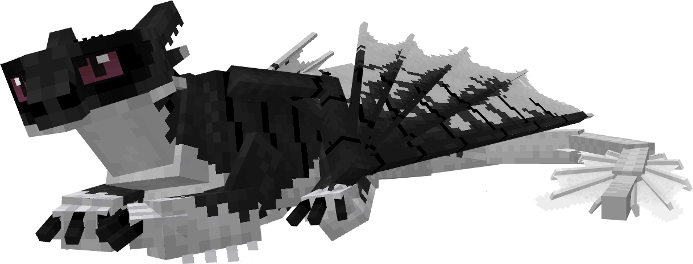

**Obtainment:** Normal breeding

```
/summon isleofberk:night_light ~ ~ ~ {VariantName:tiger}
```

### Tiger alpha

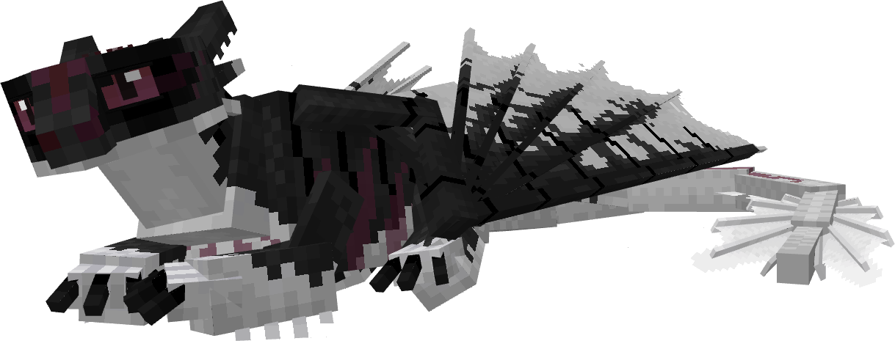

**Obtainment:** Normal breeding

```
/summon isleofberk:night_light ~ ~ ~ {VariantName:tiger_alpha}
```

### Tigress

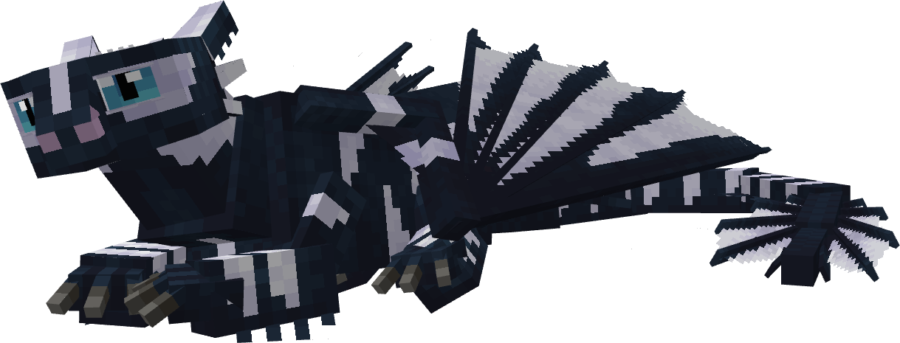

**Obtainment:** Normal breeding

```
/summon isleofberk:night_light ~ ~ ~ {VariantName:tigress}
```

*Credits: This variant was designed by Mittens365*

### Tigress alpha

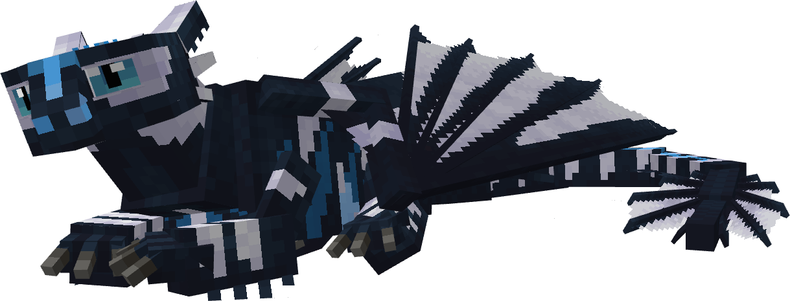

**Obtainment:** Normal breeding

```
/summon isleofberk:night_light ~ ~ ~ {VariantName:tigress_alpha}
```

*Credits: This variant was designed by Mittens365*

---

_Content adapted from the [Archipelago Additions Wiki](https://archipelagoadditions.miraheze.org/wiki/Night_Light) under [CC BY-SA 4.0](https://creativecommons.org/licenses/by-sa/4.0/)._
