# Night Terror

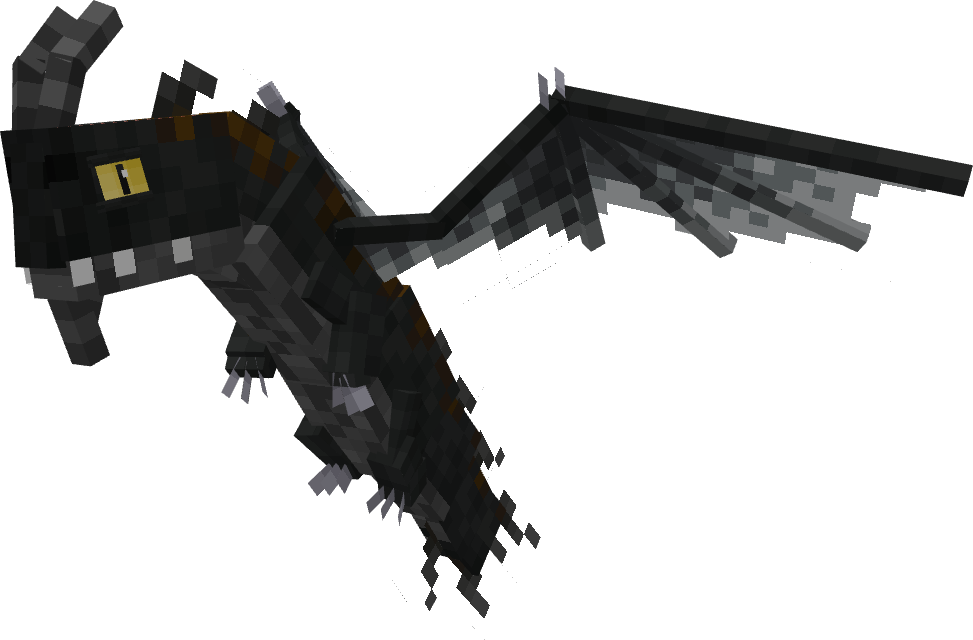

The Night Terror is a series canon dragon, first appearing in Race to the Edge. It is a Stego's Dragons dragon, now part of AA after the merge. The Night Terror uses theTerrible Terrorbase.

## Stats

| Stat | Value |
|---|---|
| Health | 25 (12.5 hearts) |
| Armour | 0 |
| Attack | 3 (1.5 hearts) |
| Walk Speed | 0.3 (Wolf speed) |
| Fly Speed | 0.04 (50% Allay speed) |

## Taming

**Taming Foods:** Raw Cod, Raw Salmon, Tropical Fish

**Requirements:** No tools or weapons (except Dragon Blades & specified Viking Artifacts) held

**Alt Taming:** Dragon Nip

## Breeding

**Breeding Foods:** Pufferfish, Sagefruit

## Drops

**Brush Drops:** 1-2 Night Terror Scales

**Death Drops:** 1 Dragon Blood, 1-3 Night Terror Scales

## Spawn Biomes

- `minecraft:dark_forest`
- `minecraft:forest`
- `minecraft:old_growth_pine_taiga`

## Variants

### Albino

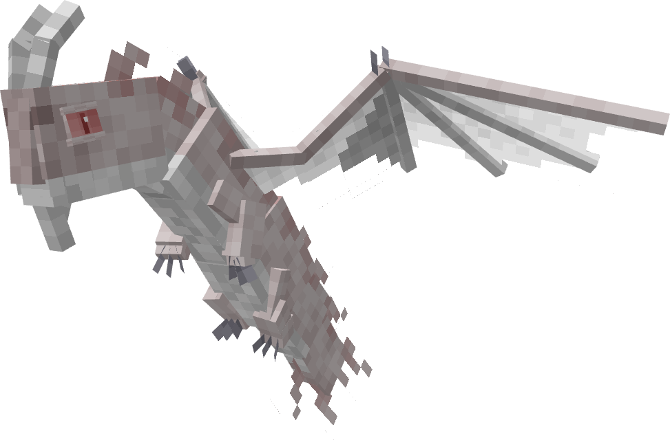

**Obtainment:** Rare spawn

```
/summon isleofberk:terrible_terror ~ ~ ~ {VariantName:night_albino}
```

*Credits: Stego's Dragons variant*

### Bronze


**Obtainment:** Normal spawn

```
/summon isleofberk:terrible_terror ~ ~ ~ {VariantName:bronze_terror}
```

*Credits: Stego's Dragons variant*

### Darkvarg

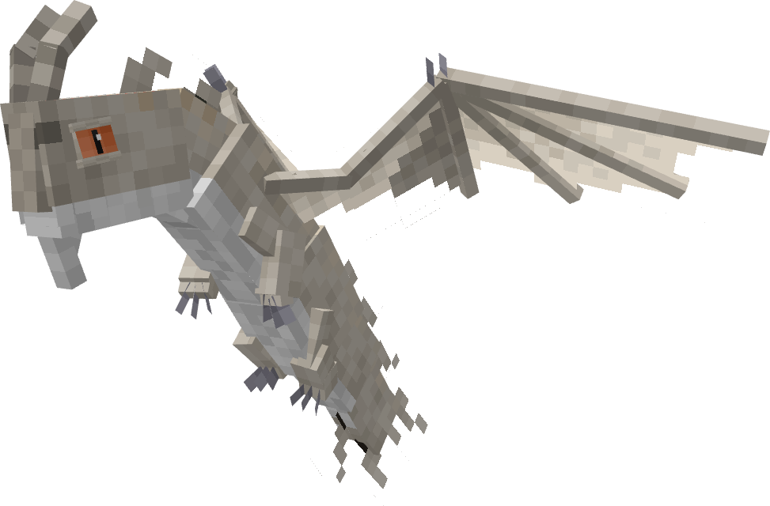

**Obtainment:** Rare spawn

```
/summon isleofberk:terrible_terror ~ ~ ~ {VariantName:darkvarg}
```

*Credits: Stego's Dragons variant*

### Dusk Mite

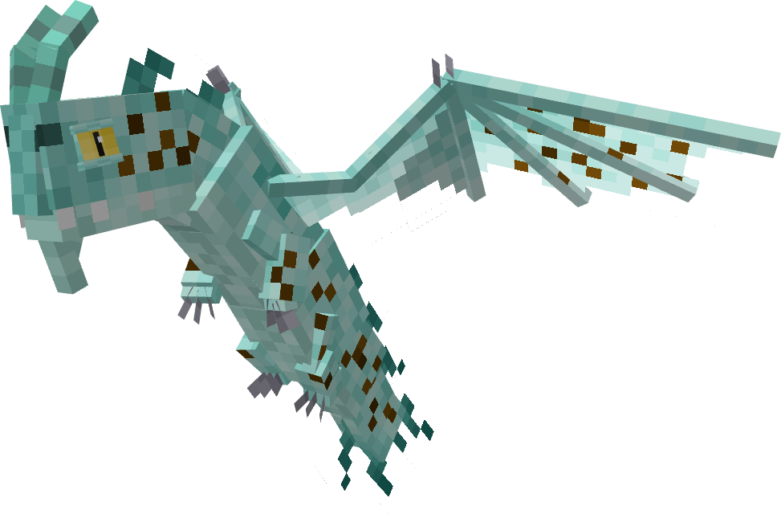

**Obtainment:** Rare spawn

```
/summon isleofberk:terrible_terror ~ ~ ~ {VariantName:dusk_mite}
```

*Credits: Stego's Dragons variant*

### Eclipse Terror

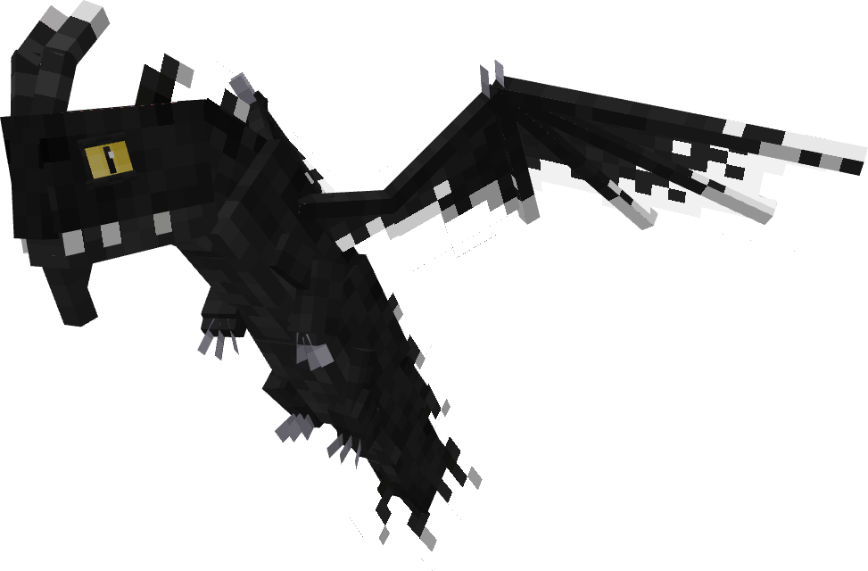

**Obtainment:** Normal spawn

```
/summon isleofberk:terrible_terror ~ ~ ~ {VariantName:eclipse_terror}
```

*Credits: Stego's Dragons variant*

### Fire Terror

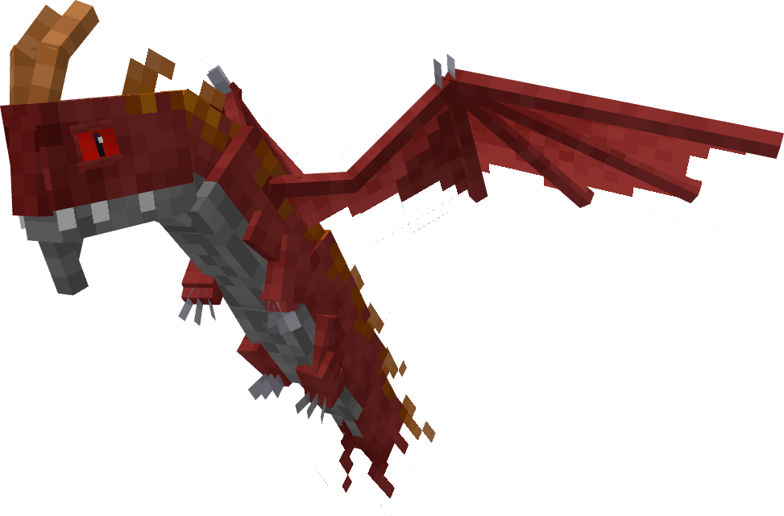

**Obtainment:** Rare spawn

```
/summon isleofberk:terrible_terror ~ ~ ~ {VariantName:fire_terror}
```

*Credits: Stego's Dragons variant*

### Gold

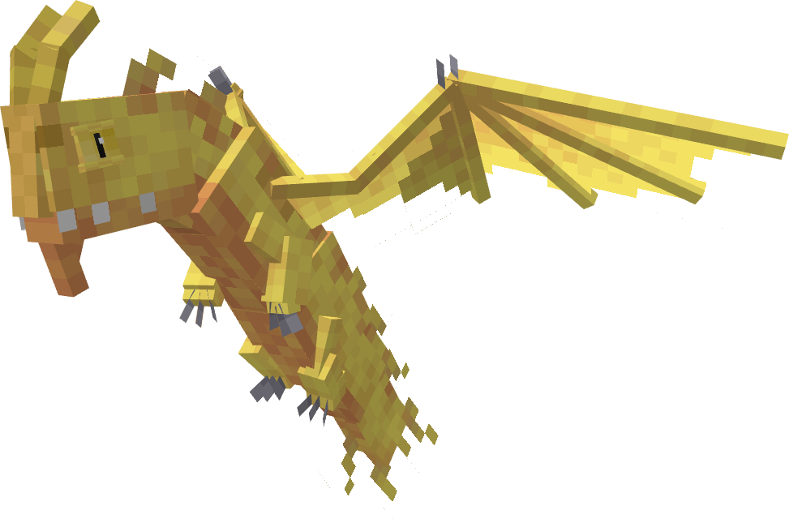

**Obtainment:** Rare spawn

```
/summon isleofberk:terrible_terror ~ ~ ~ {VariantName:golden_terror}
```

*Credits: Stego's Dragons variant*

### Hailstorm

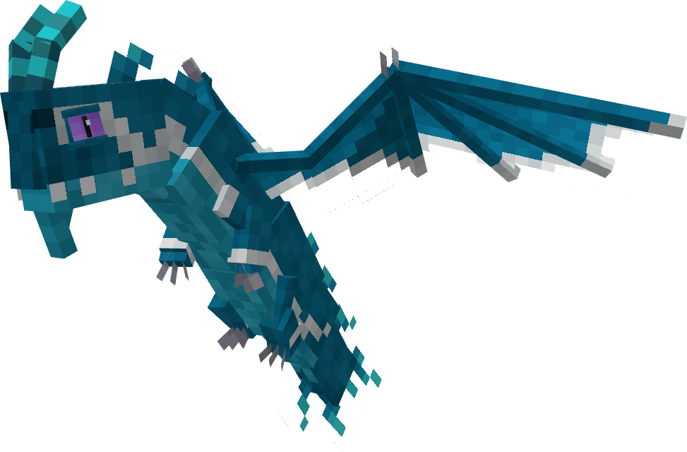

**Obtainment:** Rare spawn

```
/summon isleofberk:terrible_terror ~ ~ ~ {VariantName:hailstorm}
```

*Credits: Stego's Dragons variant*

### Heartwarmer

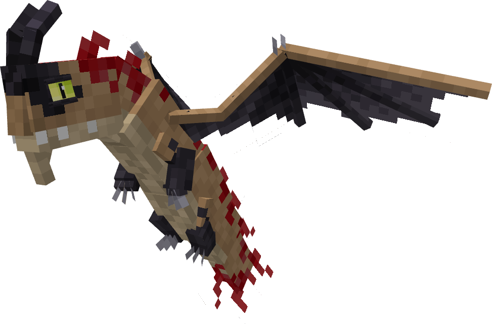

**Obtainment:** Rare spawn

```
/summon isleofberk:terrible_terror ~ ~ ~ {VariantName:heartwarmer}
```

*Credits: Stego's Dragons variant*

### Leucistic

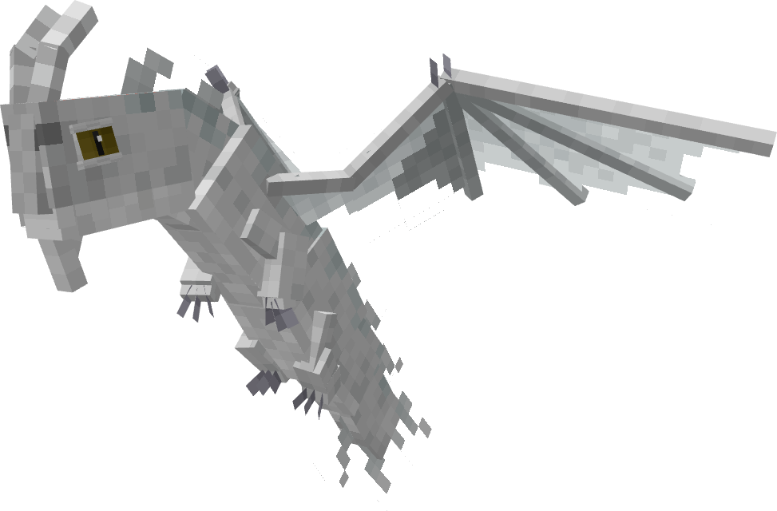

**Obtainment:** Rare spawn

```
/summon isleofberk:terrible_terror ~ ~ ~ {VariantName:night_leucist}
```

*Credits: Stego's Dragons variant*

### Melanistic

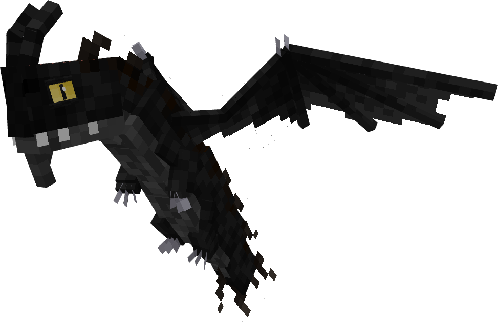

**Obtainment:** Rare spawn

```
/summon isleofberk:terrible_terror ~ ~ ~ {VariantName:night_melan}
```

*Credits: Stego's Dragons variant*

### Midnight Terror

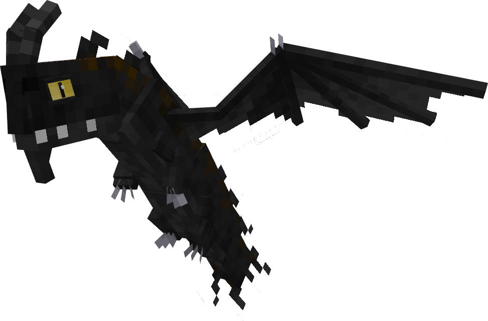

**Obtainment:** Normal spawn

```
/summon isleofberk:terrible_terror ~ ~ ~ {VariantName:midnight_terror}
```

*Credits: Stego's Dragons variant*

### Night Cheese


**Obtainment:** Rare spawn

```
/summon isleofberk:terrible_terror ~ ~ ~ {VariantName:night_cheese}
```

*Credits: Stego's Dragons variant*

### Night Swarm

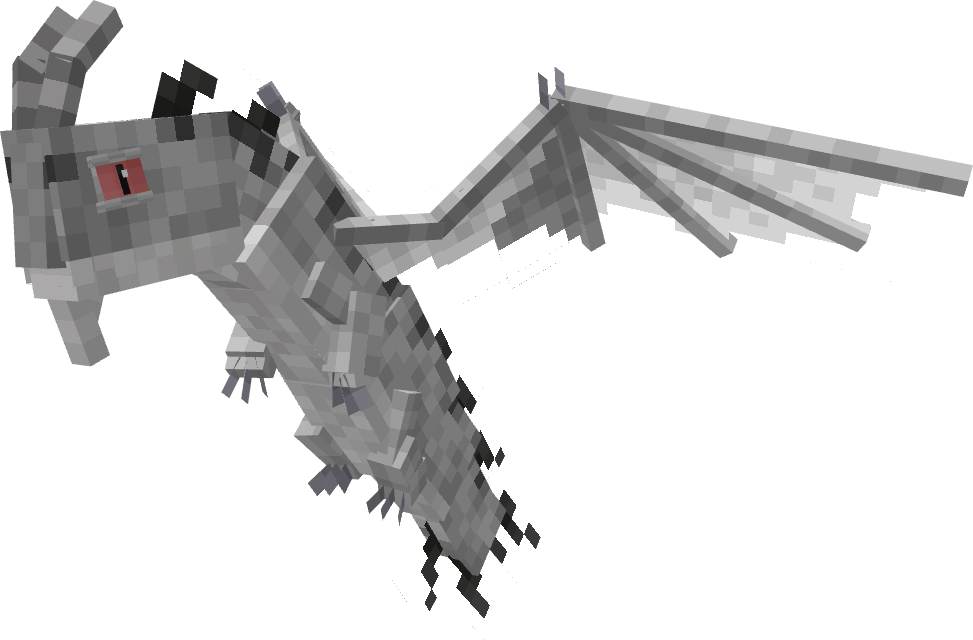

**Obtainment:** Normal spawn

```
/summon isleofberk:terrible_terror ~ ~ ~ {VariantName:night_swarm}
```

*Credits: Stego's Dragons variant*

### Night Terror

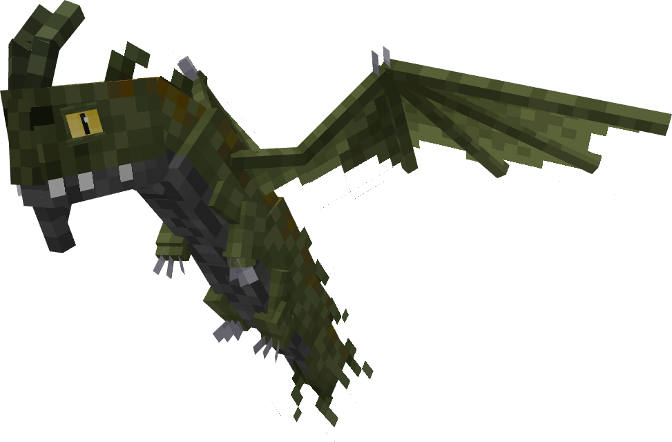

**Obtainment:** Normal spawn

```
/summon isleofberk:terrible_terror ~ ~ ~ {VariantName:night_terror}
```

*Credits: Stego's Dragons variant*

### Nightwatch


**Obtainment:** Normal spawn

```
/summon isleofberk:terrible_terror ~ ~ ~ {VariantName:nightwatch}
```

*Credits: Stego's Dragons variant*

### Silver

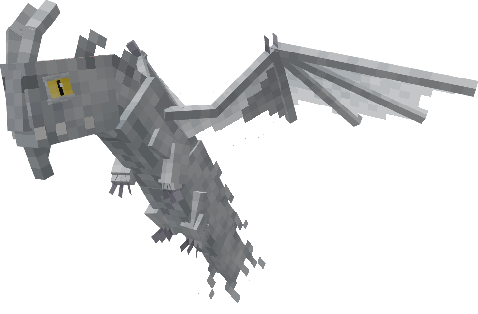

**Obtainment:** Rare spawn

```
/summon isleofberk:terrible_terror ~ ~ ~ {VariantName:silver_terror}
```

*Credits: Stego's Dragons variant*

### Smidvarg

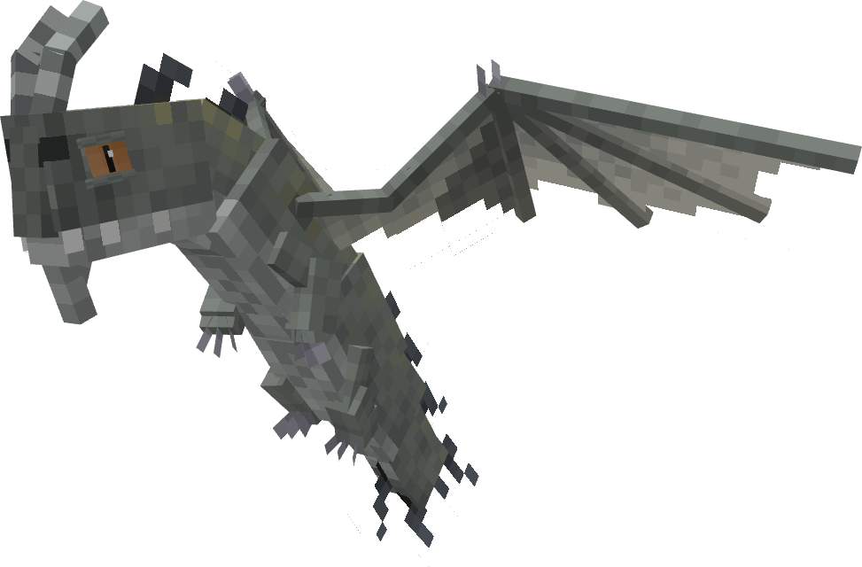

**Obtainment:** Rare spawn

```
/summon isleofberk:terrible_terror ~ ~ ~ {VariantName:smidvarg}
```

*Credits: Stego's Dragons variant*

### Sunrise


**Obtainment:** Rare spawn

```
/summon isleofberk:terrible_terror ~ ~ ~ {VariantName:sunrise_terror}
```

*Credits: Stego's Dragons variant*

### Wasted Love

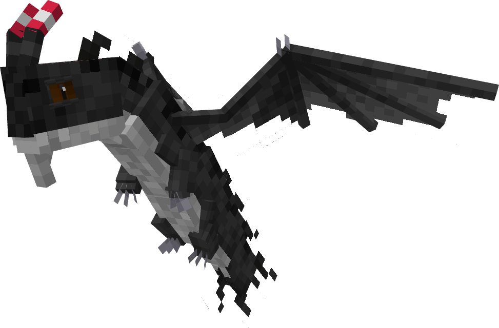

**Obtainment:** Rare spawn

```
/summon isleofberk:terrible_terror ~ ~ ~ {VariantName:wasted_love}
```

*Credits: Stego's Dragons variant*

---

_Content adapted from the [Archipelago Additions Wiki](https://archipelagoadditions.miraheze.org/wiki/Night_Terror) under [CC BY-SA 4.0](https://creativecommons.org/licenses/by-sa/4.0/)._
