# Pygmy Death


The Pygmy Death is an Archipelago Additions original sub-species of the Red Death, Green Death & Purple Death. It is on theMonstrous Nightmarebase.

## Stats

| Stat | Value |
|---|---|
| Health | 300 (150 hearts) |
| Armour | 10 (5 icon) |
| Attack | 14 (7 hearts) |
| Walk Speed | 0.4 (Piglin Brute speed) |
| Fly Speed | 0.14 |

## Taming

**Taming Foods:** Dragon Blood Marinated Feed, Feed Bundle

**Requirements:**

- No tools or weapons (except Dragon Blades & specified Viking Artifacts) held
- No armour worn
- Fire resistance potion effect active

**Alt Taming:** Dragon Nip

## Breeding

**Breeding Foods:** Suspicious Stew, Sagefruit

## Drops

**Brush Drops:** 3-5 Pygmy Death Scales

**Death Drops:** 7-15 Dragon Blood, 7-15 Pygmy Death Scales

## Spawn Biomes

- `Pygmy Death Lair .`

## Variants

### Albino

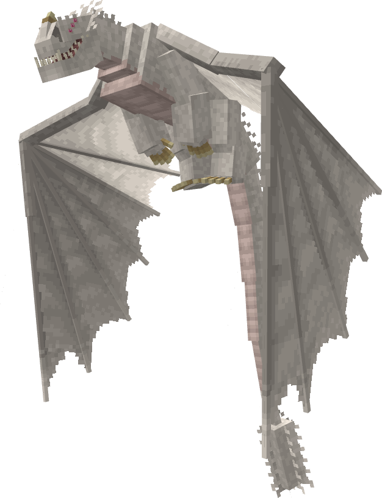

**Obtainment:** Rare spawn

```
/summon isleofberk:monstrous_nightmare ~ ~ ~ {VariantName:albino_death}
```

### Blood Belly

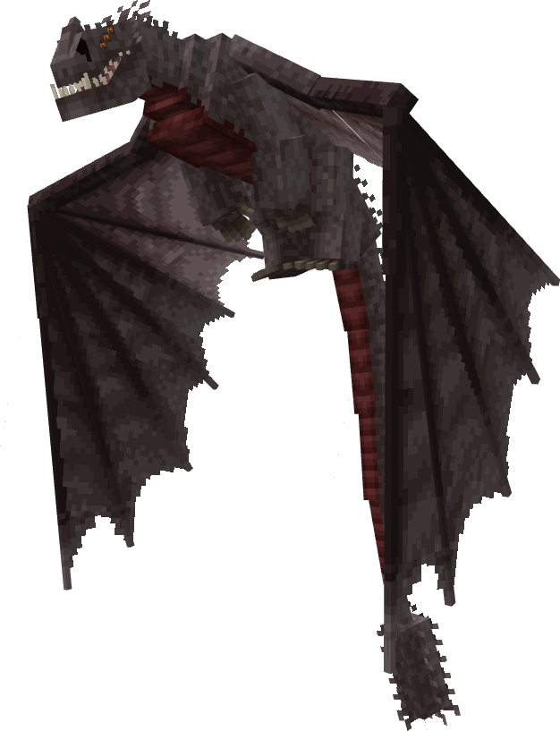

**Obtainment:** Normal spawn

```
/summon isleofberk:monstrous_nightmare ~ ~ ~ {VariantName:blood_belly}
```

### Boogie Bomb

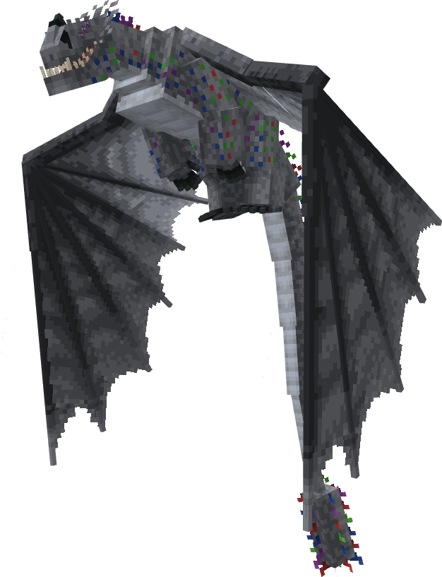

**Obtainment:** Rare spawn

```
/summon isleofberk:monstrous_nightmare ~ ~ ~ {VariantName:boogie_bomb}
```

### Compass

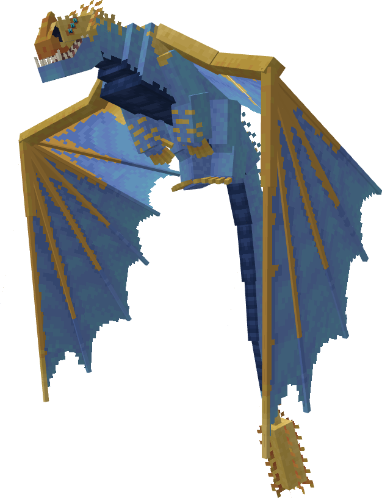

**Obtainment:** Normal spawn

```
/summon isleofberk:monstrous_nightmare ~ ~ ~ {VariantName:compass}
```

### Melanistic

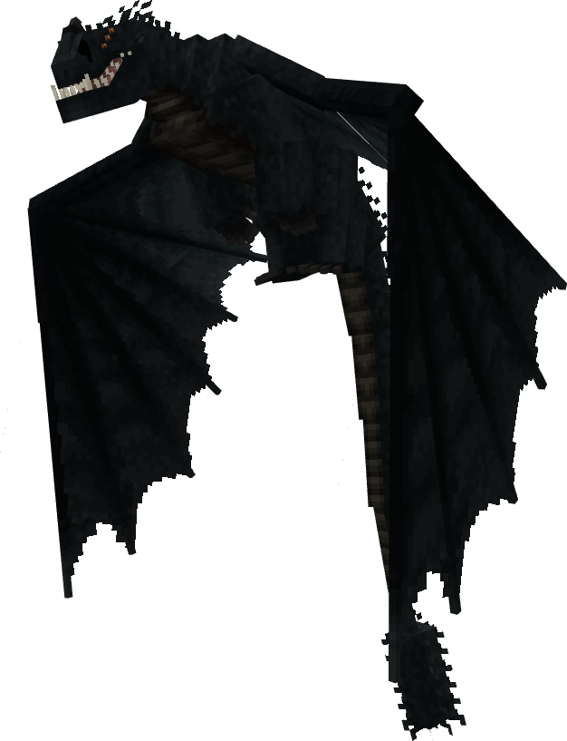

**Obtainment:** Rare spawn

```
/summon isleofberk:monstrous_nightmare ~ ~ ~ {VariantName:melanistic_death}
```

### Mistreated

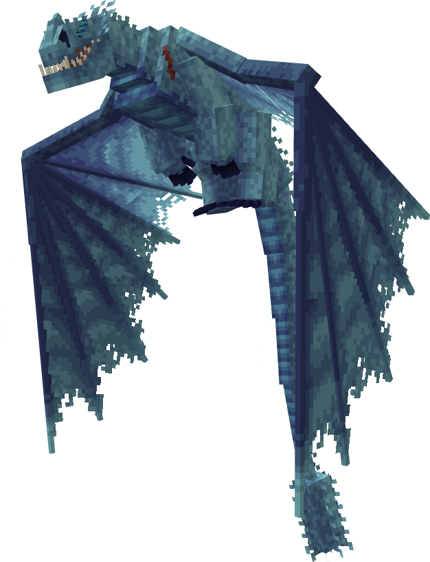

**Obtainment:** Rare spawn

```
/summon isleofberk:monstrous_nightmare ~ ~ ~ {VariantName:pygmy_death_mistreated}
```

### Orca

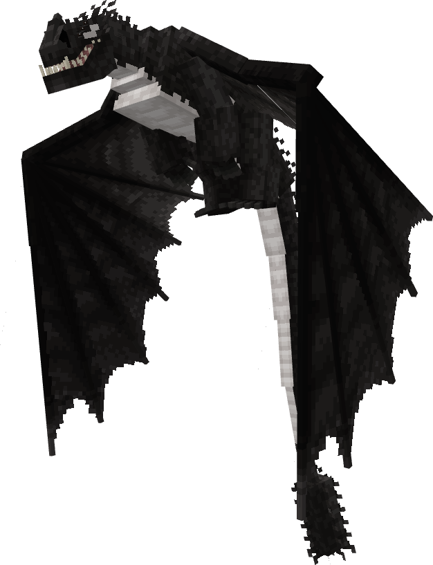

**Obtainment:** Normal spawn

```
/summon isleofberk:monstrous_nightmare ~ ~ ~ {VariantName:orca_death}
```

### Purple Death

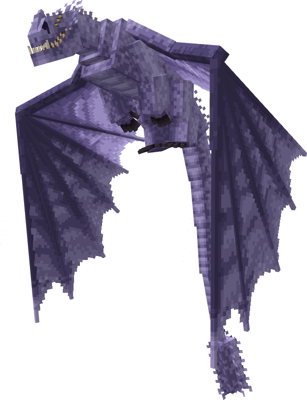

**Obtainment:** Normal spawn

```
/summon isleofberk:monstrous_nightmare ~ ~ ~ {VariantName:purple_death}
```

### Pygmy Death

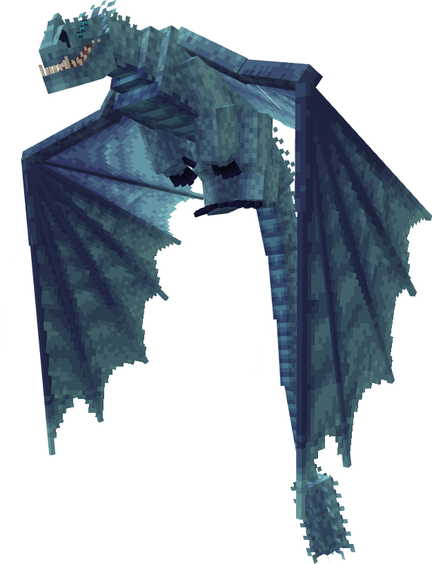

**Obtainment:** Normal spawn

```
/summon isleofberk:monstrous_nightmare ~ ~ ~ {VariantName:pygmy_death}
```

### Red Death

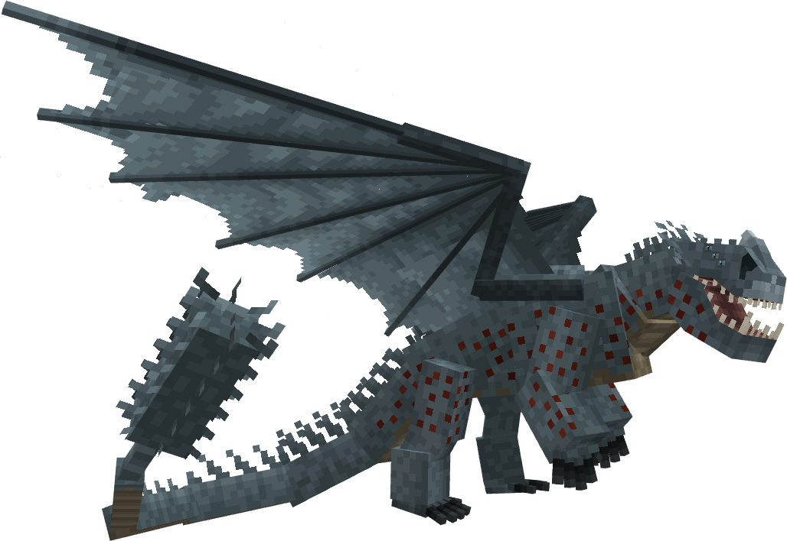

**Obtainment:** Normal spawn

```
/summon isleofberk:monstrous_nightmare ~ ~ ~ {VariantName:red_death}
```

### Stalker

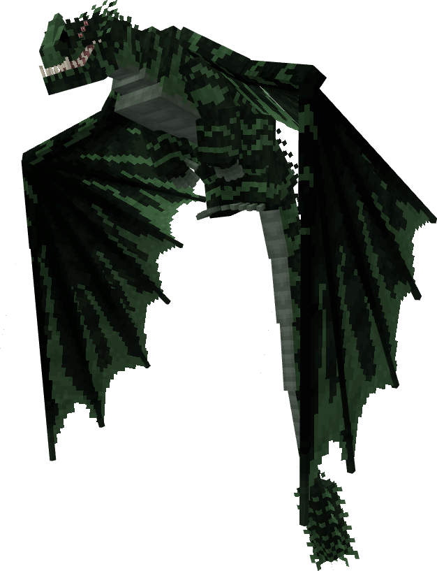

**Obtainment:** Normal spawn

```
/summon isleofberk:monstrous_nightmare ~ ~ ~ {VariantName:stalker}
```

### Violent Death

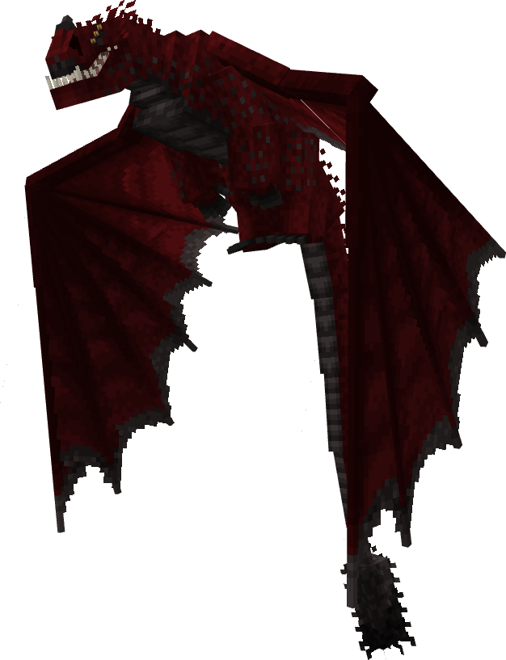

**Obtainment:** Normal spawn

```
/summon isleofberk:monstrous_nightmare ~ ~ ~ {VariantName:violent_death}
```

### Violet Death

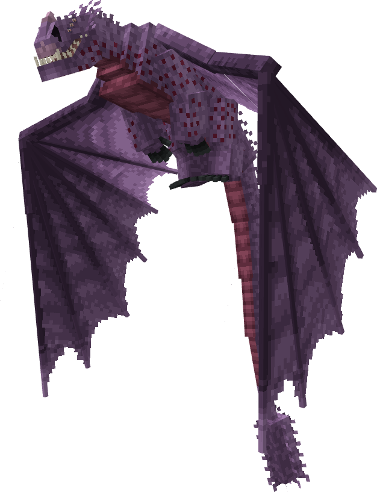

**Obtainment:** Normal spawn

```
/summon isleofberk:monstrous_nightmare ~ ~ ~ {VariantName:violet_death}
```

### Volcan

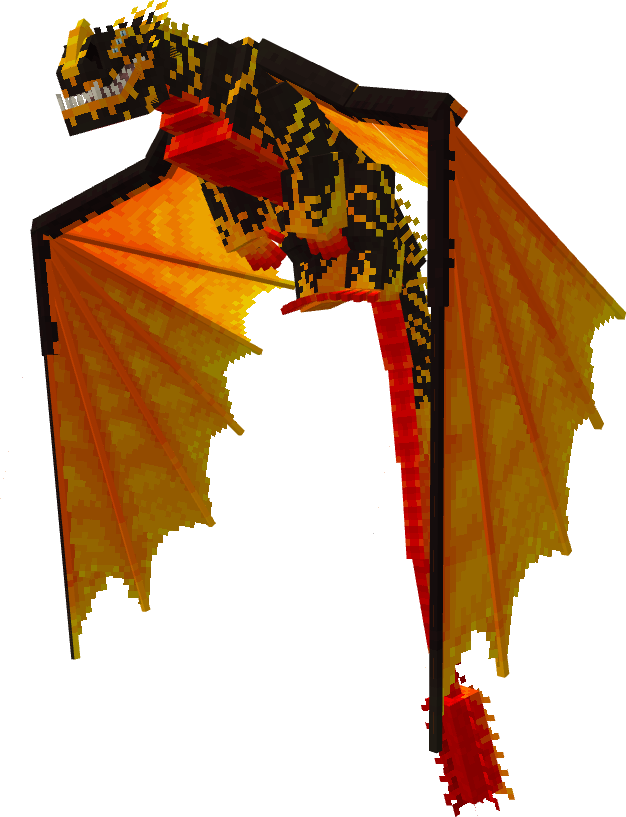

**Obtainment:** Rare spawn

```
/summon isleofberk:monstrous_nightmare ~ ~ ~ {VariantName:volcan}
```

---

_Content adapted from the [Archipelago Additions Wiki](https://archipelagoadditions.miraheze.org/wiki/Pygmy_Death) under [CC BY-SA 4.0](https://creativecommons.org/licenses/by-sa/4.0/)._
