# Razorwhip


The Razorwhip is a series canon dragon, first appearing in Race to the Edge. It is an Archipelago Additions dragon on theDeadly Nadderbase.

## Stats

| Stat | Value |
|---|---|
| Health | 50 (25 hearts) |
| Armour | 8 (4 icons) |
| Attack | 9 (4.5 hearts) |
| Walk Speed | 0.4 (Piglin Brute speed) |
| Fly Speed | 0.17 (70% faster than Allay speed) |

## Taming

**Taming Foods:** Sea Slugs

**Requirements:** No tools or weapons (except Dragon Blades & specified Viking Artifacts) held

**Alt Taming:** Dragon Nip

## Breeding

**Breeding Foods:** Suspicious Stew, Sagefruit

## Drops

**Brush Drops:** 1-3 Razorwhip Scales, 0-1 Razorwhip Spine

**Death Drops:** 1-2 Dragon Blood, 3-5 Razorwhip Scales, 1-2 Razorwhip Spine

## Spawn Biomes

- `minecraft:old_growth_pine_taiga`
- `minecraft:old_growth_spruce_taiga`
- `minecraft:snowy_taiga`

## Variants

### Albino

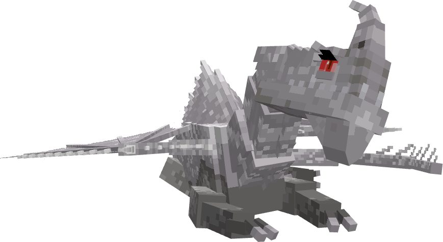

**Obtainment:** Rare spawn

```
/summon isleofberk:deadly_nadder ~ ~ ~ {VariantName:albino_razorwhip}
```

### Copperwhip

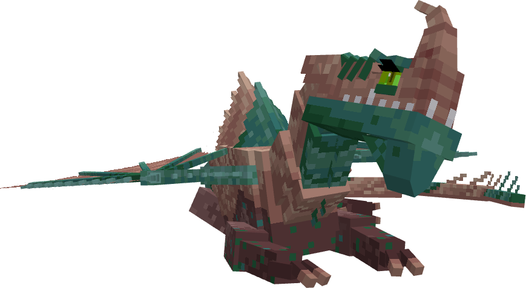

**Obtainment:** Rare spawn

```
/summon isleofberk:deadly_nadder ~ ~ ~ {VariantName:copperwhip}
```

### Crimson Slash

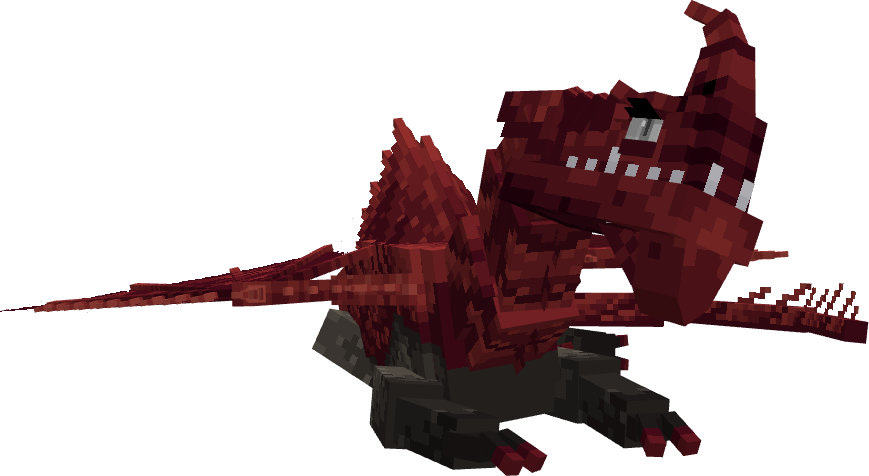

**Obtainment:** Normal spawn

```
/summon isleofberk:deadly_nadder ~ ~ ~ {VariantName:crimson_slash}
```

### Crisp Grasper

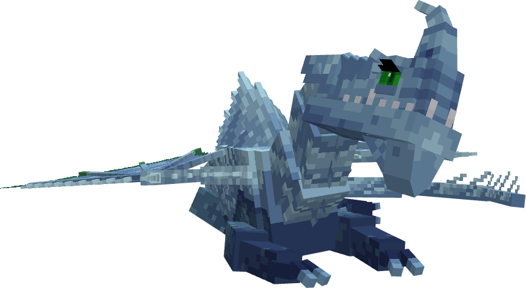

**Obtainment:** Normal spawn

```
/summon isleofberk:deadly_nadder ~ ~ ~ {VariantName:crisp_grasper}
```

### Diamondwhip

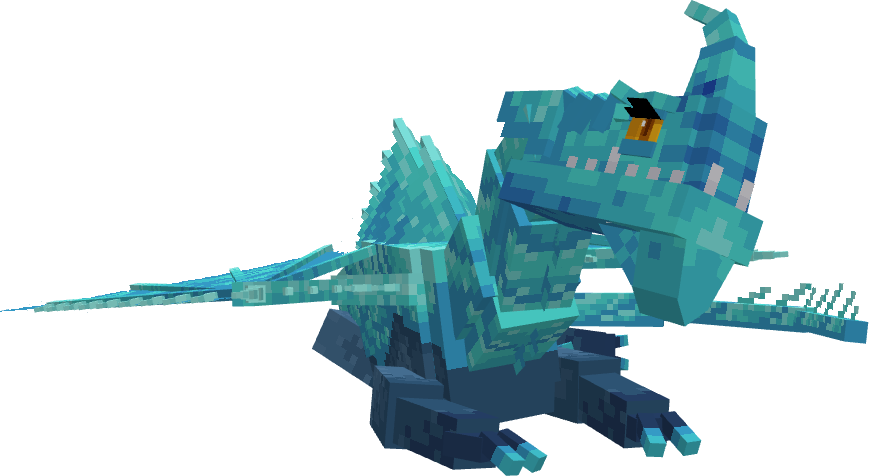

**Obtainment:** Rare spawn

```
/summon isleofberk:deadly_nadder ~ ~ ~ {VariantName:diamondwhip}
```

### Exotic

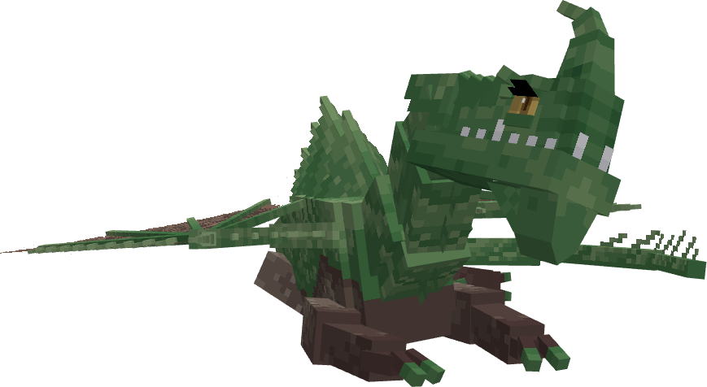

**Obtainment:** Rare spawn

```
/summon isleofberk:deadly_nadder ~ ~ ~ {VariantName:exotic_razorwhip}
```

### Goldenwhip

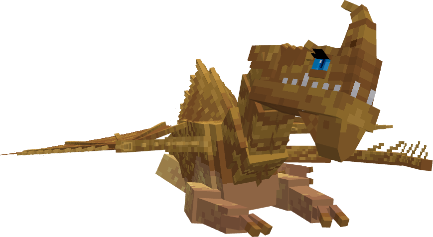

**Obtainment:** Normal spawn

```
/summon isleofberk:deadly_nadder ~ ~ ~ {VariantName:goldenwhip}
```

### Hailfate

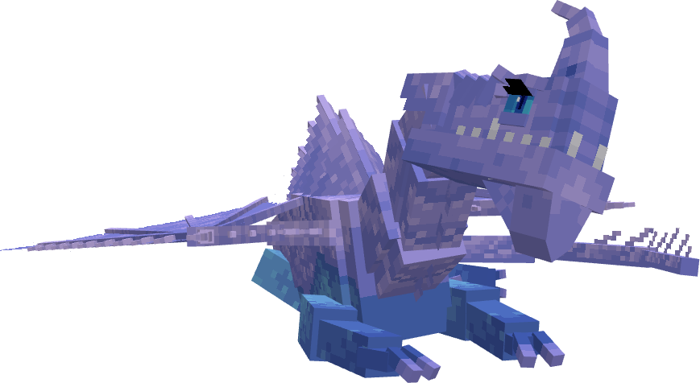

**Obtainment:** Normal spawn

```
/summon isleofberk:deadly_nadder ~ ~ ~ {VariantName:hailfate}
```

### Jade Blade

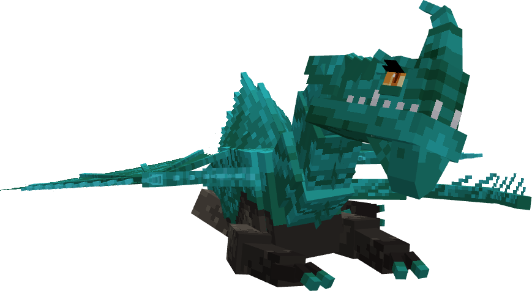

**Obtainment:** Normal spawn

```
/summon isleofberk:deadly_nadder ~ ~ ~ {VariantName:jade_blade}
```

### Lavawhip

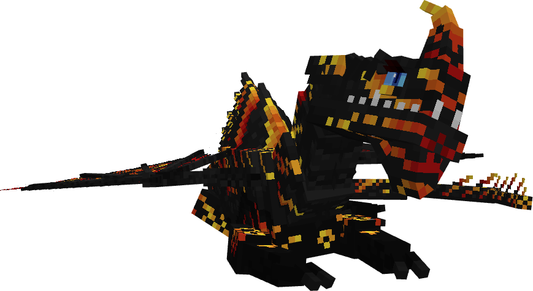

**Obtainment:** Rare spawn

```
/summon isleofberk:deadly_nadder ~ ~ ~ {VariantName:lavawhip}
```

### Melanistic

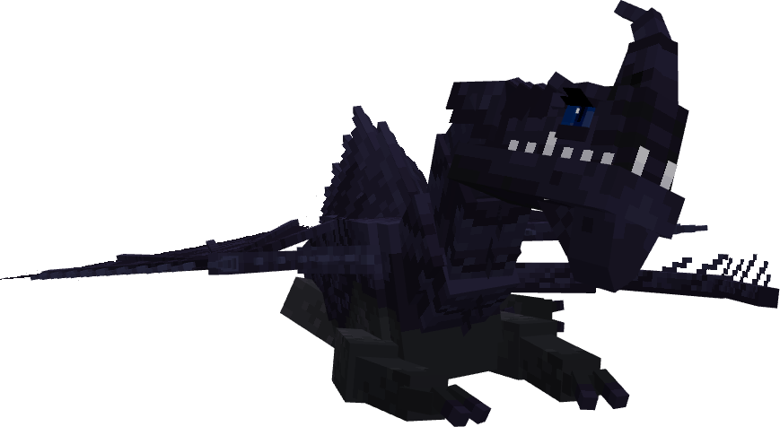

**Obtainment:** Rare spawn

```
/summon isleofberk:deadly_nadder ~ ~ ~ {VariantName:melanistic_razorwhip}
```

### Netherwhip

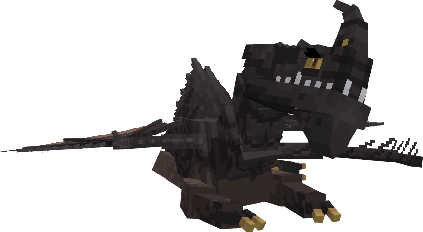

**Obtainment:** Rare spawn

```
/summon isleofberk:deadly_nadder ~ ~ ~ {VariantName:netherwhip}
```

*Credits: This variant was designed by AmiEpyk.*

### Plated Razorwhip

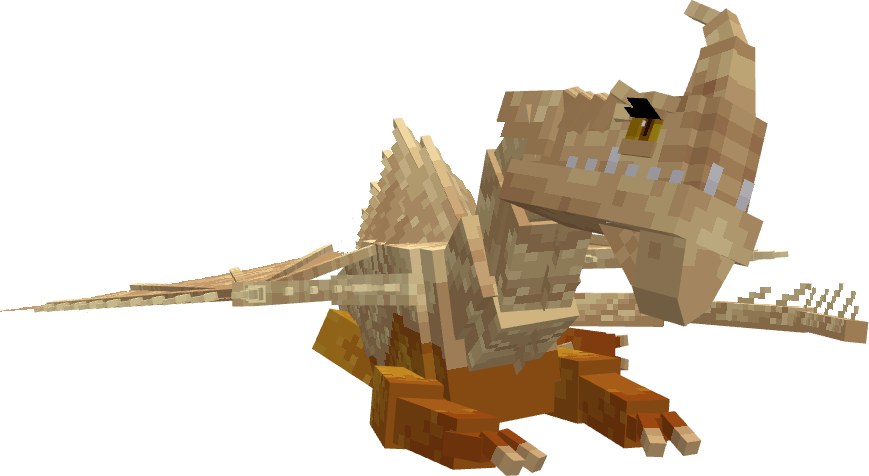

**Obtainment:** Normal spawn

```
/summon isleofberk:deadly_nadder ~ ~ ~ {VariantName:plated_razorwhip}
```

### Razorwhip

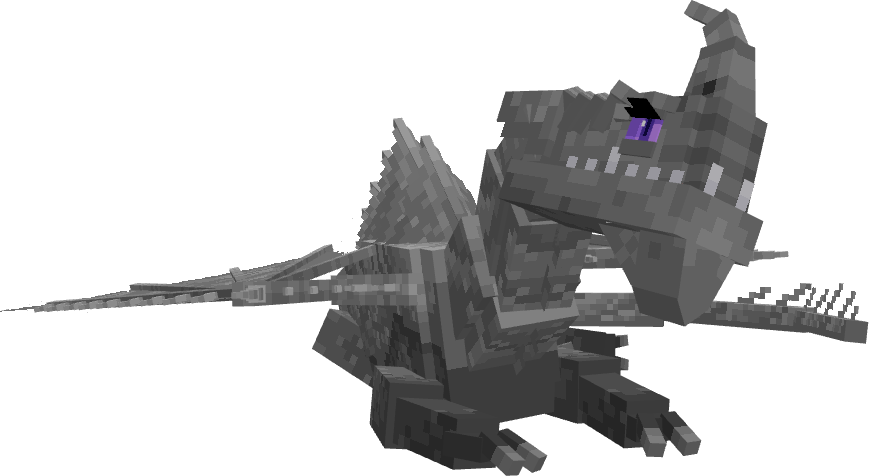

**Obtainment:** Normal spawn

```
/summon isleofberk:deadly_nadder ~ ~ ~ {VariantName:razorwhip}
```

### Sawtooth

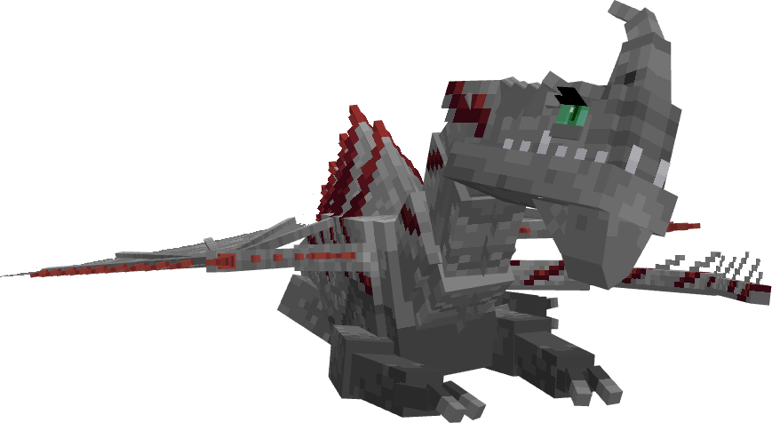

**Obtainment:** Rare spawn

```
/summon isleofberk:deadly_nadder ~ ~ ~ {VariantName:sawtooth}
```

### Seethsizzle

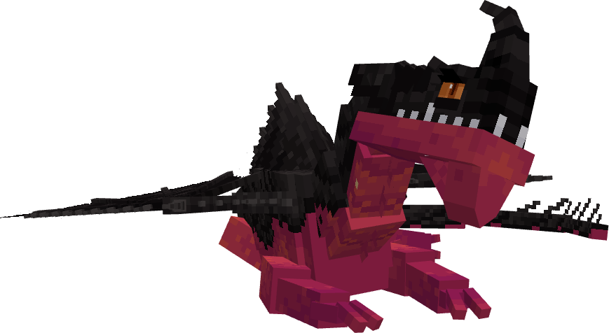

**Obtainment:** Normal spawn

```
/summon isleofberk:deadly_nadder ~ ~ ~ {VariantName:seethsizzle}
```

### Slashdasher

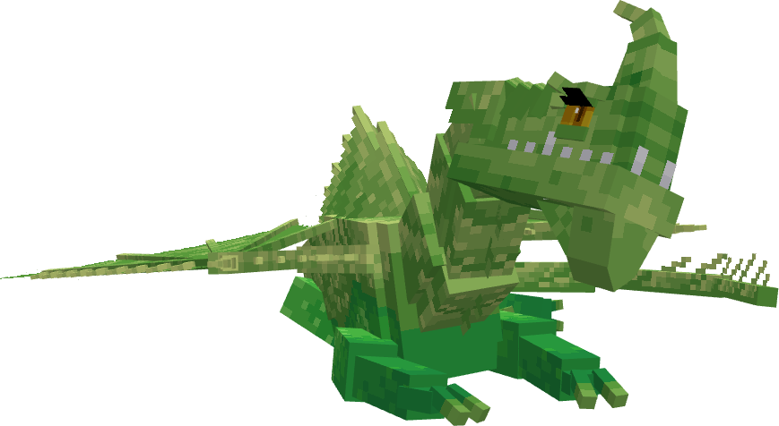

**Obtainment:** Normal spawn

```
/summon isleofberk:deadly_nadder ~ ~ ~ {VariantName:slashdasher}
```

### Thorstopian

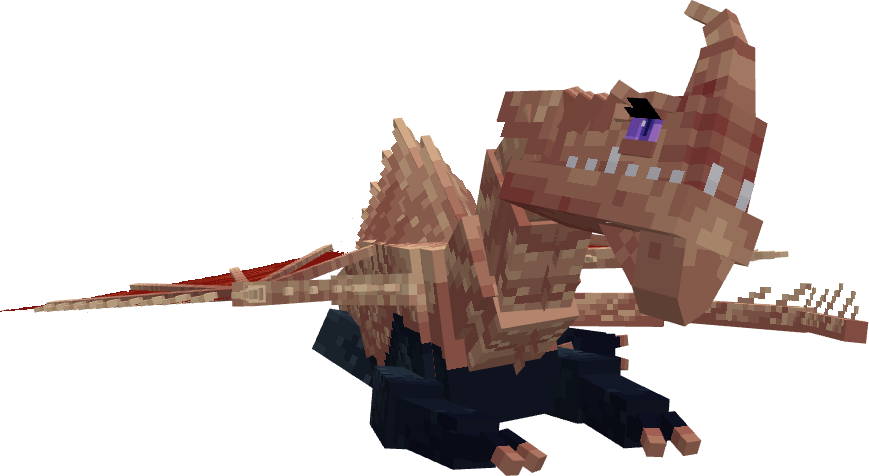

**Obtainment:** Normal spawn

```
/summon isleofberk:deadly_nadder ~ ~ ~ {VariantName:thorstopian}
```

### Titanwhip

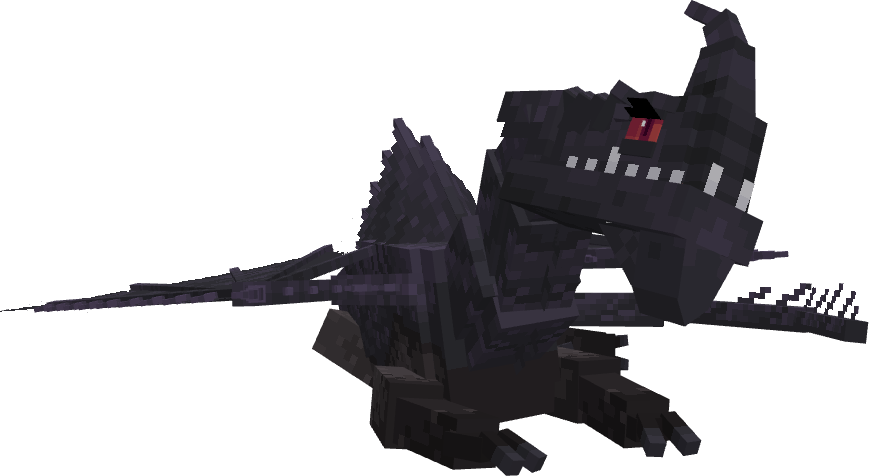

**Obtainment:** Normal spawn

```
/summon isleofberk:deadly_nadder ~ ~ ~ {VariantName:titanwhip}
```

### Windshear

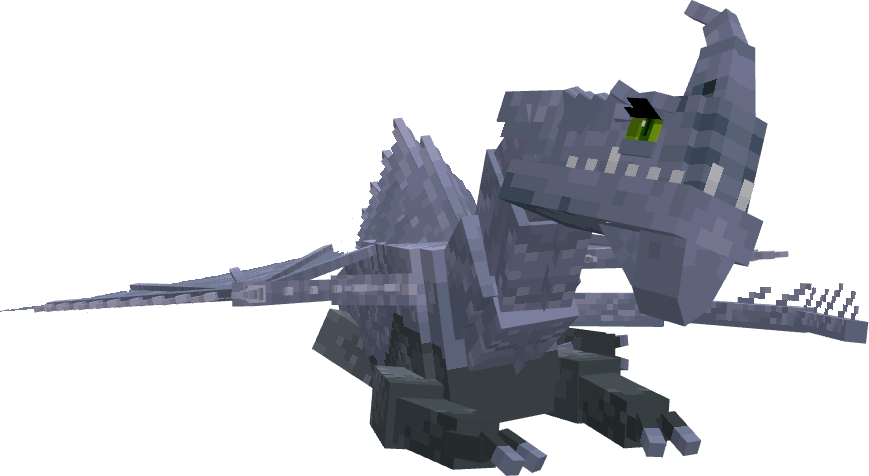

**Obtainment:** Normal spawn

```
/summon isleofberk:deadly_nadder ~ ~ ~ {VariantName:windshear}
```

### Wingnutt

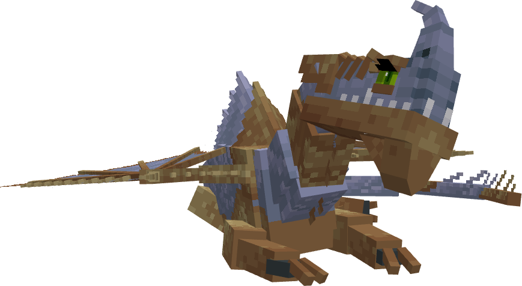

**Obtainment:** Rare spawn

```
/summon isleofberk:deadly_nadder ~ ~ ~ {VariantName:wingnutt}
```

---

_Content adapted from the [Archipelago Additions Wiki](https://archipelagoadditions.miraheze.org/wiki/Razorwhip) under [CC BY-SA 4.0](https://creativecommons.org/licenses/by-sa/4.0/)._
