# Rumblehorn


The Rumblehorn is a main canon dragon, first appearing in HTTYD 2. It is an Archipelago Additions dragon on theGroncklebase.

## Stats

| Stat | Value |
|---|---|
| Health | 100 (50 hearts) |
| Armour | 10 (5 icons) |
| Attack | 6 (3 hearts) |
| Walk Speed | 0.5 (sprinting villager speed) |
| Fly Speed | 0.12 (slightly faster than Allay speed) |

## Taming

**Taming Foods:** Raw Cod, Raw Salmon

**Requirements:** No tools or weapons (except Dragon Blades & specified Viking Artifacts) held

**Alt Taming:** Dragon Nip

## Breeding

**Breeding Foods:** Suspicious Stew, Sagefruit

## Drops

**Brush Drops:** 1-3 Rumblehorn Scales

**Death Drops:** 1-2 Dragon Blood, 3-5 Rumblehorn Scales

## Spawn Biomes

- `minecraft:beach`
- `minecraft:snowy_beach`
- `minecraft:windswept_forest`

## Variants

### Albino

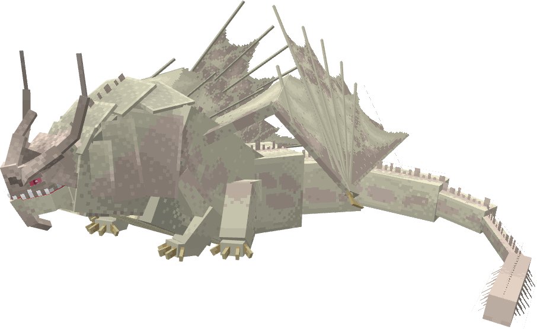

**Obtainment:** Rare spawn

```
/summon isleofberk:gronckle ~ ~ ~ {VariantName:albino_rumble}
```

### Bismuth

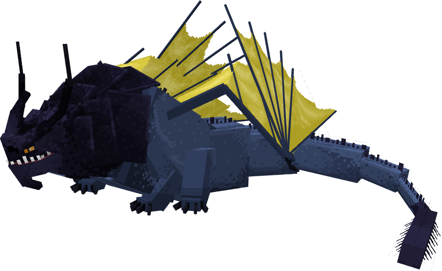

**Obtainment:** Normal spawn

```
/summon isleofberk:gronckle ~ ~ ~ {VariantName:bismuth}
```

*Credits: This variant was designed by AmiEpyk.*

### Bloodbath

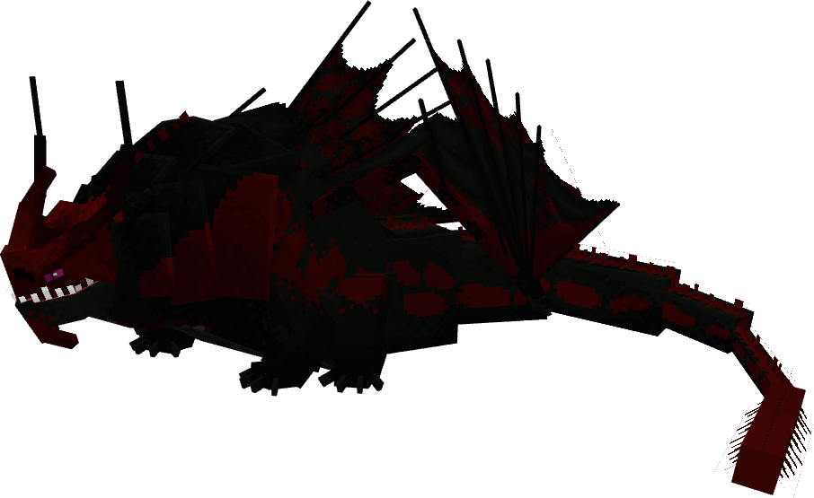

**Obtainment:** Normal spawn

```
/summon isleofberk:gronckle ~ ~ ~ {VariantName:blood_bath}
```

### Bumble Rumble

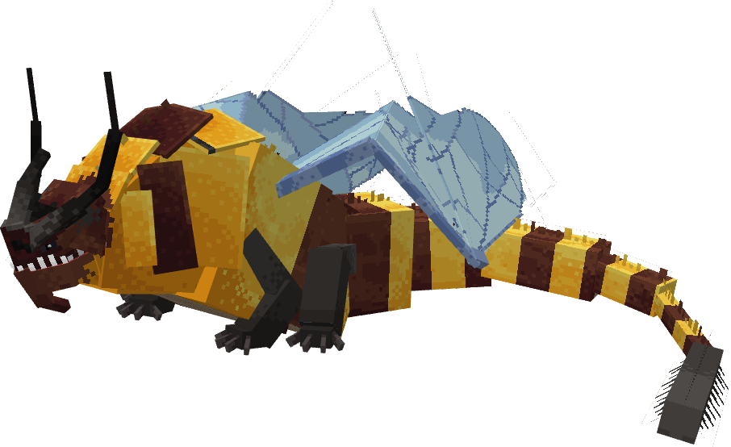

**Obtainment:** Command only

```
/summon isleofberk:gronckle ~ ~ ~ {VariantName:bumble_rumble}
```

### Emerald

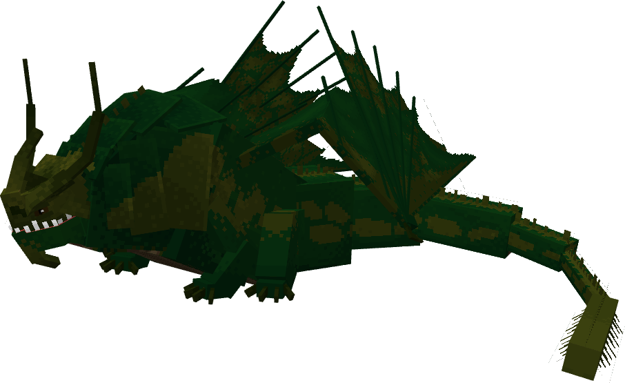

**Obtainment:** Normal spawn

```
/summon isleofberk:gronckle ~ ~ ~ {VariantName:emerald}
```

### Junebug

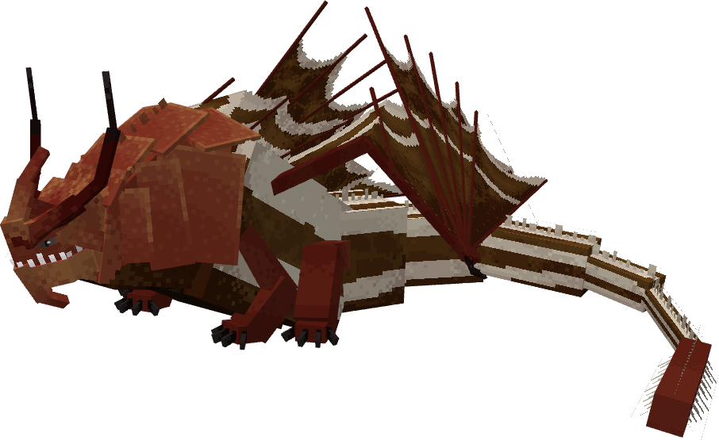

**Obtainment:** Normal spawn

```
/summon isleofberk:gronckle ~ ~ ~ {VariantName:junebug}
```

### Melanistic

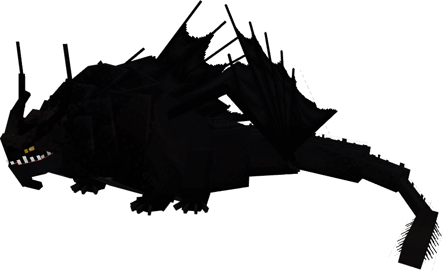

**Obtainment:** Rare spawn

```
/summon isleofberk:gronckle ~ ~ ~ {VariantName:melanistic_rumble}
```

### Painted

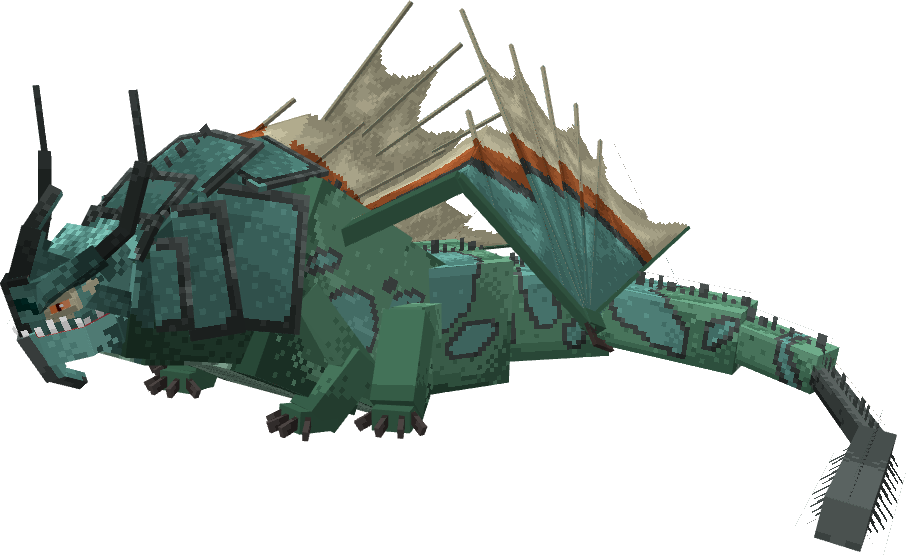

**Obtainment:** Rare spawn

```
/summon isleofberk:gronckle ~ ~ ~ {VariantName:painted}
```

*Credits: This variant was designed by AmiEpyk.*

### Purplehorn

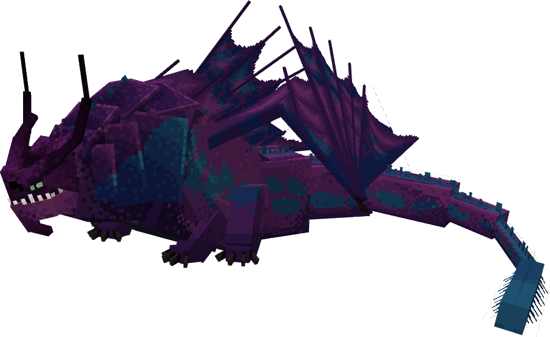

**Obtainment:** Normal spawn

```
/summon isleofberk:gronckle ~ ~ ~ {VariantName:purplehorn}
```

### Rhino

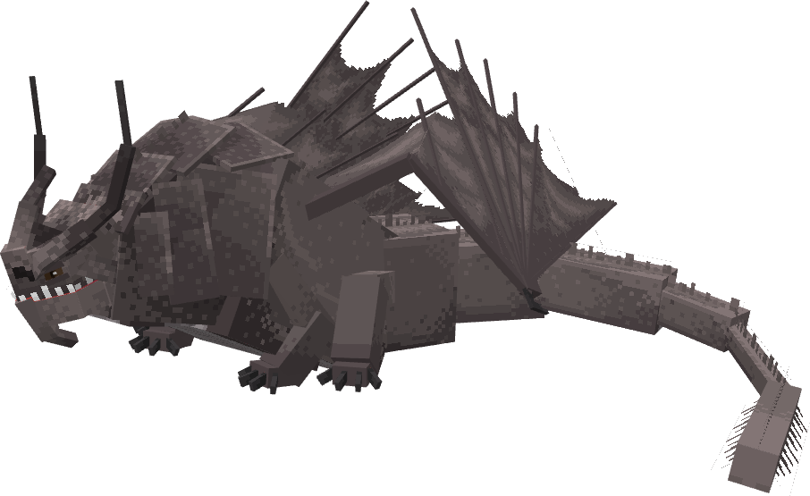

**Obtainment:** Normal spawn

```
/summon isleofberk:gronckle ~ ~ ~ {VariantName:rhino}
```

### Skullcrusher

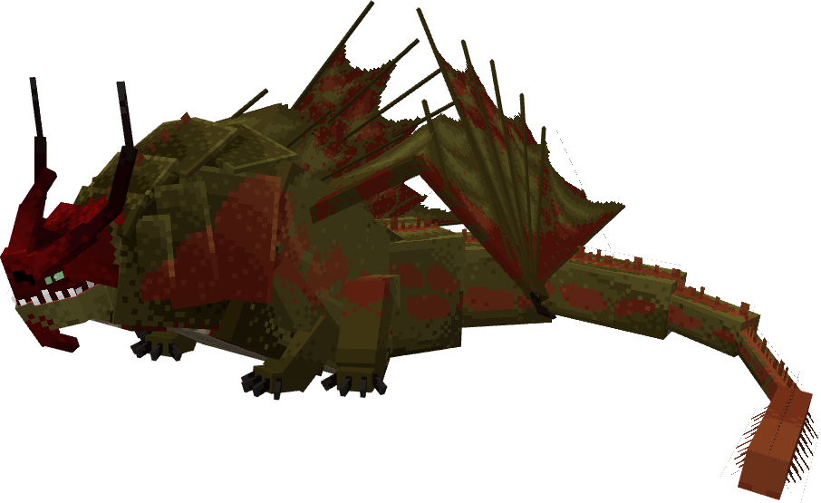

**Obtainment:** Normal spawn

```
/summon isleofberk:gronckle ~ ~ ~ {VariantName:skullcrusher}
```

### Snowcap

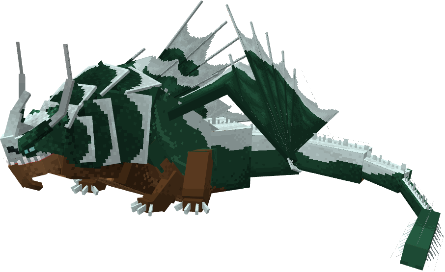

**Obtainment:** Rare spawn

```
/summon isleofberk:gronckle ~ ~ ~ {VariantName:snowcap}
```

### Thor

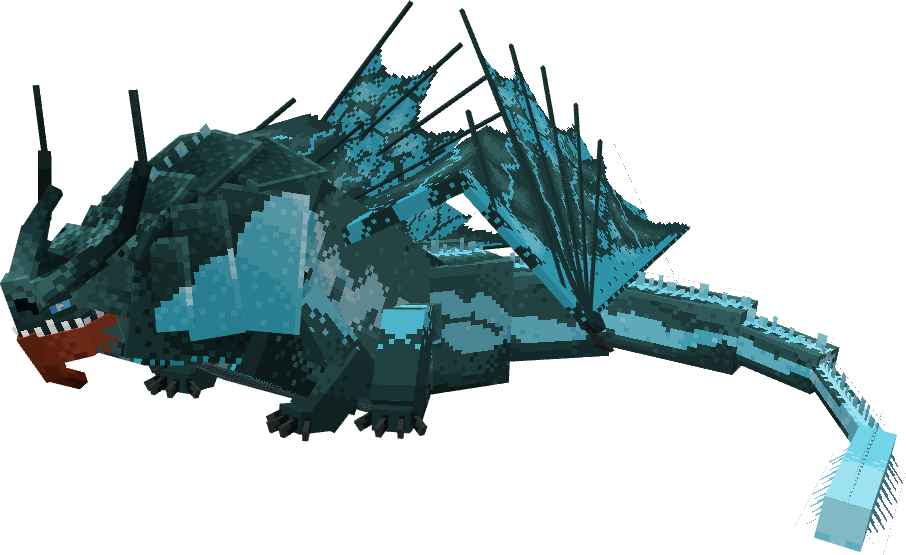

**Obtainment:** Rare spawn

```
/summon isleofberk:gronckle ~ ~ ~ {VariantName:thor}
```

---

_Content adapted from the [Archipelago Additions Wiki](https://archipelagoadditions.miraheze.org/wiki/Rumblehorn) under [CC BY-SA 4.0](https://creativecommons.org/licenses/by-sa/4.0/)._
