# Silver Phantom

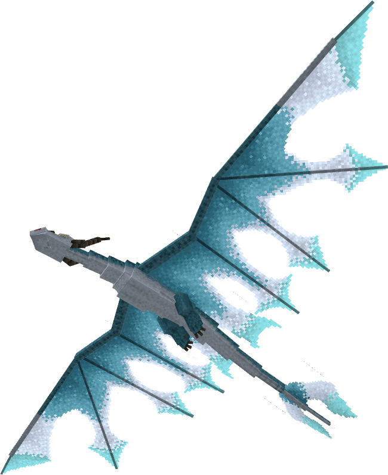

The Silver Phantom is a game canon dragon, first appearing in School of Dragons. It is an Archipelago Additions dragon on theNight Furybase.

## Stats

| Stat | Value |
|---|---|
| Health | 100 (50 hearts) |
| Armour | 0 |
| Attack | 5 (2.5 hearts) |
| Walk Speed | 0.4 (Piglin Brute speed) |
| Fly Speed | 0.17 |

## Taming

**Taming Foods:** Raw Cod, Raw Salmon

**Requirements:**

- No tools or weapons (except Dragon Blades & specified Viking Artifacts) held
- No armour worn
- Night vision potion effect active

**Alt Taming:** Dragon Nip

## Breeding

**Breeding Foods:** Honeycomb, Sagefruit

## Drops

**Brush Drops:** 2-3 Silver Phantom Scales

**Death Drops:** 1-3 Dragon Blood, 5-7 Silver Phantom Scales

## Spawn Biomes

- `minecraft:frozen_peaks`
- `minecraft:jagged_peaks`
- `minecraft:snowy_slopes`

## Variants

### Albino

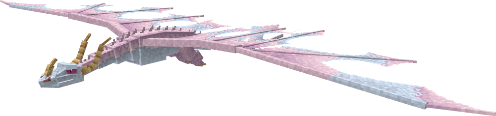

**Obtainment:** Rare spawn

```
/summon isleofberk:night_fury ~ ~ ~ {VariantName:albino_phantom}
```

### Apoapsis

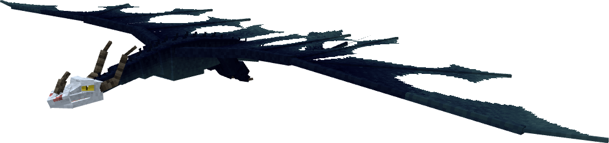

**Obtainment:** Normal spawn

```
/summon isleofberk:night_fury ~ ~ ~ {VariantName:apoapsis}
```

### Blackout

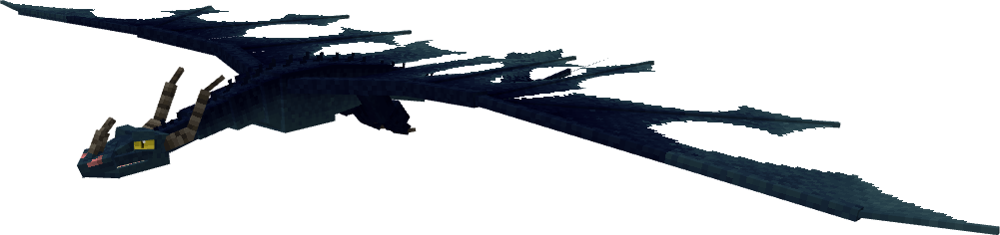

**Obtainment:** Normal spawn

```
/summon isleofberk:night_fury ~ ~ ~ {VariantName:blackout}
```

### Blood Phantom

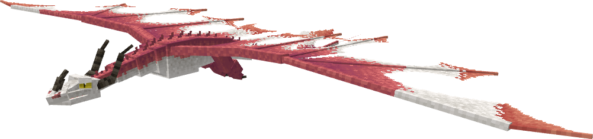

**Obtainment:** Normal spawn

```
/summon isleofberk:night_fury ~ ~ ~ {VariantName:blood_phantom}
```

### Forest Phantom

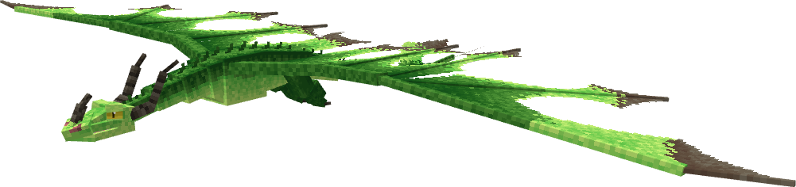

**Obtainment:** Normal spawn

```
/summon isleofberk:night_fury ~ ~ ~ {VariantName:forest_phantom}
```

### Galestorm

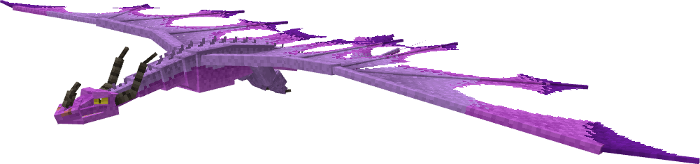

**Obtainment:** Normal spawn

```
/summon isleofberk:night_fury ~ ~ ~ {VariantName:galestorm}
```

### Green Dragon

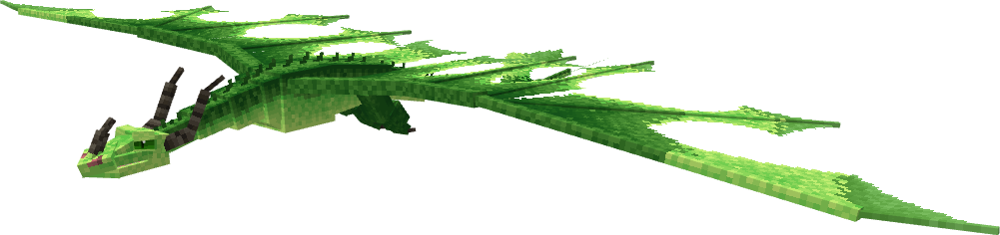

**Obtainment:** Normal spawn

```
/summon isleofberk:night_fury ~ ~ ~ {VariantName:green_dragon}
```

### Howl

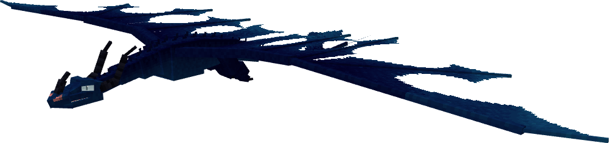

**Obtainment:** Normal spawn

```
/summon isleofberk:night_fury ~ ~ ~ {VariantName:howl}
```

### Howl (B)

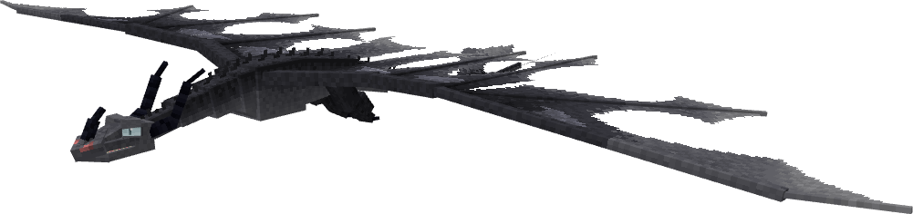

**Obtainment:** Normal spawn

```
/summon isleofberk:night_fury ~ ~ ~ {VariantName:howl_b}
```

### Legiana

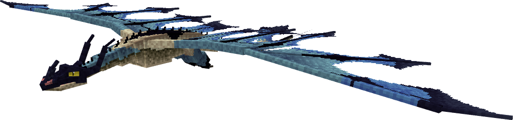

**Obtainment:** Rare spawn

```
/summon isleofberk:night_fury ~ ~ ~ {VariantName:legiana}
```

### Melanistic

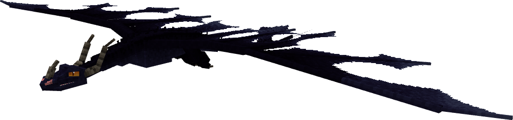

**Obtainment:** Rare spawn

```
/summon isleofberk:night_fury ~ ~ ~ {VariantName:melanistic_phantom}
```

### Night Phantom

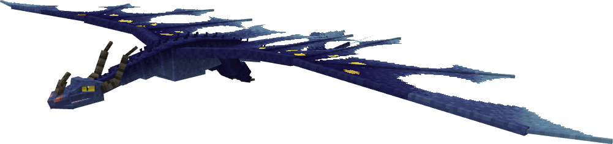

**Obtainment:** Rare spawn

```
/summon isleofberk:night_fury ~ ~ ~ {VariantName:night_phantom}
```

*Credits: Designed to be reminiscent of a work of van Gogh's*

### Pearlescent Poltergeist

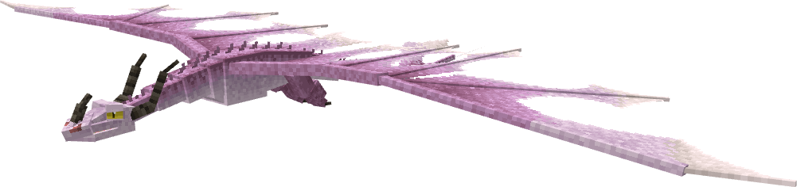

**Obtainment:** Normal spawn

```
/summon isleofberk:night_fury ~ ~ ~ {VariantName:pearlescent_poltergeist}
```

### Periapsis

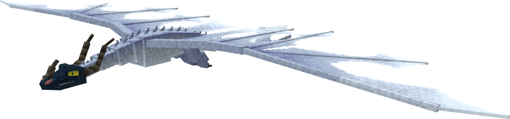

**Obtainment:** Normal spawn

```
/summon isleofberk:night_fury ~ ~ ~ {VariantName:periapsis}
```

### Phantom

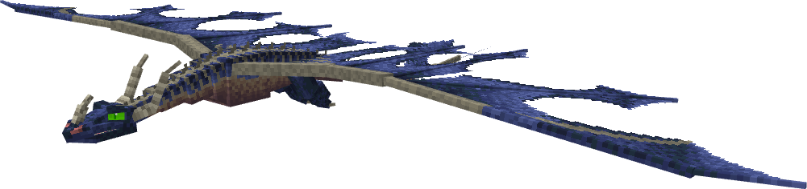

**Obtainment:** Rare spawn

```
/summon isleofberk:night_fury ~ ~ ~ {VariantName:phantom}
```

### Platinum Phantom

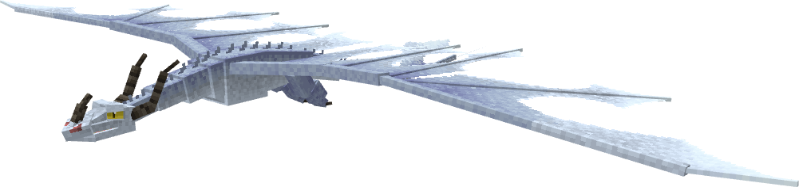

**Obtainment:** Normal spawn

```
/summon isleofberk:night_fury ~ ~ ~ {VariantName:platinum_phantom}
```

### Silver Phantom


**Obtainment:** Normal spawn

```
/summon isleofberk:night_fury ~ ~ ~ {VariantName:rob_phantom}
```

### Starshard

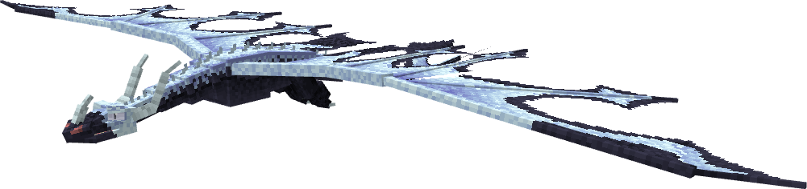

**Obtainment:** Rare spawn

```
/summon isleofberk:night_fury ~ ~ ~ {VariantName:starshard}
```

### Wave Phantom

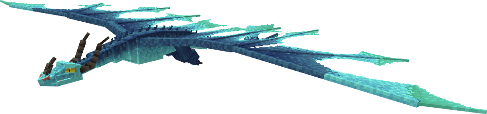

**Obtainment:** Normal spawn

```
/summon isleofberk:night_fury ~ ~ ~ {VariantName:wave_phantom}
```

---

_Content adapted from the [Archipelago Additions Wiki](https://archipelagoadditions.miraheze.org/wiki/Silver_Phantom) under [CC BY-SA 4.0](https://creativecommons.org/licenses/by-sa/4.0/)._
