# Singetail

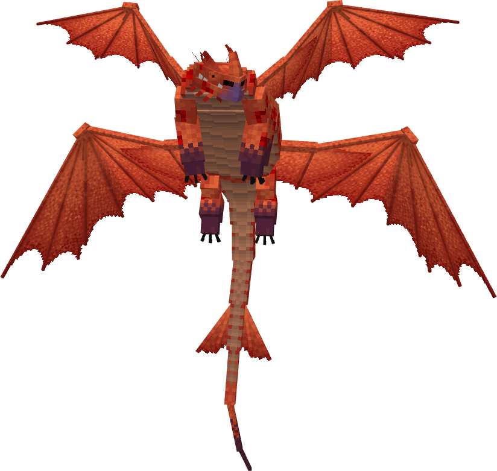

The Singetail is a series canon dragon, first appearing in Race to the Edge. It is an Archipelago Additions dragon on theMonstrous Nightmarebase.

## Stats

| Stat | Value |
|---|---|
| Health | 140 (70 hearts) |
| Armour | 2 (1 icon) |
| Attack | 7 (3.5 hearts) |
| Walk Speed | 0.4 (Piglin Brute speed) |
| Fly Speed | 0.15 (50% faster than Allay speed) |

## Taming

**Taming Foods:** Icetail Pike

**Requirements:**

- No tools or weapons (except Dragon Blades & specified Viking Artifacts) held
- No armour worn
- Fire resistance potion effect active

**Alt Taming:** Dragon Nip

## Breeding

**Breeding Foods:** Suspicious Stew, Sagefruit

## Drops

**Brush Drops:** 2-3 Singetail Scales

**Death Drops:** 1-3 Dragon Blood, 4-7 Singetail Scales

## Spawn Biomes

- `minecraft:desert`
- `minecraft:eroded_badlands`
- `minecraft:savanna`

## Variants

### Albino

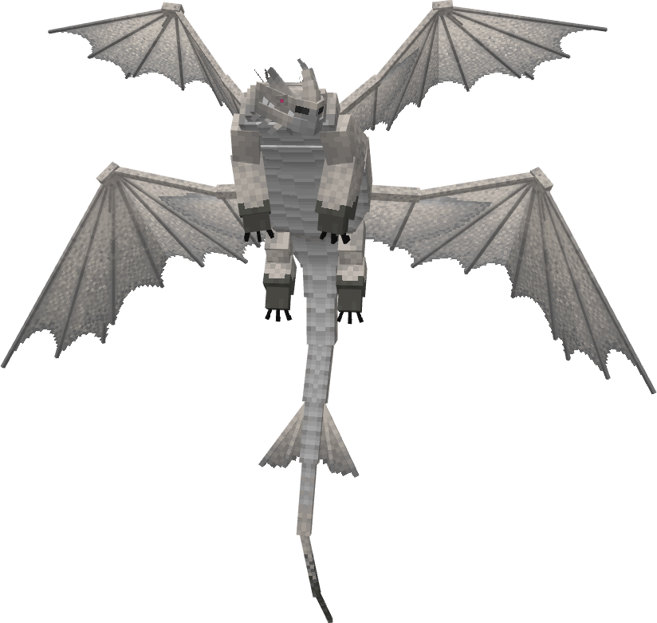

**Obtainment:** Rare spawn

```
/summon isleofberk:monstrous_nightmare ~ ~ ~ {VariantName:albino_singetail}
```

### Aske

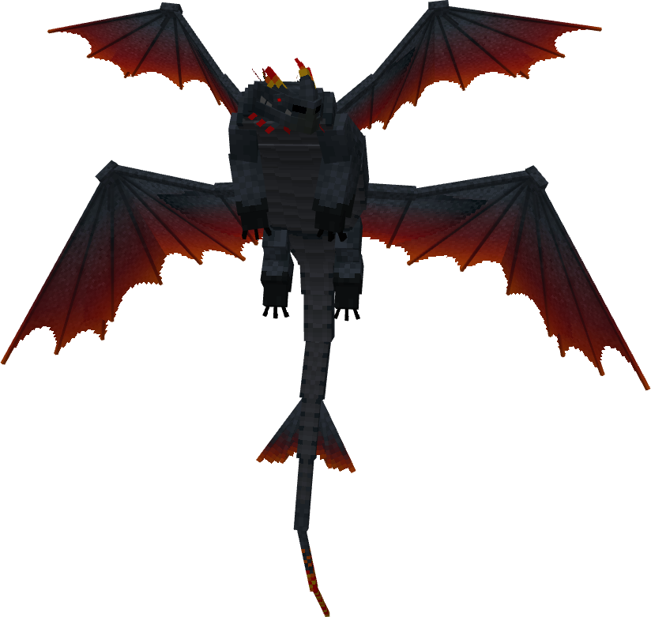

**Obtainment:** Rare spawn

```
/summon isleofberk:monstrous_nightmare ~ ~ ~ {VariantName:aske}
```

### Dragonfruit

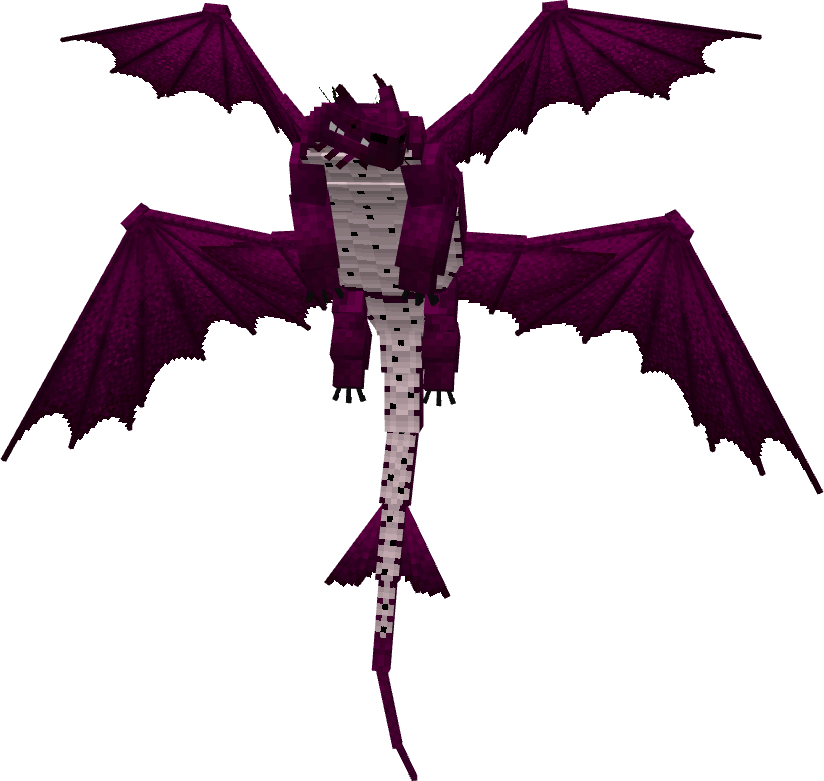

**Obtainment:** Rare spawn

```
/summon isleofberk:monstrous_nightmare ~ ~ ~ {VariantName:dragonfruit}
```

*Credits: This variant was designed by LIA*

### Finis

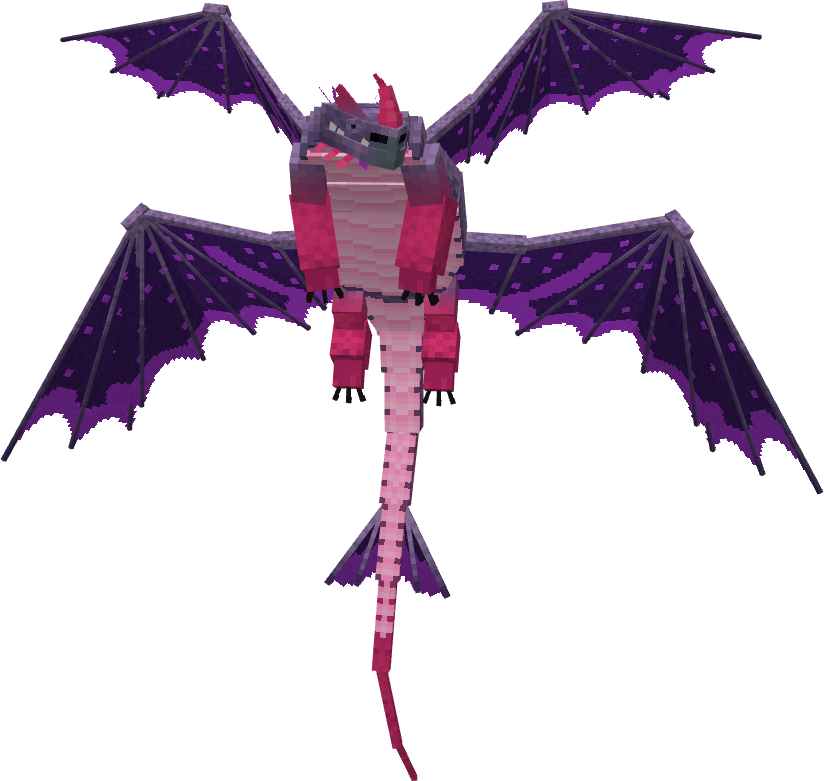

**Obtainment:** Rare spawn

```
/summon isleofberk:monstrous_nightmare ~ ~ ~ {VariantName:finis}
```

### Green

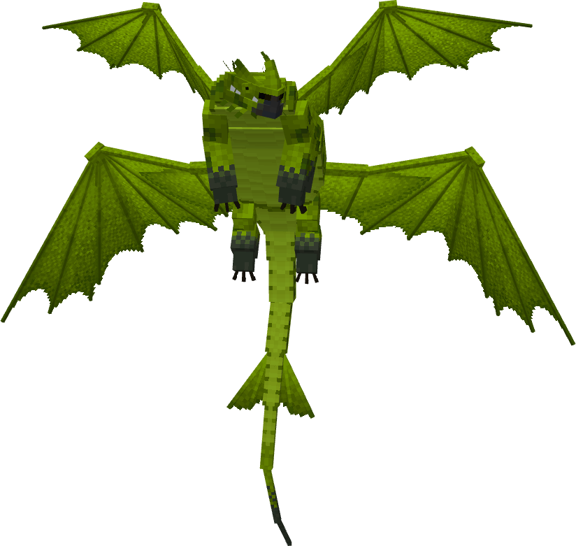

**Obtainment:** Normal spawn

```
/summon isleofberk:monstrous_nightmare ~ ~ ~ {VariantName:green}
```

### Infernier

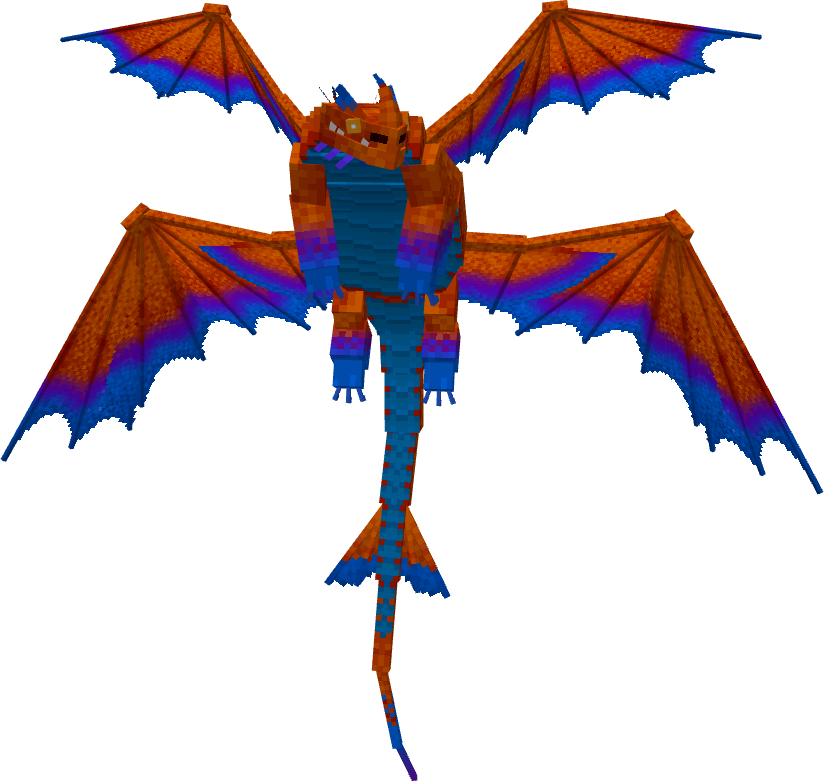

**Obtainment:** Rare spawn

```
/summon isleofberk:monstrous_nightmare ~ ~ ~ {VariantName:infernier}
```

### Juniper

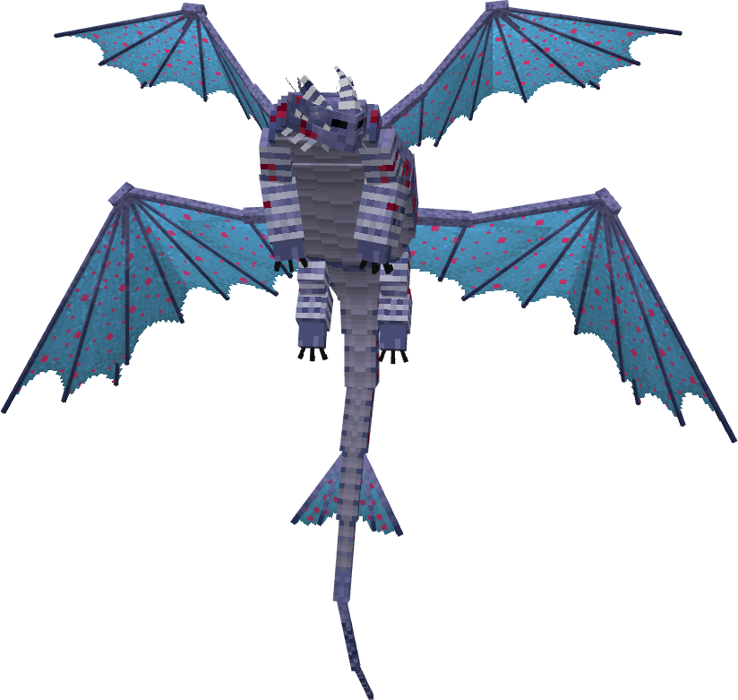

**Obtainment:** Rare spawn

```
/summon isleofberk:monstrous_nightmare ~ ~ ~ {VariantName:juniper}
```

### Melanistic

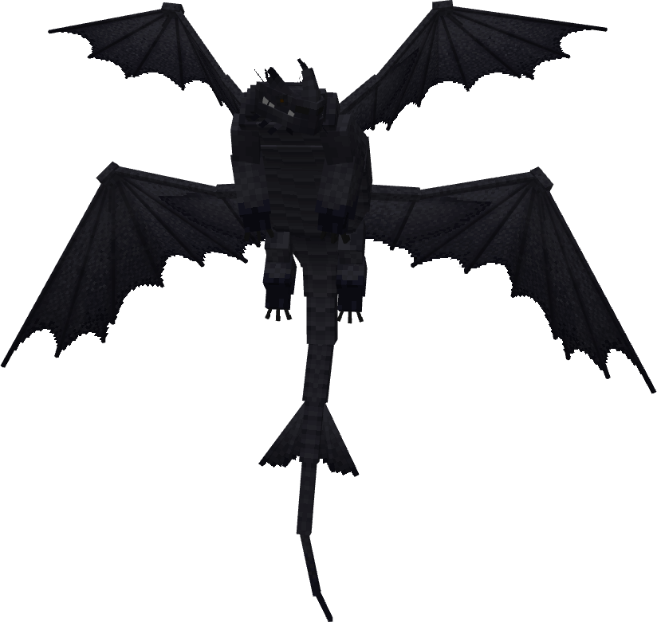

**Obtainment:** Rare spawn

```
/summon isleofberk:monstrous_nightmare ~ ~ ~ {VariantName:melanistic_singetail}
```

### Novatail

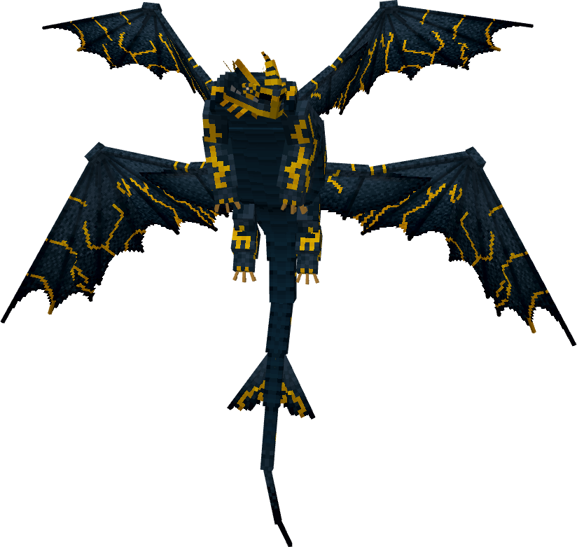

**Obtainment:** Rare spawn

```
/summon isleofberk:monstrous_nightmare ~ ~ ~ {VariantName:novatail}
```

### Purple

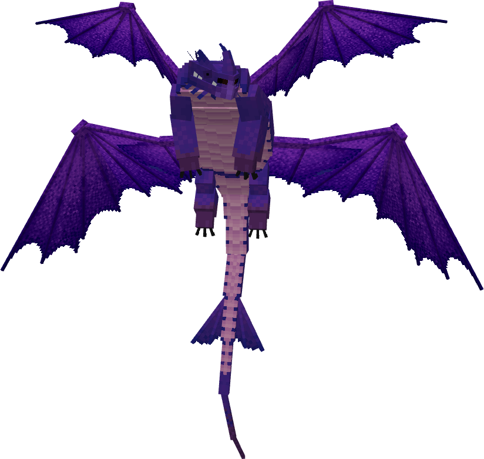

**Obtainment:** Normal spawn

```
/summon isleofberk:monstrous_nightmare ~ ~ ~ {VariantName:purple}
```

### Red

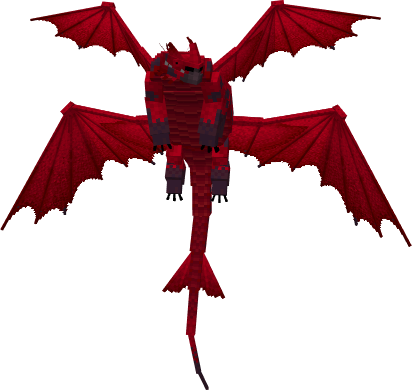

**Obtainment:** Normal spawn

```
/summon isleofberk:monstrous_nightmare ~ ~ ~ {VariantName:red}
```

### Singetail


**Obtainment:** Normal spawn

```
/summon isleofberk:monstrous_nightmare ~ ~ ~ {VariantName:singetail}
```

### Spotless

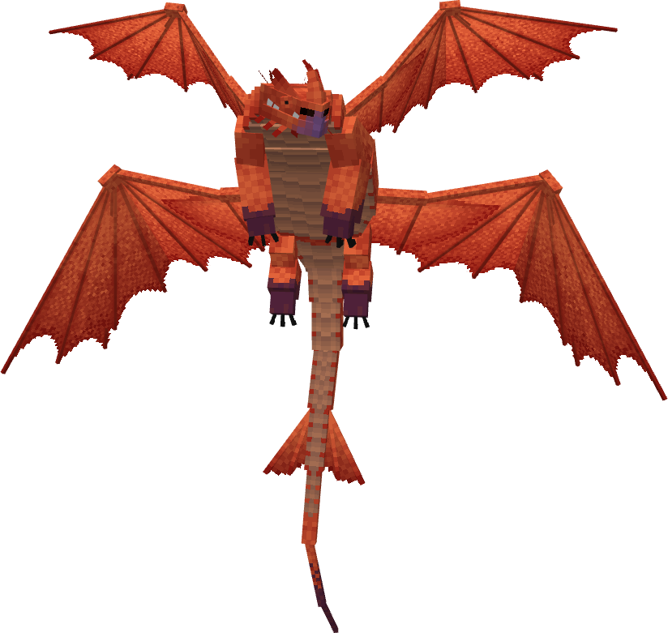

**Obtainment:** Normal spawn

```
/summon isleofberk:monstrous_nightmare ~ ~ ~ {VariantName:spotless}
```

### Terrestris

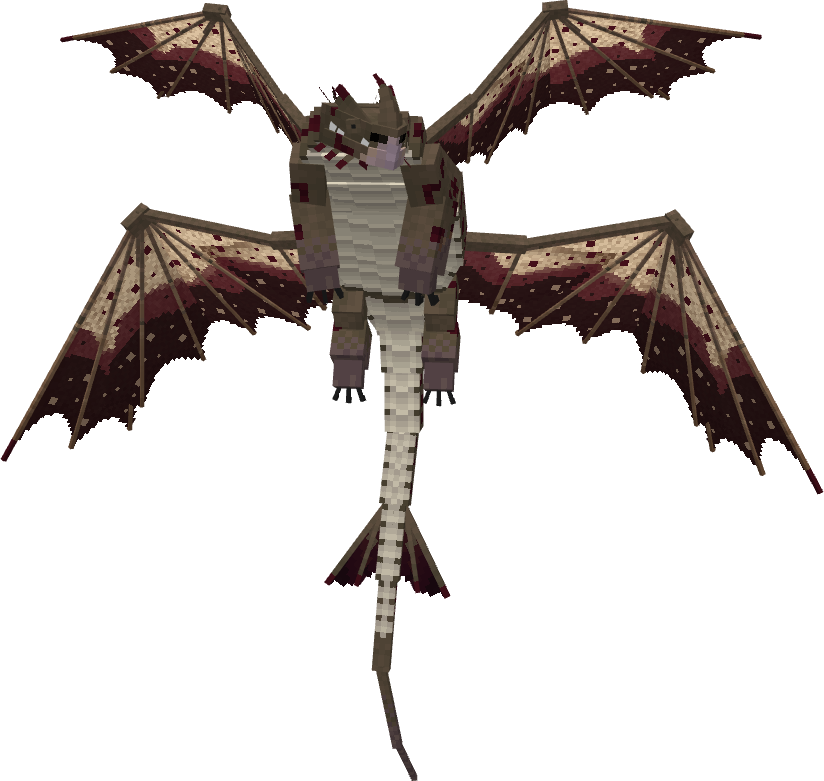

**Obtainment:** Rare spawn

```
/summon isleofberk:monstrous_nightmare ~ ~ ~ {VariantName:terrestris}
```

### Yellow

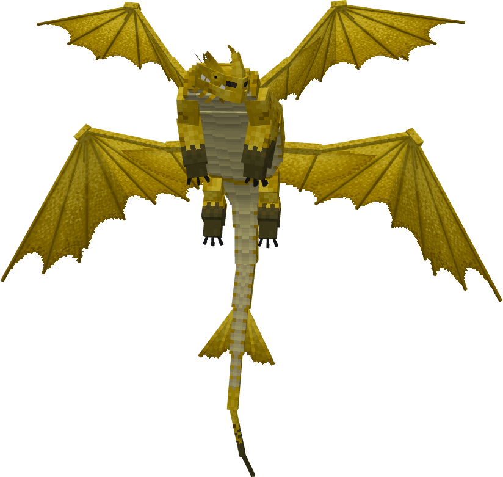

**Obtainment:** Normal spawn

```
/summon isleofberk:monstrous_nightmare ~ ~ ~ {VariantName:yellow}
```

---

_Content adapted from the [Archipelago Additions Wiki](https://archipelagoadditions.miraheze.org/wiki/Singetail) under [CC BY-SA 4.0](https://creativecommons.org/licenses/by-sa/4.0/)._
