# Slitherwing


The Slitherwing is a series canon dragon, first appearing in Race to the Edge. It is an Archipelago Additions dragon on theTriple Strykebase.

## Stats

| Stat | Value |
|---|---|
| Health | 60 (30 hearts) |
| Armour | 0 |
| Attack | 10 (5 hearts) |
| Walk Speed | 0.6 (Wither speed) |
| Fly Speed | 0.2 (twice Allay speed) |

## Taming

**Taming Foods:** Raw Chicken, Raw Rabbit

**Requirements:** Decrease dragon below 25% hp

**Alt Taming:** Dragon Nip

## Breeding

**Breeding Foods:** Suspicious Stew, Sagefruit

## Drops

**Brush Drops:** 1-3 Slitherwing Scales

**Death Drops:** 1-2 Dragon Blood, 3-5 Slitherwing Scales, 1 Venom Gland

## Spawn Biomes

- `minecraft:bamboo_jungle`
- `minecraft:sparse_jungle`
- `minecraft:jungle`

## Variants

### Albino

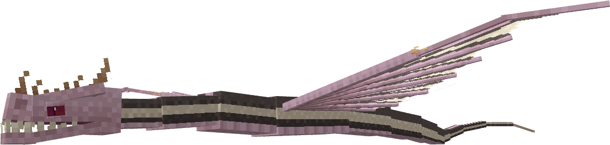

**Obtainment:** Rare spawn

```
/summon isleofberk:triple_stryke ~ ~ ~ {VariantName:albino_slither}
```

### Banana Ice Cream

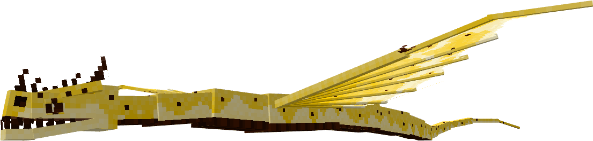

**Obtainment:** Normal spawn

```
/summon isleofberk:triple_stryke ~ ~ ~ {VariantName:banana_icecream}
```

### Erythristic

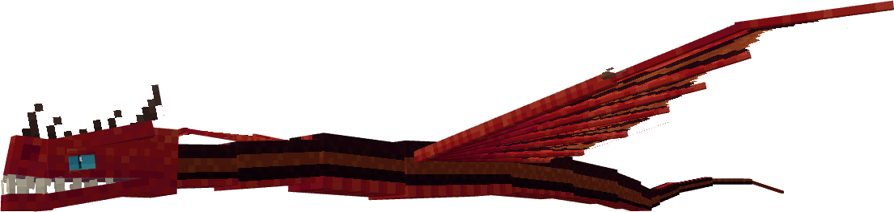

**Obtainment:** Rare spawn

```
/summon isleofberk:triple_stryke ~ ~ ~ {VariantName:erythristic_slither}
```

### Harmhug

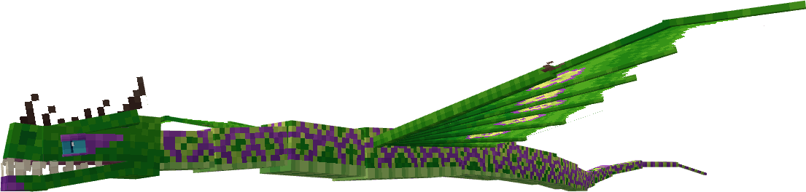

**Obtainment:** Normal spawn

```
/summon isleofberk:triple_stryke ~ ~ ~ {VariantName:harmhug}
```

### Leucistic

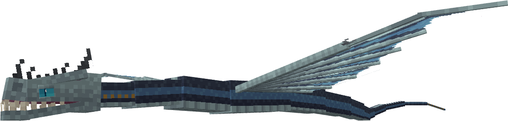

**Obtainment:** Rare spawn

```
/summon isleofberk:triple_stryke ~ ~ ~ {VariantName:leucistic_slither}
```

### Melanistic

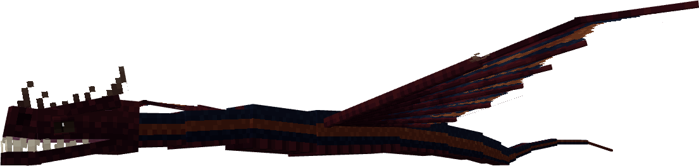

**Obtainment:** Rare spawn

```
/summon isleofberk:triple_stryke ~ ~ ~ {VariantName:melanistic_slither}
```

### Mosaic

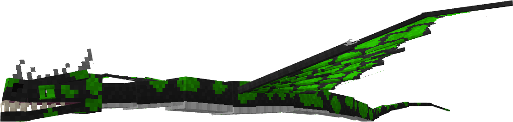

**Obtainment:** Normal spawn

```
/summon isleofberk:triple_stryke ~ ~ ~ {VariantName:mosaic}
```

### Pastella

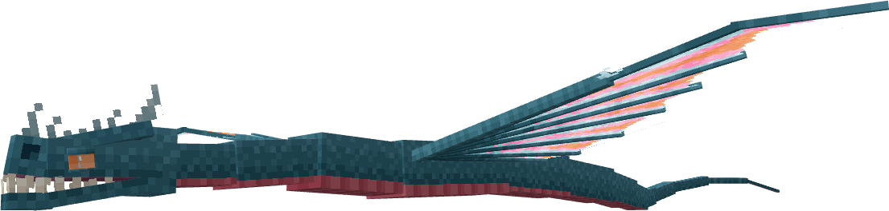

**Obtainment:** Normal spawn

```
/summon isleofberk:triple_stryke ~ ~ ~ {VariantName:pastella}
```

### Slitherbase

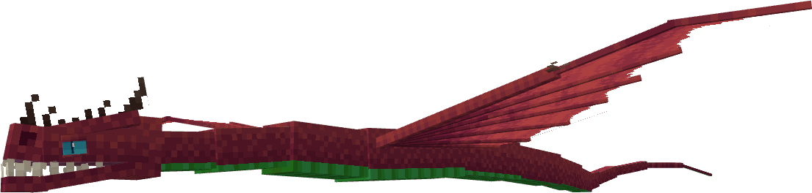

**Obtainment:** Normal spawn

```
/summon isleofberk:triple_stryke ~ ~ ~ {VariantName:slitherbase}
```

### Slitherwing


**Obtainment:** Normal spawn

```
/summon isleofberk:triple_stryke ~ ~ ~ {VariantName:slitherwing}
```

### Sourslurp

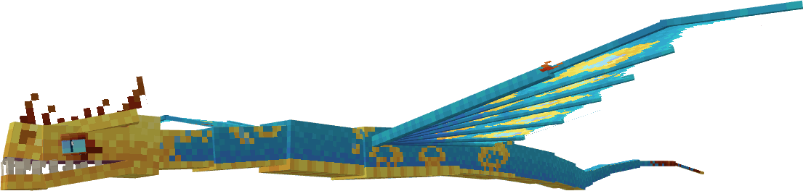

**Obtainment:** Normal spawn

```
/summon isleofberk:triple_stryke ~ ~ ~ {VariantName:sourslurp}
```

### Taipan

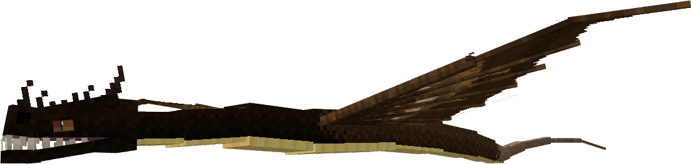

**Obtainment:** Normal spawn

```
/summon isleofberk:triple_stryke ~ ~ ~ {VariantName:taipan}
```

### Tenebrae

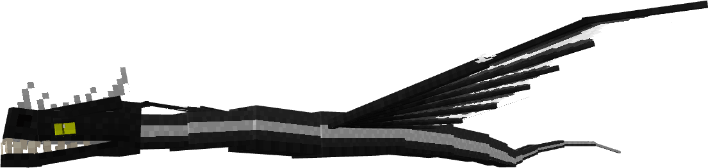

**Obtainment:** Normal spawn

```
/summon isleofberk:triple_stryke ~ ~ ~ {VariantName:tenebrae}
```

### Titan

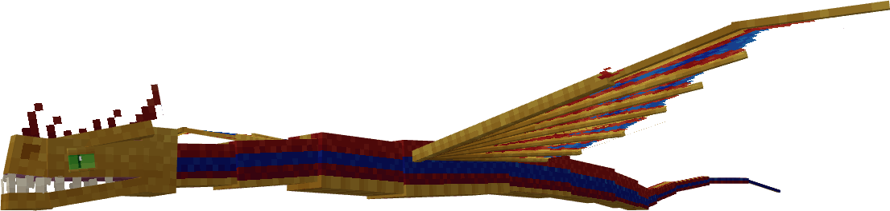

**Obtainment:** Normal spawn

```
/summon isleofberk:triple_stryke ~ ~ ~ {VariantName:titanslither}
```

### Toksin

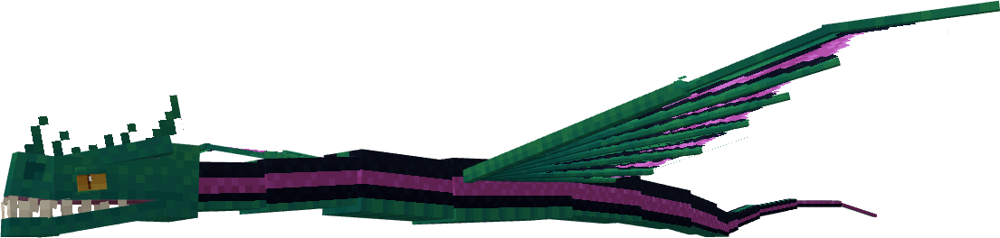

**Obtainment:** Normal spawn

```
/summon isleofberk:triple_stryke ~ ~ ~ {VariantName:toksin}
```

---

_Content adapted from the [Archipelago Additions Wiki](https://archipelagoadditions.miraheze.org/wiki/Slitherwing) under [CC BY-SA 4.0](https://creativecommons.org/licenses/by-sa/4.0/)._
