# Songwing


Nothing to do with Rescue Riders.
The Songwing is a non-canon concept dragon. It is a Stego's Dragons dragon, now part of AA after the merge. The Songwing uses theNight Furybase.

## Stats

| Stat | Value |
|---|---|
| Health | 90 (45 hearts) |
| Armour | 2 (1 icon) |
| Attack | 4 (2 hearts) |
| Walk Speed | 0.4 (Piglin Brute speed) |
| Fly Speed | 0.18 (80% faster than Allay speed) |

## Taming

**Taming Foods:** Raw Cod, Raw Salmon

**Requirements:**

- No tools or weapons (except Dragon Blades & specified Viking Artifacts) held
- No armour worn
- Night Vision potion effect active

**Alt Taming:** Dragon Nip

## Breeding

**Breeding Foods:** Honeycomb, Sagefruit

## Drops

**Brush Drops:** 1-3 Songwing Scales

**Death Drops:** 1-2 Dragon Blood, 3-5 Songwing Scales

## Spawn Biomes

- `minecraft:badlands`
- `minecraft:eroded_badlands`
- `minecraft:savanna`

## Variants

### Albino

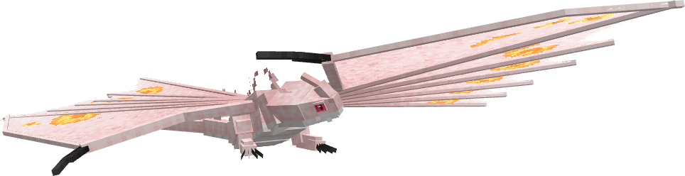

**Obtainment:** Rare spawn

```
/summon isleofberk:night_fury ~ ~ ~ {VariantName:albino_songwing}
```

*Credits: Stego's Dragons variant*

### Autumnsong

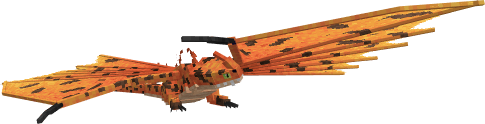

**Obtainment:** Normal spawn

```
/summon isleofberk:night_fury ~ ~ ~ {VariantName:autumnsong}
```

*Credits: Stego's Dragons variant*

### Blueflame

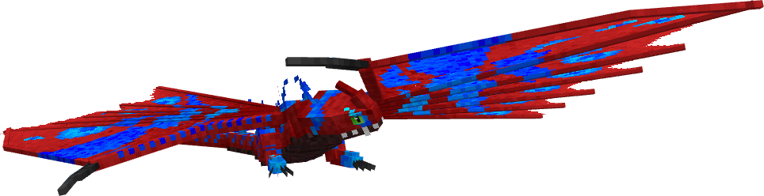

**Obtainment:** Normal spawn

```
/summon isleofberk:night_fury ~ ~ ~ {VariantName:blueflame_songwing}
```

*Credits: Stego's Dragons variant*

### Cheesesong

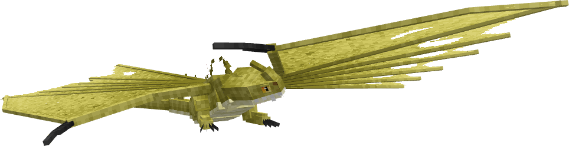

**Obtainment:** Rare spawn

```
/summon isleofberk:night_fury ~ ~ ~ {VariantName:cheesesong}
```

*Credits: Stego's Dragons variant*

### Copperwing

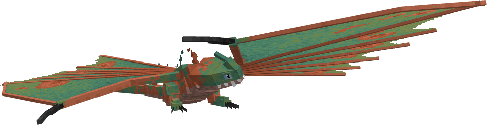

**Obtainment:** Normal spawn

```
/summon isleofberk:night_fury ~ ~ ~ {VariantName:copperwing}
```

*Credits: Stego's Dragons variant*

### Dragonfruitwing

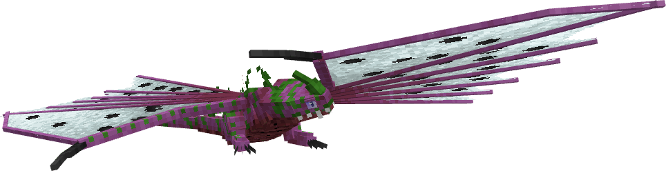

**Obtainment:** Normal spawn

```
/summon isleofberk:night_fury ~ ~ ~ {VariantName:dragonfruitwing}
```

*Credits: Stego's Dragons variant*

### Endereye

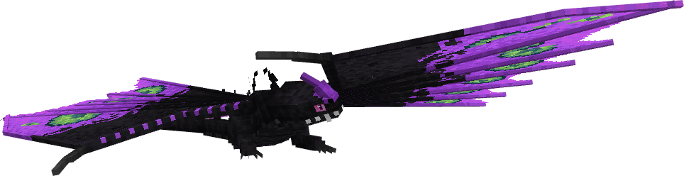

**Obtainment:** Normal spawn

```
/summon isleofberk:night_fury ~ ~ ~ {VariantName:endereye}
```

*Credits: Stego's Dragons variant*

### Flourishsong

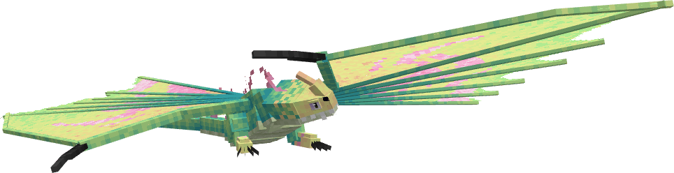

**Obtainment:** Normal spawn

```
/summon isleofberk:night_fury ~ ~ ~ {VariantName:flourishsong}
```

*Credits: Stego's Dragons variant*

### Leucistic

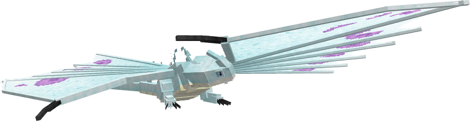

**Obtainment:** Rare spawn

```
/summon isleofberk:night_fury ~ ~ ~ {VariantName:leucistic_songwing}
```

*Credits: Stego's Dragons variant*

### Lullabywing

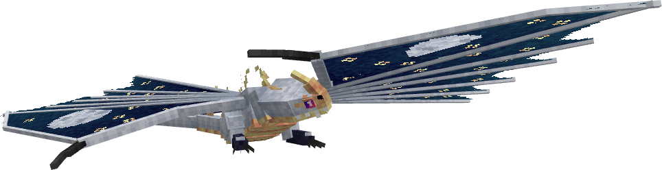

**Obtainment:** Normal spawn

```
/summon isleofberk:night_fury ~ ~ ~ {VariantName:lullabywing}
```

*Credits: Stego's Dragons variant*

### Melanistic

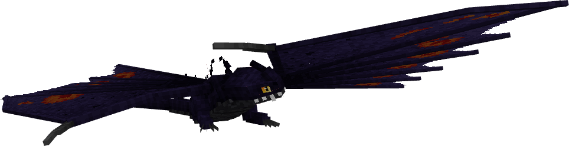

**Obtainment:** Rare spawn

```
/summon isleofberk:night_fury ~ ~ ~ {VariantName:melanistic_songwing}
```

*Credits: Stego's Dragons variant*

### Midsummersong

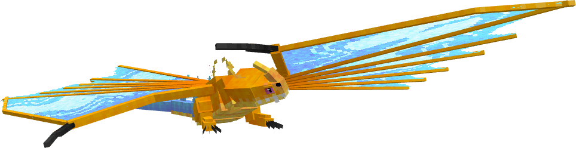

**Obtainment:** Normal spawn

```
/summon isleofberk:night_fury ~ ~ ~ {VariantName:midsummersong}
```

*Credits: Stego's Dragons variant*

### Mothra

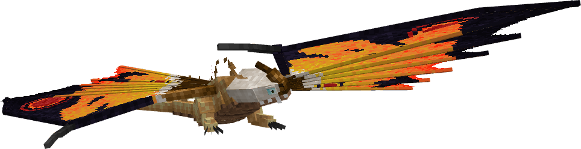

**Obtainment:** Normal spawn

```
/summon isleofberk:night_fury ~ ~ ~ {VariantName:mothra}
```

*Credits: Stego's Dragons variant*

### Northsong

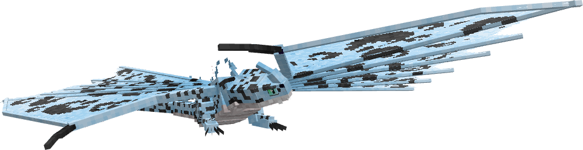

**Obtainment:** Normal spawn

```
/summon isleofberk:night_fury ~ ~ ~ {VariantName:northsong}
```

*Credits: Stego's Dragons variant*

### Prism

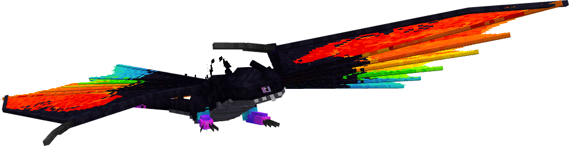

**Obtainment:** Bifrost Temple only

```
/summon isleofberk:night_fury ~ ~ ~ {VariantName:prism_songwing}
```

*Credits: Stego's Dragons variant*

### Scarletsong

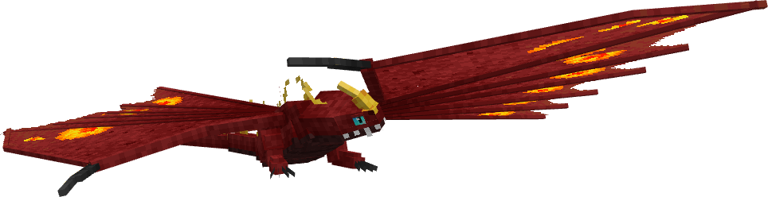

**Obtainment:** Normal spawn

```
/summon isleofberk:night_fury ~ ~ ~ {VariantName:scarletsong}
```

*Credits: Stego's Dragons variant*

### Solarflare

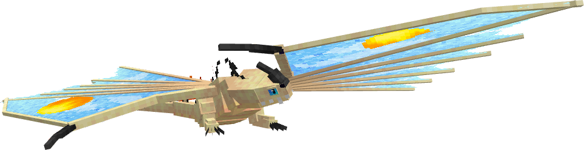

**Obtainment:** Normal spawn

```
/summon isleofberk:night_fury ~ ~ ~ {VariantName:solarflare}
```

*Credits: Stego's Dragons variant*

### Songdeath

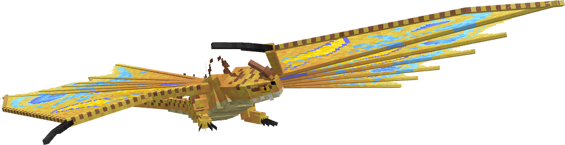

**Obtainment:** Normal spawn

```
/summon isleofberk:night_fury ~ ~ ~ {VariantName:songdeath}
```

*Credits: Stego's Dragons variant*

### Songwing


**Obtainment:** Normal spawn

```
/summon isleofberk:night_fury ~ ~ ~ {VariantName:songwing}
```

*Credits: Stego's Dragons variant*

### Vaporwave

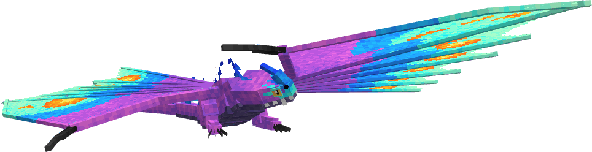

**Obtainment:** Normal spawn

```
/summon isleofberk:night_fury ~ ~ ~ {VariantName:vaporwave}
```

*Credits: Stego's Dragons variant*

### Voidwing

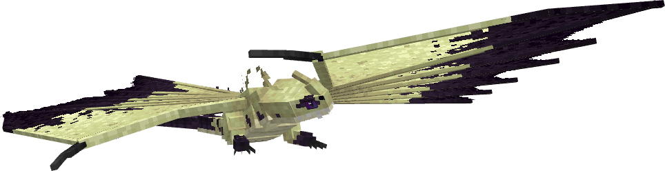

**Obtainment:** Normal spawn

```
/summon isleofberk:night_fury ~ ~ ~ {VariantName:voidwing}
```

*Credits: Stego's Dragons variant*

### Wastewing

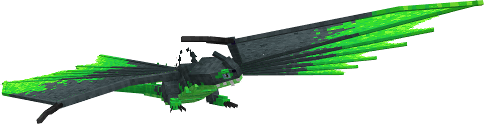

**Obtainment:** Normal spawn

```
/summon isleofberk:night_fury ~ ~ ~ {VariantName:wastewing}
```

*Credits: Stego's Dragons variant*

### Watermelonwing

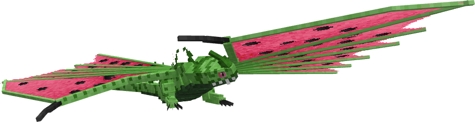

**Obtainment:** Normal spawn

```
/summon isleofberk:night_fury ~ ~ ~ {VariantName:watermelonwing}
```

*Credits: Stego's Dragons variant*

---

_Content adapted from the [Archipelago Additions Wiki](https://archipelagoadditions.miraheze.org/wiki/Songwing) under [CC BY-SA 4.0](https://creativecommons.org/licenses/by-sa/4.0/)._
