# Speed Stinger

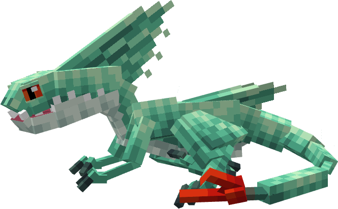

The Speed Stinger is a series canon dragon, first appearing in Riders & Defenders of Berk. It is a base Isle of Berk dragon.

## Stats

| Stat | Value |
|---|---|
| Health | 40 (20 hearts) |
| Armour | 0 |
| Attack | 4 (2 hearts) |
| Walk Speed | 0.4 (Piglin Brute speed) |

## Taming

**Taming Foods:** Raw Rabbit, Raw Salmon, Raw Chicken

**Requirements:** Must be a baby

## Breeding

**Breeding Foods:** Suspicious Stew, Sagefruit

## Drops

**Brush Drops:** 1-2 Speed Stinger Scales

**Death Drops:** 1 Dragon Blood, 2-3 Speed Stinger Scales, 1 Venom Gland

## Spawn Biomes

- `This dragon only spawns through structures.`

## Variants

### Albino

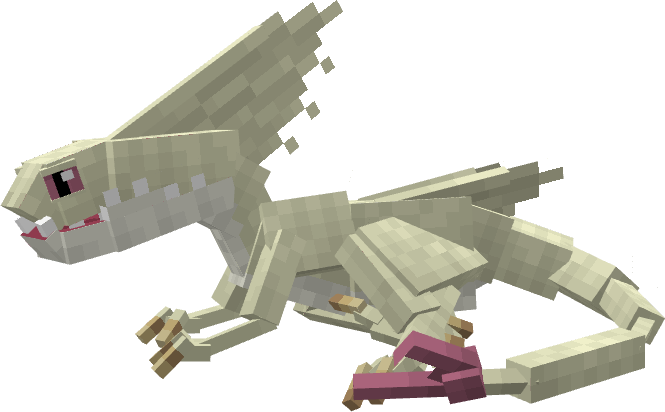

**Obtainment:** Rare spawn

```
/summon isleofberk:speed_stinger ~ ~ ~ {VariantName:albino_speed_stinger}
```

### Blue

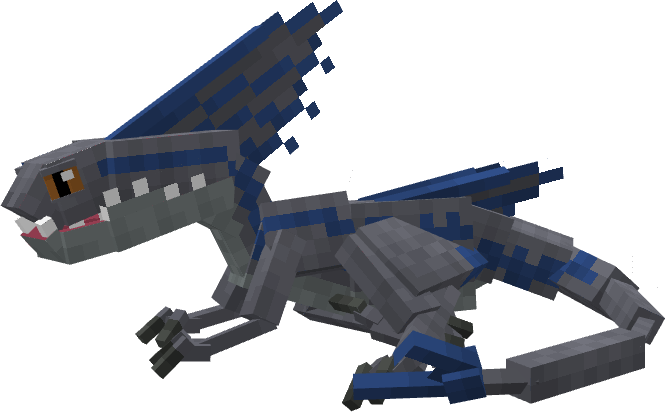

**Obtainment:** Normal spawn

```
/summon isleofberk:speed_stinger ~ ~ ~ {VariantName:blue}
```

### Charlie

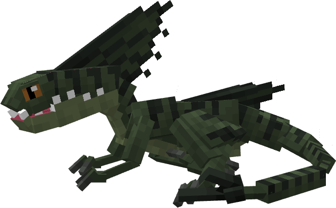

**Obtainment:** Normal spawn

```
/summon isleofberk:speed_stinger ~ ~ ~ {VariantName:charlie}
```

### Delta

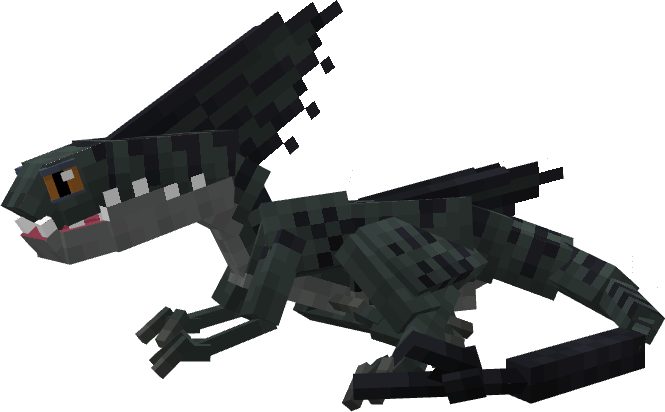

**Obtainment:** Normal spawn

```
/summon isleofberk:speed_stinger ~ ~ ~ {VariantName:delta}
```

### Echo

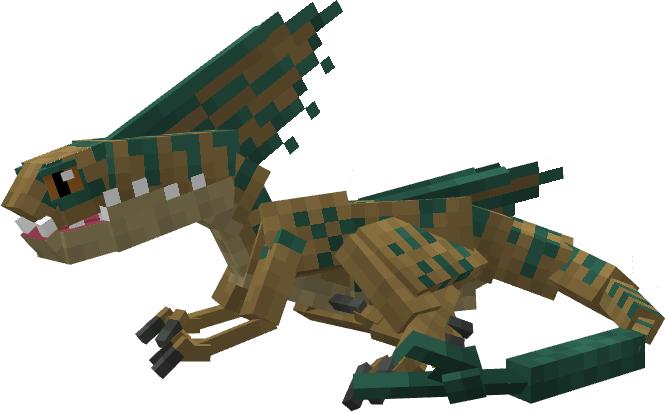

**Obtainment:** Normal spawn

```
/summon isleofberk:speed_stinger ~ ~ ~ {VariantName:echo}
```

### Exotic

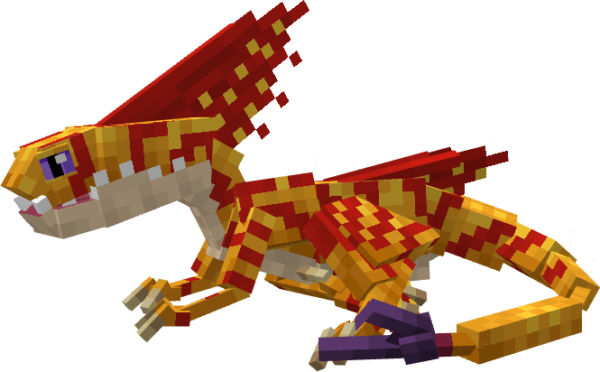

**Obtainment:** Midsommar only

```
/summon isleofberk:speed_stinger ~ ~ ~ {VariantName:exotic}
```

### Floutscout

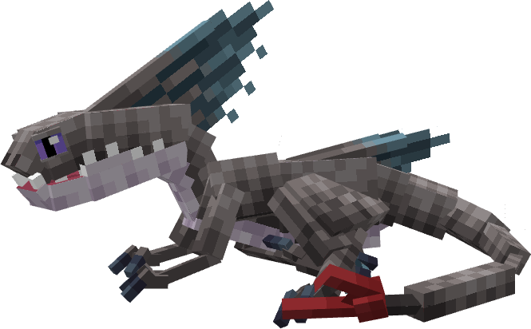

**Obtainment:** Normal spawn

```
/summon isleofberk:speed_stinger ~ ~ ~ {VariantName:floutscout}
```

*Credits: Base IoB variant*

### Floutscout Leader

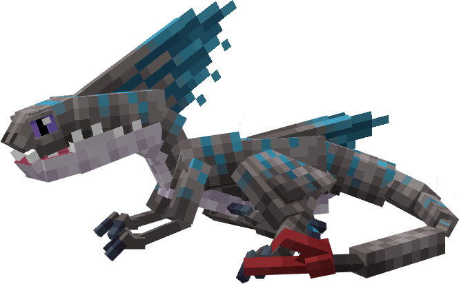

**Obtainment:** Rare spawn

```
/summon isleofberk:speed_stinger ~ ~ ~ {VariantName:floutscout_leader}
```

*Credits: Base IoB variant*

### Ghost

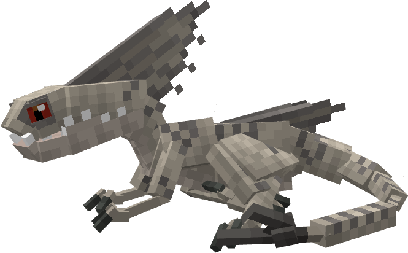

**Obtainment:** Normal spawn

```
/summon isleofberk:speed_stinger ~ ~ ~ {VariantName:ghost}
```

### Hallucination

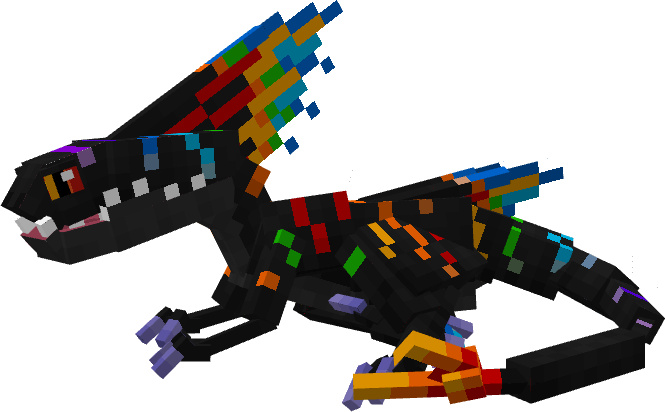

**Obtainment:** Bifrost Temple only

```
/summon isleofberk:speed_stinger ~ ~ ~ {VariantName:hallucination}
```

### Ice Breaker

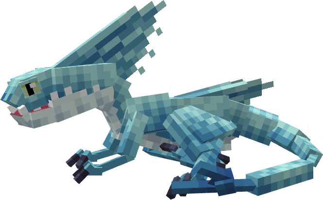

**Obtainment:** Normal spawn

```
/summon isleofberk:speed_stinger ~ ~ ~ {VariantName:ice_breaker}
```

*Credits: Base IoB variant*

### Ice Breaker Leader

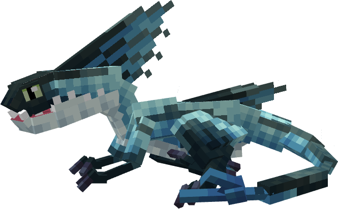

**Obtainment:** Rare spawn

```
/summon isleofberk:speed_stinger ~ ~ ~ {VariantName:ice_breaker_leader}
```

*Credits: Base IoB variant*

### Lightstrike

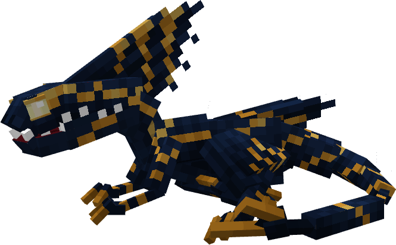

**Obtainment:** Normal spawn

```
/summon isleofberk:speed_stinger ~ ~ ~ {VariantName:lightstrike}
```

### Lightstrike Leader

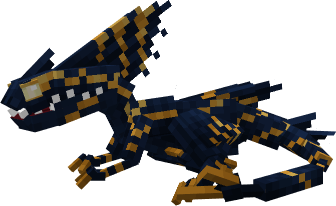

**Obtainment:** Rare spawn

```
/summon isleofberk:speed_stinger ~ ~ ~ {VariantName:lightstrike_alpha}
```

### Melanistic

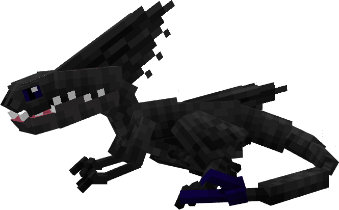

**Obtainment:** Rare spawn

```
/summon isleofberk:speed_stinger ~ ~ ~ {VariantName:melanistic_speed_stinger}
```

### Panthera

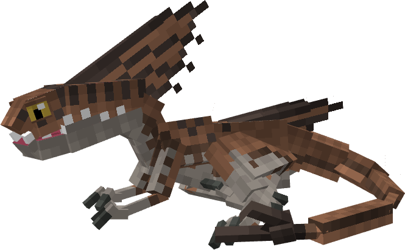

**Obtainment:** Normal spawn

```
/summon isleofberk:speed_stinger ~ ~ ~ {VariantName:panthera}
```

### Red

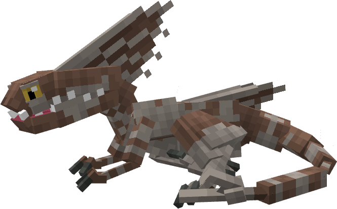

**Obtainment:** Normal spawn

```
/summon isleofberk:speed_stinger ~ ~ ~ {VariantName:red}
```

### Speed Stinger


**Obtainment:** Normal spawn

```
/summon isleofberk:speed_stinger ~ ~ ~ {VariantName:speed_stinger}
```

*Credits: Base IoB variant*

### Speed Stinger Leader

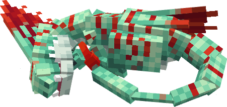

**Obtainment:** Rare spawn

```
/summon isleofberk:speed_stinger ~ ~ ~ {VariantName:speed_stinger_leader}
```

*Credits: Base IoB variant*

### Sweet Sting

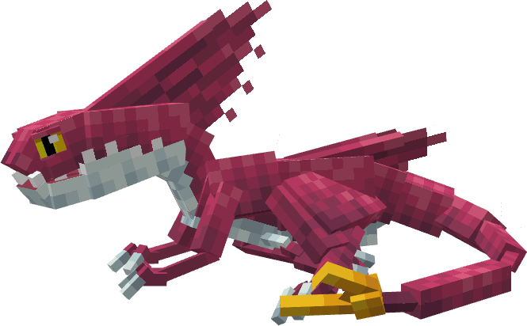

**Obtainment:** Normal spawn

```
/summon isleofberk:speed_stinger ~ ~ ~ {VariantName:sweet_sting}
```

*Credits: Base IoB variant*

### Sweet Sting Leader

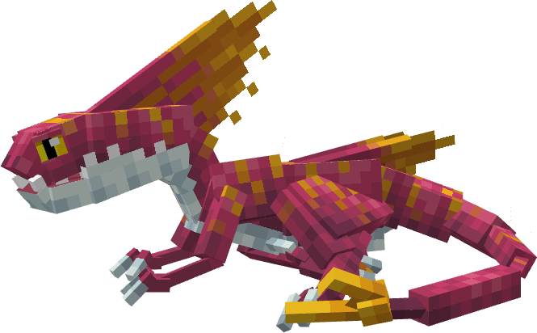

**Obtainment:** Rare spawn

```
/summon isleofberk:speed_stinger ~ ~ ~ {VariantName:sweet_sting_leader}
```

*Credits: Base IoB variant*

### Tiger

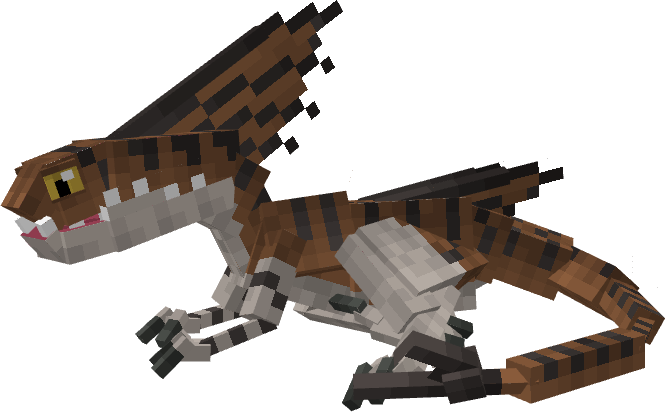

**Obtainment:** Normal spawn

```
/summon isleofberk:speed_stinger ~ ~ ~ {VariantName:tiger}
```

### Timberprickle

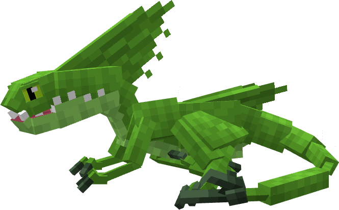

**Obtainment:** Normal spawn

```
/summon isleofberk:speed_stinger ~ ~ ~ {VariantName:timberprickle}
```

### Timberprickle Leader

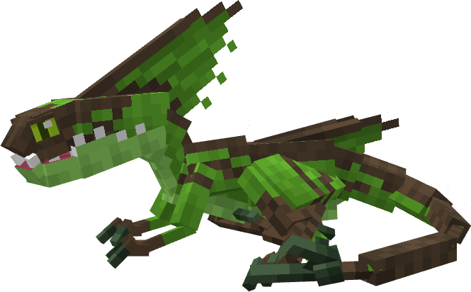

**Obtainment:** Rare spawn

```
/summon isleofberk:speed_stinger ~ ~ ~ {VariantName:timberprickle_alpha}
```

### Titan

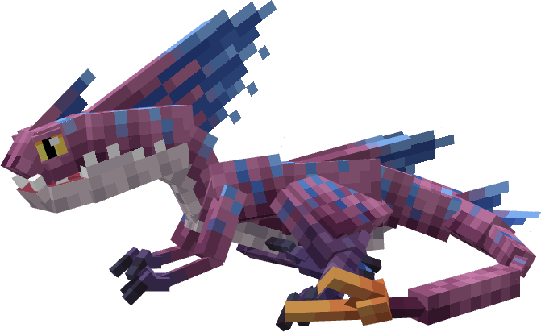

**Obtainment:** Rare spawn

```
/summon isleofberk:speed_stinger ~ ~ ~ {VariantName:titan}
```

*Credits: Base IoB variant*

---

_Content adapted from the [Archipelago Additions Wiki](https://archipelagoadditions.miraheze.org/wiki/Speed_Stinger) under [CC BY-SA 4.0](https://creativecommons.org/licenses/by-sa/4.0/)._
