# Storming Nightmare

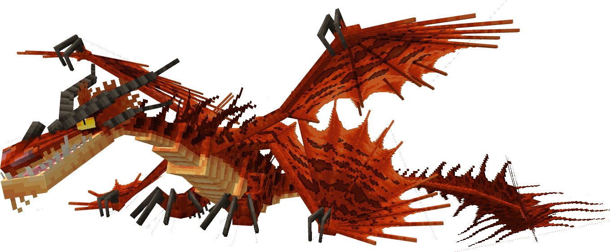

The Storming Nightmare is an Archipelago Additions original hybrid of theMonstrous Nightmare&Stormcutter. It is on theMonstrous Nightmarebase.

## Stats

| Stat | Value |
|---|---|
| Health | 135 (67.5 hearts) |
| Armour | 2 (1 icon) |
| Attack | 7 (3.5 hearts) |
| Walk Speed | 0.4 (Piglin Brute speed) |
| Fly Speed | 0.15 (50% faster than Allay speed) |

## Taming

**Taming Foods:** Raw Cod, Raw Pork

**Requirements:**

- No tools or weapons (except Dragon Blades & specified Viking Artifacts) held
- No armour worn
- Fire resistance potion effect active

**Alt Taming:** Dragon Nip

## Breeding

**Breeding Foods:** Suspicious Stew, Sagefruit

## Drops

**Brush Drops:** 2-3 Storming Nightmare Scales, 1-2 Monstrous Nightmare Gel

**Death Drops:** 1-3 Dragon Blood, 4-7 Storming Nightmare Scales, 1-3 Monstrous Nightmare Gel

## Spawn Biomes

- `minecraft:grove`
- `minecraft:snowy_slopes`
- `minecraft:windswept_hills`

## Variants

### Albino

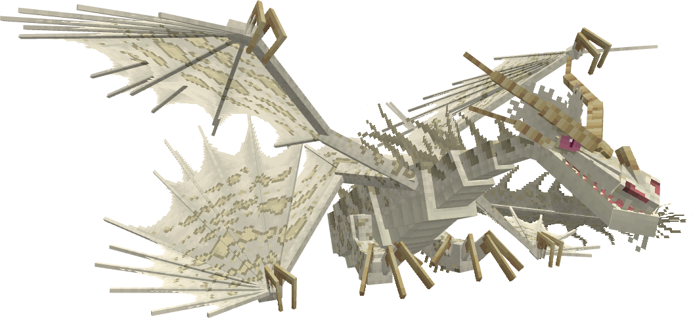

**Obtainment:** Rare spawn

```
/summon isleofberk:monstrous_nightmare ~ ~ ~ {VariantName:albino_stormingnightmare}
```

### Atlantic

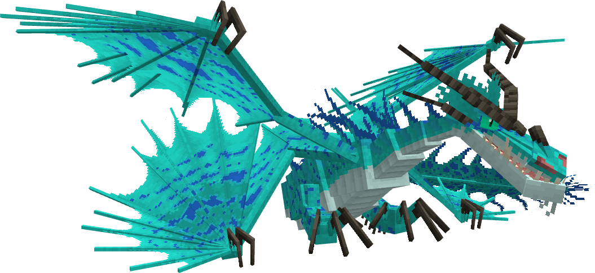

**Obtainment:** Normal spawn

```
/summon isleofberk:monstrous_nightmare ~ ~ ~ {VariantName:atlantic}
```

### Bad Weather

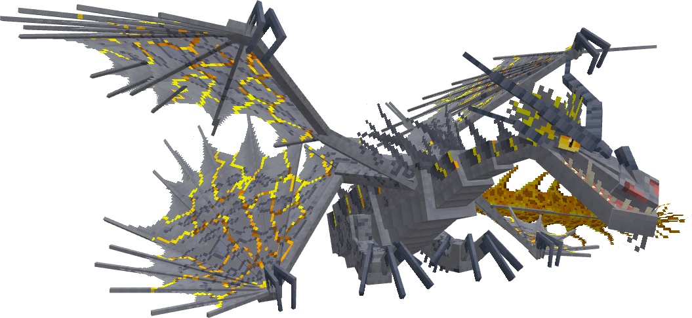

**Obtainment:** Rare spawn

```
/summon isleofberk:monstrous_nightmare ~ ~ ~ {VariantName:bad_weather}
```

### Greenwind Storm

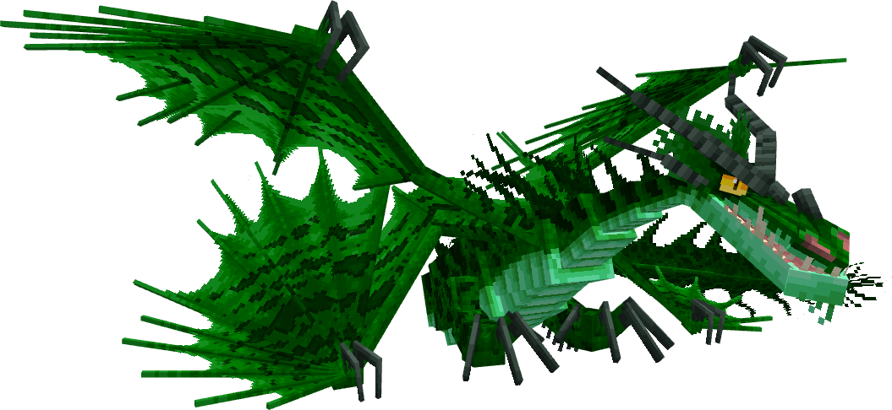

**Obtainment:** Normal spawn

```
/summon isleofberk:monstrous_nightmare ~ ~ ~ {VariantName:greenwind_storm}
```

### Host

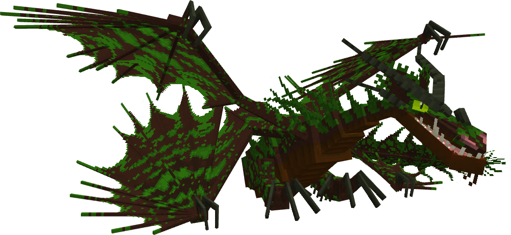

**Obtainment:** Normal spawn

```
/summon isleofberk:monstrous_nightmare ~ ~ ~ {VariantName:host}
```

### Melanistic

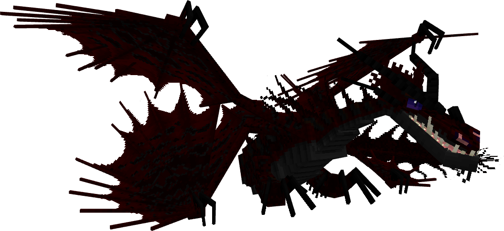

**Obtainment:** Rare spawn

```
/summon isleofberk:monstrous_nightmare ~ ~ ~ {VariantName:melanistic_stormingnightmare}
```

### Pixel

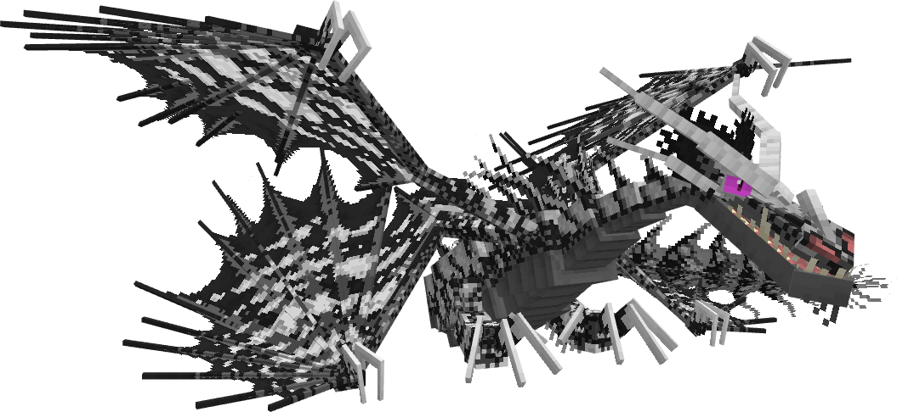

**Obtainment:** Normal spawn

```
/summon isleofberk:monstrous_nightmare ~ ~ ~ {VariantName:pixel}
```

### Storming Hookfang


**Obtainment:** Normal spawn

```
/summon isleofberk:monstrous_nightmare ~ ~ ~ {VariantName:storming_hookfang}
```

### Tempest

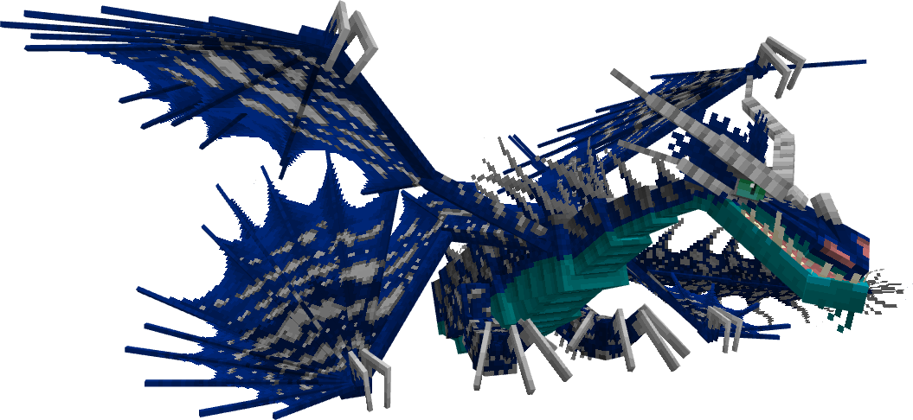

**Obtainment:** Normal spawn

```
/summon isleofberk:monstrous_nightmare ~ ~ ~ {VariantName:tempest}
```

### Thunder

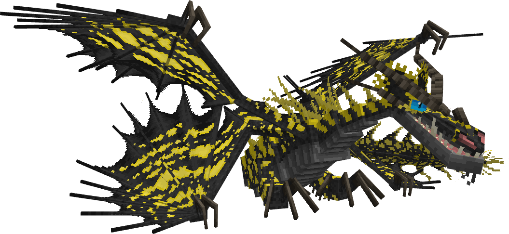

**Obtainment:** Normal spawn

```
/summon isleofberk:monstrous_nightmare ~ ~ ~ {VariantName:thunder}
```

### Violet Storm

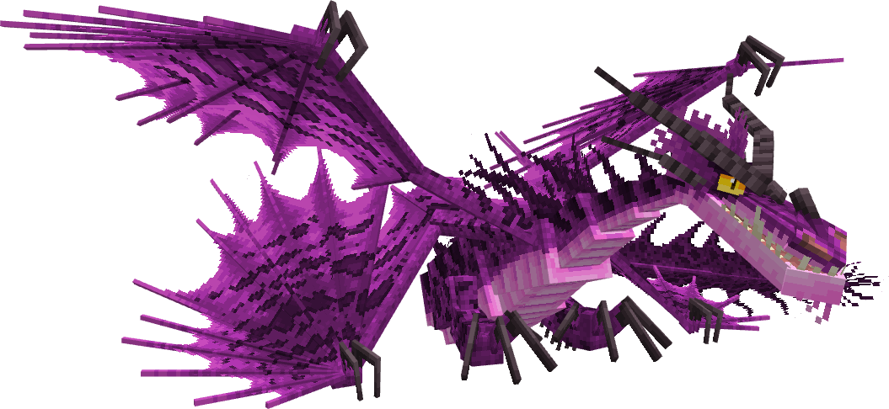

**Obtainment:** Normal spawn

```
/summon isleofberk:monstrous_nightmare ~ ~ ~ {VariantName:violet_storm}
```

---

_Content adapted from the [Archipelago Additions Wiki](https://archipelagoadditions.miraheze.org/wiki/Storming_Nightmare) under [CC BY-SA 4.0](https://creativecommons.org/licenses/by-sa/4.0/)._
