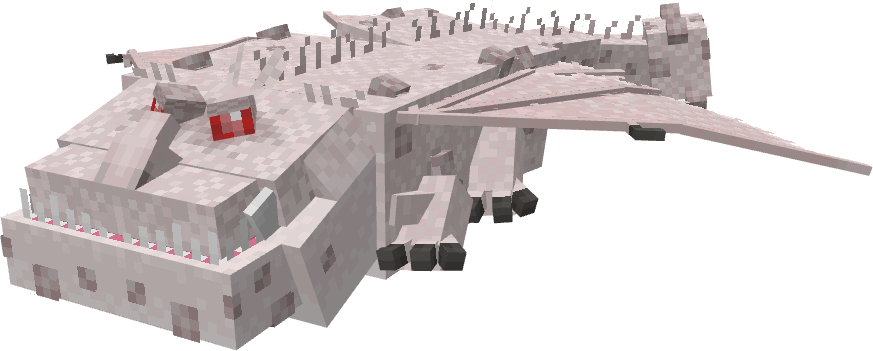
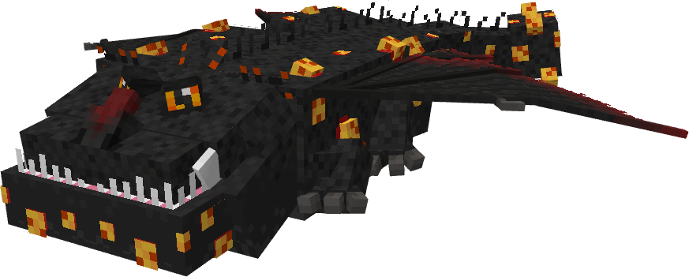
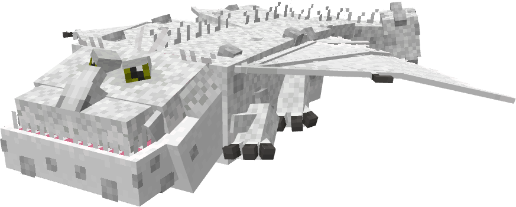
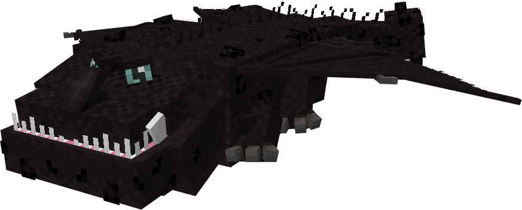
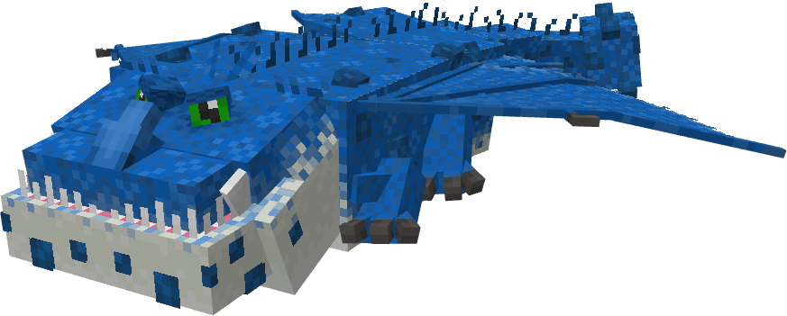
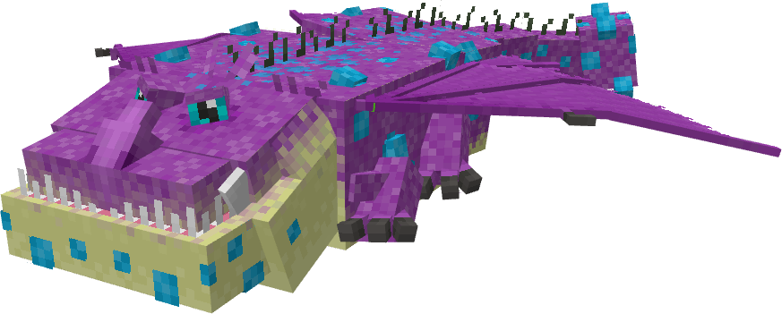
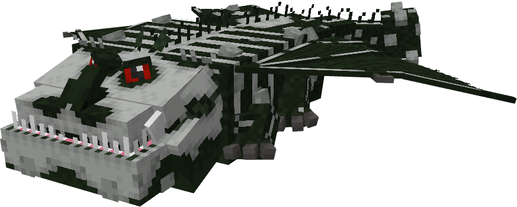
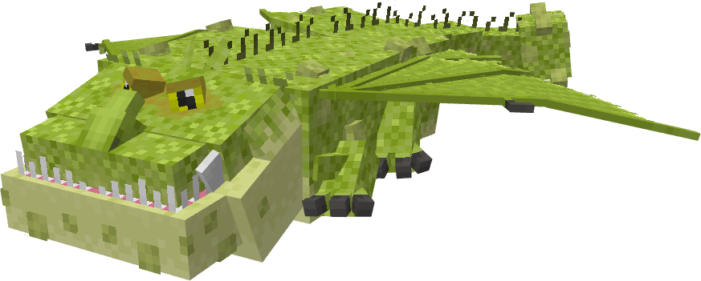

# Thunderbottom


The Thunderbottom is a non-canon dragon, from Titans Uprising. It is a Stego's Dragons dragon, now part of AA after the merge. The Thunderbottom uses theGroncklebase.

## Stats

| Stat | Value |
|---|---|
| Health | 70 (35 hearts) |
| Armour | 6 (3 icons) |
| Attack | 6 (3 hearts) |
| Walk Speed | 0.38 (Piglin Brute speed) |
| Fly Speed | 0.08 (just below Allay speed) |

## Taming

**Taming Foods:** Raw Cod

**Requirements:** No tools or weapons (except Dragon Blades & specified Viking Artifacts) held

**Alt Taming:** Dragon Nip

## Breeding

**Breeding Foods:** Suspicious Stew, Sagefruit

## Drops

**Brush Drops:** 1-3 Thunderbottom Scales

**Death Drops:** 1-2 Dragon Blood, 3-5 Thunderbottom Scales

## Spawn Biomes

- `minecraft:beach`
- `minecraft:snowy_beach`
- `minecraft:stony_shore`

## Variants

### Albino



**Obtainment:** Rare spawn

```
/summon isleofberk:gronckle ~ ~ ~ {VariantName:albino_bottom}
```

*Credits: Stego's Dragons variant*

### Cheese


**Obtainment:** Normal spawn

```
/summon isleofberk:gronckle ~ ~ ~ {VariantName:bottomcheese}
```

*Credits: Stego's Dragons variant*

### Hell



**Obtainment:** Normal spawn

```
/summon isleofberk:gronckle ~ ~ ~ {VariantName:hellbottom}
```

*Credits: Stego's Dragons variant*

### Leucistic



**Obtainment:** Rare spawn

```
/summon isleofberk:gronckle ~ ~ ~ {VariantName:leucistic_bottom}
```

*Credits: Stego's Dragons variant*

### Melanistic



**Obtainment:** Rare spawn

```
/summon isleofberk:gronckle ~ ~ ~ {VariantName:melanistic_bottom}
```

*Credits: Stego's Dragons variant*

### Smurf



**Obtainment:** Normal spawn

```
/summon isleofberk:gronckle ~ ~ ~ {VariantName:smurfbottom}
```

*Credits: Stego's Dragons variant*

### Spardian



**Obtainment:** Normal spawn

```
/summon isleofberk:gronckle ~ ~ ~ {VariantName:spardian}
```

*Credits: Stego's Dragons variant*

### Spooky Scary Thunderbottom



**Obtainment:** Rare spawn

```
/summon isleofberk:gronckle ~ ~ ~ {VariantName:spooky_scary_bottom}
```

*Credits: Stego's Dragons variant*

### Thunderbottom



**Obtainment:** Normal spawn

```
/summon isleofberk:gronckle ~ ~ ~ {VariantName:thunderbottom}
```

*Credits: Stego's Dragons variant*

---

_Content adapted from the [Archipelago Additions Wiki](https://archipelagoadditions.miraheze.org/wiki/Thunderbottom) under [CC BY-SA 4.0](https://creativecommons.org/licenses/by-sa/4.0/)._
