# Timberjack


The Timberjack is a main canon dragon, first appearing in the Book of Dragons short, and receiving canon confirmation by appearing in HTTYD2. It is an Archipelago Additions dragon on theMonstrous Nightmarebase.

## Stats

| Stat | Value |
|---|---|
| Health | 100 (50 hearts) |
| Armour | 4 (2 icons) |
| Attack | 10 (5 hearts) |
| Walk Speed | 0.4 (Piglin Brute speed) |
| Fly Speed | 0.15 (around 50% faster than Allay speed) |

## Taming

**Taming Foods:** Raw Cod, Raw Salmon

**Requirements:**

- No tools or weapons (except Dragon Blades & specified Viking Artifacts) held
- No armour worn
- Fire resistance potion effect active

**Alt Taming:** Dragon Nip

## Breeding

**Breeding Foods:** Suspicious Stew, Sagefruit

## Drops

**Brush Drops:** 2-3 Timberjack Scales, 1-2 Timberjack Oil

**Death Drops:** 2-4 Dragon Blood, 4-7 Timberjack Scales, 1-3 Timberjack Oil

## Spawn Biomes

- `minecraft:frozen_peaks`
- `minecraft:jagged_peaks`
- `minecraft:snowy_slopes`

## Variants

### Albino

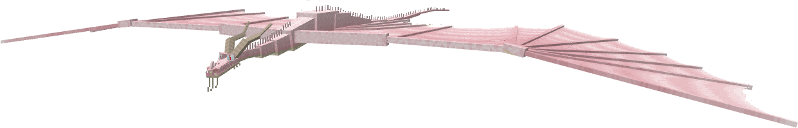

**Obtainment:** Rare spawn

```
/summon isleofberk:monstrous_nightmare ~ ~ ~ {VariantName:albino_timberjack}
```

### Ash

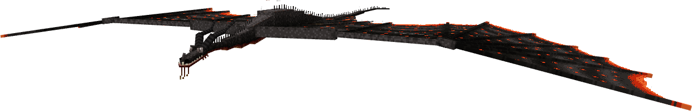

**Obtainment:** Normal spawn

```
/summon isleofberk:monstrous_nightmare ~ ~ ~ {VariantName:ash}
```

### Axewing

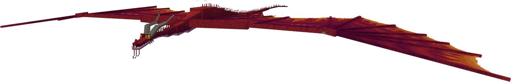

**Obtainment:** Normal spawn

```
/summon isleofberk:monstrous_nightmare ~ ~ ~ {VariantName:axewing_one}
```

### Axewing the Second

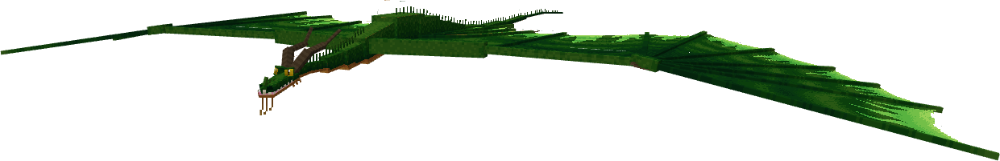

**Obtainment:** Normal spawn

```
/summon isleofberk:monstrous_nightmare ~ ~ ~ {VariantName:axewing_two}
```

### Blossoming Bumbershoot

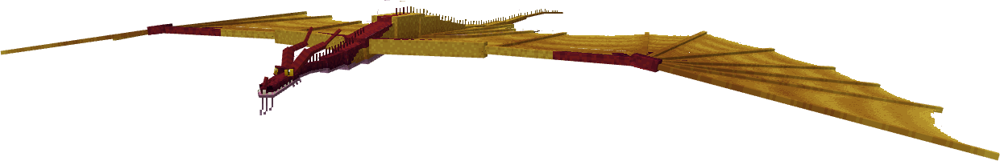

**Obtainment:** Normal spawn

```
/summon isleofberk:monstrous_nightmare ~ ~ ~ {VariantName:blossoming_bumbershoot}
```

### Boreal

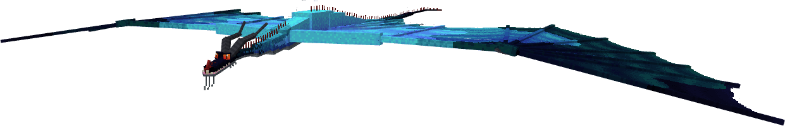

**Obtainment:** Rare spawn

```
/summon isleofberk:monstrous_nightmare ~ ~ ~ {VariantName:boreal_timberjack}
```

### Brute Timberjack

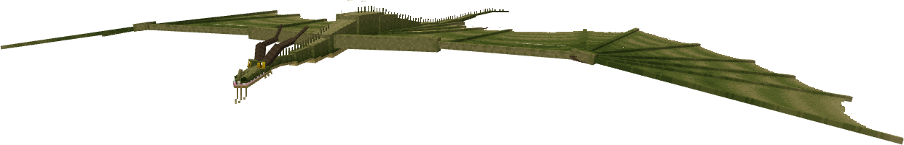

**Obtainment:** Normal spawn

```
/summon isleofberk:monstrous_nightmare ~ ~ ~ {VariantName:brute_timberjack}
```

### Caramel

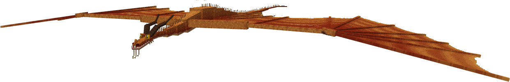

**Obtainment:** Normal spawn

```
/summon isleofberk:monstrous_nightmare ~ ~ ~ {VariantName:caramel_timberjack}
```

### Driftcleaver

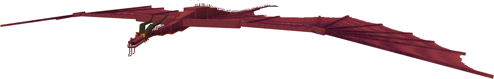

**Obtainment:** Normal spawn

```
/summon isleofberk:monstrous_nightmare ~ ~ ~ {VariantName:driftcleaver}
```

### Elsa

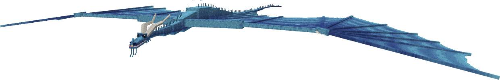

**Obtainment:** Rare spawn

```
/summon isleofberk:monstrous_nightmare ~ ~ ~ {VariantName:elsa}
```

### Emerald

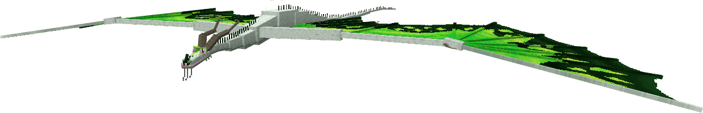

**Obtainment:** Rare spawn

```
/summon isleofberk:monstrous_nightmare ~ ~ ~ {VariantName:emerald_timberjack}
```

### Freeweald

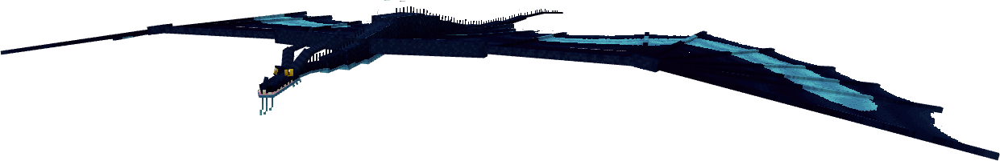

**Obtainment:** Rare spawn

```
/summon isleofberk:monstrous_nightmare ~ ~ ~ {VariantName:freeweald}
```

### Hoopoe

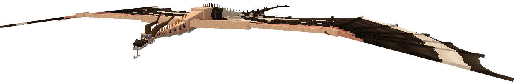

**Obtainment:** Normal spawn

```
/summon isleofberk:monstrous_nightmare ~ ~ ~ {VariantName:hoopoe}
```

### Imperial Emperor

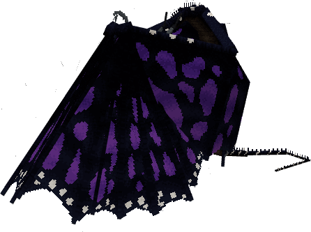

**Obtainment:** Rare spawn

```
/summon isleofberk:monstrous_nightmare ~ ~ ~ {VariantName:imperial_emperor}
```

### Limehawk

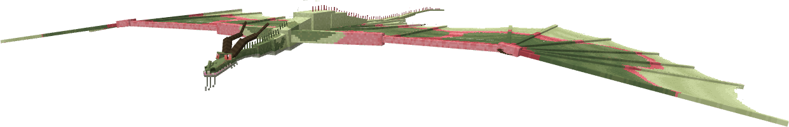

**Obtainment:** Normal spawn

```
/summon isleofberk:monstrous_nightmare ~ ~ ~ {VariantName:limehawk}
```

### Lithe Logjammer

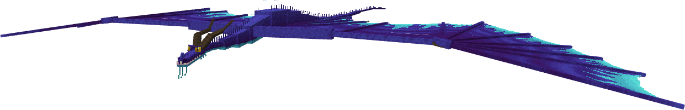

**Obtainment:** Normal spawn

```
/summon isleofberk:monstrous_nightmare ~ ~ ~ {VariantName:lithe_logjammer}
```

### Luna

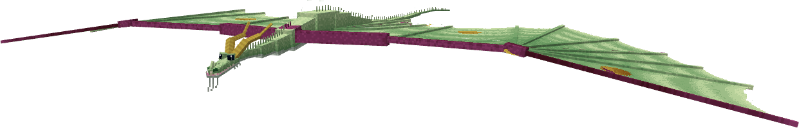

**Obtainment:** Normal spawn

```
/summon isleofberk:monstrous_nightmare ~ ~ ~ {VariantName:luna}
```

### Luzon Peacock

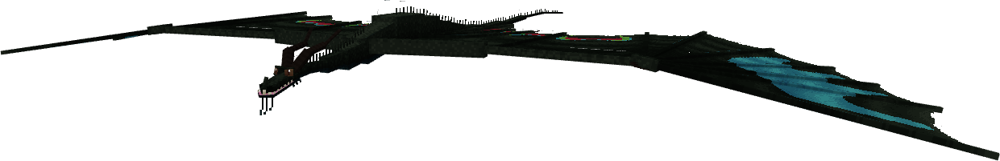

**Obtainment:** Rare spawn

```
/summon isleofberk:monstrous_nightmare ~ ~ ~ {VariantName:luzon_peacock}
```

*Credits: Unfortunately, this Endangered butterfly is in serious danger from international poaching.*

### Melanistic

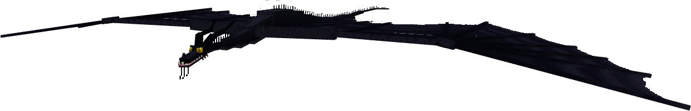

**Obtainment:** Rare spawn

```
/summon isleofberk:monstrous_nightmare ~ ~ ~ {VariantName:melanistic_timberjack}
```

### Monarch

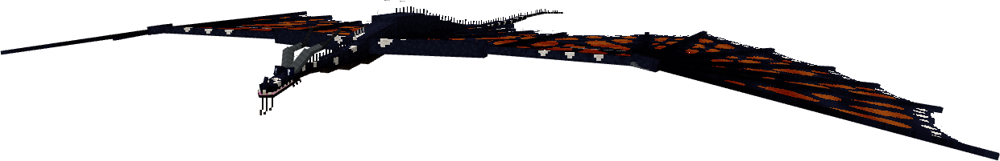

**Obtainment:** Normal spawn

```
/summon isleofberk:monstrous_nightmare ~ ~ ~ {VariantName:monarch}
```

### Peacock

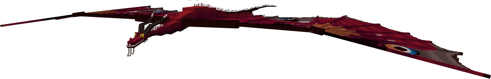

**Obtainment:** Normal spawn

```
/summon isleofberk:monstrous_nightmare ~ ~ ~ {VariantName:peacock}
```

### Piebald

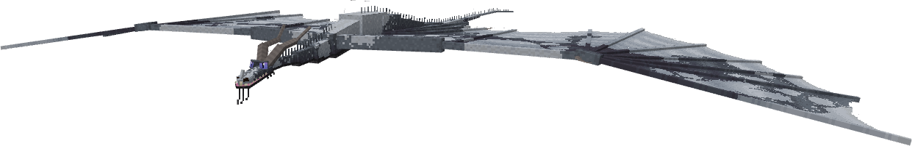

**Obtainment:** Rare spawn

```
/summon isleofberk:monstrous_nightmare ~ ~ ~ {VariantName:piebald_timberjack}
```

### Queen Alexandra Birdwing

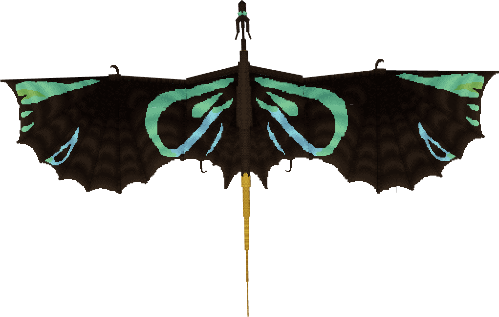

**Obtainment:** Rare spawn

```
/summon isleofberk:monstrous_nightmare ~ ~ ~ {VariantName:queen_alexandra_birdwing}
```

*Credits: Unfortunately, this Endangered butterfly is in serious danger from international poaching.*

### Seedling Saplinger

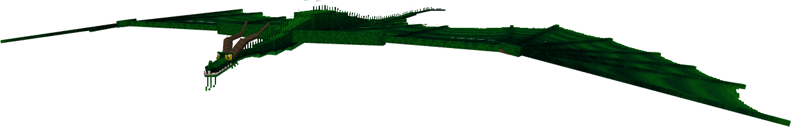

**Obtainment:** Normal spawn

```
/summon isleofberk:monstrous_nightmare ~ ~ ~ {VariantName:seedling_saplinger}
```

### Stokehead

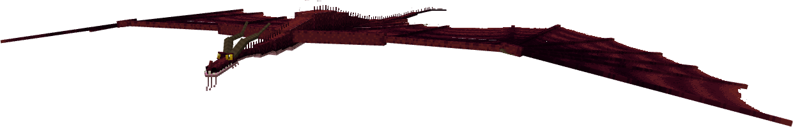

**Obtainment:** Normal spawn

```
/summon isleofberk:monstrous_nightmare ~ ~ ~ {VariantName:stokehead}
```

### Stoneslice

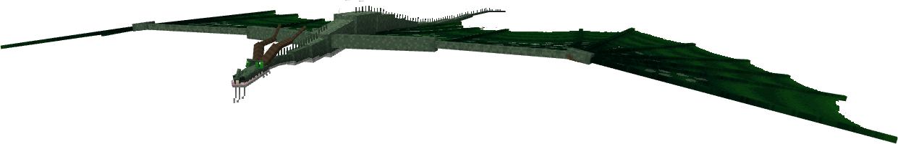

**Obtainment:** Normal spawn

```
/summon isleofberk:monstrous_nightmare ~ ~ ~ {VariantName:stoneslice}
```

### Strawberry Chocolate

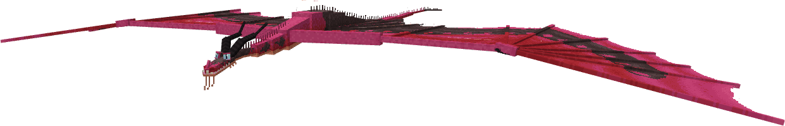

**Obtainment:** Normal spawn

```
/summon isleofberk:monstrous_nightmare ~ ~ ~ {VariantName:strawberrychoccy}
```

### Target

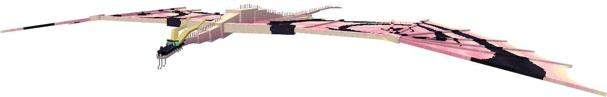

**Obtainment:** Normal spawn

```
/summon isleofberk:monstrous_nightmare ~ ~ ~ {VariantName:target}
```

### Timberjack

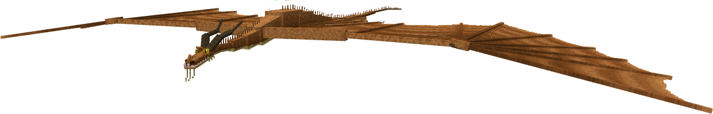

**Obtainment:** Normal spawn

```
/summon isleofberk:monstrous_nightmare ~ ~ ~ {VariantName:timberjack}
```

### Tricky Timberjack

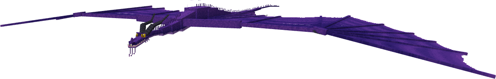

**Obtainment:** Normal spawn

```
/summon isleofberk:monstrous_nightmare ~ ~ ~ {VariantName:tricky_timberjack}
```

### Uhm... Dave?

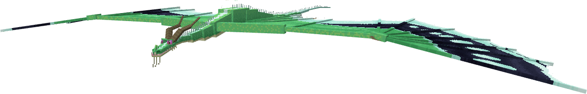

**Obtainment:** Normal spawn

```
/summon isleofberk:monstrous_nightmare ~ ~ ~ {VariantName:uhm_dave}
```

### Vampire

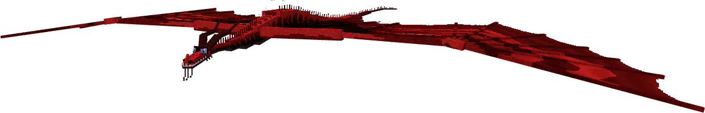

**Obtainment:** Normal spawn

```
/summon isleofberk:monstrous_nightmare ~ ~ ~ {VariantName:vampire}
```

### Wetland Timberjack

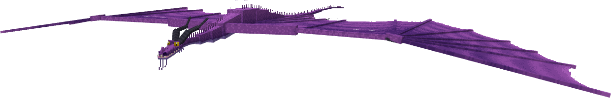

**Obtainment:** Normal spawn

```
/summon isleofberk:monstrous_nightmare ~ ~ ~ {VariantName:wetland_timberjack}
```

---

_Content adapted from the [Archipelago Additions Wiki](https://archipelagoadditions.miraheze.org/wiki/Timberjack) under [CC BY-SA 4.0](https://creativecommons.org/licenses/by-sa/4.0/)._
