# Triple Stryke


The Triple Stryke is a series canon dragon, first appearing in Race to the Edge. It is a base Isle of Berk dragon.

## Stats

| Stat | Value |
|---|---|
| Health | 90 (45 hearts) |
| Armour | 2 (1 icon) |
| Attack | 6 (3 hearts) |
| Walk Speed | 0.4 |
| Fly Speed | 0.1 |

## Taming

**Taming Foods:** Raw Beef

**Requirements:** Decrease dragon below 25% hp

**Alt Taming:** Dragon Nip

## Breeding

**Breeding Foods:** Suspicious Stew, Sagefruit

## Drops

**Brush Drops:** 1-3 Triple Stryke Scales

**Death Drops:** 1-2 Dragon Blood, 3-5 Triple Stryke Scales, 2-3 Venom Gland

## Spawn Biomes

- `minecraft:desert`
- `minecraft:badlands`
- `minecraft:wooded_badlands`

## Variants

### Albino

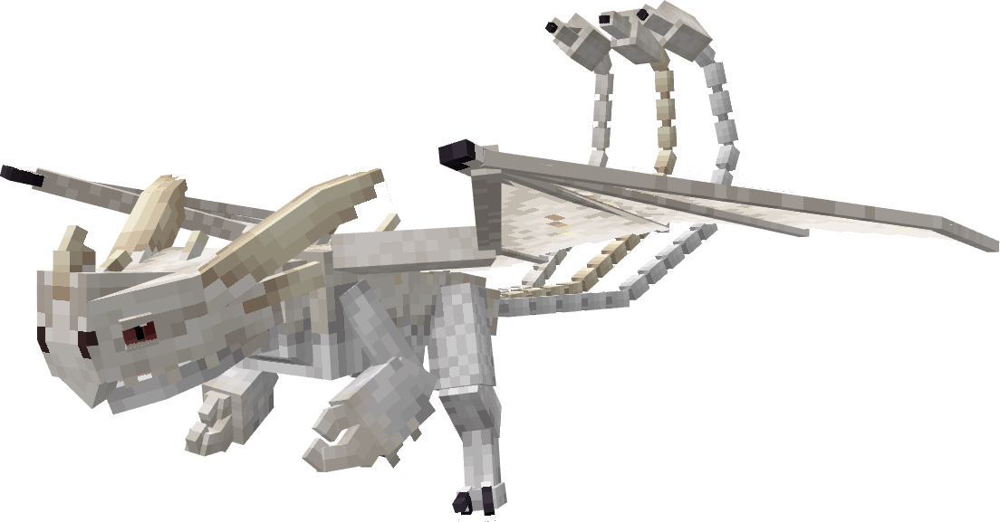

**Obtainment:** Rare spawn

```
/summon isleofberk:triple_stryke ~ ~ ~ {VariantName:albino_stryke}
```

### Albino alpha

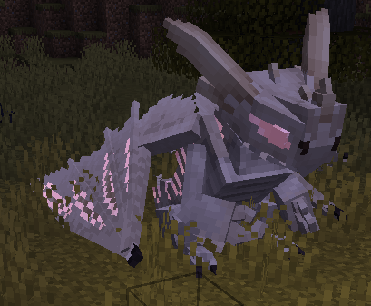

**Obtainment:** Extremely rare spawn

```
/summon isleofberk:triple_stryke ~ ~ ~ {VariantName:albino_alpha_stryke}
```

### Blue

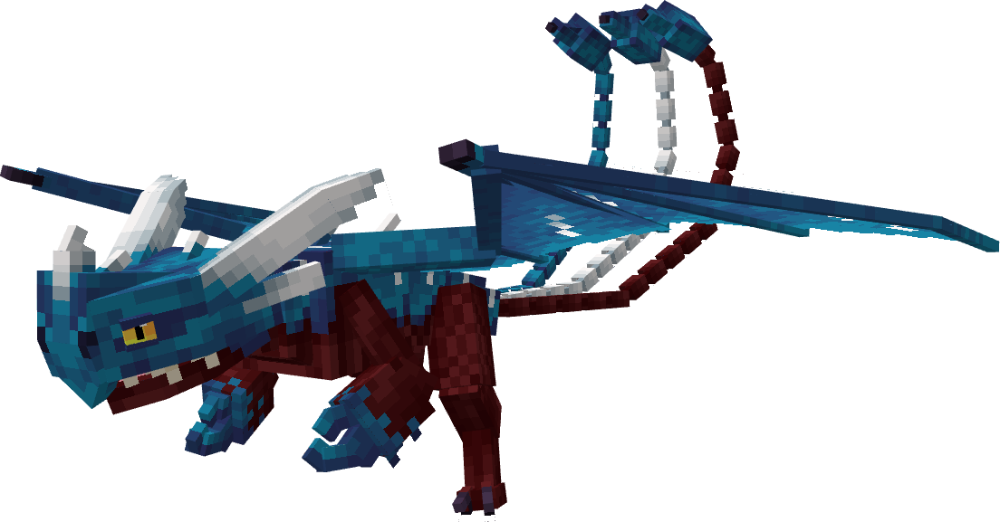

**Obtainment:** Normal spawn

```
/summon isleofberk:triple_stryke ~ ~ ~ {VariantName:blue}
```

*Credits: Base IoB variant*

### Blue alpha

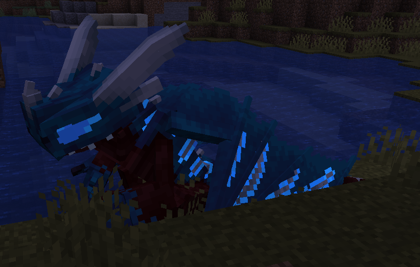

**Obtainment:** Rare spawn

```
/summon isleofberk:triple_stryke ~ ~ ~ {VariantName:blue_alpha}
```

*Credits: Near base IoB variant*

### Boreas

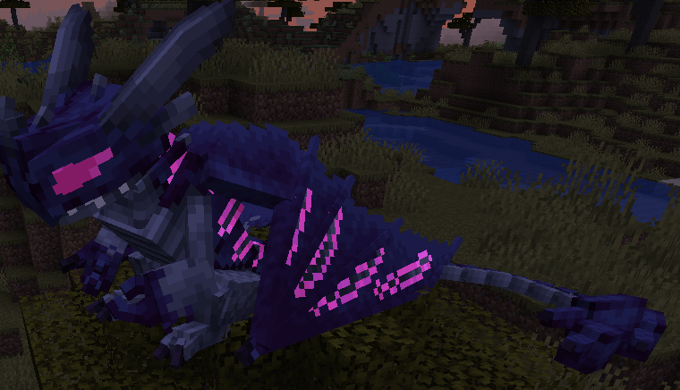

**Obtainment:** Rare spawn

```
/summon isleofberk:triple_stryke ~ ~ ~ {VariantName:boreas}
```

### Champion

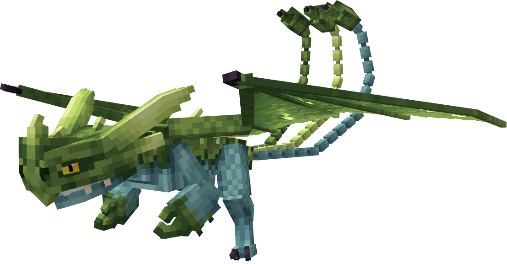

**Obtainment:** Normal spawn

```
/summon isleofberk:triple_stryke ~ ~ ~ {VariantName:champion}
```

*Credits: Base IoB variant*

### Champion alpha

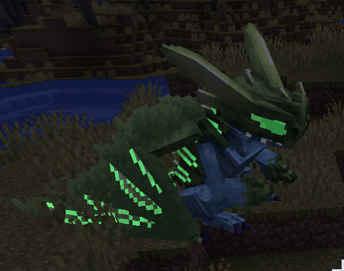

**Obtainment:** Rare spawn

```
/summon isleofberk:triple_stryke ~ ~ ~ {VariantName:champion_alpha}
```

*Credits: Near base IoB variant*

### Common

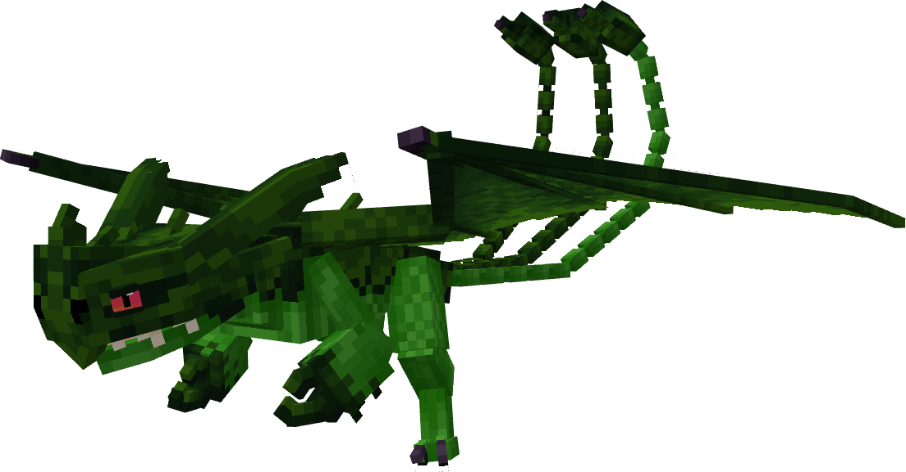

**Obtainment:** Normal spawn

```
/summon isleofberk:triple_stryke ~ ~ ~ {VariantName:common}
```

### Common alpha

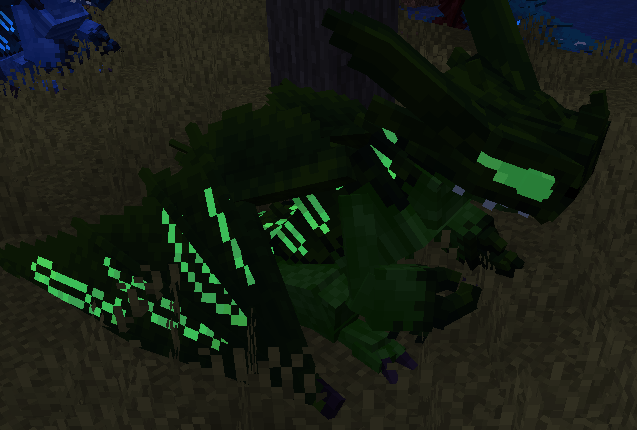

**Obtainment:** Rare spawn

```
/summon isleofberk:triple_stryke ~ ~ ~ {VariantName:common_alpha}
```

### Deepsky

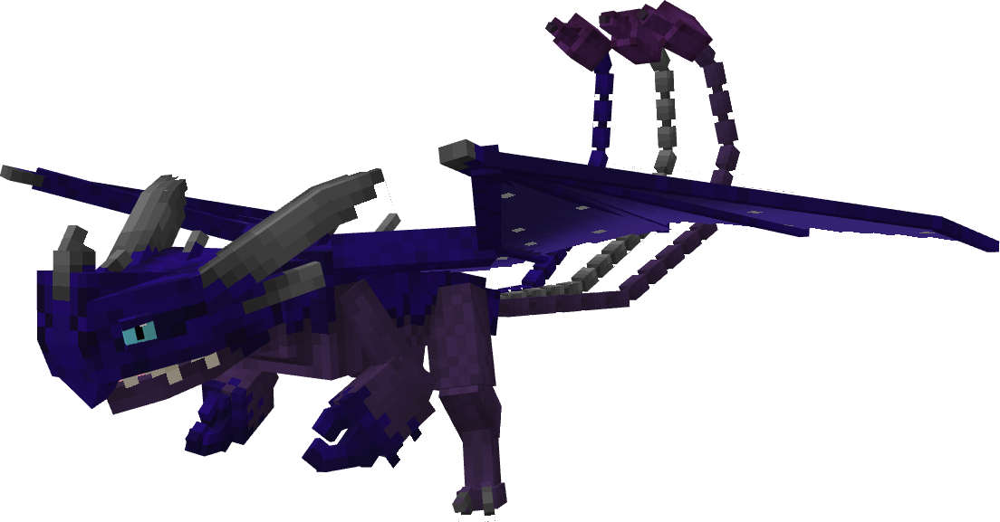

**Obtainment:** Normal spawn

```
/summon isleofberk:triple_stryke ~ ~ ~ {VariantName:deepsky}
```

### DG

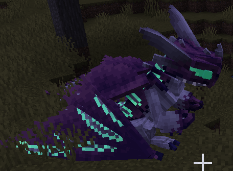

**Obtainment:** Rare spawn

```
/summon isleofberk:triple_stryke ~ ~ ~ {VariantName:dg}
```

### Eclipser

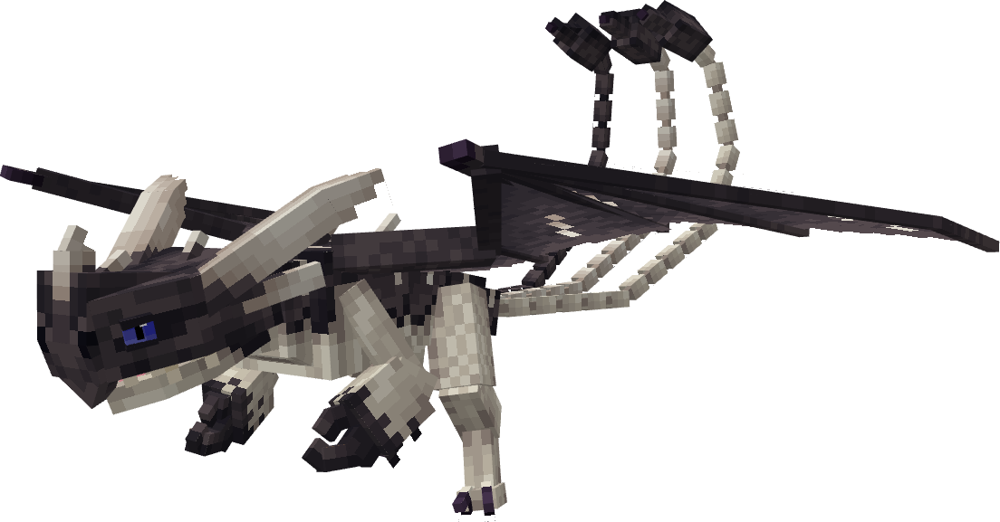

**Obtainment:** Normal spawn

```
/summon isleofberk:triple_stryke ~ ~ ~ {VariantName:eclipser}
```

*Credits: Base IoB variant*

### Eclipser alpha

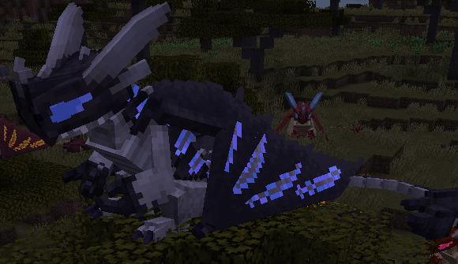

**Obtainment:** Rare spawn

```
/summon isleofberk:triple_stryke ~ ~ ~ {VariantName:eclipser_alpha}
```

*Credits: Near base IoB variant*

### Indo

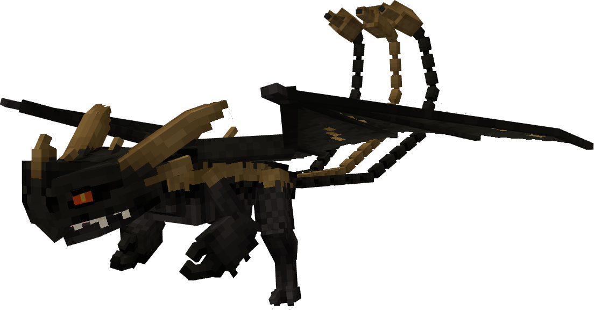

**Obtainment:** Normal spawn

```
/summon isleofberk:triple_stryke ~ ~ ~ {VariantName:indo}
```

### Indo alpha

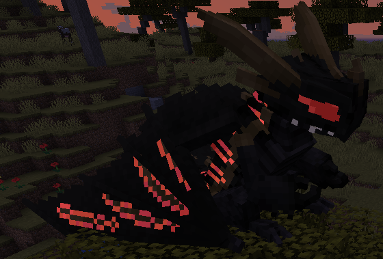

**Obtainment:** Rare spawn

```
/summon isleofberk:triple_stryke ~ ~ ~ {VariantName:indo_alpha}
```

### Ketillkott

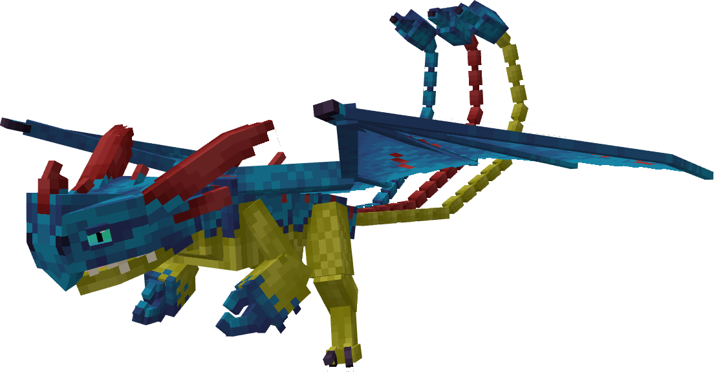

**Obtainment:** Normal spawn

```
/summon isleofberk:triple_stryke ~ ~ ~ {VariantName:ketillkott}
```

### Ketillkott alpha

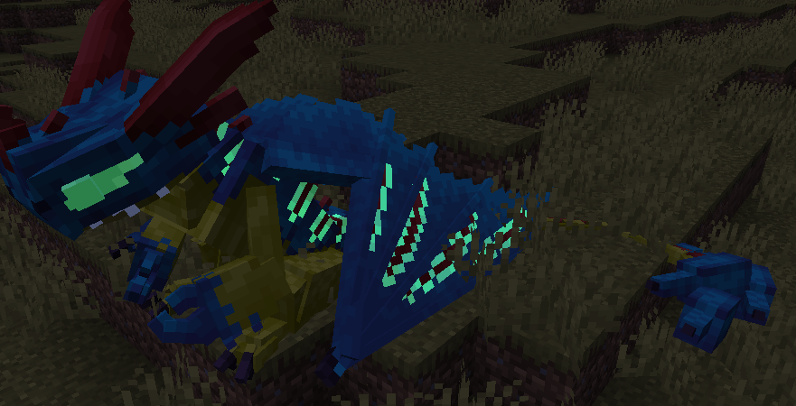

**Obtainment:** Rare spawn

```
/summon isleofberk:triple_stryke ~ ~ ~ {VariantName:ketillkott_alpha}
```

### Melanistic

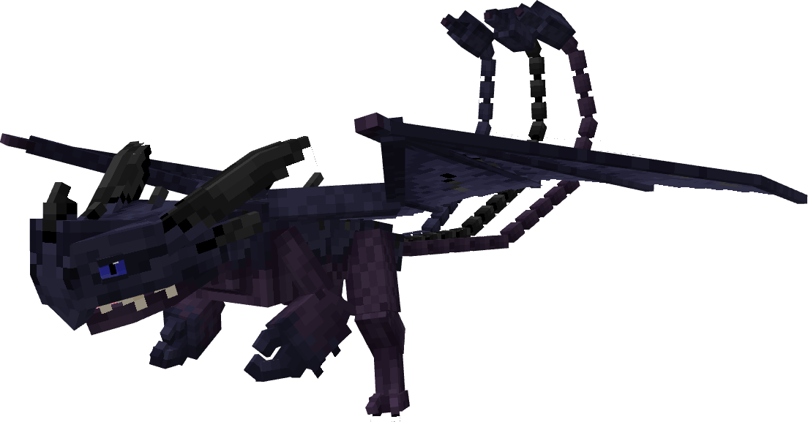

**Obtainment:** Rare spawn

```
/summon isleofberk:triple_stryke ~ ~ ~ {VariantName:melanistic_stryke}
```

### Melanistic alpha

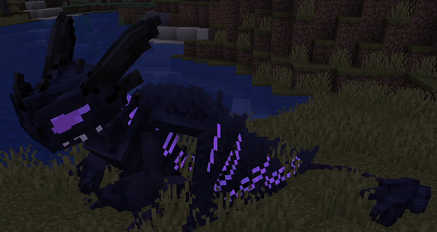

**Obtainment:** Extremely rare spawn

```
/summon isleofberk:triple_stryke ~ ~ ~ {VariantName:melanistic_alpha_stryke}
```

### Nikora

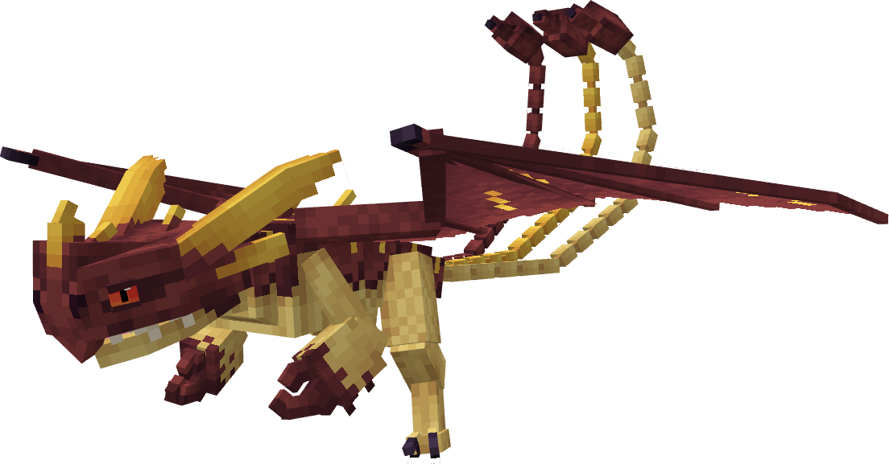

**Obtainment:** Normal spawn

```
/summon isleofberk:triple_stryke ~ ~ ~ {VariantName:nikora_triple_stryke}
```

*Credits: Base IoB variant*

### Nikora alpha

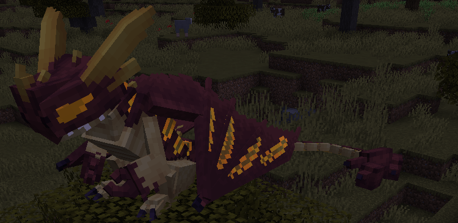

**Obtainment:** Rare spawn

```
/summon isleofberk:triple_stryke ~ ~ ~ {VariantName:nikora_triple_stryke_alpha}
```

*Credits: Near base IoB variant*

### Regnbue

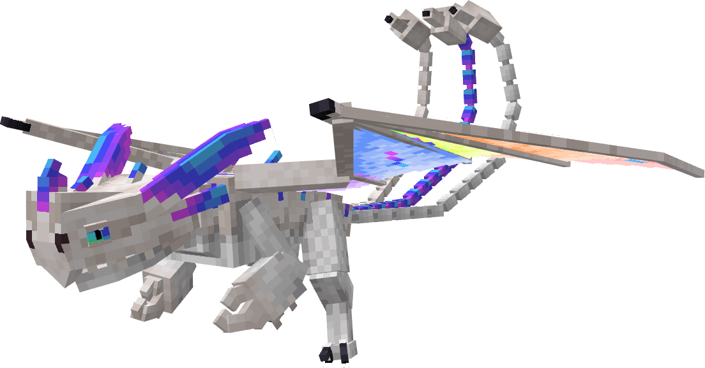

**Obtainment:** Bifrost Temple only

```
/summon isleofberk:triple_stryke ~ ~ ~ {VariantName:regnbue}
```

### Rosethorn

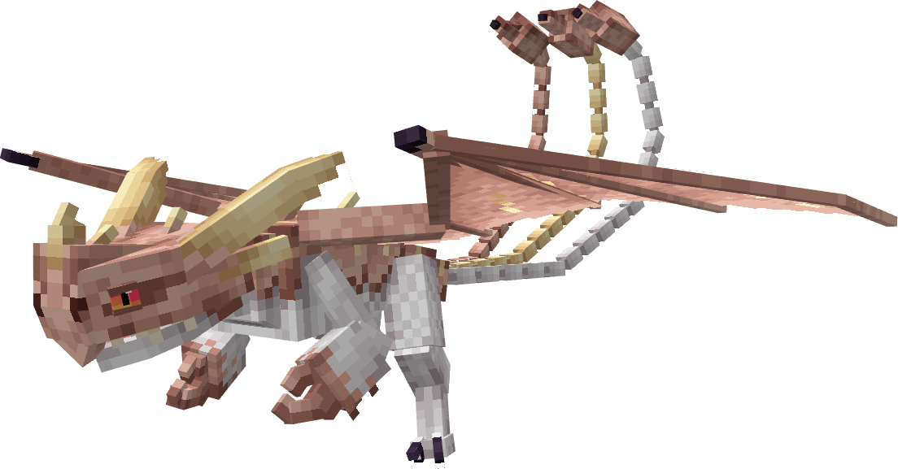

**Obtainment:** Normal spawn

```
/summon isleofberk:triple_stryke ~ ~ ~ {VariantName:rosethorn}
```

*Credits: Base IoB variant*

### Rosethorn alpha

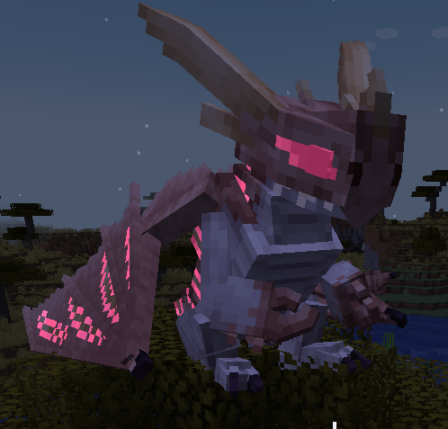

**Obtainment:** Rare spawn

```
/summon isleofberk:triple_stryke ~ ~ ~ {VariantName:rosethorn_alpha}
```

*Credits: Near base IoB variant*

### Scorpius

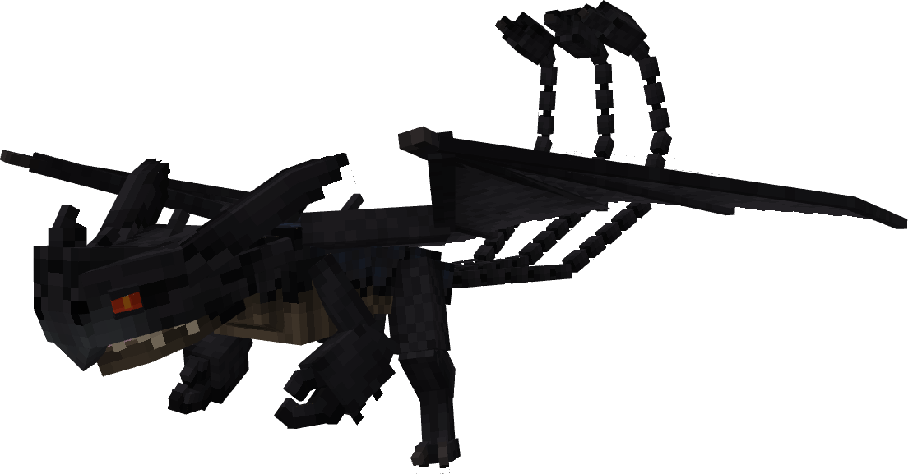

**Obtainment:** Normal spawn

```
/summon isleofberk:triple_stryke ~ ~ ~ {VariantName:scorpius}
```

### Scorpius alpha

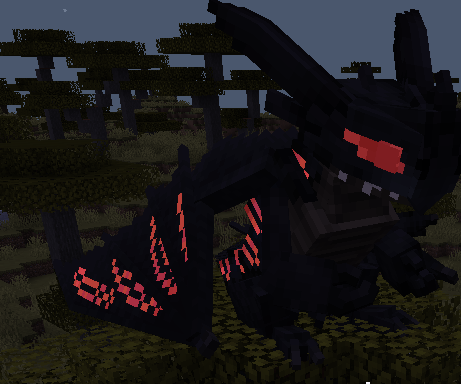

**Obtainment:** Rare spawn

```
/summon isleofberk:triple_stryke ~ ~ ~ {VariantName:scorpius_alpha}
```

### Sleuther


**Obtainment:** Normal spawn

```
/summon isleofberk:triple_stryke ~ ~ ~ {VariantName:sleuther}
```

*Credits: Base IoB variant*

### Sleuther alpha

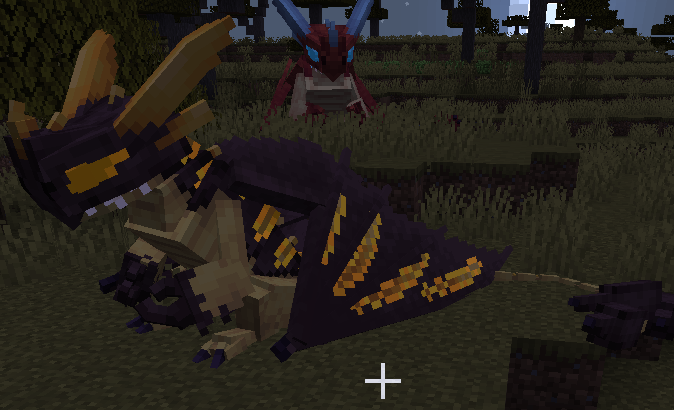

**Obtainment:** Rare spawn

```
/summon isleofberk:triple_stryke ~ ~ ~ {VariantName:sleuther_alpha}
```

*Credits: Near base IoB variant*

### Spyro

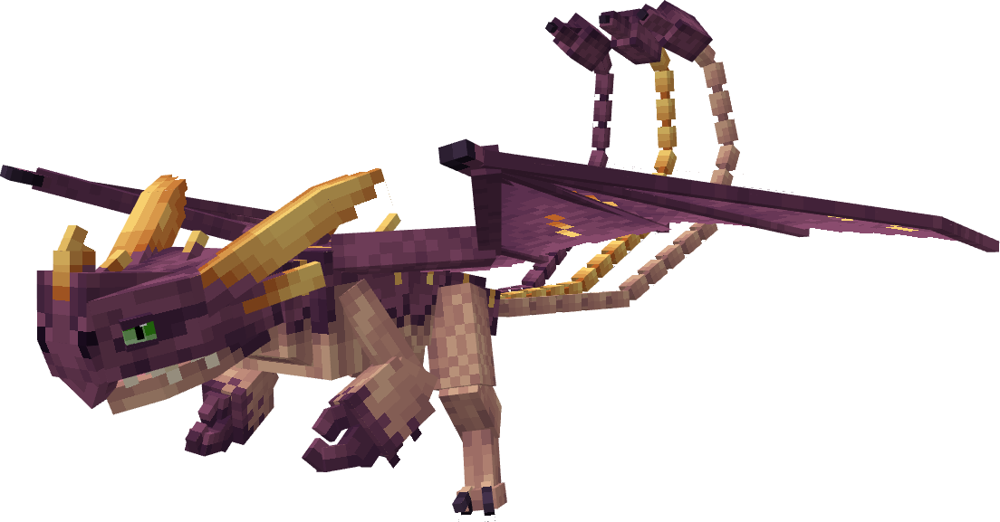

**Obtainment:** Normal spawn

```
/summon isleofberk:triple_stryke ~ ~ ~ {VariantName:spyro}
```

*Credits: Base IoB variant*

### Spyro alpha

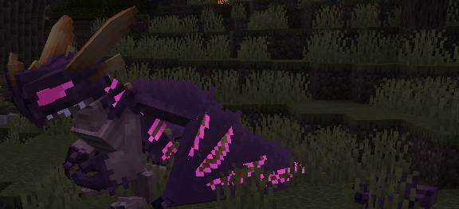

**Obtainment:** Rare spawn

```
/summon isleofberk:triple_stryke ~ ~ ~ {VariantName:spyro_alpha}
```

*Credits: Near base IoB variant*

### Starstreak

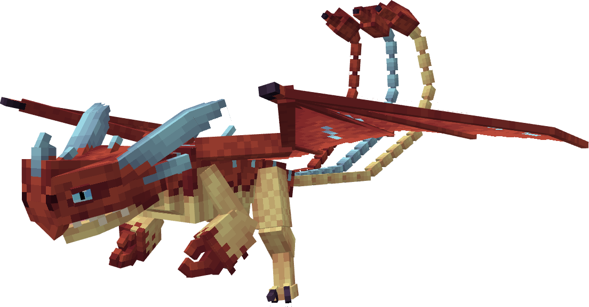

**Obtainment:** Normal spawn

```
/summon isleofberk:triple_stryke ~ ~ ~ {VariantName:starstreak}
```

*Credits: Base IoB variant*

### Starstreak alpha

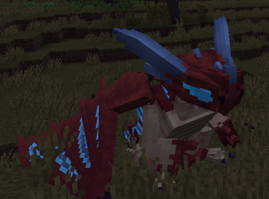

**Obtainment:** Rare spawn

```
/summon isleofberk:triple_stryke ~ ~ ~ {VariantName:starstreak_alpha}
```

*Credits: Near base IoB variant*

### Stone mother

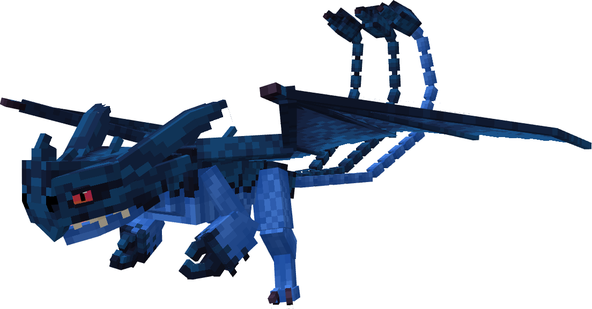

**Obtainment:** Normal spawn

```
/summon isleofberk:triple_stryke ~ ~ ~ {VariantName:stone_mother}
```

### Stone mother alpha

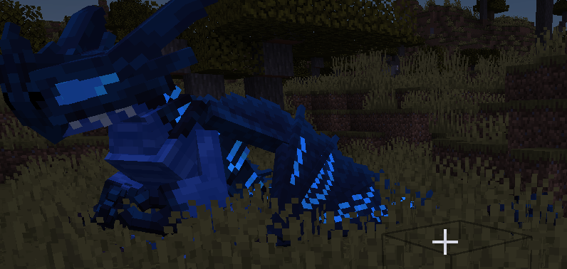

**Obtainment:** Rare spawn

```
/summon isleofberk:triple_stryke ~ ~ ~ {VariantName:stone_mother_alpha}
```

### Triple stryke

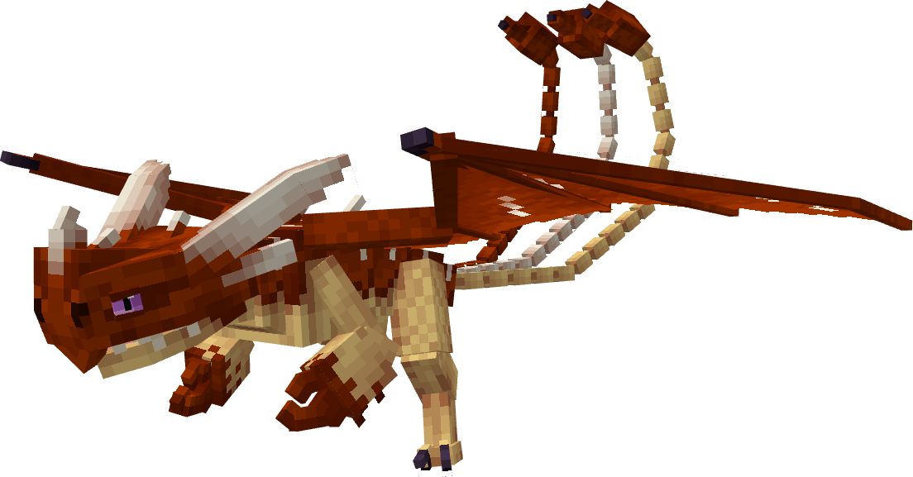

**Obtainment:** Normal spawn

```
/summon isleofberk:triple_stryke ~ ~ ~ {VariantName:triple_stryke}
```

*Credits: Base IoB variant*

### Triple stryke alpha

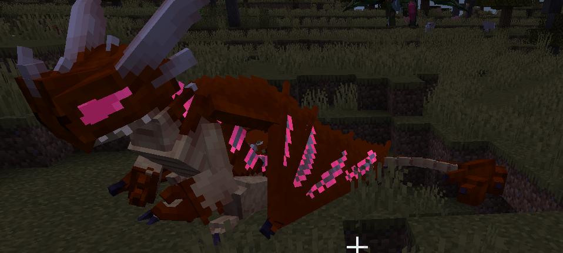

**Obtainment:** Rare spawn

```
/summon isleofberk:triple_stryke ~ ~ ~ {VariantName:triple_stryke_alpha}
```

*Credits: Near base IoB variant*

---

_Content adapted from the [Archipelago Additions Wiki](https://archipelagoadditions.miraheze.org/wiki/Triple_Stryke) under [CC BY-SA 4.0](https://creativecommons.org/licenses/by-sa/4.0/)._
