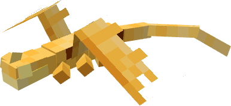

# Stoker Class

| | Dragon |
|---|---|
|  | [**Fireworm**](detail/fireworm.md) |
|  | [**Fireworm Queen**](detail/fireworm-queen.md) |
|  | [**Flame Whipper**](detail/flame-whipper.md) |
|  | [**Hobblegrunt**](detail/hobblegrunt.md) |
|  | [**Magma Breather**](detail/magma-breather.md) |
|  | [**Monstrous Nightmare**](detail/monstrous-nightmare.md) |
|  | [**Night Terror**](detail/night-terror.md) |
|  | [**Pygmy Death**](detail/pygmy-death.md) |
|  | [**Silver Phantom**](detail/silver-phantom.md) |
|  | [**Singetail**](detail/singetail.md) |
|  | [**Storming Nightmare**](detail/storming-nightmare.md) |
|  | [**Terrible Terror**](detail/terrible-terror.md) |
|  | [**Typhoomerang**](detail/typhoomerang.md) |

---

_Content adapted from the [Archipelago Additions Wiki](https://archipelagoadditions.miraheze.org/wiki/Stoker_Class) under [CC BY-SA 4.0](https://creativecommons.org/licenses/by-sa/4.0/)._
