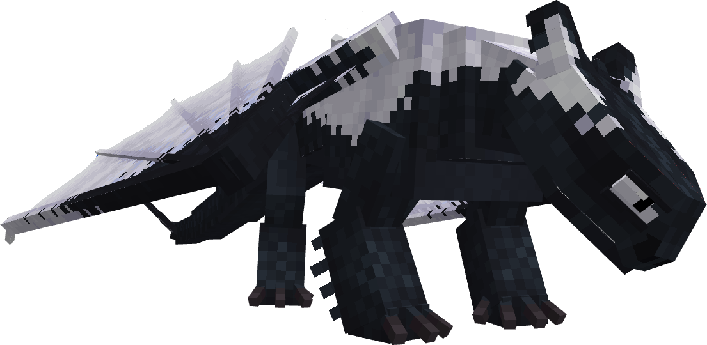
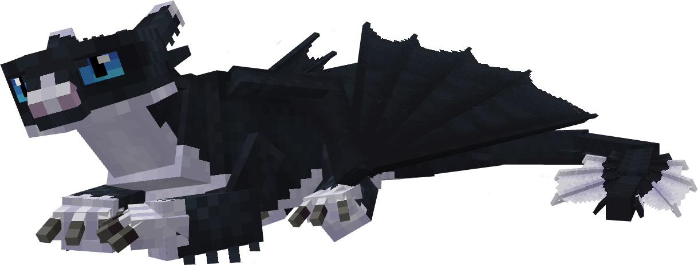
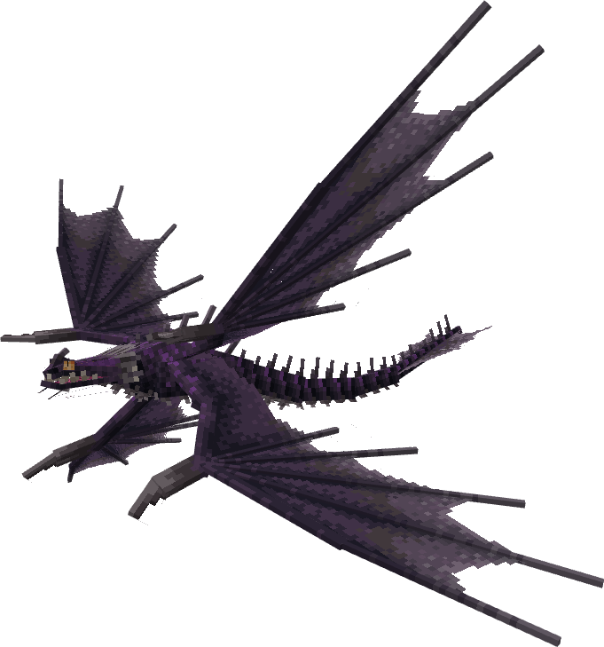
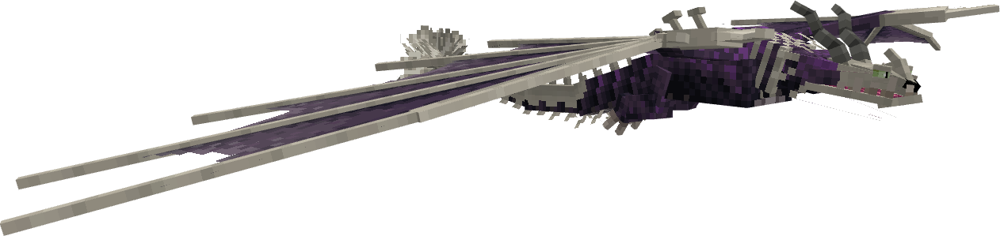
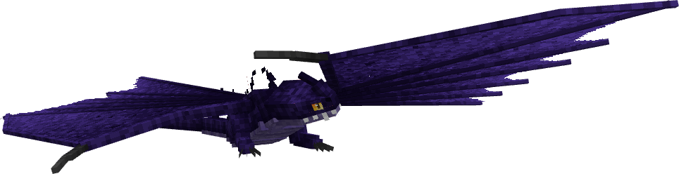

# Strike Class

| | Dragon |
|---|---|
|  | [**Deathgripper**](detail/deathgripper.md) |
|  | [**Helstryke**](detail/helstryke.md) |
| | [**Lightcutter**](detail/lightcutter.md) |
|  | [**Light Fury**](detail/light-fury.md) |
|  | [**Light Night**](detail/light-night.md) |
| | [**Nightcutter**](detail/nightcutter.md) |
|  | [**Night Fury**](detail/night-fury.md) |
|  | [**Night Light**](detail/night-light.md) |
|  | [**Skrill**](detail/skrill.md) |
|  | [**Skrillcutter**](detail/skrillcutter.md) |
|  | [**Skrillknapper**](detail/skrillknapper.md) |
|  | [**Snow Wraith**](detail/snow-wraith.md) |
|  | [**Songwing**](detail/songwing.md) |
|  | [**Triple Stryke**](detail/triple-stryke.md) |
| | [**Woolly Howl**](detail/woolly-howl.md) |

---

_Content adapted from the [Archipelago Additions Wiki](https://archipelagoadditions.miraheze.org/wiki/Strike_Class) under [CC BY-SA 4.0](https://creativecommons.org/licenses/by-sa/4.0/)._
